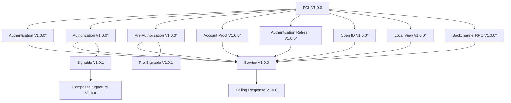

# FLIP xxx: FCL Versioning Standards

## Objective

This FLIP aims to outline a formal version-negotiation mechanism between FCL-compliant wallets and clients.  This will allow changes to the FCL protocol whilst maintaining backward-compatibility moving forward.

## Motivation

To date, the FCL protocol has only experienced a single stable version - V1.0.  However, no existing mechanisms exist to develop new versions of the protocol without a significant deterioration in developer and end-user experience.  Existing mechanisms for backward compatibility between wallets and clients involve using an out-of-spec `"fclVersion"` request parameter sent by FCL-JS.

Namely, the FCL protocol does not establish any forms of version negotiation between wallets and clients and does not expose versioning information to the other party involved (i.e. wallet to dApp or dApp to wallet).  It is impossible for the entire Flow ecosystem to upgrade their FCL implementations in lock-step - this means that periods of time exist where different versions of the FCL spec are implemented across the ecosystem. This proves problematic when attempting to introduce new features.  If breaking, these features result in unpredictable incompatibility between wallets and dApps.  If additive, one party risks making erroneous assumptions upon the feature set available at the receiving end.

It is worth noting that various components of the FCL protocol do include existing versioning information.  However, none of this information is currently discoverable by the other party involved, nor are these versions globally mandated by the version of the FCL spec.

## User Benefit

The FCL protocol is widely used throughout the Flow ecosystem and remains as one of the primary ways in which users interact with their wallets.  In order to support new wallet features without breaking existing dApps, it is imperative that the FCL protocol establishes a mechanism by which upgrades may be gradually adopted throughout the ecosystem.  Because the FCL protocol lacks such a mechanism today, it remains difficult to surface new functionality to the end-user.

## Design Proposal

This proposal outlines a wallet-mediated versioning handshake as apart of V1.1.0 FCL authentication services (authn).  In this proposal, authn V1.1.0 would become the standard handshaking mechanism to be supported by all future clients and wallets, and wallets would bear the responsibility of upgrading the connection to a more recent protocol level based upon their desired connection parameters.

Additionally, this proposal formalizes the FCL V1.0.0 dependency graph, identifying the versions of all components used by the FCL V1.0.0 protocol today.

### Authn v1.1.0

Introducing a robust version negotiation mechanism for iterations of the FCL protocol >V1.0.0 requires some non-breaking changes to the specification of the FCL authn service.  This would exist as the V1.1.0 specification of the authn service.

1. Authn services would now contain an additional field in their definition, `fclProtocol`, indicating the FCL protocol version intended to be used during the connection with the wallet.  This will be used by wallets or discovery services in order to inform the client of which protocol version they should proceed with for a given authn service.
2. Authn requests would now include an additional request parameter, `fclProtocolSupport`.  This parameter would be an array of acceptable FCL protocol versions which the client supports.

### Authn Upgrade/Redirect

All future FCL clients and wallets are expected to support V1.1.0 authn services moving forward, regardless of their FCL protocol version support.  They will be expected to support the authn service corresponding to their protocol version as well as always supporting authn V1.1.0.  Clients would be expected to initialize FCL protocol connections using a V1.1.0 authn service which would provide compatibility information about the client via the `fclProtocolSupport` parameter.

Following the negotiation of the FCL protocol version during the authentication phase, this FCL protocol version will be used throughout the remained of the session.  Both the client and wallet are individually responsible for remembering this connection parameter when executing any other wallet services.  If the wallet lacks primitives for retrieving this parameter during subsequent client requests (i.e. database retrieval), there are two ways which they may persist this information:

1. The server may choose to include a field in the `params` of their services when the user authenticates to provide this connection parameter (i.e. `service.params.fclVersion = "1.2"`)
2. The server may choose to version the API endpoints of their wallet services based on protocol version. (i.e. `https://wallet.com/1.0/authn`).

There is no one-size-fits-all approach, and it is ultimately the decision of the wallet developer regarding how they wish to persist a session’s protocol version throughout their system.

### Formalizing FCL V1.0 Dependencies

As previously indicated, in absence of wallet/client versioning headers, the protocol will fallback to assuming that they are communicating with a V1.0 counterparty.  Formally, the existing V1.0.0 clients support the following FCL component versions (indicated by the `f_type` fields of these objects) 

- `"Service"` (Service) V1.0.0

**Services (by `"type"`, where `f_type = "Service"` )**

- `"authn"` (Authentication) V1.0.0
- `"authz"` (Authorization) V1.0.0
- `"pre-authz"` (Pre-Authorization) V1.0.0
- `"account-proof"` (Account Proof) V1.0.0
- `"authn-refresh"` (Authentication Refresh) V1.0.0
- `"open-id"` (Open ID) V1.0.0
- `"local-view"` (Local View) V1.0.0
- `"back-channel-rpc"` (Back Channel RPC) V1.0.0

**Other (by `"f_type"`)**

- `CompositeSignature` (Composite Signature) V1.0.0
- `PollingResponse` (Polling Response) V1.0.0
- `PreSignable` (Pre Signable) V1.0.1
- `Signable` (Signable) V1.0.1
- `Provider` (Provider) V1.0.0
- `Service` (Service) V1.0.0

Note: Data structures marked with an asterisk (*) represent service types.  They are unique as their `f_vsn` value is tied to a particular `type` key, which describes which type of service they represent and all services share `f_type="Service"`.  All other data structures may be identified solely by the `f_type` value.

Subsequent protocol versions (beyond FCL V1.0) may be pinned to different versions of these data structures to accommodate protocol changes.

### Drawbacks

Leveraging a wallet-mediated version selection mechanism faces one central drawback - the client is unable to discover the compatibility information about the wallet.  In this proposal, the client exposes versioning information to the wallet, but not vice versa.  This means that it is impossible to predict whether a wallet will be compatible with a client without actually executing an authentication request.

This approach does not provide an official mechanism for wallet discovery services to predict whether a client will be compatible with a given wallet.  Without additional interventions within wallet discovery services, users would only realize a wallet is incompatible after attempting to use this wallet and experiencing a failure.

Fortunately, developers are incentivized to keep their systems up to date, so this “error case” is already extraordinarily minimal.

- DApp developers can avoid this scenario by keeping their FCL client reasonably up to date, which would support the most recent versions of the FCL protocol.
- Wallet developers can avoid this scenario by maintaining backward compatibility with previous FCL protocol versions and offering a sufficient deprecation timeline before eliminating support for older clients.

As previously alluded to, there are also interventions that can take place in discovery services to prevent this incompatibility.  This avoids the need to mandate superfluous changes within the FCL specification itself.

- Wallet compatibility information can be “hardcoded” into the discovery service
- The discovery service itself can deploy a proprietary protocol in order to fetch ad hoc wallet compatibility information.  It can mandate that wallets submitted to the service comply with this protocol (i.e. this could simply be a service provided by the wallet that returns compatible FCL protocol versions).

### Alternatives Considered

Wallets could provide an additional service offering wallet information (including compatibility).  This service could theoretically act as the new “point of contact” with wallets moving forward (which is currently handled by authn).  It could provide wallet information (such as versioning), and allow the client to discover the wallet’s authentication service which could be used to connect to the wallet.  A client-mediated version selection could now be deployed instead (i.e. clients could preemptively be aware of wallet compatibility).  They could proceed accordingly with a FCL protocol version based on the wallet’s compatibility.  However, this has some drawbacks:

- This would mean FCL discovery services & clients would require additional configuration to describe wallets (i.e. wallets would need to be described by both an authentication service and this new service).  This would result in significant changes to existing applications.
- There is difficulty in adopting this approach for wallets without a backend/frontchannel wallets.  Creating an informative service using the existing specification for extension wallets would be impossible without utilizing an auxiliary backchannel communication service.
- This approach would also require breaking changes to existing codebases.  Applications and wallet discovery services would have to migrate to this new service endpoint.  Client libraries, like FCL-JS, would have to differentiate whether the dApp-provided wallet endpoint is either a legacy authn service or this new service before connecting to the wallet.

It is worth noting that this approach and the one outlined by this document are not mutually exclusive.  Ideally, the FCL protocol would support bidirectional discovery of compatibility information.  However, given the constraints of front-channel wallets, the approach outlined by this document is the one that satisfies the minimum requirement of protocol version negotiation between all wallet types.  Adding an informative service to the FCL protocol may be a future iteration to the FCL specification.

### Performance Implications

There are some performance implications of routinely redirecting to another service during FCL authentication requests.

**Best case**

User interacts with discovery service, tries to authenticate, selects wallet, discovery redirects with correct protocol version. There is no performance degradation in this scenario and the same number of requests/services are executed.

**Worst Case**

User interacts directly with wallet, tries to authenticate, authenticate redirects to a later protocol version.  This requires an additional service execution compared to the current V1.0 workflow and is especially problematic with front-channel services.

There are two mitigation strategies for this scenario: refactoring of FCL clients (particularly FCL-JS) and refactoring of FCL wallets:

FCL clients can be refactored to preserve the original VIEW when performing a redirect (instead of creating a new one as FCL-JS does now).  This could potentially extend to preserving the contents of the VIEW as well if the authn endpoint remains unchanged after the redirect, but would require further investigation.

FCL wallets may choose to provide their FCL authn V1.1.0 service as a back-channel service, even if their wallet generally uses front-channel services.  This avoids the need to resolve the authentication redirect within a front-channel view and instead can simplify the FCL protocol upgrade to a single authentication request which will tend to be more performant.

### Dependencies

This proposal would be relevant to all existing clients and wallets which rely on the FCL protocol.  Some examples:

 - [https://github.com/onflow/fcl-js](https://github.com/onflow/fcl-js)
 - [https://github.com/outblock/fcl-swift](https://github.com/outblock/fcl-swift) 
 - [https://github.com/Outblock/fcl-android](https://github.com/Outblock/fcl-android)
 - [https://github.com/onflow/fcl-dev-wallet](https://github.com/onflow/fcl-dev-wallet)

### Engineering Impact

This proposal has engineering impacts for FCL clients and wallets as it adds additional complexity to their existing systems.  However, this complexity is necessary to create future improvements to the FCL protocol.

### Best Practices

By definition, this proposal does change the best practices for certain personas building on Flow as it proposes changes to the FCL protocol (a technical specification which guides best practices when interacting between dApps & wallets).

### Tutorials and Examples

Open source software managed by the Flow Foundation will help guide client & wallet developers when adopting these changes.  FCL-JS will serve as an initial client example and FCL Dev Wallet can serve as a simplified wallet example.  However, the FCL spec alone should be sufficient to implement these changes.

### Compatibility

There are two scenarios to consider when evaluating backward-compatibility for the authn V1.1.0 service.

**Outdated Wallet**

Wallets supporting only V1.0.0 authn services would not recognize the additional client information and would proceed with a regular V1.0 FCL connection (as V1.1.0 authn is non-breaking).  However, wallets supporting >V1.1.0 authn services, would be able to use this additional field to perform a “connection upgrade”.  The wallet would do this by examining the versions provided by the client via the `fclProtocolSupport` parameter and choosing the greatest version of these which it supports.  Critically, it is the wallet’s responsibility to determine this version using the client’s compatibility information and upgrade the connection accordingly (wallet-mediated version negotiation).

**Outdated Client**

If the client executes a V1.1.0 authn service without providing `fclProtocolSupport` as a parameter, it may be assumed that the client is following the V1.0.0 authn specification and the wallet may proceed with a FCL V1.0 connection.

### User Impact

There is no significant user impact.  Consumers of FCL-compliant clients (i.e. FCL-JS) will have to upgrade to the latest version to surface these changes and to continue to be compatible with wallets in the future.

## Related Issues

A future topic of discussion is how FCL discovery services can filter displayed wallets based on protocol versions as well as redirect to the appropriate authn service directly (i.e. without redirecting to wallet’s authn V1.1.0 endpoint first and performing a subsequent connection upgrade)

## Prior Art

[FCL Specification](https://github.com/onflow/flips/blob/main/application/20221108-fcl-specification.md)

## Questions & Discussion

Discussion should take place in this pull request.