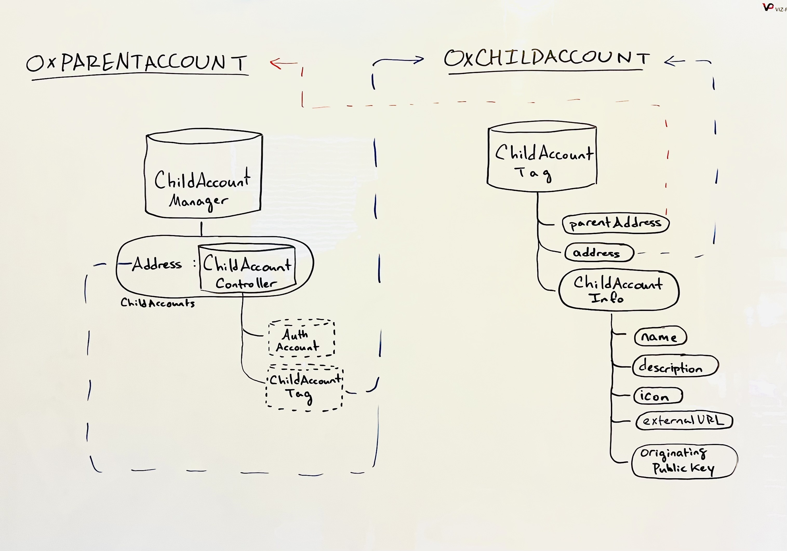
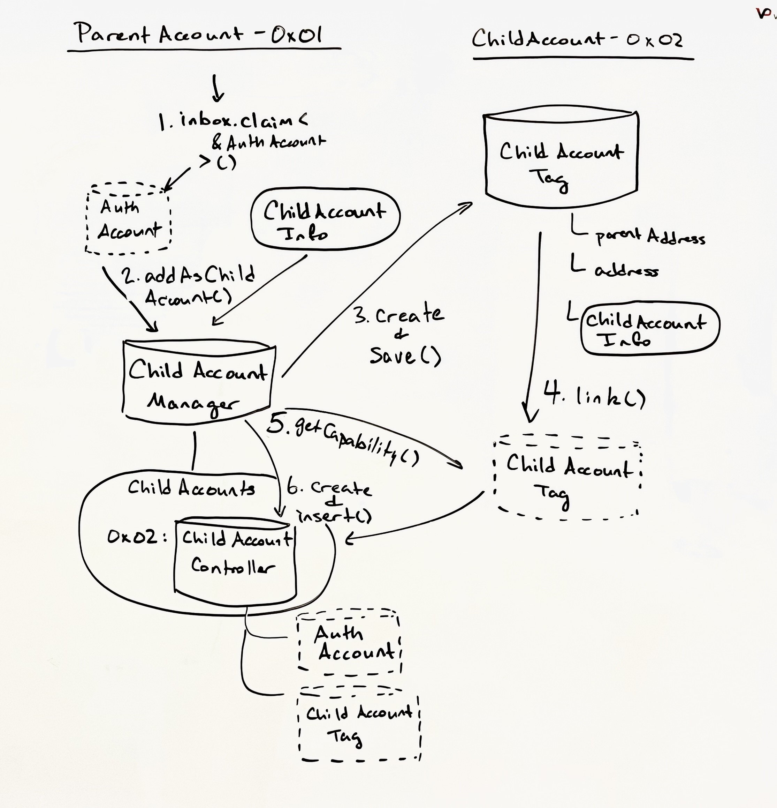
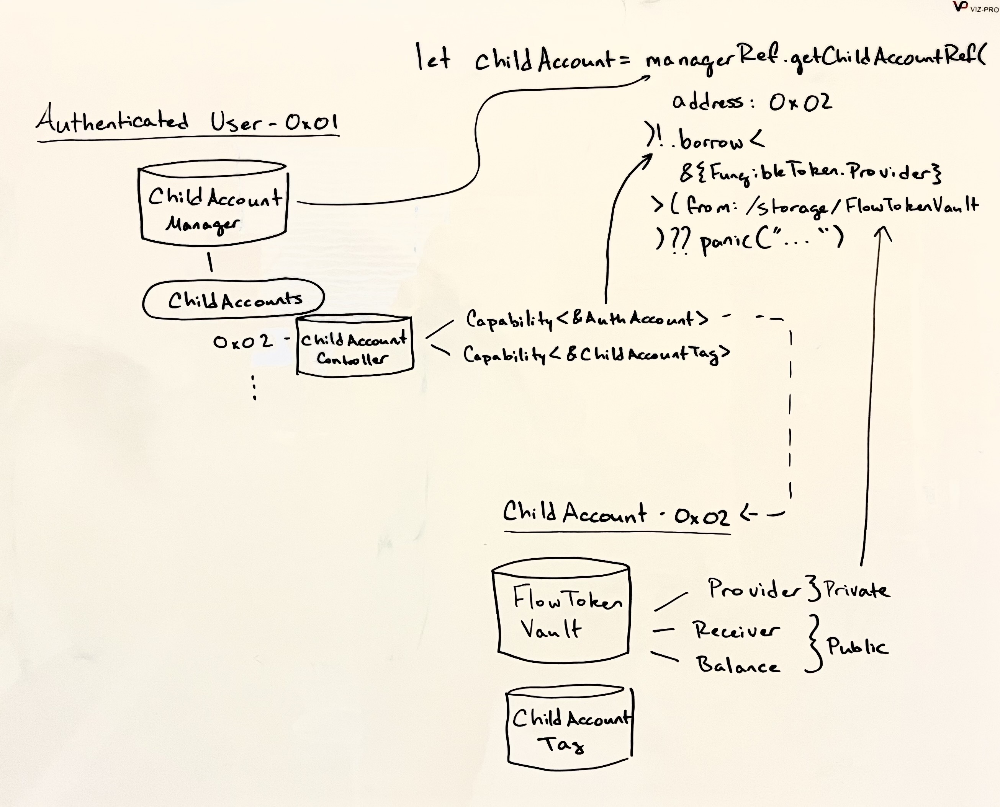

# AuthAccount Capability Management

<details>
<summary>Table of Contents</summary>

- [Context](#context)
- [Objective](#objective)
    - [Non-goals](#non-goals)
    - [Essential](#essential)
    - [For Consideration](#for-consideration)
- [Existing Work](#existing-work)
- [Motivation](#motivation)
- [Design Proposal](#design-proposal)
- [Example Implementation](#example-implementation)
- [Considered For Inclusion](#considered-for-inclusion)
    - [Standardizing child accounts’ resources access](#standardizing-child-accounts-resources-access)
- [Drawbacks](#drawbacks)
    - [Considerations](#considerations)
        - [Visibility into All Sub-Account Storage](#visibility-into-all-sub-account-storage)
        - [Sources of Truth](#sources-of-truth)
        - [Auditability and Revocation](#auditability-and-revocation)
        - [Limiting Delayed Attack Vectors](#limiting-delayed-attack-vectors)
        - [Lack of Ultimate Control](#lack-of-ultimate-control)
- [Alternatives Considered](#alternatives-considered)
    - [Key-Based Child Accounts](#key-based-child-accounts)
    - [Native Notion of Child Accounts](#native-notion-of-child-accounts)
- [Best Practices](#best-practices)
    - [Creating and Funding Child Accounts](#creating-and-funding-child-accounts)
        - [DApp-Funded, DApp-Custodied](#dapp-funded-dapp-custodied)
        - [DApp-Funded, User-Custodied](#dapp-funded-user-custodied)
        - [User-Funded, DApp-Custodied](#user-funded-dapp-custodied)
        - [User-Funded, User-Custodied](#user-funded-user-custodied)
    - [Linking existing account as child account](#linking-existing-account-as-child-account)
    - [Revoking a child account](#revoking-a-child-account)
    - [Granting a child account Capabilities](#granting-a-child-account-capabilities)
- [Tutorials and Examples](#tutorials-and-examples)
    - [Adding an Account as a Child Account](#adding-an-account-as-a-child-account-aka-account-linking)
    - [Using a Child Account's FlowToken Vault](#using-a-child-accounts-flowtoken-vault)
- [Compatibility](#compatibility)
- [User Impact](#user-impact)
- [Questions and Discussion Topics](#questions-and-discussion-topics)
    - [Verbiage](#verbiage)
    - [Open Questions](#open-questions)
- [References](#references)


</details>

# Context

One of Flow’s biggest advantages is its ease of user onboarding; however, as discussed recently, the current state does not [go far enough](https://flow.com/post/flow-blockchain-mainstream-adoption-easy-onboarding-wallets). With the focus on [hybrid custody](https://forum.onflow.org/t/hybrid-custody/4016) and [progressive onboarding flows](https://youtu.be/0eYX_S4jUYM) and the recent work on [AuthAccount capabilities](https://github.com/onflow/flips/pull/53), there is a need for a mechanism to both maintain these capabilities as well as enable dApps to facilitate user interactions that deal with those sub-accounts and the assets within them.

# Objective

## Non-Goals

Before continuing, let’s clear up some common misconceptions about what’s being proposed. Here’s what this Flip is **not** proposing:

- Create a standard for shared access on a user’s primary account
- Introduce guardrails for the use of AuthAccount Capabilities

## Essential

This FLIP proposes a standard for the creation and management of child accounts to support  progressive onboarding models. The standard defines the resource representing the parent-child relationship between accounts, identifies an account as a parent and/or child, and related management functions including:

- Child account creation
- Child AuthAccount capability management
- Viewing existing child accounts
- Adding an account as a child account
- Revoking hybrid custody approval/access granted to a child account
- Identifying an account’s child accounts
- Identifying an account’s parent account(s)

## For Consideration

These are features we have thought about including in this standard, but are uncertain if they should be included in the standard

- Delegating Capabilities to a child account from the parent’s ChildAccountManager
- Easily viewing the assets in an user’s child accounts

# Existing Work

Guidance on implementation of this standard for wallets & marketplaces can be seen [here](https://developers.flow.com/account-linking). Below are contract and dApp implementations that were used as sandboxes for on-chain gaming, native attachments, progressive onboarding and eventually culminated in the development of this Flip.

- [Simplified linked accounts Cadence](https://github.com/onflow/linked-accounts)
- [Linked accounts Cadence in context](https://github.com/onflow/sc-eng-gaming/tree/sisyphusSmiling/child-account-auth-acct-cap)
- [Walletless onboarding dApp example](https://github.com/onflow/walletless-arcade-example)
- [Testnet contract deployment](https://f.dnz.dev/0x1b655847a90e644a/ChildAccount)

The work thus far is a product of lots of iteration. Much thought has been put into alternative approaches ([more details below](#alternatives-considered)) including key-based and language API approaches. However, due to a combination of consequential technical issues, prioritization of iteration speed, and avoiding dependency on external actors, the Capability-based contract & resource design outlined in this FLIP is the one proposed. Of course, this FLIP is just that - a proposal - and alternative approaches and challenges to this design are welcome for discussion.

# Motivation

We can imagine that a user can have any number of child accounts tied to their main account, one for each dApp they’re using. They will need to maintain AuthAccount capabilities for each, create new child accounts, add existing accounts as child accounts, issue child account capabilities and easily manage assets across their sub-accounts without the need to first transfer assets to their main account.

For example, a user might have a child account associated with a game dApp containing an NFT and in-game FungibleTokens. They should be able to sign into an NFT marketplace and view the NFTs across all of their linked accounts. Then, without needing to first transfer the NFT to the signing account, list that NFT for sale or purchase an NFT with the FungibleTokens in their child account, signing as the parent account. Similarly, if an offer is submitted on an NFT in a child account, a wallet provider managing the parent or dApp in which the parent accounts is authenticated (i.e. a marketplace) should be able to notify the owner and allow them to accept the offer, again signing as the parent account.

To put it simply, this standard sets down primitives through which well-known web2 account-to-application authorization schemes can be modeled in our decentralized context.

Accomplishing this vision successfully - success here meaning building a secure and universally useful construct that serves as solid ground truth while satisfying the aforementioned objectives - can further distinguish Flow among other chains as a platform for builders to create totally new dApps not possible elsewhere.

# FAQ

- I’m concerned my main account can get adopted by another Flow account, how is that prevented?
    - Issuing Capabilities on an AuthAccount pose the same sort of vulnerability vector as adding keys onto an account. Since these features are in a similar class - that of delegated authority - the community has worked to introduce a new [“Super User Account” feature](https://forum.onflow.org/t/super-user-account/4088), similar to `sudo` in Linux systems. This means issuing a Capability on your AuthAccount, as well as adding keys, deploying/deleting contracts, and other potentially dangerous operations, can only occur in transactions for which you have given explicit sudo-like permission for. Note that the concept is not the focus of this Flip, and is still in discussion meaning the exact construct will likely evolve.
- Why would I want someone else to have access to my account?
    - To clarify, the design isn’t for you to give a dApp access to your main account. The dApp creates an account it maintains access to that it uses to interact with Flow. Then, when you’re ready to control the dApp’s account more directly, the dApp issues a Capability on its AuthAccount to you, thereby linking its account as a child of your main account. This lets the dApp act on your behalf for only the assets in the child account. Everything in your main account remains only in your control, while allowing you to act on the assets in the child account without the need for the dApp to mediate.
- Why would I want a separate account I share access with? Doesn’t that put all of my assets at custodial risk?
    - Again, only the child account shares access with another party, meaning your main account is safe from custodial risk. Additionally, the second party’s access can be revoked by the parent account at any time without the need to maintain a signing key on the child account. In fact, partitioning assets across accounts in this way enhances security over a model that requires all transactions be signed by your main account. A user can keep all of their more valuable assets in their main account, out of reach without a user-signed transaction, while keeping less valuable dApp assets in a shared account for ease of use.

# User Benefit

A standard resource managing all child account capabilities allows for a unified user experience, enabling any dApp in the ecosystem to connect a user’s primary wallet and get global context into the entirety of the user’s accounts and assets that would otherwise be fragmented and unknown. For the end user, this means:

- greater organization of their app accounts and assets across them
- reduced risk of forgetting about assets in secondary accounts
- reduced custodial risk to assets in their main account due to partitioned access between parent and child accounts
- fewer transfers needed to engage with assets in child accounts as connected dApps can leverage the standard child account managing resource to utilize multiple AuthAccount capabilities within a single signed transaction
- unified asset balance views across all of their accounts (e.g. Alice has 3 accounts with TokenA Vaults, but only needs to know the sum of all their balances; Alice has 3 accounts with NFTs but is only interested in viewing her total collection overview on a marketplace profile page)

And for builders:

- clear expectations on where child account capabilities will reside and how to engage with them
- the ability to create self-custodial dApps leveraging web2 onboarding flows with the added flexibility of delegating shared control of an app account to a user in the future

# Design Proposal

*The hierarchical model between accounts is reflected by the ChildAccountManager in the parent account & ChildAccountTag in the child account. A ChildAccountManager identifies a parent account, map its child accounts to ChildAccountController, and enables a user to create & manage multiple child accounts. ChildAccountTags identify a child account, its parent, & enables its creating Manager to grant the child account Capabilities.*

> ℹ️ Note that AuthAccount Capabilities are not currently enabled on mainnet, only testnet. You may also use a [preview version of flow-cli](https://github.com/onflow/flow-cli/releases/tag/v0.45.1-cadence-attachments-dev-wallet) to utilize the feature in your local emulator environment

Taking a look at our [current prototype implementation](https://github.com/onflow/linked-accounts/blob/main/contracts/ChildAccount.cdc), you'll find the following constructs:

- `ChildAccountManager` - a resource associated with a parent account that will allow its owner to store and access (currently via reference) AuthAccount Capabilities to which it has been delegated access. Enables creation of child accounts, linking existing accounts as child accounts and issuing/revoking Capabilities directly to/from child accounts that are accessed via reference. Note that any accounts created by this resource are, at least via single signed transactions, funded via the parent account (AKA user-funded) as far as the contracts are concerned.
- `ChildAccountTag` - a resource that is held by any account and identifies it as a child / secondary account. This will store its parent / main account address along with some metadata info that will identify the secondary account (e.g. what dApp created it) and methods related to managing the child account.
- `ChildAccountInfo` - a metadata struct containing information about the intended purpose of a given child account. In a world where dApps create these use-case specific accounts for users, it would be helpful to know at a glance the context of a given child account.
- `ChildAccountController` - a resource containing a Capability to the child’s AuthAccount and its `ChildAccountTag`, created to be stored as a nested resource in `ChildAccountManager`. This construct is a resource for two reasons
    1. We want to leverage the existence safeguards inherent to resources.
    2. The uniqueness guarantees of resources prevent copying which would be very difficult to detect and prevent with structs.
- `ChildAccountCreator` - a resource designed to create child accounts from provided public keys without assigned parents. This can be a helpful resource to keep in a backend account which creates and funds new accounts for local dApp clients which maintain keys in a self-custodial manner on the user’s device. While not critical to the linked account paradigm, it was useful for prototyping and remained in the contract for reference.

## Example Implementation

The constructs listed above have been prototyped and are available for reference below. For more context on how these function together, the [demo dApp Cadence repo](https://github.com/onflow/sc-eng-gaming/tree/sisyphusSmiling/child-account-auth-acct-cap) and simplified [linked accounts](https://github.com/onflow/linked-accounts) repos will be helpful.

<details>
<summary>ChildAccountManager</summary>

```js
/** --- ChildAccountManager --- */

/// Interface that allows one to view information about the owning account's
/// child accounts including the addresses for all child accounts and information
/// about specific child accounts by Address
///
pub resource interface ChildAccountManagerViewer {
    pub fun getChildAccountAddresses(): [Address]
    pub fun getChildAccountInfo(address: Address): ChildAccountInfo?
}

/// Resource allows for management of on-chain associations between accounts.
///  Note that while creating child accounts
/// is available in this resource, revoking keys on those child accounts is not.
/// 
pub resource ChildAccountManager : ChildAccountManagerViewer {

    access(self) let childAccounts: @{Address: ChildAccountController}

    /** --- ChildAccountManagerViewer --- */

    /// Returns an array of all child account addresses
    ///
    pub fun getChildAccountAddresses(): [Address]
    
    /// Returns ChildAccountInfo struct containing info about the child account
    /// or nil if there is no child account with the given address
    ///
    pub fun getChildAccountInfo(address: Address): ChildAccountInfo?

    /** --- ChildAccountManager --- */

		/// Creates a new account, funding with the signer account, adding the public key
    /// contained in the ChildAccountInfo, and linking with this manager's owning
		/// account.
    pub fun createChildAccount(
        signer: AuthAccount,
        initialFundingAmount: UFix64,
        childAccountInfo: ChildAccountInfo
    ): AuthAccount

    /// Allows the ChildAccountManager to retrieve a reference to a ChildAccountController
    ///
    pub fun getChildAccountControllerRef(address: Address): &ChildAccountController?
		/// Allows the ChildAccountManager to retrieve a reference to an AuthAccount
    ///
    pub fun getChildAccountRef(address: Address): &AuthAccount?
		/// Allows the ChildAccountManager to retrieve a reference to a ChildAccountTag
    ///
    pub fun getChildAccountTagRef(address: Address): &ChildAccountTag?

    /// Add an existing account as a child account to this manager resource.
    ///
    pub fun addAsChildAccount(
				childAccountCap: Capability<&AuthAccount>,
				childAccountInfo: ChildAccountInfo
		) {
        pre {
            childAccountCap.check():
                "Problem with given AuthAccount Capability!"
            !self.childAccounts.containsKey(childAccountCap.borrow()!.address):
                "Child account with given address already exists!"
        }
    }

    /// Adds the given Capability to the ChildAccountTag at the provided Address
    ///
    pub fun addCapability(to: Address, _ cap: Capability) {
        pre {
            self.childAccounts.containsKey(to):
                "No tag with given Address!"
        }
    }

    /// Removes the capability of the given type from the ChildAccountTag with the given Address
    ///
    pub fun removeCapability(from: Address, type: Type)

    /// Removes the child account, returning its ChildAccountController if it exists.
		/// Note: removal does not revoke the key on the child account if it has been added.
    /// Key revocation should be done in the same transaction in which this method is called.
    ///
    pub fun removeChildAccount(withAddress: Address): @ChildAccountController?
}
```
</details>

<details>
<summary>ChildAccountTag</summary>
<code>

```js
/** --- Child Account Tag--- */

pub resource interface ChildAccountTagPublic {
    pub var parentAddress: Address?
    pub let address: Address
    pub let info: ChildAccountInfo
    pub fun getGrantedCapabilityTypes(): [Type]
    pub fun isCurrentlyActive(): Bool
}

/// Identifies an account as a child account and maintains info
/// about its parent & association as well as Capabilities granted by
/// its parent's ChildAccountManager
///
pub resource ChildAccountTag : ChildAccountTagPublic {
		/// Optional assigned parent - can be nil on creation
    pub var parentAddress: Address?
		/// Address of residing address
    pub let address: Address
		/// Metadata about the child account's intended purpose
    pub let info: ChildAccountInfo
		/// Mapping of Capabilities that have been granted by parent account
    access(contract) let grantedCapabilities: {Type: Capability}
		/// Identifying whether link to parent is still active
    access(contract) var isActive: Bool

    /** --- ChildAccountTagPublic --- */
    pub fun getGrantedCapabilityTypes(): [Type]
    pub fun isCurrentlyActive(): Bool

    /** --- ChildAccountTag --- */
		// Returns reference to a granted Capability
    pub fun getGrantedCapabilityAsRef(_ type: Type): &Capability? {
        pre {
            self.isActive: "ChildAccountTag has been de-permissioned by parent!"
        }
    }
		// Allows the contract to assign the parent of this ChildAccountTag
    access(contract) fun assignParent(address: Address) {
        pre {
            self.parentAddress == nil:
                "Parent has already been assigned to this ChildAccountTag as ".concat(self.parentAddress!.toString())
        }
    }
		// Allows the contract to grant a Capability
    access(contract) fun grantCapability(_ cap: Capability) {
        pre {
            !self.grantedCapabilities.containsKey(cap.getType()):
                "Already granted Capability of given type!"
        }
    }
		// Removes a Capability from the grantedCapabilities mapping
    access(contract) fun revokeCapability(_ type: Type): Capability?
		// Sets the ChildAccountTag as inactive after parent account
		// removes the account as a child account
    access(contract) fun setInactive()
}
```
</code>
</details>

<details>
<summary>ChildAccountInfo</summary>

```js
pub struct ChildAccountInfo {
    pub let name: String
    pub let description: String
    pub let icon: AnyStruct{MetadataViews.File}
    pub let externalURL: MetadataViews.ExternalURL
    pub let originatingPublicKey: String
}
```
</details>

<details>
<summary>ChildAccountController</summary>

```js
/// Wrapper for the child's info and authacct and tag capabilities
///
pub resource ChildAccountController: MetadataViews.Resolver {
    
    access(self) let authAccountCapability: Capability<&AuthAccount>
    access(self) var childAccountTagCapability: Capability<&ChildAccountTag>


    /// Store the child account tag capability
    ///
    pub fun setTagCapability (tagCapability: Capability<&ChildAccountTag>)

    /// Function that returns all the Metadata Views implemented by a Child Account controller
    ///
    /// @return An array of Types defining the implemented views. This value will be used by
    ///         developers to know which parameter to pass to the resolveView() method.
    ///
    pub fun getViews(): [Type]

    /// Function that resolves a metadata view for this ChildAccount.
    ///
    /// @param view: The Type of the desired view.
    /// @return A structure representing the requested view.
    ///
    pub fun resolveView(_ view: Type): AnyStruct?

    /// Get a reference to the child AuthAccount object.
    /// What is better to do if the capability can not be borrowed? return an optional or just panic?
    ///
    /// We could explore making the account controller a more generic solution (resource interface)
    /// and allow developers to create their own application specific more restricted getters that only expose
    /// specific parts of the account (e.g.: a certain NFT collection). This could not be very useful for the child 
    /// accounts since you will be restricting the highest permission level account access to something it owns, but
    /// could be useful for other forms of delegated access
    ///
    pub fun getAuthAcctRef(): &AuthAccount

    pub fun getChildTagRef(): &ChildAccountTag

    pub fun getTagPublicRef(): &{ChildAccountTagPublic}
}
```
</details>

<details>
<summary>ChildAccountCreator</summary>

```js
pub resource interface ChildAccountCreatorPublic {
    pub fun getAddressFromPublicKey (publicKey: String): Address?
}

/// Anyone holding this resource can create accounts, keeping a mapping of their
/// originating public keys to their addresses. These accounts can then later
/// be associated with a parent account by wrapping the ChildAccountTag and AuthAccount
/// Capabilities in a ChildAccountController & saving in the parent account's
/// ChildAccountManager
/// 
pub resource ChildAccountCreator : ChildAccountCreatorPublic {
    /// mapping of public_key: address
    access(self) let createdChildren: {String: Address}

    /// Returns the address of the account created by this resource if it exists
    pub fun getAddressFromPublicKey (publicKey: String): Address?
    /// Creates a new account, funding with the signer account, adding the public key
    /// contained in the ChildAccountInfo, and saving a ChildAccountTag with unassigned
    /// parent account containing the provided ChildAccountInfo metadata
    pub fun createChildAccount(
        signer: AuthAccount,
        initialFundingAmount: UFix64,
        childAccountInfo: ChildAccountInfo
    ): AuthAccount
}
```
</details>

## Considered For Inclusion

### Storage Iteration Convenience Methods

The most simple use case for this is when dealing with a FT that multiple child accounts hold, or NFTs from the same collection spread among different child accounts. Currently, a dApp would solve this by iterating over each child account's storage either in separate or one large script (the former being more scalable over large number of stored items):

<details>
<summary>Example Account + Storage Iteration Script to get child account balances</summary>

```js
import FungibleToken from "../../contracts/utility/FungibleToken.cdc"
import MetadataViews from "../../contracts/utility/MetadataViews.cdc"
import FungibleTokenMetadataViews from "../../contracts/utility/FungibleTokenMetadataViews.cdc"
import ChildAccount from "../../contracts/ChildAccount.cdc"

/// Custom struct to easily communicate vault data to a client
pub struct VaultInfo {
    pub let name: String?
    pub let symbol: String?
    pub var balance: UFix64
    pub let description: String?
    pub let externalURL: String?
    pub let logos: MetadataViews.Medias?
    pub let storagePathIdentifier: String
    pub let receiverPathIdentifier: String?
    pub let providerPathIdentifier: String?

    init(
        name: String?,
        symbol: String?,
        balance: UFix64,
        description: String?,
        externalURL: String?,
        logos: MetadataViews.Medias?,
        storagePathIdentifier: String,
        receiverPathIdentifier: String?,
        providerPathIdentifier: String?
    ) {
        self.name = name
        self.symbol = symbol
        self.balance = balance
        self.description = description
        self.externalURL = externalURL
        self.logos = logos
        self.storagePathIdentifier = storagePathIdentifier
        self.receiverPathIdentifier = receiverPathIdentifier
        self.providerPathIdentifier = providerPathIdentifier
    }

    pub fun addBalance(_ addition: UFix64) {
        self.balance = self.balance + addition
    }
}

/// Returns an array of StoragePaths where @FungibleToken.Vaults are stored
pub fun getAllVaultInfoInAddressStorage(_ address: Address): {Type: VaultInfo} {
    // Get the account
    let account: AuthAccount = getAuthAccount(address)
    // Init for return value
    let balances: {Type: VaultInfo} = {}
    // Assign the type we'll need
    let vaultType: Type = Type<@{FungibleToken.Balance, MetadataViews.Resolver}>()
    let ftViewType: Type= Type<FungibleTokenMetadataViews.FTView>()
    // Iterate over all stored items & get the path if the type is what we're looking for
    account.forEachStored(fun (path: StoragePath, type: Type): Bool {
        if type.isSubtype(of: vaultType) {
            // Get a reference to the vault & its balance
            if let vaultRef = account.borrow<&{FungibleToken.Balance, MetadataViews.Resolver}>(from: path) {
                let balance = vaultRef.balance
                // Attempt to resolve metadata on the vault
                if let ftView = vaultRef.resolveView(ftViewType) as! FungibleTokenMetadataViews.FTView? {
                    // Insert a new info struct if it's the first time we've seen the vault type
                    if !balances.containsKey(type) {
                        let vaultInfo = VaultInfo(
                            name: ftView.ftDisplay?.name ?? vaultRef.getType().identifier,
                            symbol: ftView.ftDisplay?.symbol,
                            balance: balance,
                            description: ftView.ftDisplay?.description,
                            externalURL: ftView.ftDisplay?.externalURL?.url,
                            logos: ftView.ftDisplay?.logos,
                            storagePathIdentifier: path.toString(),
                            receiverPathIdentifier: ftView.ftVaultData?.receiverPath?.toString(),
                            providerPathIdentifier: ftView.ftVaultData?.providerPath?.toString()
                        )
                        balances.insert(key: type, vaultInfo)
                    } else {
                        // Otherwise just update the balance of the vault (unlikely we'll see the same type twice in
                        // the same account, but we want to cover the case)
                        balances[type]!.addBalance(balance)
                    }
                }
            }
        }
        return true
    })
    return balances
}

/// Takes two dictionaries containing VaultInfo structs indexed on the type of vault they represent &
/// returns a single dictionary containg the summed balance of each respective vault type
pub fun merge(_ d1: {Type: VaultInfo}, _ d2: {Type: VaultInfo}): {Type: VaultInfo} {
    for type in d1.keys {
        if d2.containsKey(type) {
            d1[type]!.addBalance(d2[type]!.balance)
        }
    }

    return d1
}

pub fun main(address: Address): {Type: VaultInfo} {
    // Get the balance info for the given address
    var balances: {Type: VaultInfo} = getAllVaultInfoInAddressStorage(address)
    
    /* Iterate over any child accounts */ 
    //
    // Get reference to ChildAccountManager if it exists
    if let managerRef = getAccount(address).getCapability<
            &{ChildAccount.ChildAccountManagerViewer}
        >(
            ChildAccount.ChildAccountManagerPublicPath
        ).borrow() {
        // Iterate over each child account in ChildAccountManagerRef
        for childAddress in managerRef.getChildAccountAddresses() {
            // Ensure all vault type balances are pooled across all addresses
            balances = merge(balances, getAllVaultInfoInAddressStorage(childAddress))
        }
    }
    return balances 
}
```
</details>

But we could include this functionality in the contract in some different ways. For example, we could add to `ChildAccountManager` the following methods:

```js
pub fun getChildBalances(tokenPath: PublicPath): {Address: UFix64}

pub fun withdrawFromChild(tokenPath: PublicPath, amount: UInt64, _ children: Address?): @FungibleToken.Vault

_____________

pub fun getChildNFTIDs(tokenPath: PublicPath): {Address: [UInt64]}

pub fun withdrawChildNFT(tokenPath: PublicPath, tokenID: UInt64, child: Address): @NonFungibleToken.NFT
```

Those convenience methods would allow vaults or collections to easily accessible across all child accounts from one parent at the same time. However, iteration over a large number of accounts and/or unexpected path naming conventions within those accounts might lead to unexpected behavior and encourage reliance on iteration at the script layer anyway.

# Drawbacks

AuthAccount Capability is a powerful tool that can be dangerous if it is not used properly. Standardizing how these Capabilities are managed should not have any negative impact on Flow’s ecosystem. Considering there have already been discussions about enhancing the security of potentially dangerous actions with a [sudo-like transaction](https://forum.onflow.org/t/super-user-account/4088), and increasing the auditability and control of Capabilities with [Capability Controllers (CapCons)](https://github.com/onflow/flow/pull/798/files?short_path=f2770e8#diff-f2770e8e35eaed0f7ffa91d366e50cb08f0e18d363c0c5543774d11d7656c8a9), this Flip does not introduce any new attack vectors into the ecosystem.

## Considerations

### Visibility into All Sub-Account Storage

Queries involving storage iteration over a large number of accounts might encounter memory limits either by iteration over too large a number of addresses, too many items in storage, or some combination of the two. This is noted not as a requirement to solve, but as a design consideration in how we communicate an account’s sub-accounts and whether we also include resource/contract methods to easily query the assets in sub-accounts.

### Sources of Truth

Another consideration is preserving the managing resource and tag as accurate sources of truth for the status of account linking. Just as we rely on keys to determine access to an account, so too should we be able to determine from a parent account if it has a capability for another account. Inversely, from a child account we should be able to determine if another account has delegated authority and the address of that account.

### Auditability and Revocation

If a user wanted to revoke secondary access to one of their linked accounts, they’d have to check two things. First, they’d want to ensure that only the key they custody has access to the linked account. Easily enough, they’d revoke any keys on the account that they do not custody. Second, they’d want to know who else has delegated access via AuthAccount Capabilities. This is not so straightforward, at least not until [Capability Controllers](https://github.com/onflow/flow/pull/798) join the picture.

Ideally, a user could look at the AuthAccount Capability they have and see at minimum if any other parties have been issued a Capability from the same CapabilityPath. If so, they could easily revoke that Capability thereby removing the holding party’s access to the linked account. Alternatively, the user could retarget their Capability to an alternative CapabilityPath and unlink the original, also breaking the secondary party’s access.

Currently, however, a user cannot know who else has been issued an AuthAccount Capability linked at the same path as their held Capability. While a user could unlink any AuthAccount Capabilities at other Capability paths, they can not be guaranteed that no one else has access via the same CapabilityPath as the Capability they hold. If a user wanted to ensure no one else had access, they would unlink the AuthAccount Capability altogether, thereby removing their own access to the child account altogether. 

As such, it’s recommended that users forego revocation in favor of abandoning a child account altogether, at least until CapCons enable more granular control over Capabilities at large.

### Limiting Delayed Attack Vectors

When it comes to accessing a user’s saved AuthAccount Capabilities, it is possible to restrict Capabilities to retrieval by reference - `&AuthAccount` instead of `Capability<&AuthAccount>`. However, in capability-based access, such restrictions on an issued Capability might be considered an anti-pattern.

With that said, signing a malicious transaction today means you are at risk within the scope of that transaction. Signing a malicious transaction in a world of AuthAccount Capabilities means a bad actor could issue themselves a Capability on your account or one of your child accounts to perform their attack at a later time.

One way to prevent this is to make accessing issued AuthAccount Capabilities ephemeral, limiting the scope of the attack to the time scope of the transaction. Another is to rely on events emitted whenever an AuthAccount Capability is retrieved from the `ChildAccountManager`. Yet another measure would include emitting an event any time an AuthAccount Capability is linked.

```js
// Let's say a parent account is signing a transaction in which a reference to
// a ChildAccountManager is retrieved
let managerRef: &ChildAccountManager = parent.borrow<
		&ChildAccountManager
	>(
		from: ChildAccount.ChildAccountManagerStoragePath
	)!

// In the current prototype definitions of ChildAccountManager
// we return a reference to an auth account which is ephemeral
// in that it cannot be stored. The worst a malicious transaction could
// do is limited in scope to within the transaction being signed
let childAccountRef: &AuthAccount? = managerRef.getChildAccountRef(
		address: 0x02
	)

// Alternatively, we could just return the Capability to the AuthAccount.
// With this, a malicious transaction could publish the capability for themselves,
// retrieve it and store it for later use. This expands at least the time scope
// of the attack and is difficult to audit. 
let childAccountCap: Capability<&AuthAccount> = managerRef.getChildAccountCap(
		address: 0x02
	)
```

Taken together, these measures enable wallet providers to at least notify relevant user’s when any of their accounts trigger an AuthAccount Capability-related event. Such a flow would be similar to the notification you receive from a Web2 identity provider whenever you authorize a new app (e.g. sign in with Google to DapperLabs and Google will let you know you linked your accounts).

### Lack of Ultimate Control

Ideally, this standard would place ultimate authority over the child account in the hands of the parent account. Think of the child account as a joint bank account with the user as the superceding owner - they could issue and revoke capabilities on the joint account, but no one could revoke their access.

Currently, a dApp with shared access to the child account could unlink the AuthAccount Capability removing the parent account’s access to it. If the child account was created by the user and a user-custodied key was added to the child account, the dApp could even revoke the associated keys on the account.

The [SuperAuthAccount proposal](https://forum.onflow.org/t/super-user-account/4088/2?u=gio_on_flow) mentioned earlier removes the possibility of a secondary party revoking key access if they do not also custody a signing private key. Still, if the dApp custodies the private key, the possibility remains that the user can lose access to the child account.

While this custodial risk exists, hybrid custody accounts are by no means intended to store valuable assets and would refer builders to traditional custodial models more suitable for high-value assets. It might be worth informing users that their in-app accounts have shared access, and recommending that the resources they deem valuable be transferred to their wallet-mediated parent accounts.

# **Alternatives Considered**

## Key-Based Child Accounts

For reference, see this implementation of  [key-based child accounts](https://github.com/onflow/sc-eng-gaming/blob/sisyphusSmiling/child-account/contracts/ChildAccount.cdc#L145)

In this construction, account access is delegated by adding a parent account’s PublicKey (1000 weight) to a child account. This gives both the parent and the holder of the originating public key’s paired private key full signing authority on the child account.

Simply using keys to delegate access is the most often suggested alternative to AuthAccount Capabilities for delegated access. While this would technically result in shared access, this approach creates a number of secondary problems without straightforward solutions.

In the scenario that a main account key is added to a linked account, consider the following:

1. What if I want to switch wallets & bring linked accounts with me?
2. What if I want to bring my linked accounts across devices namely mobile?
3. If I need to re-key my main account, do I need to also re-key all linked accounts?

On 1/ - delegated access should be portable across wallets & knowledge of linked accounts should be available to both wallets & dApps. Establishing the association on-chain solves the problem of global knowledge.

On 2/ Again, linked accounts should be available anywhere the user has access to the parent account, meaning cross-device & potentially across different wallets. If we rely on a self-custodied key local to a device, we lose that interoperability.

On 3/ In this key-based approach key, re-keying my main account means I need to re-key all linked accounts. If I have separate keys for each linked account, how do I manage those keys?

This approach, while technically feasible, implies considerations that are more than just technical - with a dependency on wallet providers to implement, how do we make the business case that this is worth implementing?

And if we convince one, that still doesn’t get Flow an ecosystem-wide account linking feature. Implementing at the contract level, standardizing the construct, then telling all wallet providers & dApps to use this thing to support hybrid custody & walletless onboarding is way more impactful.

Even if a key-based approach is decided in favor of account delegation by AuthAccount Capabilities, there remains the issue of representing the association on-chain so the link is portable, meaning a common standard is still required.

## Native Notion of Child Accounts

In this approach, the `ChildAccountManager` and `ChildAccountTag` would be a construct native to all AuthAccounts - `AuthAccount.childAccounts` and `AuthAccount.parentAccounts` respectively. The idea is the route to issue delegated AuthAccount Capabilities would be more direct, and all access would be restricted to ephemeral references to prevent storage by unauthorized parties. A byproduct of this is more granular access control and auditability of delegated access, leading us to believe this could be a viable alternative.

However, this approach felt too prescriptive about the use of AuthAccounts and attempts to mitigate security concerns felt incomplete. Additionally, we also wanted to move quickly in prototyping, and doing so at the contract level enabled us to experiment and iterate much faster than if we attempted to introduce a language level construct from the start.

In summary, on the one hand, this feels more secure. On the other hand, if we still allow linking AuthAccount like any other Capability, this is like putting up a fence you can simply walk around. If we choose to continue down this path, we should also reconsider implementation approach to make account linking via this route more direct. In other words, linking AuthAccount Capabilities should only be possible via `AuthAccount.ParentAccounts` and accessible ephemerally via `AuthAccount.ChildAccounts` (or similarly named AuthAccount objects).


# Best Practices*

As this Flip introduces a standard contract and set of resources, best practices around using them are centered around:

1. Creating and funding child accounts
2. Linking existing accounts as a user’s child account
3. Revoking a child account
4. [Seeking input] Granting/revoking a child account Capabilities from the parent account

## Creating and Funding Child Accounts

Aside from implementing onboarding flows & account linking, you'll want to also consider the account funding & custodial pattern appropriate for the dApp you're building. The only one compatible with walletless onboarding is one in which the dApp custodies the child account's key, funds account creation. This can be done by using a `ChildAccountCreator` resource to initiate account creation, but any existing means of account creation is suitable.

In general, the funding pattern for account creation will determine to some extent the backend infrastructure needed to support a dApp and the onboarding flow a dApp can support. For example, if you want to to create a service-less client (a totally local dApp without backend infrastructure), you could forego walletless onboarding in favor of a user-funded blockchain-native onboarding to achieve a hybrid custody model. Your dApp maintains the keys to the dApp account to sign on behalf of the user, and the user funds the creation of the the account, linking to their main account on account creation. This would be a **user-funded, dApp custodied** pattern.

Here are the patterns for consideration:

### DApp-Funded, DApp-Custodied

This is the only pattern compatible with walletless onboarding. In this scenario, a backend dApp account funds the creation of a new account and the dApp custodies the key for said account either on the user's device or some backend KMS. Creation can occur the same as any Flow account or with the help of the `ChildAccountCreator` resource.

### DApp-Funded, User-Custodied

In this case, the backend dApp account funds account creation, but adds a key to the account which the user custodies. In order for the dApp to act on the user's behalf, it has to be delegated access via AuthAccount Capability which the backend dApp account would maintain in a `ChildAccountManager`. This means that the new account would have two parent accounts - the user's and the dApp. While not comparatively useful now, once `SuperAuthAccount` is ironed out and implemented, this pattern will be the most secure in that the custodying user will have ultimate authority over the child account. Also note that this and the following patterns are incompatible with walletless onboarding in that the user must have an existing wallet.

### User-Funded, DApp-Custodied

As mentioned above, this pattern unlocks totally service-less architectures - just a local client & smart contracts. An authenticated user signs a transaction creating an account, adding the key provided by the client, and linking the account as a child account. At the end of the transaction, hybrid custody is achieved and the dApp can sign with the custodied key on the user's behalf using the newly created account.

### User-Funded, User-Custodied

While perhaps not useful for most dApps, this pattern may be desirable for advanced users who wish to create a shared access account themselves. The user funds account creation, adding keys they custody, and delegates secondary access to some other account. As covered above in account linking, this can be done via multisig or the publish & claim mechanism.

## Linking existing account as child account

Given the idea of progressive onboarding, we’ll need to add existing accounts as child accounts. This can be done either by a multisig transaction by the parent & child account, or via the `AuthAccount.Inbox` methods `publish()` and `claim()` across two transactions.

The parent can the take the child account’s AuthAccount Capability & call `ChildAccountManager.addAsChildAccount()` to create the on-chain link between accounts & preserve the child account’s `ChildAccountTag` & `AuthAccount` Capabilities.

For more on this process, see [this example](#adding-an-account-as-a-child-account-aka-account-linking).

## Revoking a child account

Revocation in this construct involves removing the `ChildAccountController` from the parent’s `ChildAccountManager`. This can be done via `ChildAccountManager.removeChildAccount()` method. However, this is only one side of revocation.

The other sort of revocation a user might want to accomplish is taking full control of the child account & removing secondary party access. In this case, there are two things we want to check:

1. Key access
2. AuthAccount Capability access

With regards to key access, if a developer account custodied the keys, the user will want to revoke them. In addition, a user will likely want to add a key they can access to their child account. If the user custodied keys for the child account, then this step can be skipped.

With regards to Capabilities on the child account, a user will want to unlink any undesired AuthAccount Capabilities from within their child account.

## Granting a child account Capabilities

This is more of an open question we’re hoping for more input on. On the one hand, CapCons make it much easier to audit and revoke Capabilities. On the other hand, the ability to easily pass Capabilities to a child account via the `ChildAccountManager` → `ChildAccountTag` mechanism means the a user has granular control over the Capabilities their child accounts have access to. 

This is especially useful in the case of gaming for instance, where a user may maintain a Capability to their global gamer identity. This resource can be saved and linked at a single path in their main account and a private Capability issued to each of the child accounts used across a number of different game clients. This would allow for full interoperability across all platforms and granular control over each client’s access to the central gamer identity resource. As you can see, the granted capabilities are accessible only by reference in `ChildAccountTag.getGrantedCapabilityAsRef()` and can be removed from child accounts via `ChildAccountManager.removeCapability()`.

# **Tutorials and Examples**

Assuming this FLIP is approved/implemented formal tutorials and examples will be provided before launch. Examples provided below are illustrative and for alignment purposes, and may be subject to change.

## Adding an Account as a Child Account (AKA “Account Linking”)
> ℹ️ Can be multisigned transaction by both parties or AuthAccount capability can be linked & published by child account then claimed and linked in the parent accounts ChildAccountManager



In this diagram, the parent account signs a transaction doing the following:

1. Claim the AuthAccount Capability published for them by the child account
2. Gets a reference to their ChildAccountManager and passes the claimed Capability along with child account metadata, `ChildAccountInfo`
3. Creates a ChildAccountTag in the child account if one doesn’t already exist, providing the given `ChildAccountInfo` on creation. Again, this is possible because the parent now has an AuthAccount Capability for the child account.
4. Links the `ChildAccountTag` in as a private Capability in the child account
5. Retrieves the linked `ChildAccountTag` Capability from the child account
6. Creates a `ChildAccountController`, providing the claimed AuthAccount Capability as well as the `ChildAccountTag` Capability

## Using a Child Account’s FlowToken Vault



```js
/// Transaction showcasing access of child account's Provider
transaction(childAccountAddress: Address, withdrawalAmount: UFix64) {
	prepare(signer: AuthAccount) {
		// Get a reference to the signer's ChildAccountManager
		if let managerRef: &ChildAccountManager = signer.borrow<&ChildAccountManager>(
				from: ChildAccount.ChildAccountManagerStoragePath
			) {
			// Get a reference to the the child account's AuthAccount
			let childAccount: &AuthAccount = managerRef.getChildAccountRef(
					address: childAccountAddress
				) ?? panic("Provided address is not a child account!")
			// Get a reference to the child account's FlowToken Vault Provider Capability
			let flowProviderRef: &{FungibleToken.Provider} = childAccount.borrow<
					&FlowToken.Vault{FungibleToken.Provider}
				>( 
					from: /storage/FlowTokenVault
				) ?? panic("Could not get FlowToken Provider from child account at expected path!")
			// Can now transact with the child account's funds having signed as parent account
			// ...
		}
	}
}
```

In the above example, an authenticated user signs a transaction that retrieves a Provider on a FlowToken Vault stored in one of their child accounts. This can of course be any denomination Vault, allowing a user to sign a transaction with the parent account and withdraw funds for use in a transaction without needing to first transfer funds to the signing account.

# Compatibility

The standards being discussed in this Flip are additive, and thus do not imply any issues with backwards compatibility.

# User Impact

Our hope is that if/when this Flip is adopted, this feature will be useful for a number of different use cases. We can see child accounts being especially useful for gaming and perhaps even as a new airdrop mechanism, allowing creators to conduct airdrops tied to Web2 identities. As such, we’re hoping to provide as many examples and supporting scripts & transactions we can think of to facilitate progressive onboarding as well as account + storage iteration to get Flow builders started implementing this standard into their projects where they see fit.

# Questions and Discussion Topics

## Verbiage

While the “parent-child” name implies an account hierarchy, it doesn’t necessarily map to the hybrid custody model that this standard works to support. There are number of other ideas for this hierarchical linked account relationship that could serve as better alternatives we’re hoping for input and consensus on. Share your opinion and provide others if you think there’s a better fit.

- Parent-child account
- Main-secondary account
- Principal-proxy account
- Main-shared account
- Core-satellite account
- Primary-partition account
- Private-joint account
- Puppeteer-puppet account
- Hybrid custody account
- Linked Accounts

## Open Questions

- Should the Cadence implementation of AuthAccount Capabilities prevent linking AuthAccounts to public paths?
- How will the newly introduced [SuperAuthAccount](https://forum.onflow.org/t/super-user-account/4088/2) feature fit in? Will we want to delegate and store `SuperAuthAccount` in the parent’s managing resource or should parent accounts only preserve AuthAccount? My vote is to give parent accounts the fullest permissions on child accounts so they can add/revoke keys, etc.
- Where do Capability Controllers fit in and can they reduce some of the concerns around auditing and revocation of AuthAccount Capabilities?
- Should ChildAccountTags be allowed to have multiple parent accounts. I believe they should. One use case I can imagine is gaming - I might want all of my game client accounts to have access to each other so I can easily transfer between them and for full interoperability between platforms.
    - `parentAddresses: [Address]`
- Do we want `ChildAccountManager` to be able to revoke other `ChildAccountManager`s’ access to a child account? For example, let’s say I have access to a set of child accounts and I want to remove anyone else’s access to those accounts. How can we ensure the user has that ability - AuthAccount CapabilityPath naming conventions, CapCons, in-built functions in `ChildAccountManager`?
    - This can be helpful in the case that a user delegates child account access to another account - a user’s mobile game client account delegated to their web game client account for instance so assets are visible and accessible between the two without friction.
    - Alternatively, AuthAccount Capabilities on a child account can be handled the same as any Capability - unlink from a designated path and via CapCons in the future.
- Is it warranted to create a new set of metadata for the purposes of identifying child accounts? For example, the metadata needs for gaming, marketplaces, and airdrop accounts might differ. What would that metadata contain?
    - If we plan on doing so, this should probably be a separate contract `ChildAccountMetadata` or similar (perhaps even a FLIP) and the current `ChildAccountTag.ChildAccountInfo` should be changed accept any metadata implementing struct
- Linking AuthAccounts is possible outside of the mechanisms defined in this standard. How does a user know who else has secondary access to their child accounts.
    - Example: A user might think they have revoked secondary access to a child account by revoking the originating public key; however, how can the user be assured that no one else has AuthAccount Capabilities. Additionally, how should the user unlink the existing AuthAccount Capabilities without also removing their access which is also delegated via Capability.
    - This is possibly the strongest case for baking this construction into AuthAccounts natively and making linking & Capability access available only through direct routes. Alternatively, child AuthAccounts might be encapsulated by a wrapping API layer that would prevent direct access entirely.

# References

- [Preceding Forum Post](https://forum.onflow.org/t/account-linking-authaccount-capabilities-management/4314)
- [Walletless Onboarding Blog Post](https://flow.com/post/flow-blockchain-mainstream-adoption-easy-onboarding-wallets)
- [Walletless Onboarding Presentation](https://youtu.be/0eYX_S4jUYM)
- [AuthAccount Capability Cadence implementation](https://github.com/onflow/cadence/issues/2151)
- [AuthAccount Capability Flip](https://github.com/onflow/flips/pull/53)
- [Hybrid Custody forum post](https://forum.onflow.org/t/hybrid-custody/4016/8)
- [Gaming + Child Account contract implementation](https://github.com/onflow/sc-eng-gaming/tree/sisyphusSmiling/child-account-auth-acct-cap)
- [Child Account dApp implementation](https://github.com/onflow/flow-games-retro)
- [Super User AuthAccount Forum Post](https://forum.onflow.org/t/super-user-account/4088/2?u=gio_on_flow)