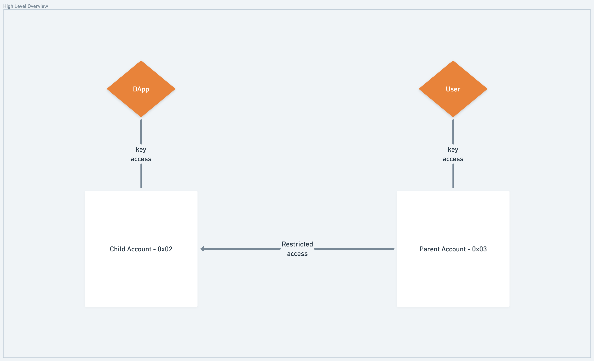
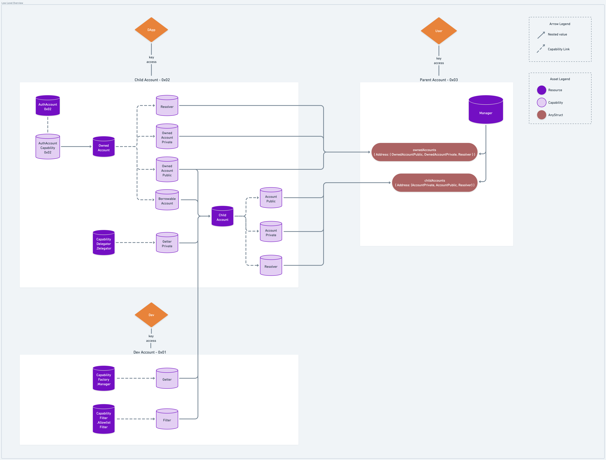
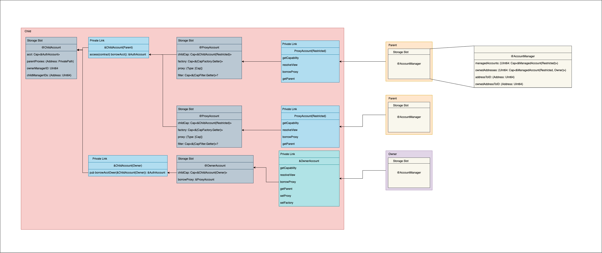
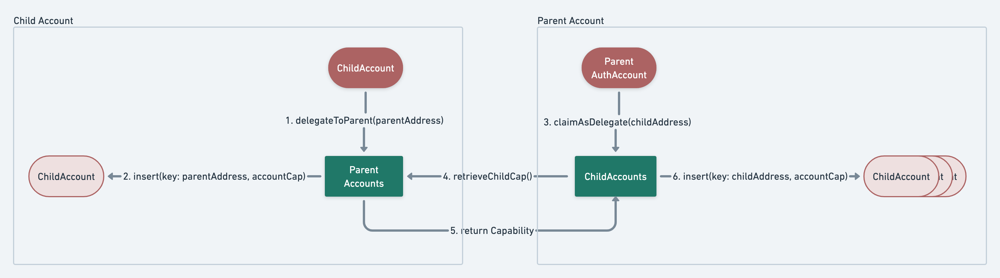

# AuthAccount Capability Management

<details>
<summary>Table of Contents</summary>

- [Context](#context)
- [Objective](#objective)
    - [Non-goals](#non-goals)
    - [Goals](#goals)
- [Ongoing Work](#ongoing-work)
    - [Previous Work](#previous-work)
    - [Proposal Updates](#proposal-updates)
- [Motivation](#motivation)
- [FAQ](#faq)
- [User Benefit](#user-benefit)
- [Design Proposal](#design-proposal)
    - [Bird's-Eye View](#birds-eye-view)
    - [Lower-Level Details](#lower-level-details)
        - [Contracts and Constructs](#contracts-and-constructs)
    - [Considered For Inclusion](#considered-for-inclusion)
        - [Events](#events)
        - [MetadataViews Standards Implementation](#metadataviews-standards-implementation)
        - [Storage Iteration Convenience Methods](#storage-iteration-convenience-methods)
        - [Discoverability](#discoverability)
- [Drawbacks](#drawbacks)
    - [Considerations](#considerations)
        - [Visibility into All Sub-Account Storage](#visibility-into-all-sub-account-storage)
        - [Sources of Truth](#sources-of-truth)
        - [Auditability and Revocation](#auditability-and-revocation)
        - [Limiting Delayed Attack Vectors](#limiting-delayed-attack-vectors)
        - [Lack of Ultimate Control](#lack-of-ultimate-control)
- [Alternatives Considered](#alternatives-considered)
    - [Key-Based Child Accounts](#key-based-child-accounts)
    - [Native Notion of Child Accounts](#native-notion-of-child-accounts)
- [Best Practices](#best-practices)
    - [Creating and Funding Child Accounts](#creating-and-funding-child-accounts)
    - [Linking Existing Account as Child Account](#linking-existing-account-as-child-account)
    - [Revoking a Child Account](#revoking-a-child-account)
    - [Granting Ownership](#granting-ownership)
- [Tutorials and Examples](#tutorials-and-examples)
    - [Adding an Account as a Child Account](#adding-an-account-as-a-child-account-aka-account-linking)
    - [Using a Child Account’s NFT Collection](#using-a-child-accounts-nft-collection)
- [Compatibility](#compatibility)
- [User Impact](#user-impact)
- [Open Questions](#open-questions)
- [References](#references)

</details>

# Context

One of Flow’s biggest advantages is its ease of user onboarding; however, the current state does not [go far enough](https://flow.com/post/flow-blockchain-mainstream-adoption-easy-onboarding-wallets). With the focus on [hybrid custody](https://forum.onflow.org/t/hybrid-custody/4016) and [progressive onboarding flows](https://youtu.be/0eYX_S4jUYM) and the recent work on [AuthAccount capabilities](https://github.com/onflow/flips/pull/53), there is a need for a mechanism to both maintain these capabilities as well as enable dApps to facilitate user interactions that deal with those sub-accounts and the assets within them.

# Objective

## Non-Goals

Before continuing, let’s clear up some common misconceptions about what’s being proposed. Here’s what this Flip is **not** proposing:

- Create a standard for shared access on a user’s primary account
- Introduce guardrails for the use of AuthAccount Capabilities

## Goals

This FLIP proposes a standard for the creation and management of child accounts to support  progressive onboarding models. The standard defines the resources representing the parent-child relationship between accounts, identifies an account as a parent and/or child, and related management functions including:

- Child AuthAccount capability management
- Identifying an account’s child accounts
- Identifying an account’s parent account(s)
- Distinguishing between parent account & owning account
- Adding/removing an account as a child account
- Revoking hybrid custody approval/access granted to a child account from child account owner
- Empowering child account owners (i.e. applications) to define restrictions on parent account access
- Patterns for sharing castable Capabilities via parent-child access path
- Implement useful events builders can rely on

# Ongoing Work

Community-led efforts to collaboratively iterate toward a final solution that works for all parties end-to-end can be found in [onflow/hybrid-custody](https://github.com/Flowtyio/restricted-child-account), originally named `flowtyio/restricted-child-accounts`. This FLIP reflects design updates and revisions raised by [@austinkline](https://github.com/austinkline) to [this forum post](https://forum.onflow.org/t/hybrid-custody-restrictions-on-linked-accounts/4561) and addresses concerns with the original design that was proposed in this FLIP.

## Previous Work

Below are contract and dApp implementations that were used as sandboxes for onchain gaming, progressive onboarding, eventually culminating in the development of this FLIP and hybrid custody as it will be deployed to Mainnet:

- [Simplified linked accounts Cadence](https://github.com/onflow/linked-accounts)
- [Hybrid Custody Cadence in context](https://github.com/onflow/sc-eng-gaming)
- [Walletless onboarding dApp example](https://github.com/onflow/walletless-arcade-example)
- [v0.0 ChildAccount contract deployment](https://f.dnz.dev/0x1b655847a90e644a/ChildAccount)
- [v0.1 LinkedAccounts contract deployment](https://f.dnz.dev/0x1b655847a90e644a/LinkedAccounts)
- [v1.0 HybridCustody contracts deployment](https://f.dnz.dev/0x96b15ff6dfde11fe)
- [v2.0 HybridCustody contracts deployment](https://f.dnz.dev/0x294e44e1ec6993c6)

## Proposal Updates

- **05.05.23**: Major design change covering new HybridCustody + supporting contracts, introducing the ability for app developers to define and encapsulate retrictions on the access given to parent accounts.
- **08.01.23**: Verbiage changes and updates to HybridCustody contract suite.
- **08.15.21**: Moved from "Proposed" to "Accepted"

# Motivation

With Hybrid Custody as an ecosystem-wide feature, we can imagine that a user can have any number of child accounts tied to their main account - one for each dApp they’re using. They will need to maintain AuthAccount capabilities for each, add existing accounts as child accounts, use child account capabilities and easily manage assets across their sub-accounts without the need to first transfer assets to their main account.

For example, a user might have a child account associated with a game dApp containing an NFT and in-game FungibleTokens. They should be able to sign into an NFT marketplace and view the NFTs across all of their linked accounts. Then, without needing to first transfer the NFT to the signing account, list that NFT for sale or purchase an NFT with the FungibleTokens in their child account, signing as the parent account. Similarly, if an offer is submitted on an NFT in a child account, a wallet provider managing the parent or dApp in which the parent accounts is authenticated (i.e. a marketplace) should be able to notify the owner and allow them to accept the offer, again signing as the parent account.

To put it simply, this standard sets down primitives through which well-known web2 account-to-application authorization schemes can be modeled in our decentralized context.

Accomplishing this vision successfully - success here meaning building a secure and universally useful construct that serves as solid ground truth while satisfying the aforementioned objectives - can further distinguish Flow among other chains as a platform for builders to create totally new dApps not possible elsewhere.

# FAQ

- I’m concerned my main account can get adopted by another Flow account, how is that prevented?
    - Issuing Capabilities on an AuthAccount pose the same sort of vulnerability vector as adding keys onto an account. Since these features are in a similar class - that of delegated authority - the community has worked to introduce a new [“Super User Account” feature](https://forum.onflow.org/t/super-user-account/4088), similar to `sudo` in Linux systems. This means issuing a Capability on your AuthAccount, as well as adding keys, deploying/deleting contracts, and other potentially dangerous operations, can only occur in transactions for which you have given explicit sudo-like permission for. Note that the concept is not the focus of this Flip, and is still in discussion meaning the exact construct will likely evolve.
- Why would I want someone else to have access to my account?
    - To clarify, the design isn’t for you to give a dApp access to your main account. The dApp creates an account it maintains access to that it uses to interact with Flow. Then, when you’re ready to access the dApp’s account more directly, the dApp delegates access to your main account, thereby linking its account as a child of your main account. This lets the dApp act on your behalf for only the assets in the child account. Everything in your main account remains only in your control, while allowing you to act on the assets in the child account without the need for the dApp to mediate.
- As a user, why would I want a separate account I share access with? Doesn’t that put all of my assets at custodial risk?
    - Again, only the child account shares access with another party, meaning your main account is safe from custodial risk. In fact, partitioning assets across accounts in this way enhances security over a model that requires all transactions be signed by your main account. A user can keep all of their more valuable assets in their main account, out of reach without a user-signed transaction, while keeping less valuable dApp assets in a shared account for ease of use.
- As an application developer, won't I expose myself to undue risk by giving a user access on an account I have custody of?
    - The newly proposed design introduces the ability to restrict delegated access. This means that you can set the rules on what a user can access via the delegation you grant them, thereby setting their scope as you define it. For example, want users to only be able to access an NFT Collection in your app-custodied account? That can be easily configured!
- This standard and design introduce a lot of complexity. Could this not have been solved in other ways, such as through the use of keys or other approaches?
    - There were a number of previous iterations and designs preceding the Restricted Child Account proposal from Flowty and can be found in [Alternatives Considered](#alternatives-considered) where the issues and limitations of those approaches are detailed.

# User Benefit

A standard resource managing all child account capabilities allows for a unified user experience and prevents the risk of fragmentation, or loss of visibility around capabilities, when handling child accounts. It also enables dApps to connect a user’s primary wallet to access a singular global context across all child accounts and assets. For the end user, this means:

- Greater organization of their app accounts and assets across them
- Reduced risk of forgetting about assets in child accounts
- Ensure the security of a user's main account due to partitioned access between parent and child accounts
- Fewer transfers needed to engage with assets in child accounts as connected dApps can leverage the standard child account managing resource to utilize capabilities across multiple linked accounts within a single signed transaction
- Unified asset balance views across all of their accounts (e.g. Alice has 3 child accounts with TokenA Vaults, but only needs to know the sum of all their balances; Alice has 3 child accounts with NFTs but is only interested in viewing her total collection overview on a marketplace profile page)

And for builders:

- Standardization to define clear expectations on where child account capabilities will reside and how to engage with them
- The ability to create self-custodial dApps leveraging web2 onboarding flows with the added flexibility of delegating shared control of an app account to a user in the future
- Newly included ability to define and set restrictions on the Capabilities a parent account has access to on an account your app custodies
- Easily tap into an ecosystem-wide differentiating feature not possible anywhere else in the industry

# Design Proposal

## Bird's-Eye View



At a high level, a user will have delegated access on an app-custodied account - access mediated by resources which encapsulate developer-defined and instantiated rules, regulating user access on the account to that which the developer has allowed.

Support for access restrictions applied to custodied accounts directly addresses the need for regulatory compliance and mitigation of regulatory risk for developers. This also removes the burden of implementation complexity often experienced with compliance. 

As we'll see below, the promise of real ownership enabled by Hybrid Custody is still realized in that a user can access assets in their child accounts; however, this is now possible without outsized burden and risk on the implementing applications. Additionally, this new approach accounts for a path to "promotion", allowing for users to take control of their shared access accounts while preserving developer safety and expectations.

## Lower-Level Details

### Contracts and Constructs

Below are the contracts involved in the Hybrid Custody construction. The first three come together in the `HybridCustody` contract, so we'll start with those for some context before taking a look at a diagram.

#### CapabilityFilter

The resources in this contract are variations of `Filter` interface implementations. In short, their job is to determine if a given Capability is allowed - in essence, a filter rule to determine whether a Capability is accessible or not based on its underlying Type.

- `DenylistFilter` - Types defined in this filter are those that should not be accessible. This and all following `Filter` implementations link Capabilities that are stored in a `ChildAccount` as a, well filter, on the Capability Types accessible from a child account.
- `AllowlistFilter` - Types defined in this filter are those which are accessible
- `AllowAllFilter` - Can be counted on to allow all types of capabilities

#### CapabilityFactory

Constructs in this contract deal with defining access patterns (in `Factory` struct implementations) for specific Capabilities from accounts such that retrieved Capabilities are castable by the caller.

- `Manager` - Motivated by the need to retrieve typed Capabilities from child accounts, this resource maintains `Factory` structs which retrieve Capabilities that can be cast by the caller. A given `Factory` implementation defines how to access a Capability of a certain type from an account.

#### CapabilityDelegator

As it's named, this contract defines a `Delegator` resource that enables the delegation of arbitrary and "naked" Capabilities.

- `Delegator` - Tasked with storing and retrieving arbitrary Capabilities and intended to be segmented similar to current public & public models for Capability access via `GetterPublic` and `GetterPrivate` interfaces respectively. This resource in stored in a child account and a Capability on it is maintained by a `ChildAccount`.

#### HybridCustody

This contract pulls together all of those listed above to enable Hybrid Custody.

- `Manager` - A resource associated with a parent account that will allow its owner to store and access Capabilities which mediate access on child accounts. These can be Capabilities with restrictions (`childAccounts`) or without restrictions (`ownedAccounts`), mapping to Capabilities on `ChildAccount` and `OwnedAccount` respectively. Enables the addition of delegated Capabilities, retrieval of Capabilities in child accounts, and querying a `Manager`'s child accounts. A manager can also set a filter on the Capabilities it can be granted from a child account which can be helpful if a user is managing child accounts from a custodial wallet that wants to prevent access on specific Capabilities (e.g. `FungibleToken.Vault`).
- `ChildAccount` - This resource lives in a child account and maintains a Capability on an `OwnedAccount` along with other Capabilities that regulate Capability retrieval from said `OwnedAccount`. This resource also serves as a pointer to its related "parent" account who holds a Capability on it from a `Manager` resource.
- `OwnedAccount` - This resource also lives in a child account, encapsulating an AuthAccount Capability on the account in which it's stored. It also maintains state on the parent accounts that have delegated access, its current owner, as well as functionality that enables the owner to revoke parent access and grant account ownership by delegating a Capability on itself to said owner.

#### Tying it All Together


*This diagram depicts the composition of resources and Capabilities involved in this design*

Taking a look at the child account above, we see three resources - `OwnedAccount`, `ChildAccount`, and `Delegator`. The `OwnedAccount` encapsulates a Capability on the child account's AuthAccount while the `ChildAccount` encapsulates Capabilities on facets of the `OwnedAccount`.

In addition to access on the `OwnedAccount`, the `ChildAccount` also has Capabilities on a `CapabilityFactory.Manager` and `CapabilityFilter.Filter`. Together, these two Capabilities enable the delegating application to encapsulate both access patterns and rules around how to access and which types of Capabilities are accessible.

Ultimately, the parent account's access on the child account is mediated through a `Manager` which itself maintains a Capability on the `ChildAccount`.

> :information_source: Note that the diagram above depicts the parent account having both restricted and owned access to the child account via `ChildAccount` and `OwnedAccount` Capabilities respectively; however, this is unlikely to be the case for virtually all users. For the vast majority of users, their hybrid custody access will be mediated via a `ChildAccount` Capability in their `Manager.childAccounts`.

#### Original Implementation Diagram

For reference, here is the diagram that was originally submitted by Austin Kline depicting the relationships & rough interfaces.



The constructs listed above have been prototyped and interface references are available for reference below. Development is ongoing and up-to-date implementation can be found in [this repo](https://github.com/Flowtyio/restricted-child-account).

### Interfaces

The interfaces below are those implemented in the current implementation of [HybridCustody contracts](https://github.com/onflow/hybrid-custody).

<details>
<summary>Filters</summary>

```cadence
pub resource interface Filter {
    pub fun allowed(cap: Capability): Bool
    pub fun getDetails(): AnyStruct
}

pub resource DenylistFilter: Filter {
    // deniedTypes
    // Represents the underlying types which should not ever be 
    // returned by a RestrictedChildAccount. The filter will borrow
    // a requested capability, and make sure that the type it gets back is not
    // in the list of denied types
    access(self) let deniedTypes: {Type: Bool}

    pub fun addType(_ type: Type)
    pub fun removeType(_ type: Type)
    pub fun allowed(cap: Capability): Bool
    pub fun getDetails(): AnyStruct
}

pub resource AllowlistFilter: Filter {
    // allowedTypes
    // Represents the set of underlying types which are allowed to be 
    // returned by a RestrictedChildAccount. The filter will borrow
    // a requested capability, and make sure that the type it gets back is
    // in the list of allowed types
    access(self) let allowedTypes: {Type: Bool}

    pub fun addType(_ type: Type)
    pub fun removeType(_ type: Type)
    pub fun allowed(cap: Capability): Bool
    pub fun getDetails(): AnyStruct
}

// AllowAllFilter is a passthrough, all requested capabilities are allowed
pub resource AllowAllFilter: Filter {
    pub fun allowed(cap: Capability): Bool
    pub fun getDetails(): AnyStruct
}
```
</details>

<details>
<summary>Factory</summary>

```cadence
pub struct interface Factory {
    pub fun getCapability(acct: &AuthAccount, path: CapabilityPath): Capability
}

pub resource interface Getter {
    pub fun getSupportedTypes(): [Type]
    pub fun getFactory(_ t: Type): {CapabilityFactory.Factory}?
}

pub resource Manager: Getter {
    pub let factories: {Type: {CapabilityFactory.Factory}}

    pub fun getSupportedTypes(): [Type]
    pub fun addFactory(_ t: Type, _ f: {CapabilityFactory.Factory})
    pub fun updateFactory(_ t: Type, _ f: {CapabilityFactory.Factory})
    pub fun removeFactory(_ t: Type): {CapabilityFactory.Factory}?
    pub fun getFactory(_ t: Type): {CapabilityFactory.Factory}?
}
```
</details>

<details>
<summary>Delegator</summary>

```cadence
pub resource interface GetterPrivate {
    pub fun getPrivateCapability(_ type: Type): Capability? {
        post {
            result == nil || type.isSubtype(of: result.getType()): "incorrect returned capability type"
        }
    }
    pub fun findFirstPrivateType(_ type: Type): Type?
    pub fun getAllPrivate(): [Capability]
}

pub resource interface GetterPublic {
    pub fun getPublicCapability(_ type: Type): Capability? {
        post {
            result == nil || type.isSubtype(of: result.getType()): "incorrect returned capability type "
        }
    }
    pub fun findFirstPublicType(_ type: Type): Type?
    pub fun getAllPublic(): [Capability]
}

pub resource Delegator: GetterPublic, GetterPrivate {
    access(self) let privateCapabilities: {Type: Capability}
    access(self) let publicCapabilities: {Type: Capability}

    // ------ Begin Getter methods
    pub fun getPublicCapability(_ type: Type): Capability?
    pub fun getPrivateCapability(_ type: Type): Capability?
    pub fun getAllPublic(): [Capability] 
    pub fun getAllPrivate(): [Capability]
    pub fun findFirstPublicType(_ type: Type): Type?
    pub fun findFirstPrivateType(_ type: Type): Type?
    // ------- End Getter methods
    pub fun addCapability(cap: Capability, isPublic: Bool)
    pub fun removeCapability(cap: Capability)
}
```
</details>

<details>
<summary>Manager</summary>

```cadence
/// Entry point for a parent to borrow its child account and obtain capabilities or
/// perform other actions on the child account
pub resource interface ManagerPrivate {
    pub fun addAccount(cap: Capability<&{AccountPrivate, AccountPublic, MetadataViews.Resolver}>)
    pub fun borrowAccount(addr: Address): &{AccountPrivate, AccountPublic, MetadataViews.Resolver}?
    pub fun removeChild(addr: Address)
    pub fun addOwnedAccount(cap: Capability<&{OwnedAccountPrivate, OwnedAccountPublic, MetadataViews.Resolver}>)
    pub fun borrowOwnedAccount(addr: Address): &{OwnedAccountPrivate, OwnedAccountPublic, MetadataViews.Resolver}?
    pub fun removeOwned(addr: Address)
    pub fun setManagerCapabilityFilter(cap: Capability<&{CapabilityFilter.Filter}>?, childAddress: Address) {
        pre {
            cap == nil || cap!.check(): "Invalid Manager Capability Filter"
        }
    }
}

/// Functions anyone can call on a manager to get information about an account such as
/// What child accounts it has
pub resource interface ManagerPublic {
    pub fun borrowAccountPublic(addr: Address): &{AccountPublic, MetadataViews.Resolver}?
    pub fun getChildAddresses(): [Address]
    pub fun getOwnedAddresses(): [Address]
    pub fun getChildAccountDisplay(address: Address): MetadataViews.Display?
    access(contract) fun removeParentCallback(child: Address)
}


/// A resource for an account which fills the Parent role of the Child-Parent account management Model. A Manager
/// can redeem or remove child accounts, and obtain any capabilities exposed by the child account to them.
pub resource Manager: ManagerPrivate, ManagerPublic, MetadataResolver.Resolver {
    pub let childAccounts: {{Address: Capability<&{AccountPrivate, AccountPublic, MetadataViews.Resolver}>}
    pub let ownedAccounts: {Address: Capability<&{Account, ChildAccountPublic, ChildAccountPrivate, MetadataViews.Resolver}>}
    // A bucket of structs so that the Manager resource can be easily extended with new functionality.
    pub let data: {String: AnyStruct}
    // A bucket of resources so that the Manager resource can be easily extended with new functionality.
    pub let resources: @{String: AnyResource}
    /// An optional filter to gate what capabilities are permitted to be returned from a child account
    /// For example, Dapper Wallet parent account's should not be able to retrieve any FungibleToken Provider capabilities.
    pub let filter: Capability<&{CapabilityFilter.Filter}>?
    
    pub fun setChildAccountDisplay(address: Address, _ d: MetadataViews.Display?) {
        pre {
            self.childAccounts[address] != nil: "There is no child account with this address"
        }
    }
    pub fun addAccount(_ cap: Capability<&{AccountPrivate, AccountPublic, MetadataViews.Resolver}>) {
        pre {
            self.accounts[cap.address] == nil: "There is already a child account with this address"
        }
    }
    pub fun setDefaultManagerCapabilityFilter(cap: Capability<&{CapabilityFilter.Filter}>?) {
        pre {
            cap == nil || cap!.check(): "supplied capability must be nil or check must pass"
        }
    }
    pub fun setManagerCapabilityFilter(cap: Capability<&{CapabilityFilter.Filter}>?, childAddress: Address)
    pub fun removeChild(addr: Address)
    access(contract) fun removeParentCallback(child: Address)
    pub fun addOwnedAccount(_ cap: Capability<&{Account, ChildAccountPublic, ChildAccountPrivate, MetadataViews.Resolver}>) {
        pre {
            self.ownedAccounts[cap.address] == nil: "There is already a child account with this address"
        }
    }
    pub fun getAddresses(): [Address]
    pub fun borrowAccount(addr: Address): &{AccountPrivate, AccountPublic}?
    pub fun borrowAccountPublic(addr: Address): &{AccountPublic}?
    pub fun borrowOwnedAccount(addr: Address): &{Account, ChildAccountPublic, ChildAccountPrivate}?
    pub fun removeOwned(addr: Address)
    pub fun giveOwnerShip(addr: Address, to: Address)
    pub fun getChildAddresses(): [Address]
    pub fun getOwnedAddresses(): [Address]
    pub fun getViews(): [Type]
    pub fun resolveView(_ view: Type): AnyStruct?
}
```
</details>

<details>
<summary>ChildAccount</summary>
<code>

```cadence
/// Public methods exposed on a ChildAccount resource. OwnedAccountPublic will share some methods here, but isn't
/// necessarily the same.
pub resource interface AccountPublic {
    pub fun getPublicCapability(path: PublicPath, type: Type): Capability?
    pub fun getPublicCapFromDelegator(type: Type): Capability?
    pub fun getAddress(): Address
}

/// Methods accessible to the designated parent of a ChildAccount
pub resource interface AccountPrivate {
    pub fun getCapability(path: CapabilityPath, type: Type): Capability? {
        post {
            result == nil || [true, nil].contains(self.getManagerCapabilityFilter()?.allowed(cap: result!)):
                "Capability is not allowed by this account's Parent"
        }
    }
    pub fun getPublicCapability(path: PublicPath, type: Type): Capability?
    pub fun getManagerCapabilityFilter():  &{CapabilityFilter.Filter}?
    pub fun getPublicCapFromDelegator(type: Type): Capability?
    pub fun getPrivateCapFromDelegator(type: Type): Capability? {
        post {
            result == nil || [true, nil].contains(self.getManagerCapabilityFilter()?.allowed(cap: result!)):
                "Capability is not allowed by this account's Parent"
        }
    }
    access(contract) fun redeemedCallback(_ addr: Address)
    access(contract) fun setManagerCapabilityFilter(_ managerCapabilityFilter: Capability<&{CapabilityFilter.Filter}>?) {
        pre {
            managerCapabilityFilter == nil || managerCapabilityFilter!.check(): "Invalid Manager Capability Filter"
        }
    }
    access(contract) fun parentRemoveChildCallback(parent: Address)
}

/// The ChildAccount resource sits between a child account and a parent and is stored on the same account as the
/// child account. Once created, a private capability to the child account is shared with the intended parent. The
/// parent account will accept this child capability into its own manager resource and use it to interact with the
/// child account.
/// 
/// Because the ChildAccount resource exists on the child account itself, whoever owns the child account will be
/// able to manage all ChildAccount resources it shares, without worrying about whether the upstream parent can do
/// anything to prevent it.
pub resource ChildAccount: AccountPrivate, AccountPublic, MetadataViews.Resolver {
    /// A Capability providing access to the underlying child account via Capability on its OwnedAccount
    access(self) let childCap: Capability<&{BorrowableAccount, OwnedAccountPublic, MetadataViews.Resolver}>
    // The CapabilityFactory Manager is a ChildAccount's way of limiting what types can be asked for by its parent
    // account. The CapabilityFactory returns Capabilities which can be casted to their appropriate types once
    // obtained, but only if the child account has configured their factory to allow it. For instance, a
    // ChildAccount might choose to expose NonFungibleToken.Provider, but not FungibleToken.Provider
    pub var factory: Capability<&CapabilityFactory.Manager{CapabilityFactory.Getter}>
    // The CapabilityFilter is a restriction put at the front of obtaining any non-public Capability. Some wallets
    // might want to give access to NonFungibleToken.Provider, but only to **some** of the collections it manages,
    // not all of them.
    pub var filter: Capability<&{CapabilityFilter.Filter}>
    // The CapabilityDelegator is a way to share one-off capabilities from the child account. These capabilities
    // can be public OR private and are separate from the factory which returns a capability at a given path as a 
    // certain type. When using the CapabilityDelegator, you do not have the ability to specify which path a
    // capability came from. For instance, Dapper Wallet might choose to expose a Capability to their Full TopShot
    // collection, but only to the path that the collection exists in.
    pub let delegator: Capability<&CapabilityDelegator.Delegator{CapabilityDelegator.GetterPublic, CapabilityDelegator.GetterPrivate}>
    // managerCapabilityFilter is a component optionally given to a child account when a manager redeems it. If
    // this filter is not nil, any Capability returned through the `getCapability` function checks that the
    // manager allows access first.
    access(self) var managerCapabilityFilter: Capability<&{CapabilityFilter.Filter}>?
    // A bucket of structs so that the ChildAccount resource can be easily extended with new functionality.
    access(self) let data: {String: AnyStruct}
    // A bucket of resources so that the ChildAccount resource can be easily extended with new functionality.
    access(self) let resources: @{String: AnyResource}
    // ChildAccount resources have a 1:1 association with parent accounts, the named parent Address here is the 
    // one with a Capability on this resource.
    pub let parent: Address

    pub fun getAddress(): Address
    access(contract) fun redeemedCallback(_ addr: Address)
    access(contract) fun setManagerCapabilityFilter(_ managerCapabilityFilter: Capability<&{CapabilityFilter.Filter}>?)
    pub fun setCapabilityFactory(_ cap: Capability<&CapabilityFactory.Manager{CapabilityFactory.Getter}>)
    pub fun setCapabilityFilter(_ cap: Capability<&{CapabilityFilter.Filter}>)
    access(contract) fun setDisplay(_ d: MetadataViews.Display)
    // The main function to a child account's capabilities from a parent account. When a PrivatePath type is used, 
    // the CapabilityFilter will be borrowed and the Capability being returned will be checked against it to 
    // ensure that borrowing is permitted
    pub fun getCapability(path: CapabilityPath, type: Type): Capability?
    pub fun getPrivateCapFromDelegator(type: Type): Capability?
    pub fun getPublicCapFromDelegator(type: Type): Capability?
    pub fun getPublicCapability(path: PublicPath, type: Type): Capability?
    pub fun getManagerCapabilityFilter():  &{CapabilityFilter.Filter}?
    access(contract) fun setRedeemed(_ addr: Address)
    pub fun borrowCapabilityDelegator(): &CapabilityDelegator.Delegator?
    pub fun getViews(): [Type]
    pub fun resolveView(_ view: Type): AnyStruct?
    access(contract) fun parentRemoveChildCallback(parent: Address)
}
```
</code>
</details>

<details>
<summary>OwnedAccount</summary>

```cadence

/// An OwnedAccount shares the BorrowableAccount capability to itelf with ChildAccount resources
pub resource interface BorrowableAccount {
    access(contract) fun borrowAccount(): &AuthAccount
    /// Returns whether the encapsulated AuthAccount Capability is valid
    pub fun check(): Bool
}

/// Public methods anyone can call on an OwnedAccount
pub resource interface OwnedAccountPublic {
    /// Returns the addresses of all parent accounts
    pub fun getParentAddresses(): [Address]

    /// Returns associated parent addresses and their redeemed status - true if redeemed, false if pending
    pub fun getParentStatuses(): {Address: Bool}

    /// Returns true if the given address is a parent of this child and has redeemed it. Returns false if the given
    /// address is a parent of this child and has NOT redeemed it. Returns nil if the given address it not a parent
    /// of this child account.
    pub fun getRedeemedStatus(addr: Address): Bool?

    /// A callback function to mark a parent as redeemed on the child account.
    access(contract) fun setRedeemed(_ addr: Address)
}

/// Private interface accessible to the owner of the OwnedAccount
pub resource interface OwnedAccountPrivate {
    /// Deletes the ChildAccount resource being used to share access to this OwnedAccount with the supplied parent
    /// address, and unlinks the paths it was using to reach the underlying account.
    pub fun removeParent(parent: Address): Bool

    /// Sets up a new ChildAccount resource for the given parentAddress to redeem. This child account uses the
    /// supplied factory and filter to manage what can be obtained from the child account, and a new
    /// CapabilityDelegator resource is created for the sharing of one-off capabilities. Each of these pieces of
    /// access control are managed through the child account.
    pub fun publishToParent(
        parentAddress: Address,
        factory: Capability<&CapabilityFactory.Manager{CapabilityFactory.Getter}>,
        filter: Capability<&{CapabilityFilter.Filter}>
    ) {
        pre {
            factory.check(): "Invalid CapabilityFactory.Getter Capability provided"
            filter.check(): "Invalid CapabilityFilter Capability provided"
        }
    }

    /// Passes ownership of this child account to the given address. Once executed, all active keys on the child
    /// account will be revoked, and the active AuthAccount Capability being used by to obtain capabilities will be
    /// rotated, preventing anyone without the newly generated Capability from gaining access to the account.
    pub fun giveOwnership(to: Address)

    /// Revokes all keys on an account, unlinks all currently active AuthAccount capabilities, then makes a new one
    /// and replaces the OwnedAccount's underlying AuthAccount Capability with the new one to ensure that all
    /// parent accounts can still operate normally.
    /// Unless this method is executed via the giveOwnership function, this will leave an account **without** an
    /// owner.
    /// USE WITH EXTREME CAUTION.
    pub fun seal()

    // setCapabilityFactoryForParent
    // Override the existing CapabilityFactory Capability for a given parent. This will allow the owner of the
    // account to start managing their own factory of capabilities to be able to retrieve
    pub fun setCapabilityFactoryForParent(parent: Address, cap: Capability<&CapabilityFactory.Manager{CapabilityFactory.Getter}>) {
        pre {
            cap.check(): "Invalid CapabilityFactory.Getter Capability provided"
        }
    }

    /// Override the existing CapabilityFilter Capability for a given parent. This will allow the owner of the
    /// account to start managing their own filter for retrieving Capabilities on Private Paths
    pub fun setCapabilityFilterForParent(parent: Address, cap: Capability<&{CapabilityFilter.Filter}>) {
        pre {
            cap.check(): "Invalid CapabilityFilter Capability provided"
        }
    }

    /// Adds a capability to a parent's managed @ChildAccount resource. The Capability can be made public,
    /// permitting anyone to borrow it.
    pub fun addCapabilityToDelegator(parent: Address, cap: Capability, isPublic: Bool) {
        pre {
            cap.check<&AnyResource>(): "Invalid Capability provided"
        }
    }

    /// Removes a Capability from the CapabilityDelegator used by the specified parent address
    pub fun removeCapabilityFromDelegator(parent: Address, cap: Capability)

    /// Returns the address of this OwnedAccount
    pub fun getAddress(): Address
    
    /// Checks if this OwnedAccount is a child of the specified address
    pub fun isChildOf(_ addr: Address): Bool

    /// Returns all addresses which are parents of this OwnedAccount
    pub fun getParentAddresses(): [Address]

    /// Borrows this OwnedAccount's AuthAccount Capability
    pub fun borrowAccount(): &AuthAccount?

    /// Returns the current owner of this account, if there is one
    pub fun getOwner(): Address?

    /// Returns the pending owner of this account, if there is one
    pub fun getPendingOwner(): Address?

    /// A callback which is invoked when a parent redeems an owned account
    access(contract) fun setOwnerCallback(_ addr: Address)
    
    /// Destroys all outstanding AuthAccount capabilities on this owned account, and creates a new one for the
    /// OwnedAccount to use
    pub fun rotateAuthAccount()

    /// Revokes all keys on this account
    pub fun revokeAllKeys()
}


/// A resource which sits on the account it manages to make it easier for apps to configure the behavior they want 
/// to permit. An OwnedAccount can be used to create ChildAccount resources and share them, publishing them to
/// other addresses.
/// 
/// The OwnedAccount can also be used to pass ownership of an account off to another address, or to relinquish
/// ownership entirely, marking the account as owned by no one. Note that even if there isn't an owner, the parent
/// accounts would still exist, allowing a form of Hybrid Custody which has no true owner over an account, but
/// shared partial ownership.
///
pub resource OwnedAccount: OwnedAccountPrivate, BorrowableAccount, OwnedAccountPublic, MetadataViews.Resolver {
    access(self) var acct: Capability<&AuthAccount>
    pub let parents: {Address: Bool}
    pub var pendingOwner: Address?
    pub var acctOwner: Address?
    pub var currentlyOwned: Bool

    access(contract) fun setRedeemed(_ addr: Address) {
        pre {
            self.parents[addr] != nil: "address is not waiting to be redeemed"
        }
    }
    access(contract) fun setOwnerCallback(_ addr: Address) {
        pre {
            self.pendingOwner == addr: "Address does not match pending owner!"
        }
    }
    pub fun publishToParent(
        parentAddress: Address,
        factory: Capability<&CapabilityFactory.Manager{CapabilityFactory.Getter}>,
        filter: Capability<&{CapabilityFilter.Filter}>
    )
    pub fun check(): Bool
    pub fun borrowAccount(): &AuthAccount
    pub fun getParentsAddresses(): [Address]
    pub fun isChildOf(_ addr: Address): Bool
    pub fun getRedeemedStatus(addr: Address): Bool?
    pub fun getParentStatuses(): {Address: Bool}
    pub fun removeParent(parent: Address): Bool
    pub fun getAddress(): Address
    pub fun getOwner(): Address?
    pub fun giveOwnership(to: Address)
    pub fun revokeAllKeys() {
    pub fun rotateAuthAccount()
    /// Revokes all keys on an account, unlinks all currently active AuthAccount capabilities, then makes a new one
    /// and replaces the @OwnedAccount's underlying AuthAccount Capability with the new one to ensure that all parent
    /// accounts can still operate normally.
    /// Unless this method is executed via the giveOwnership function, this will leave an account **without** an owner.
    pub fun seal()
    pub fun borrowChildAccount(parent: Address): &ChildAccount?
    pub fun setCapabilityFactoryForParent(parent: Address, cap: Capability<&CapabilityFactory.Manager{CapabilityFactory.Getter}>)
    pub fun setCapabilityFilterForParent(parent: Address, cap: Capability<&{CapabilityFilter.Filter}>)
    pub fun borrowCapabilityDelegatorForParent(parent: Address): &CapabilityDelegator.Delegator?
    pub fun addCapabilityToDelegator(parent: Address, _ cap: Capability, isPublic: Bool)
    pub fun removeCapabilityFromDelegator(parent: Address, _ cap: Capability)
    pub fun getViews(): [Type]
    pub fun resolveView(_ view: Type): AnyStruct?
    pub fun setDisplay(_ d: MetadataViews.Display)
}
```
</details>

## Considered For Inclusion

### Events

> The following proposed events are in addition to the AuthAccount Capability linking event `flow.AccountLinked(address: Address, path: PrivatePath)` implemented in the Cadence [AuthAccount Capability linking API](https://github.com/onflow/flips/pull/53#issuecomment-1452777257) whenever an account is linked via `AuthAccount.linkAccount(PrivatePath)`.

As some builders have voiced, using a shared standard contract can present challenges to dApps subscibing to events on the contract. Ultimately, how do they know which events are relevant to their users' accounts?

Events have been a topic of discussion and iteration (see PRs [#20](https://github.com/onflow/hybrid-custody/pull/20), [#82](https://github.com/onflow/hybrid-custody/pull/82), [#83](https://github.com/onflow/hybrid-custody/pull/83), & [#123](https://github.com/onflow/hybrid-custody/pull/123)) and the following events have been elected:

- **Publishing a ChildAccount and Adding & Removing ChildAccount to Manager** - Whenever an account is added as a child of a parent account - IOW when a Capability is added/removed to/from a `Manager` - an event is emitted denoting both sides of the link. Other events include coverage for actions involved in readying a child account to be claimed by a `Manager` resource.
    ```cadence
    /// ChildAccount ready to be redeemed by emitted pendingParent
    pub event ChildAccountPublished(
        ownedAcctID: UInt64,
        childAcctID: UInt64,
        capDelegatorID: UInt64,
        factoryID: UInt64,
        filterID: UInt64,
        filterType: Type,
        child: Address,
        pendingParent: Address
    )
    // ChildAccount added/removed from Manager
    // - active  : added to Manager
    // - !active : removed from Manager
    pub event AccountUpdated(id: UInt64?, child: Address, parent: Address, active: Bool)
    ```

- **Grant/Revoke Capabilities from Child Accounts** - Emitted when access to a Capability has been granted from a child account.
    ```cadence
    /* CapabilityDelegator - isPublic: Delegator.publicCapabilities | !isPublic: Delegator.privateCapabilities | active: added | !active: removed */
    pub event DelegatorUpdated(id: UInt64, capabilityType: Type, isPublic: Bool, active: Bool)

    /* CapabilityFilter - active: added | !active: removed */
    pub event FilterUpdated(id: UInt64, filterType: Type, type: Type, active: Bool)
    ```

- **Ownership Actions** - An `OwnedAccount` resource has the ability to delegate ownership to another account, providing unrestricted access to the account via its encapsulated AuthAccount Capability. This is an important action and deserves relevant events.
    ```cadence
    pub event OwnershipGranted(ownedAcctID: UInt64, child: Address, previousOwner: Address?, pendingOwner: Address)
    pub event AccountSealed(id: UInt64, address: Address, parents: [Address])
    /// OwnedAccount added/removed from Manager
    ///     active && owner != nil  : added to Manager 
    ///     !active && owner == nil : removed from Manager
    pub event OwnershipUpdated(id: UInt64, child: Address, previousOwner: Address?, owner: Address?, active: Bool)
    ```

- **Creation of Standard Resources** - Emitted when a `Manager`, `ChildAccount` and `Delegator` are created. Since the `Manager` creation method is a public contract methods, there isn't any data we can include related to the caller. However, this event could be helpful from a data analysis & user behavior perspective allowing us to gain insight into the adoption of Hybrid Custody as a whole.
    ```cadence
    /* HybridCustody */
    pub event CreatedManager(id: UInt64)
    pub event CreatedChildAccount(id: UInt64, child: Address)
    /* CapabilityDelegator */
    pub event DelegatorCreated(id: UInt64)
    ```

### MetadataViews Standards Implementation

While not yet implemented, `MetadataViews` interfaces lend themselves well to the need for identifying the purposes of child accounts. For example, a user would want to identify which child account is associated with their MonsterMaker game and which is their social media app account, etc. Leveraging these existing metadata interfaces makes it easy for builders to resolve metadata about a user's linked accounts, at least in regards to the account's association/purpose.

Implementation of the standard is easy enough, but we'll want to consider guidance on source of truth as developer-defined metadata presents a phishing vector. An attacker could create an account with standard resources and attached metadata resembling a victim's account, then publish it for the victim to claim. The victim might then inadvertently then claim the account transfer NFTs or funds to that account which the attacker could then siphon.

Requiring user signature to add accounts to their `Manager` helps prevent phishing, but building out user notifications on `ChildAccountPublished` presents at minimum a spam vector that could result in user action exposing them to phishing attacks. A combination of on- and off-chain pet names have been raised a potential construct to minimize the risk associated with these sorts of attack vectors.

For the moment, it's recommended that providers disable inbox notification for `OwnershipGranted` and `ChildAccountPublished` events, instead allowing account linking to occur in the initiating application. This practice reduces the chance users will be fooled as they won't be notified of published attempts and anyone interested in leveraging hybrid custody as an attack vector must first onboard users and convince them to add valuable assets to the app-custodied child accounts, vastly increasing the cost an attack.

With regard to the metadata scheme, both `OwnedAccount` resources have an optional `display` field, and while it can't be enforced, it's recommended that application developers add a `Display` view that accurately represents the account's association. A parent account can also set a `Display` view for a `ChildAccount` via their manager, but note that these mechanisms aren't foolproof and are not to be used as a source of provenance - a topic that has been raised, but has been decided to be out of scope as a requirement for a Hybrid Custody solution.

### Storage Iteration Convenience Methods

To support developers integrating with Hybrid Custody accounts, it will be essential that we provide example scripts (if not in-built helper methods). Inspecting balances across all of a user's associated accounts is one common use case.

Note that this script doesn't check if the a user has access to the Vaults in those accounts which will be an important consideration in production environments

The most simple use case for this is when dealing with a FT that multiple child accounts hold, or NFTs from the same collection spread among different child accounts. Currently, a dApp would solve this by iterating over each child account's storage either in separate or one large script (the former being more scalable over large number of stored items):

<details>
<summary>Example Account + Storage Iteration Script to get child account balances</summary>

```cadence
import "FungibleToken"
import "MetadataViews"
import "HybridCustody"

/// Returns a mapping of balances indexed on the Type of resource containing the balance
///
pub fun getAllBalancesInStorage(_ address: Address): {Type: UFix64} {
    // Get the account
    let account: AuthAccount = getAuthAccount(address)
    // Init for return value
    let balances: {Type: UFix64} = {}
    // Track seen Types in array
    let seen: [Type] = []
    // Assign the type we'll need
    let balanceType: Type = Type<@{FungibleToken.Balance}>()
    // Iterate over all stored items & get the path if the type is what we're looking for
    account.forEachStored(fun (path: StoragePath, type: Type): Bool {
        if type.isInstance(balanceType) || type.isSubtype(of: balanceType) {
            // Get a reference to the resource & its balance
            let vaultRef = account.borrow<&{FungibleToken.Balance}>(from: path)!
            // Insert a new values if it's the first time we've seen the type
            if !seen.contains(type) {
                balances.insert(key: type, vaultRef.balance)
            } else {
                // Otherwise just update the balance of the vault (unlikely we'll see the same type twice in
                // the same account, but we want to cover the case)
                balances[type] = balances[type]! + vaultRef.balance
            }
        }
        return true
    })
    return balances
}

/// Queries for FT.Vault balance of all FT.Vaults in the specified account and all of its associated accounts
///
pub fun main(address: Address): {Address: {Type: UFix64}} {

    // Get the balance for the given address
    let balances: {Address: {Type: UFix64}} = { address: getAllBalancesInStorage(address) }
    // Tracking Addresses we've come across to prevent overwriting balances (more efficient than checking dict entries (?))
    let seen: [Address] = [address]
    
    /* Iterate over any associated accounts */ 
    //
    if let managerRef = getAuthAccount(address)
        .borrow<&HybridCustody.Manager>(from: HybridCustody.ManagerStoragePath) {
        
        for childAccount in managerRef.getChildAddresses() {
            balances.insert(key: childAccount, getAllBalancesInStorage(address))
            seen.append(childAccount)
        }

        for ownedAccount in managerRef.getOwnedAddresses() {
            if seen.contains(ownedAccount) == false {
                balances.insert(key: ownedAccount, getAllBalancesInStorage(address))
                seen.append(ownedAccount)
            }
        }
    }

    return balances 
}
```
</details>

## Discoverability

The notion of discoverability has come up a number of times throughout conversations, and can generally be described as the process of understanding the purpose of, contents in, and access allowed on a particular child account.

Metadata views and resolution helps answer the question of the purpose of a child account. Scripts can help us discover the contents of a given accounts.

The remaining question - what access is allowed on an account via `ChildAccount` Capability - is largely a matter of leveraging rich scripts. Since testnet deployment, builders have provided very helpful feedback that has helped grow the repository of helpful boilerplate scripts. The hope is we'll be able to continue growing these over time and at some point leverage FLIX, FCL plugins, and perhaps other SDKs to enhance developer experience when interacting with Hybrid Custody accounts.

Below is one common use case example demonstrating how we can determine accessible assets in child accounts:

<details> 
<summary>Getting Accessible Child Account NFTs</summary>

```cadence
import "HybridCustody"
import "NonFungibleToken"
import "MetadataViews"

// source: https://github.com/onflow/hybrid-custody/blob/main/scripts/hybrid-custody/get_accessible_child_account_nfts.cdc
//
// This script iterates through a parent's child accounts, 
// identifies private paths with an accessible NonFungibleToken.Provider, and returns the corresponding typeIds
pub fun main(addr: Address): AnyStruct {
  let manager = getAuthAccount(addr).borrow<&HybridCustody.Manager>(from: HybridCustody.ManagerStoragePath) ?? panic ("manager does not exist")

  var typeIdsWithProvider = {} as {Address: [String]}

  // Address -> nft UUID -> Display
  var nftViews = {} as {Address: {UInt64: MetadataViews.Display}} 

  
  let providerType = Type<Capability<&{NonFungibleToken.Provider}>>()
  let collectionType: Type = Type<@{NonFungibleToken.CollectionPublic}>()

  // Iterate through child accounts
  for address in manager.getChildAddresses() {
    let acct = getAuthAccount(address)
    let foundTypes: [String] = []
    let views: {UInt64: MetadataViews.Display} = {}
    let childAcct = manager.borrowAccount(addr: address) ?? panic("child account not found")
    // get all private paths
    acct.forEachPrivate(fun (path: PrivatePath, type: Type): Bool {
      // Check which private paths have NFT Provider AND can be borrowed
      if !type.isSubtype(of: providerType){
        return true
      }
      if let cap = childAcct.getCapability(path: path, type: Type<&{NonFungibleToken.Provider}>()) {
        let providerCap = cap as! Capability<&{NonFungibleToken.Provider}> 

        if !providerCap.check(){
          // if this isn't a provider capability, exit the account iteration function for this path
          return true
        }
        foundTypes.append(cap.borrow<&AnyResource>()!.getType().identifier)
      }
      return true
    })
    typeIdsWithProvider[address] = foundTypes

    // iterate storage, check if typeIdsWithProvider contains the typeId, if so, add to views
    acct.forEachStored(fun (path: StoragePath, type: Type): Bool {

      if typeIdsWithProvider[address] == nil {
        return true
      }

      for key in typeIdsWithProvider.keys {
        for idx, value in typeIdsWithProvider[key]! {
          let value = typeIdsWithProvider[key]!

          if value[idx] != type.identifier {
            continue
          } else {
            if type.isInstance(collectionType) {
              continue
            }
            if let collection = acct.borrow<&{NonFungibleToken.CollectionPublic}>(from: path) { 
              // Iterate over IDs & resolve the view
              for id in collection.getIDs() {
                let nft = collection.borrowNFT(id: id)
                if let display = nft.resolveView(Type<MetadataViews.Display>())! as? MetadataViews.Display {
                  views.insert(key: nft.uuid, display)
                }
              }
            }
            continue
          }
        }
      }
      return true
    })
    nftViews[address] = views
  }
  return nftViews
}
```
</details>

# Drawbacks

AuthAccount Capability is a powerful tool that can be dangerous if it is not used properly. Standardizing how these Capabilities are managed should not have any negative impact on Flow’s ecosystem. Considering there have already been discussions about enhancing the security of potentially dangerous actions with [entitlements](https://github.com/onflow/flips/pull/54) enabled AuthAccounts, the introduction of an account linking transaction pragma (`#allowAccountLinking`), and increasing the auditability and control of Capabilities with [Capability Controllers (CapCons)](https://github.com/onflow/flow/pull/798/files?short_path=f2770e8#diff-f2770e8e35eaed0f7ffa91d366e50cb08f0e18d363c0c5543774d11d7656c8a9), this Flip does not introduce any new attack vectors into the ecosystem.

## Considerations

### Visibility into All Sub-Account Storage

Queries involving storage iteration over a large number of accounts might encounter memory limits either by iteration over too large a number of addresses, too many items in storage, or some combination of the two. This is noted not as a requirement to solve, but as a design consideration in how we communicate an account’s sub-accounts and whether we also include resource/contract methods to easily query the assets in sub-accounts.

### Sources of Truth

Another consideration is preserving the `Manager`, `ChildAccount` and `OwnedAccount` state values as accurate sources of truth for the status of a particular account link. Just as we rely on keys to determine access to an account, so too should we be able to determine from a parent account if it has a capability for another account. Inversely, from a child account we should be able to determine if another account has delegated authority and the address of that account.

### Auditability and Revocation

The proposed design does as well as possible to accurately reflect linking state and identify parent(s) and child parties; however, auditability on delegated access is limited by the nature of Capabilities as they exist today. 

From a user's perspective, even when an account is "owned" & "sealed" - that is, all keys have been revoked and AuthAccount Capailities are linked to a single, deterministically generated path - it should be treated as though a secondary party has access. This is because a malicious agent could link an AuthAccount Capability at the deterministally generated path and issue themselves said Capability in the same transactions ownership is granted. Counter-measures against such a case only go so far, at least until [Capability Controllers](https://github.com/onflow/flow/pull/798) enter the picture.

As such, and also because the current design ultimately puts control & custody in the hands of app developers, it’s recommended that a user remove their own delegated access on an account over revoking an application's access on an account.

### Limiting Delayed Attack Vectors

When it comes to accessing a user’s saved AuthAccount Capabilities, it is possible to restrict Capabilities to retrieval by reference - `&AuthAccount` instead of `Capability<&AuthAccount>`. However, in capability-based access, such restrictions on an issued Capability might be considered an anti-pattern.

With that said, signing a malicious transaction today means you are at risk within the scope of that transaction. Signing a malicious transaction in a world of AuthAccount Capabilities means a bad actor could issue themselves a Capability on your account or one of your child accounts to perform their attack at a later time.

One way to prevent this is to make accessing issued AuthAccount Capabilities ephemeral, limiting the scope of the attack to the time scope of the transaction. Another is to rely on events emitted whenever an owned account's AuthAccount Capability is retrieved from the `ChildAccount`. Yet another measure would include emitting an event any time an AuthAccount Capability is linked, which is the case when the Capability is linked at a new path.

```cadence
// Let's say a parent account is signing a transaction in which a reference to
// a ChildAccount is retrieved
let ownedAccountRef = parent.borrow<&HybridCustody.Manager>(
		from: HybridCustody.ManagerStoragePath
	)!.borrowOwnedAccount(addr: Address)!

// In the current prototype definitions of ChildAccount
// we return a reference to an auth account which is ephemeral
// in that it cannot be stored. The worst a malicious transaction could
// do is limited in scope to within the transaction being signed
let accountRef: &AuthAccount = ownedAccountRef.borrowAccount()

// Alternatively, we could just return the Capability to the AuthAccount.
// With this, a malicious transaction could publish the capability for themselves,
// retrieve it and store it for later use. This expands at least the time scope
// of the attack and is difficult to audit. 
let accountCap: Capability<&AuthAccount> = ownedAccountRef.getAccountCapability(address: 0x02)
```

Taken together, these measures enable wallet providers to at least notify relevant user’s when any of their accounts trigger an AuthAccount Capability-related event. Such a flow would be similar to the notification you receive from a Web2 identity provider whenever you authorize a new app (e.g. sign in with Google to DapperLabs and Google will let you know you linked your accounts).

With all this said, however, this does not feel entirely different than the risk vectors present by simply signing a transaction.

### Lack of Ultimate Control

Initially, the idea of Hybrid Custody was to give user's ultimate control over their app accounts. However, over time it became evident this model would not be reasonable for application developers to implement.

The response to the concerns was to place custody and control of Hybrid Custody accounts in the hands of the implementing developers. This means the current proposal is interoperable with existing custodial and funding infrastructure. The tradeoff here is that, at least initially, users have secondary access on these accounts - an application could cut off their access at any time, or another party could be given ownership of the account, superceding the user's access rights.

What this design foregoes in user sovereignty and property rights it makes up for in developer ergonomics and feasibility. A balance is necessary here for the sake of application developer experience and adoption of the this feature, and it's believed that this user-restricted access model strikes an appropriate balance.

# **Alternatives Considered**

## Key-Based Child Accounts

For reference, see this implementation of  [key-based child accounts](https://github.com/onflow/sc-eng-gaming/blob/sisyphusSmiling/child-account/contracts/ChildAccount.cdc#L145)

In this construction, account access is delegated by adding a parent account’s PublicKey (1000 weight) to a child account. This gives both the parent and the holder of the originating public key’s paired private key full signing authority on the child account.

Simply using keys to delegate access is the most often suggested alternative to AuthAccount Capabilities for delegated access. While this would technically result in shared access, this approach creates a number of secondary problems without straightforward solutions.

In the scenario that a main account key is added to a linked account, consider the following:

1. What if I want to switch wallets & bring linked accounts with me?
2. What if I want to bring my linked accounts across devices namely mobile?
3. If I need to re-key my main account, do I need to also re-key all linked accounts?

On 1/ - delegated access should be portable across wallets & knowledge of linked accounts should be available to both wallets & dApps. Establishing the association on-chain solves the problem of global knowledge.

On 2/ Again, linked accounts should be available anywhere the user has access to the parent account, meaning cross-device & potentially across different wallets. If we rely on a self-custodied key local to a device, we lose that interoperability.

On 3/ In this key-based approach key, re-keying my main account means I need to re-key all linked accounts. If I have separate keys for each linked account, how do I manage those keys?

This approach, while technically feasible, implies considerations that are more than just technical - with a dependency on wallet providers to implement, how do we make the business case that this is worth implementing?

And if we convince one, that still doesn’t get Flow an ecosystem-wide account linking feature. Implementing at the contract level, standardizing the construct, then telling all wallet providers & dApps to use this thing to support hybrid custody & walletless onboarding is way more impactful.

Even if a key-based approach is decided in favor of account delegation by AuthAccount Capabilities, there remains the issue of representing the association on-chain so the link is portable, meaning a common standard is still required.

## Native Notion of Child Accounts

In this approach, the `Collection` and `Handler` would be a construct native to all AuthAccounts - `AuthAccount.childAccounts` and `AuthAccount.parentAccounts` respectively. The idea is the route to issue delegated AuthAccount Capabilities would be more direct, and all access would be restricted to ephemeral references to prevent storage by unauthorized parties. A byproduct of this is more granular access control and auditability of delegated access, leading us to believe this could be a viable alternative.

However, this approach felt too prescriptive about the use of AuthAccounts and attempts to mitigate security concerns felt incomplete. Additionally, we also wanted to move quickly in prototyping, and doing so at the contract level enabled us to experiment and iterate much faster than if we attempted to introduce a language level construct from the start.

In summary, on the one hand, this feels more secure. On the other hand, if we still allow linking AuthAccount like any other Capability, this is like putting up a fence you can simply walk around. If we choose to continue down this path, we should also reconsider implementation approach to make account linking via this route more direct. In other words, linking AuthAccount Capabilities should only be possible via `AuthAccount.ParentAccounts` and accessible ephemerally via `AuthAccount.ChildAccounts` (or similarly named AuthAccount objects).



# Best Practices

As this FLIP introduces a standard contract and set of resources, best practices around using them are centered around:

1. Creating and funding child accounts
2. Linking existing accounts as a user’s child account
3. Removing a child account
4. Granting ownership of a child account to a parent

## Creating and Funding Child Accounts

Aside from implementing onboarding flows & account linking, you'll want to also consider the account funding & custodial pattern appropriate for the dApp you're building. The only pattern compatible with walletless onboarding is one in which the dApp custodies the child account's key and funds account creation, and thus is the only pattern considered in this FLIP. While there are technically alternative configurations of the resources outlined in this proposal that would allow for alternative custodial patterns, they will only be explored insofar as they lend insight into security risks.

Under the proposed design, account creation and funding can be done any way you'd normally create an account on Flow. Alternatively, there are custodial services that have plans to build APIs which developers can leverage to easily implement Walletless Onboarding and eventually Hybrid Custody into their applications.

## Linking Existing Account as Child Account

Given the idea of progressive onboarding, we’ll need to add existing accounts as child accounts. This can be done either by a multisig transaction by the parent & child account, or via the `AuthAccount.Inbox` methods `publish()` and `claim()` across two transactions.

The parent can the take the child account’s Capability & call `Manager.addAccount()` to create the on-chain link between accounts & preserve the child account’s `ChildAccount` Capability.

For more on this process, see [this walkthrough](#adding-an-account-as-a-child-account-aka-account-linking).

> :information_source: As mentioned previously, it's recommended that the entire Hybrid Custody linking process be completed via the linking application.

## Revoking a Child Account

Revocation in this construct involves removing the `ChildAccount` Capability from the parent’s `Manager`. This can be done via `Manager.removeChild()` method. However, this is only one side of revocation.

## Granting Ownership

The other sort of revocation is one in which the current owner or custodian of a delegator account grants ownership to the requesting parent account. Note that a parent account does not have authority to initiate this process on their own, and must rely on the application to both enable and execute this process which may even force the application to surrender its access on the account entirely. This process involves the custodial party calling `OwnedAccount.giveOwnership()` which revokes:

1. Key access
2. AuthAccount Capability access - at least any not at a deterministically generated path

With regards to key access, if a developer account custodied the keys, they will be revoked. The granted owner could add a key once they have claimed ownership of the account.

With regards to Capabilities on the child account, the `OwnedAccount.seal()` method unlinks any AuthAccount Capabilities and relinks a Capability at a path generated at runtime. The aformentioned method, calls `OwnedAccount.rotateAuthAccount()` and `OwnedAccount.revokeAllKeys()`, either of which could be called individually. Extreme caution should be taken when dealing with any of these three methods.

The motivation for total revocation when granting ownership is due to the potential regulatory risks involved with sharing unrestricted access on an account with an unknown party. 

Many custodial applications have gone through great pains to prevent users from having access to fungible tokens, and arbitrarily delegating total access on custodied accounts presents not only technical complexity, but could also imply legal obligations that developers are not prepared or do not wish to deal with. As such, it's recommended that if developers do decide to grant full ownership over accounts to users, they concurrently relinquish application access on those accounts.

## Granting Access to Child Account Capabilities

It's clear that access to typed Capabilities is a requirement for this standard to be useful. `CapabilityFactory` constructs enable retrieval of castable Capabilities while `CapabilityDelegator` interfaces and resources enable developers to share arbitrary Capabilities with a parent account. Additionally, `CapabilityFilter` resources enable developers to set rules on the Capabilitites a parent account can access.

As an example, a developer likely wouldn't want to include access to a child account's `FlowToken.Vault` in an `AllowlistFilter`. So one option would be to enumerate the types allowed in an `AllowlistFilter` and include a `Factory` in a `CapabilityFactory.Manager` that returns the desired typed Capabilities, such as an NFT `Collection` related to the app they're building. That way, a user could access the `Collection` from their main account, but the developer can be assured that any $FLOW used to fund the child account's storage remains safe from linked parent accounts.

On the other end, some wallets - where `Manager` resources are likely to be stored - may not want to be granted certain classes of Capabilities. To aid with this case, a `Filter` can be added to the `Manager`, preventing access on unwanted Capabilities. As an example, a custodial wallet may want to avoid access to fungible tokens, and so adds a `DenylistFilter` which prevents access on such Capabilities.

# **Tutorials and Examples**

Assuming this FLIP is approved/implemented formal tutorials and examples will be provided before launch. Examples provided below are illustrative and for alignment purposes, and may be subject to change.

## Adding an Account as a Child Account (AKA “Account Linking”)
> ℹ️ Can be multisigned transaction by both parties or resources & Capabilities can be configured, linked & published by child account then claimed in the parent accounts `Manager`

When delegating access, the delegator ("child") account needs to be configured with the necessary resources & Capabilities to both provide and regulate access according to the rules the developer sets.

1. Save `CapabilityFactory.Manager` and link as `{CapabilityFactory.Getter}` in public
    - Add any `Factory` structs to return typed Capabilities a delegatee ("parent") will need access to
1. Save `CapabilityFilter.Allowlist` (or other `Filter`) and link as `{CapabilityFilter.Filter}` in public
    - Add any Types a delegatee ("parent") will need access to
1. Save `HybridCustody.OwnedAccount` and link as `{HybridCustody.BorrowableAccount, HybridCustody.OwnedAccountPublic, MetadataViews.Resolver}` in private and `{HybridCustody.OwnedAccountPublic, MetadataViews.Resolver}` in public
1. Get reference to `HybridCustody.OwnedAccount` and call `publishToParent()`, providing public Capabilities to previously configured `{Filter}` and `{Getter}`
    - This creates and saves a `CapabilityDelegator.Delegator` specific to the parent, linking as `{GetterPrivate}` and `{GetterPublic}` in private and public respectively
    - Also in scope, a `ChildAccount` is created, linking as `{AccountPrivate, AccountPublic, MetadataViews.Resolver}` in private and publishing this Capability for the parent to claim

Once published, a user need to accept the published Capability and add it to their `Manager` resource

1. Save `HybridCustody.Manager` and link as `{HybridCustody.ManagerPrivate, HybridCustody.ManagerPublic}` in private and `{HybridCustody.ManagerPublic}` in public
1. Getting a reference to `Manager`, claim the published Capability on the created `ChildAccount`
    - This Capability is then inserted into the `Manager.childAccounts` mapping, indexed on the delegator account's `Address`

## Using a Child Account’s NFT Collection

```cadence
import "NonFungibleToken"
import "MetadataViews"
import "ExampleNFT"
import "HybridCustody"

transaction(childAddress: Address, withdrawID: UInt64) {

    let providerRef: &ExampleNFT.Collection{NonFungibleToken.Provider}

    prepare(signer: AuthAccount) {
        // Get a reference to the signer's HybridCustody.Manager from storage
        let managerRef: &HybridCustody.Manager = signer.borrow<&HybridCustody.Manager>(
                from: HybridCustody.ManagerStoragePath
            ) ?? panic("Could not borrow reference to HybridCustody.Manager!")
        // Borrow a reference to the signer's specified ChildAccount
        let childAccount: &{AccountPrivate, AccountPublic, MetadataViews.Resolver} = managerRef.borrowAccount(addr: childAddress)
            ?? panic("Signer does not have access to specified ChildAccount")
        let collectionData = ExampleNFT.resolveView(Type<MetadataViews.NFTCollectionData>())! as! MetadataViews.NFTCollectionData
        // Get a Capability
        let cap = childAccount.getCapability(
                path: collectionData.providerPath, type: Type<&{NonFungibleToken.Provider}>()
            ) ?? panic("Could not borrow a reference to the child account's ExampleNFT Provider!")
        // Cast the Capability as the one we want and borrow
        let providerCap = cap as! Capability<&{NonFungibleToken.Provider}>
        self.providerRef = providerCap.borrow() ?? panic("Returned invalid Provider Capability!")
    }

    execute {
      // Do stuff with the Provider...(e.g. withdraw NFT)
    }
}
```

In the above example, an authenticated user signs a transaction that retrieves a Provider on a FlowToken Vault stored in one of their child accounts. This can of course be any denomination Vault, allowing a user to sign a transaction with the parent account and withdraw funds for use in a transaction without needing to first transfer funds to the signing account.

# Compatibility

The standards being discussed in this Flip are additive, and thus do not imply any issues with backwards compatibility.

# User Impact

Our hope is that if/when this Flip is adopted, this feature will be useful for a number of different use cases. We can see child accounts being especially useful for gaming and perhaps even as a new airdrop mechanism, allowing creators to conduct airdrops tied to Web2 identities. As such, we’re hoping to provide as many examples and supporting scripts & transactions we can think of to facilitate progressive onboarding as well as account + storage iteration to get Flow builders started implementing this standard into their projects where they see fit.

# Open Questions

- [X] ~~How will entitlements factor in to contract implementation and upgradability?~~
    - A: Since entitlements aren't yet feature complete, this is currently an unknown. However, Austin Kline has scoped this out as an upgradable/migratable change should entitlements make their way to Mainnet.
- [X] ~~What metadata should be included with the introduction of this standard, and who should have authority to assign & mutate said metadata among all relevant resources?~~
    - A: `Display` views are supported by `HybridCustody` resources with the flexibility of adding more in data buckets as well as via future contract updates should there be a conensus demanding it.
- [X] ~~Potentially overlapping with metadata, what discoverability methods should be included to reveal a user's access rights on an account?~~
    - A: For the sake of scalability, it's recommended that any queries to determine access be done via the script layer. Existing scripts demonstrate that the primitives exist for the question of accessibility, at least for the vast majority of use cases, to exists and enough flexibility is present at deployment time for changes to enhance the current state.
- [X] ~~Are there any additional events and/or event data that should be included in this standard?~~
    - A: See [PR](https://github.com/Flowtyio/restricted-child-account/pull/20)
- [X] ~~Is the limitation of public `deposit()` functionality fly too far away from the NFT standard such that its use is not warranted?~~
    - A: We are no longer implementing the NFT standard in this contract, and have made additions to `Manager` private
- [X] ~~Where do Capability Controllers fit in and can they reduce some of the concerns around auditing and revocation of AuthAccount Capabilities?~~
    - A: Any Capability Controller access is done in function scope and would be an upgradable change. If anything, the feature should enhance security guarantees without much refactor needed.
- [X] ~~Should child accounts be allowed to have multiple parent accounts?~~
    - A: Yes and they will be mediated by a single owning `OwnedAccount` managing `ChildAccount` access for each parent
- [X] ~~Linking AuthAccounts is possible outside of the mechanisms defined in this standard. How does a user know who else has secondary access to their child accounts.~~
    - A: Until CapCons, this is not technically possible and will need to be addressed via communication and education
- [X] ~~Do we want `Manager` to be able to revoke other `Manager`s’ access to a child account? For example, let’s say I have access to a set of child accounts and I want to remove anyone else’s access to those accounts - should I be able to and how would I do that if so?~~
    - A: In the current implementation, only the custodian and the parent "owner" of a `OwnedAccount` can remove other parents' access

# References

- [Preceding Forum Post](https://forum.onflow.org/t/account-linking-authaccount-capabilities-management/4314)
- [Walletless Onboarding Blog Post](https://flow.com/post/flow-blockchain-mainstream-adoption-easy-onboarding-wallets)
- [Walletless Onboarding Presentation](https://youtu.be/0eYX_S4jUYM)
- [AuthAccount Capability Cadence implementation](https://github.com/onflow/cadence/issues/2151)
- [AuthAccount Capability Flip](https://github.com/onflow/flips/pull/53)
- [Hybrid Custody forum post](https://forum.onflow.org/t/hybrid-custody/4016/8)
- [Gaming + Child Account contract implementation](https://github.com/onflow/sc-eng-gaming/tree/sisyphusSmiling/child-account-auth-acct-cap)
- [Child Account dApp implementation](https://github.com/onflow/flow-games-retro)
- [Super User AuthAccount Forum Post](https://forum.onflow.org/t/super-user-account/4088/2?u=gio_on_flow)
- [Hybrid Custody & Restrictions on LinkedAccounts Forum Post](https://forum.onflow.org/t/hybrid-custody-restrictions-on-linked-accounts/4561/)
- [Hybrid Custody MVP App Demo](https://walletless-arcade-game.vercel.app/)