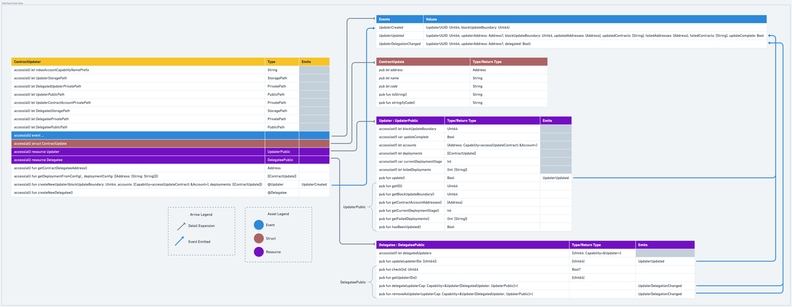

# FLIP 179: Staged Contract Update Mechanism

## Objective

This proposal outlines a mechanism for automated and efficient contract updates to take effect at or beyond a specified
block height with the goal of minimizing recovery time following breaking improvements. Included in this FLIP is a
design enabling contract developers to pre-define a sequence of contract updates across an arbitrary number of contracts
and accounts, and either execute these updates themselves or delegate deployment authority to some trusted party. 

## Motivation

Immediately following planned Cadence improvements on Mainnet (marked by the Cadence 1.0 milestone), many contracts
across the ecosystem will need to be updated. In preparation for this milestone, the Flow community is considering ways
to make this migration as quick and seamless as possible, primarily motivated by the desire to minimize any
user-perceived downtime. With this in mind, it's in the interest of everyone to provide helpful and reliable tools to
empower and support developers in upgrading their contracts.

Surely, some developers will prefer to manually excecute updates themselves. However, others may find it useful and
even preferable to both codify their updated deployment using onchain constructs and additionally delegate update
execution to an automated service run by Flow as a part of the ecosystem-wide post-spork migration.

## User Benefit

This contract would benefit developers by making it easy for them to stage and even automate contract updates after
breaking improvements and benefit users by minimizing perceived downtime.

## Design Proposal

### Context

Updates to a network of dependent contracts must occur according to their dependency ordering. Even when properly
ordered, any dependent contracts must wait for their dependencies to complete state changes in the execution environment
before they can successfully update. Said state change can only occur after the dependency updating transaction
completes.

This is an important consideration in designing a wide-scale update mechanism because it means we must batch updates in
stages, with each stage updating a set of contracts at the same level of the dependency graph.

If we were to take the following set of contracts with the pictured dependency graph and attempt to update them in a
single transaction, the attempt would fail. This is because `B` depends on `A`, and `A`'s updates won't yet take effect
until after the transaction has successfully executed.


*Sequencing a set of contracts into discrete update transactions, order labeled on the right.*

Instead, we update `A` in one transaction, `B` in the following, and lastly `C` in a final transaction. Given a larger
number of contracts, we could update multiple contracts in a single transaction, but the updates would need to be
batched with contracts at a similar maximum depth in their dependency graph.


Take for instance the graph above. We would stage `[A, D]` in the first transaction, `[B, E]` in another, and finally
`C` could be updated. Keep this mental model in mind as we put together this staged approach in the design below.

### Overview

> :information_source: The proposed design is largely informed by a working prototype which can be found in [this
> repo](https://github.com/sisyphusSmiling/contract-updater)

Proposed is a single contract implementation defining a primary resource - referred to here as `Updater` - encapsulating
a bundle of ordered contract updates, themselves bundled more granularly into stages. A developer provides AuthAccount
Capabilities on the contract hosting accounts, staged and ordered update configuration details (contract address, name,
and code) to this resource on initialization as well as a blockheight boundary, at or beyond which updates should be
deployed.

The owner of this resource can then call `Updater.update()` to execute the updates bundled into the current deployment
stage. The current stage is incremented every time `update()` is called, with `updateComplete` set to true once all
deployment stages have been attempted.

In addition to the `Updater`, the `Delegatee` can capture delegated `Updater` Capabilities. This allows a developer to
codify their deployment details in an `Updater`, save the resource in their account, and offload the entirety of their
contract updates to a trusted party via `Delegatee`.

With respect to Stable Cadence support, the idea is to provide a Flow-hosted `Delegatee` that executes delegated updates
(after updating core contracts) following the spork upgrade. At migration time, `Delegatee` can execute batches of
delegated updates, with each individual `Updater` tracking the current stage and deploying stage-specific contract
updates as configured by the resource owner. Since `Updater`s track their own stage, `Delegatee` simply needs to track
which `Updater` resources have remaining deployment stages and either execute those updates until all delegated updates
are complete or up to a maximum number of supported stages (preventing trolling attacks).

### Implementation Details


#### Interfaces



*The overview above outlines the interface of `ContractUpdater` and each of its defined constructs. Expand the toggles
below to view each component in more detail.*

<details>
<summary>struct ContractUpdate</summary>

```cadence
/// Representative of a single contract, its name, code and where it will be deployed
///
pub struct ContractUpdate {
    pub let address: Address
    pub let name: String
    pub let code: [UInt8]
    pub fun toString(): String
    pub fun stringifyCode(): String
}
```
</details>

<details>
<summary>resource Updater</summary>

```cadence
/// Private Capability enabling delegated updates
///
pub resource interface DelegatedUpdater {
    pub fun update(): Bool
}

/// Public interface enabling queries about the Updater
///
pub resource interface UpdaterPublic {
    pub fun getID(): UInt64
    pub fun getBlockUpdateBoundary(): UInt64
    pub fun getContractAccountAddresses(): [Address]
    pub fun getDeployments(): [[ContractUpdate]]
    pub fun getCurrentDeploymentStage(): Int
    pub fun getFailedDeployments(): {Int: [String]}
    pub fun hasBeenUpdated(): Bool
}

/// Resource that enables delayed contract updates to wrapped accounts at or beyond a specified block height
///
pub resource Updater : UpdaterPublic, DelegatedUpdater {
    /// Update to occur at or beyond this block height
    // TODO: Consider making this a contract-owned value as it's reflective of the spork height
    access(self) let blockUpdateBoundary: UInt64
    /// Update status for each contract
    access(self) var updateComplete: Bool
    /// Capabilities for contract hosting accounts
    access(self) let accounts: {Address: Capability<&AuthAccount>}
    /// Updates ordered by their deployment sequence and staged by their dependency depth
    /// NOTE: Dev should be careful to validate their dependencies such that updates are performed from root
    /// to leaf dependencies
    access(self) let deployments: [[ContractUpdate]]
    /// Current deployment stage
    access(self) var currentDeploymentStage: Int
    /// Contracts whose update failed keyed on their deployment stage
    access(self) let failedDeployments: {Int: [String]}

    /// Executes the next update stage for all contracts defined in deployment, returning true if all stages have
    /// been attempted and false if stages remain
    ///
    pub fun update(): Bool

    /* --- Public getters --- */
    //
    pub fun getID(): UInt64
    pub fun getBlockUpdateBoundary(): UInt64
    pub fun getContractAccountAddresses(): [Address]
    pub fun getDeployments(): [[ContractUpdate]]
    pub fun getCurrentDeploymentStage(): Int
    pub fun getFailedDeployments(): {Int: [String]}
    pub fun hasBeenUpdated(): Bool
}
```
</details>


<details>
<summary>resource Delegatee</summary>

```cadence
/// Public interface for Delegatee
///
pub resource interface DelegateePublic {
    pub fun check(id: UInt64): Bool?
    pub fun getUpdaterIDs(): [UInt64]
    pub fun delegate(updaterCap: Capability<&Updater{DelegatedUpdater, UpdaterPublic}>)
    pub fun removeAsUpdater(updaterCap: Capability<&Updater{DelegatedUpdater, UpdaterPublic}>)
}

/// Resource that executed delegated updates
///
pub resource Delegatee : DelegateePublic {
    // TODO: Block Height - All DelegatedUpdaters must be updated at or beyond this block height
    // access(self) let blockUpdateBoundary: UInt64
    /// Track all delegated updaters
    access(self) let delegatedUpdaters: {UInt64: Capability<&Updater{DelegatedUpdater, UpdaterPublic}>}

    /// Checks if the specified DelegatedUpdater Capability is contained and valid
    ///
    pub fun check(id: UInt64): Bool?
    /// Returns the IDs of the delegated updaters 
    ///
    pub fun getUpdaterIDs(): [UInt64]
    /// Allows for the delegation of updates to a contract
    ///
    pub fun delegate(updaterCap: Capability<&Updater{DelegatedUpdater, UpdaterPublic}>)
    /// Enables Updaters to remove their delegation
    ///
    pub fun removeAsUpdater(updaterCap: Capability<&Updater{DelegatedUpdater, UpdaterPublic}>)
    /// Executes update on the specified Updater, removing the Capability once update is completed
    ///
    pub fun update(updaterIDs: [UInt64]): [UInt64]
    /// Enables admin removal of a DelegatedUpdater Capability
    ///
    pub fun removeDelegatedUpdater(id: UInt64)
}
```
</details>


<details>
<summary>Events</summary>

```cadence
pub event UpdaterCreated(updaterUUID: UInt64, blockUpdateBoundary: UInt64)
pub event UpdaterUpdated(
    updaterUUID: UInt64,
    updaterAddress: Address?,
    blockUpdateBoundary: UInt64,
    updatedAddresses: [Address],
    updatedContracts: [String],
    failedAddresses: [Address],
    failedContracts: [String],
    updateComplete: Bool
)
pub event UpdaterDelegationChanged(updaterUUID: UInt64, updaterAddress: Address?, delegated: Bool)
```
</details>

<details>
<summary>Helper Methods</summary>

```cadence
/// Returns the Address of the Delegatee associated with this contract
///
pub fun getContractDelegateeAddress(): Address

/// Helper method that returns the ordered array reflecting sequenced and staged deployments, with each contract
/// update represented by a ContractUpdate struct.
///
/// NOTE: deploymentConfig is ordered, and the order is used to determine both the order of the contracts in each
/// deployment and the order of the deployments themselves. Each entry in the inner array must be exactly one
/// key-value pair, where the key is the address of the associated contract name and code.
///
pub fun getDeploymentFromConfig(_ deploymentConfig: [[{Address: {String: String}}]]): [[ContractUpdate]]

/// Returns a new Updater resource
///
pub fun createNewUpdater(
    blockUpdateBoundary: UInt64,
    accounts: [Capability<&AuthAccount>],
    deployments: [[ContractUpdate]]
): @Updater

/// Creates a new Delegatee resource enabling caller to self-host their Delegatee
///
pub fun createNewDelegatee(): @Delegatee
```
</details>


#### Note on Update API

Currently, [updating a contract](https://developers.flow.com/cadence/language/contracts#updating-a-deployed-contract)
occurs via the API `Contracts.update__experimental(name: String, code: [UInt8]): DeployedContract` which reverts when an
update fails. Reverting on failure is perfectly fine for individual updates; however, doing so in the context of
iterative updates would prevent successive updates from executing, leading to a fragile design with cumbersome
alternatives.

This design is heavily dependent on the existence of an alternative update API that avoids reverting in the event of a
failed update. Without it, each update would need to be executed in discrete transactions, resulting in at least an
order of magnitude more transaction executions to achieve the same result as this design, as well as more complex signing
architecture to handle the requisite number of proposal keys for all those transactions.

The proposed `tryUpdate()` API is its own issue (found [here](https://github.com/onflow/cadence/issues/2700)), but is
included below for context and consideration:

```cadence
pub enum ErrorType: UInt8 {
  pub case CONTRACT_NOT_FOUND
  pub case MULTIPLE_CONTRACTS_DECLARED
  pub case MISMATCHED_NAME
  pub case UNDEFINED
}

pub struct DeploymentError {
  pub let errorType: ErrorType
  pub let errorMessage: String
}

pub struct DeploymentResult {
  pub let success: Bool
  pub let errorMessage: DeploymentError?
}

pub fun tryUpdate(name: String, code: [UInt8]): DeploymentResult
```

Ideally this method would return some error message in the event of a failed update; however,
[@turbolent](https://github.com/turbolent) mentioned security implications involved with exposing such error messages
into the execution environment without reverting.

The proposed path forward then is to return the following `DeploymentResult`, later adding `errorMessage` once the
security implication has been mitigated:

```cadence
pub struct DeploymentResult {
  pub let success: Bool
}
```

With respect to the topic of this FLIP, the `Updater` can check `DeploymentResult.success` and emit any failed updates
within the executed stage as well as preserve the failure status within its fields. Direct follow up and intervention by
the `Updater` owner would then be to correct the issue and manually execute the contract updates.

### Considerations

#### Self-Defined Deployments

Update executions via `Delegatee` can't account for the global dependency graph since ultimately contract account owners
have sovereignty over their update path. Therefore, `Delegatee` depends on the `Updater`'s creator to sequence the
contained deployment appropriately given the contracts to be updated. This means that developers will still want to
validate their contracts are both individually Stable Cadence compatible and updatable, as well as sequenced correctly
within the `Updater` resource.

#### Handling Unsuccessful Updates

Since we intend to iterate over a large number of updates per transaction, we cannot allow unsuccessful update attempts
to interrupt that iteration. Therefore, this mechanism provides no guarantees to the delegator that their updates will
be completed successfully or that any stages succeeding a failed contract update will be avoided. The only strong
guarantee to delegating parties is that the update deployment encapsulated in their `Updater` will be attempted at or
beyond the collective block height boundary.

#### Examining Performance Constraints

One significant callout deserving more investigation are the limitations presented by execution limits on both the
construction of the `Updater` resource as well as the execution of delegated updates. The former is a concern because it
would influence the `Updater` setup while the latter is a concern for update batch size executed by `Delegatee`. The
hope is that all delegated updates can be executed within a dozen or so transactions post-spork (based on the current
number of mainnet contracts), but benchmarks are needed to determine a well-informed and robust migration protocol.

#### Supporting Resources

Another drawback is the complexity associated with configuring and managing the `Updater` resource. This complexity is
three-fold:

1. Configuring the `Updater` on initialization requires a fully sorted deployment complete with ordered stages, for
   which there is currently non-existent support. 
1. Once configured, there is currently no way to test whether the `Updater` will execute all updates successfully.
1. Once updates are executed, an `Updater`'s owner will want to know whether their update deployment completed
   successfully.

On 1/, it would be helpful to introduce a tool that would output a suggested `Updater` deployment ordering given a set
of Mainnet contract addresses & names as well as a tool to configure a local Flow project into the proper Cadence
json arguments for easy CLI configuration.

On 2/, planned Stable Cadence emulator previews along with local Mainnet mirroring can fill the gaps here. The workflow
might look like: Mirror mainnet locally with the Stable Cadence preview running, configure your `Updater` based on your
updated contracts, then simulate the update execution locally. Guides and best practices on this front should follow if
this FLIP is approved and implemented.

Regarding 3/, a helpful tool here would be an easy to use dashboard where the `Updater` owner can authenticate and view
both the current status of their `Updater` resource and any related events and transaction details where their updates
were executed. This would make it easy for developers to identify issues with their update deployments and
minimize follow up time.

These gaps are building opportunities beyond the scope of this design, and contributions on these fronts are very
welcome.

### Drawbacks

Since we cannot centrally organize, coordinate, or initiate all contract updates, developers using this should be aware
that any updates executed using this design should ensure that their contract dependencies are either core contracts or
are entirely owned.

### Considered Alternatives

#### Atomized Contract Updates

One considered alternative was to encapsulate contract updates on a single contract basis instead of bundling staged
deployments inside of `Updater`. These atomized contract updates could then be delegated to `Delegatee` and the
deployment ordered offchain based on the resolved dependency graph. This sorted update ordering could then be passed to
the `Delegatee` in batches, ensuring that all contracts are updated according to their dependencies.

While this sounds much neater and is in essence the approach taken by centralized, top-down architectures, with more
investigation, this approach was revealed to be fragile. The thinking here is that since delegating updates cannot be
compulsory, the `Delegatee` will inevitably lack full global context and control over contract updates. We cannot take a
top-down approach in a system that is fundamentally bottom-up.

The `Delegatee` will inevitably lack the ability to update some members of the full dependency graph. And if some of the
contracts that we are tasked with updating depend on those we can't update, all the effort we invest into neatly
resolving updates will ultimately fail. The lift for this approach is significantly higher than the proposed
self-defined crowdsourcing design for essentially similar strength guarantees.

#### Hotswap Contracts

Another alternative is to temporarily allow contract updates to take place intra-transaction by hotswapping contract
code. Hotswapping here means updating the execution state of the updated contract within the updating transaction
instead of at the end. This would allow for a bundle of contract updates to occur in a single transaction without the
need to batch updates into stages based on depth in their dependency graph.

Taking the example mentioned [previously](#context), instead of executing updates to contracts `A`, `B`, and `C` in
discrete transactions, we would execute all three updates in a single transaction so long as the updates are
appropriately ordered. 

However, hotswapping contracts comes with its own security concerns, and likely demands a sizeable implementation effort
with unknown consequences presenting an undue burden for what is potentially a single-use feature.

### Performance Implications

As mentioned above, we'll want to examine performance benchmarks with a focus on `Updater` construction - more generally
saving update deployments onchain - and `Delegatee` update execution - more generally executing a large number of
contract updates in a single transaction.

### Best Practices

As mentioned above, [supporting resources](#supporting-resources), examples, and use guides should follow if this FLIP
is adopted.

One thing to note though is that this design is not likely to cover use cases where the dependencies are not either core
contracts or fully owned by the developer since updates are not atomized and ordered at the level of `Delegatee`.

### Examples

For a working example, see [this repo and README walkthrough](https://github.com/sisyphusSmiling/contract-updater)
demonstrating the end-to-end setup and update execution flow.

Note that the linked prototype utilizes the currently available `update__experimental()` API, but emulates the proposed
design in the context of persistent update mechanisms via happy path (i.e. successful contract updates).

### Compatibility

This design is fully compatible with existing and planned featuresets. The only dependency here is the addition of [the
aforementioned](#note-on-update-api) `Contracts.tryUpdate(): DeploymentResult` (issue found
[here](https://github.com/onflow/cadence/issues/2700)) which would enable batched updates without interruption.

## Related Issues

- [Issue: Staged Contract Update](https://github.com/onflow/cadence/issues/2019)
- [Tracker: Cadence 1.0](https://github.com/onflow/cadence/issues/2642)
- [Issue: Add `tryUpdate()` method](https://github.com/onflow/cadence/issues/2700)
- [Issue: Flow CLI Contract to hex util](https://github.com/onflow/flow-cli/issues/1157)

## Prior Art

- [Proof of concept implementation](https://github.com/sisyphusSmiling/contract-updater)

## Questions & Discussion Topics

- What are the transaction limits - how do they affect `Updater` setup and `Delegatee` update execution for large
  numbers of accounts?
- What other persistent use cases would benefit from this mechanism?
- How many developers would delegate their contract updates if offered the service?