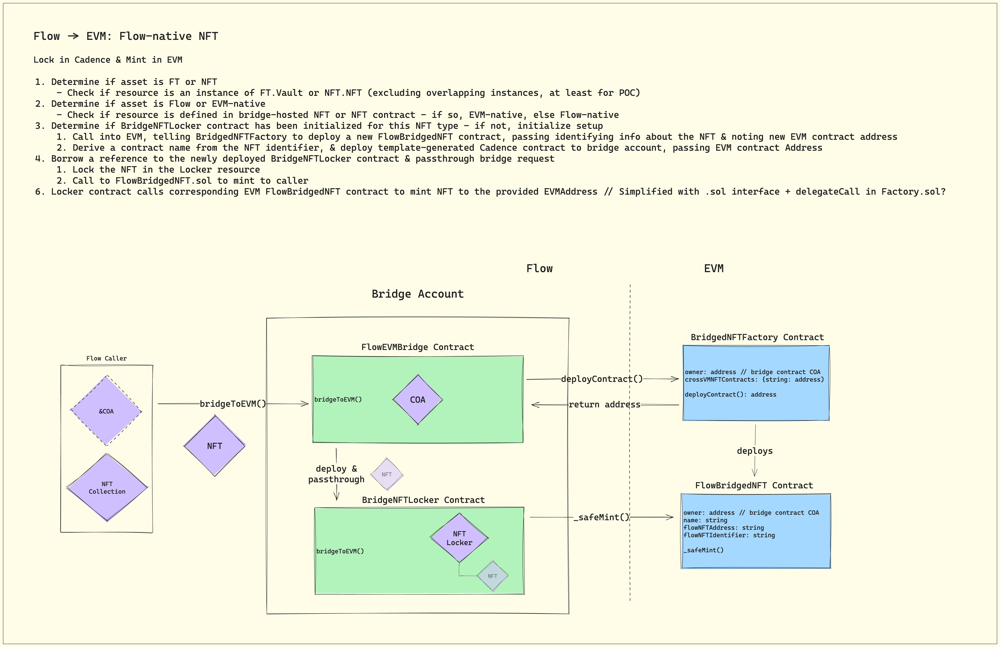
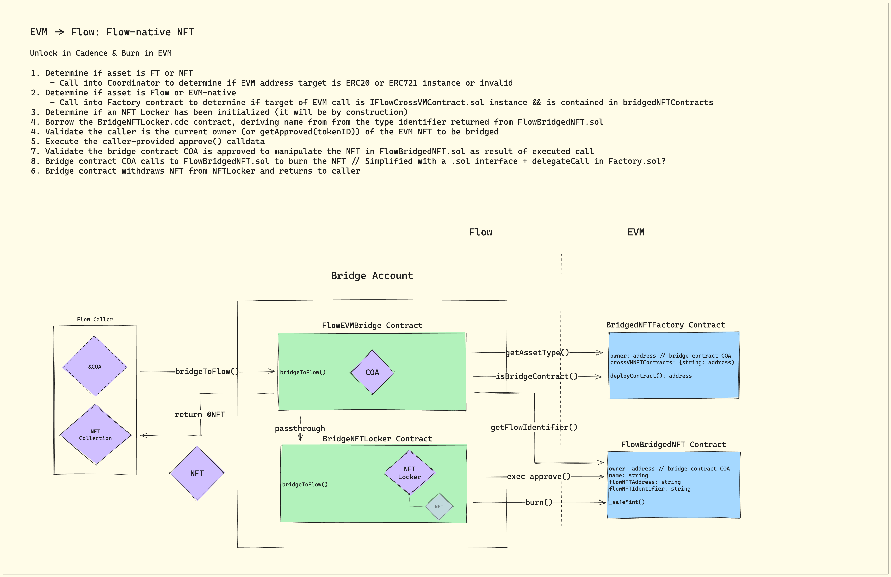
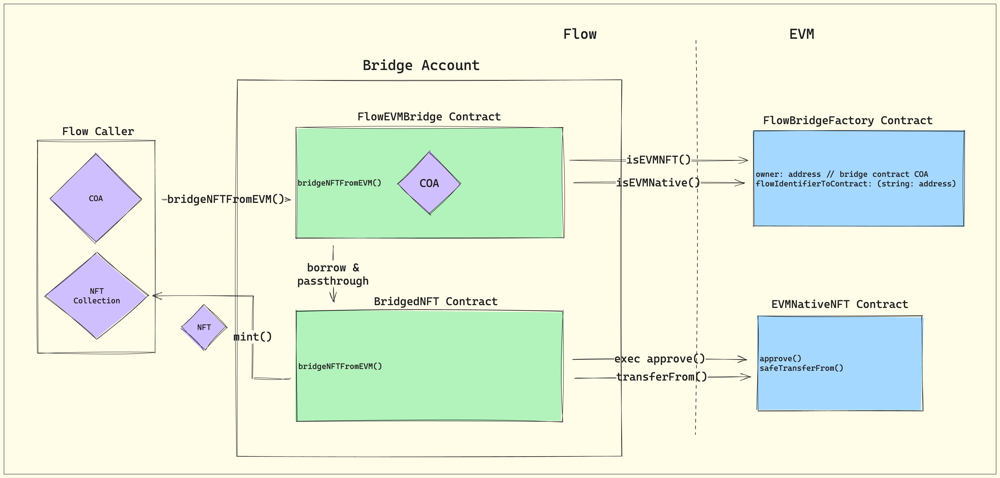
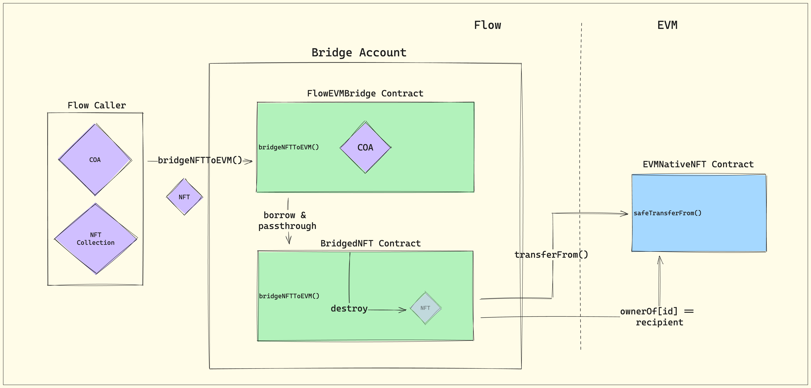

# FLIP 233: Flow VM Bridge. A contract protocol enabling arbitrary token bridging between Flow and EVM on Flow VMs

## Objective

This proposal outlines a contract-based protocol enabling the automated bridging of arbitrary Fungible (FT) and 
Non-Fungible tokens (NFT) from Cadence into EVM on Flow into the corresponding ERC-20 and ERC-721 token types. In the 
opposite direction, it supports bridging of arbitrary EVM on Flow ERC-20 and ERC-721 tokens into the corresponding 
Cadence FT or NFT token types. To facilitate users bridging tokens between VMs the protocol internalizes capabilities 
to deploy new token contracts in either VM state as needed. It serves as a request router & corresponding contract 
registrar to guarantee the synchronization integrity of assets being bridged across VM states. It additionally automates 
accounts & contracts to enforce source VM asset escrow and target VM token mint or unlock. `CadenceOwnedAccounts` (COAs)
introduced in the [EVM support FLIP proposal](https://github.com/onflow/flips/pull/225) enable the Flow VM Bridge to 
operate across both state spaces within the same, atomic transaction resulting in instantaneous asset exchange. 

## Motivation

The success and viability of EVM on Flow depends on the ability for assets to flow unimpeded between VM states. The Flow 
VM bridge resolves the need for token portability at the platform level. Its design is consistent with cross-chain 
bridging protocols common in web3 in order to ensure on-chain transparency. A generalized solution which addresses 
scalability and security concerns arising from arbitrary token bridging can better ensure the security of users on the
platform.

## User Benefit

An efficient, easy to use bridge which modifies state across VMs simultaneously in a single transaction reduces 
complexity for builders and improves end-user experience for the essential economic activity of moving tokens across VMs. 
The abstraction afforded to users by the bridge means that multiple EVM transaction steps can be bundled together using 
Cadence to securely realize bridging as a single transaction. The availability of a secure and proven platform 
capability for cross-VM bridging can ensure a consistent, higher security bar than leaving developers to implement 
project specific token bridges. It also significantly reduces the effort required of developers wishing to build 
applications which need to bridge tokens between VMs for an optimal user experience.

## Bridge Specification

Specification outline of the Flow VM bridge for bi-directional flow of FT and NFTs between VM states. While the spec 
references NFTs the VM bridge will treat both FTs and NFTs alike, with the caveat that NFTs have more complexity due to 
metadata which needs to be made to work for both VMs.

### Cadence to EVM
Breakdown of the flow for a user bridging a token across VMs from Cadence to EVM. 

#### VM bridge contract functionality

* Configure token & deploy EVM contract ABI
* Maintain Flow <-> EVM contract relationships
* Provide utility methods for information lookup about contracts for either state space

#### Prerequisites to user actions

1. Confirm counterparty EVM contract deployed state, else deploy
2. Setup and configure NFT metadata
3. Safety/integrity checks as needed

#### Cadence transaction: bridge a Cadence NFT to CadenceOwnedAccount

1. Ensure prerequisites
2. Store NFT into VM bridge Cadence contract escrow
3. EVM transaction: unlock, or mint, corresponding NFT in EVM contract

### EVM to Cadence
Sequential breakdown of the flow for a user bridging a token from EVM to Flow. The high level paths below are broken down into their respective forks to help with understanding.

#### VM bridge contract functionality

* Initialize Cadence NFT collections
* Maintain Flow <-> EVM contract relationships
* Provide utility methods for information lookup about contracts for either state space

**Path 1: Cadence originated NFT returning to Cadence**

#### Cadence transaction: COA A bridges an EVM NFT back to Cadence

* COA A calls bridge to request bridging of EVM NFT back into Cadence providing requested NFT type, id, and verification of COA ownership
* Bridge contract calls into EVM to confirm COA A is the owner of the requested NFT. If so, process continues; otherwise reverts
* Bridge contract calls into EVM contract to burn EVM NFT
* Bridge contract unlocks corresponding Cadence NFT from VM bridge contract escrow storage
* Returns NFT on call to bridge contract

#### Cadence transaction: COA B bought COA A's EVM NFT on FlowEVM, and then wants to bridge it back to Cadence

* COA B calls bridge contract to request bridging of EVM NFT back into Cadence providing requested NFT type, id, and verification of COA ownership
* Bridge contract calls into EVM to confirm COA B is the owner of the requested NFT. If so, process continues; otherwise reverts
* Bridge contract calls into EVM contract to burn EVM NFT
* Contract unlocks corresponding Cadence NFT from VM bridge contract escrow storage
* Returns NFT on call to bridge contract

**Path 2: EVM originated NFT bridging to Cadence**

#### Prerequisite steps to user actions

* VM bridge checks, else creates new NFT contract/collection if not registered
* Setup and configure NFT metadata

#### Cadence transaction: COA A wants to bridge an EVM NFT to Cadence

* Ensure prerequisites 
* Upon Cadence call to bridge, COA A must include EVM transaction transferring NFT ownership to bridge account
* Bridge checks that caller is the owner of the NFT on EVM side before transferring to Bridge account COA address
* Bridge executed provided contract call, transferring NFT to Bridge COA address
* Bridge validates its ownership of the NFT on EVM side after transfer, thus locking NFT to be bridged
* Bridge mints NFT from Flow bridge NFT contract and returns to caller
* Collection is configured if necessary and deposited to COA A's account

## Design Proposal

### Context
<!-- TODO -->

### Overview

The central bridge contract will act as a request router & corresponding contract registrar, additionally configuring contracts on either side of the VM to facilitate bridge requests as they arrive. Deployed contracts are “owned” by the bridge, but owner interactions are mediated by contract logic on either end in addition to multi-sig patterns consistent with other core network infrastructure accounts.

On the EVM side, a central contract factory will instantiate Solidity ERC20 & ERC721 contracts as directed by calls from the central Cadence contract’s Cadence Owned Account. This factory will also implement a number of helper methods to give the bridge account visibility into the EVM environment. These methods might include things like retrieving an asset type, determining if EVM contracts are bridge-owned, validating asset ownership, etc. so the COA has a central trusted source of truth for critical state assertions.

Below are diagrams depicting the call flows for both Flow and EVM-native NFTs.

#### Flow-Native: Flow -> EVM
<!-- TODO: Update image & Move text to markdown -->


#### Flow-Native: EVM -> Flow
<!-- TODO: Update image & Move text to markdown -->


#### EVM-Native: EVM -> Flow
<!-- TODO: Update image & Move text to markdown -->


#### EVM-Native: Flow -> EVM
<!-- TODO: Update image & Move text to markdown -->


#### In Aggregate

*The bridge contract can be thought of here as a router for requests to bridge to and from Flow. It determines if the requested asset is Flow or EVM native and whether it’s an FT or NFT. If needed, it performs contract initialization on either side of the VM. From there, it routes requests to the appropriate contract which fulfills the asset bridge request.*

### Implementation Details

### Contract Roles & Concerns

#### Flow

- **Bridge**
  - Unified entry point for bridging assets between VMs
  - Unified query point for NFT Locker contracts & to assess Flow x EVM contract associations
  - Owning (via contract COA) all deployed contracts on EVM side
  - Owning (via contract COA) all EVM-native assets on EVM side when bridged to Flow - equivalent to locking
  - Initializing NFT & FT Locker contracts when Flow-native assets first bridged to EVM
  - Initializing BridgedFT & BridgedNFT contracts defining EVM-native assets when first bridged to Flow
- **FT/NFT Locker**
  - Lock Flow-native tokens bridging to EVM
  - Unlock Flow-native tokens bridging from EVM
  - Serve query requests about locked tokens
  - Point to the corresponding EVM contract
- **Bridged FT/NFT**
  - Define EVM-native tokens bridged from EVM to Flow
  - Point to the corresponding EVM-native contract
  - Serve as secondary bridging interface, enabling easy bridging back to EVM
      - Result of implementing combination of `CrossVM` contract interface along with `BridgeableVault` or `BridgeableCollection` resource interfaces
      - e.g. `collection.bridgeToEVM(id: UInt64, to: EVMAddress)`
      - e.g. `vault.bridgeToEVM(amount: UFIx64, to: EVMAddress)`

#### EVM

> :information_source: Self-defined locking functionality is not required as “locked” assets will simply be transferred to the FlowEVMBridge.COA.EVMAddress

- **FlowBridgeFactory**
  - Deploys new instances of FlowBridgedFT/NFT
  - Maintains knowledge of all deployed contract addresses & their Flow token identifier correspondence
  - Aids visibility of bridge contract into the EVM environment with assistive methods

- **FlowBridgedFT/NFT**
  - Define Flow-native tokens bridged from Flow to EVM
  - Point to the corresponding Flow-native contract

#### Interfaces

<details>
<summary>FlowEVMBridge.cdc.cdc</summary>

```cadence
access(all) contract FlowEVMBridge {

    /// Denotes a contract was deployed to the bridge account, could be either FlowEVMBridgeLocker or FlowEVMBridgedAsset
    access(all) event BridgeContractDeployed(type: Type, name: String, evmContractAddress: EVM.EVMAddress)
    /// Asset bridged from Flow to EVM - satisfies both FT & NFT (always amount == 1.0)
    access(all) event BridgedToEVM(type: Type, amount: UFix64, from: EVM.EVMAddress, to: EVM.EVMAddress, evmContractAddress: EVM.EVMAddress, flowNative: Bool)
    /// Asset bridged from EVM to Flow - satisfies both FT & NFT (always amount == 1.0)
    access(all) event BridgedToFlow(type: Type, amount: UFix64, from: EVM.EVMAddress, to: EVM.EVMAddress, evmContractAddress: EVM.EVMAddress, flowNative: Bool)

    /* --- Public NFT Handling --- */

    /// Public entrypoint to bridge NFTs from Flow to EVM - cross-account bridging supported
    ///
    /// @param token: The NFT to be bridged
    /// @param to: The NFT recipient in FlowEVM
    /// @param tollFee: The fee paid for bridging
    ///
    access(all) fun bridgeNFTToEVM(token: @{NonFungibleToken.NFT}, to: EVM.EVMAddress, tollFee: @FlowToken.Vault) {
        pre {
            tollFee.balance == self.tollAmount: "Insufficient fee paid"
            asset.isInstance(of: Type<&{FungibleToken.Vault}>) == false: "Mixed asset types are not yet supported"
        }
        // Handle based on whether Flow- or EVM-native & passthrough to internal method
    }

    /// Public entrypoint to bridge NFTs from EVM to Flow
    ///
    /// @param caller: The caller executing the bridge - must be passed to check EVM state pre- & post-call in scope
    /// @param calldata: Caller-provided approve() call, enabling contract COA to operate on NFT in EVM contract
    /// @param id: The NFT ID to bridged
    /// @param evmContractAddress: Address of the EVM address defining the NFT being bridged - also call target
    /// @param tollFee: The fee paid for bridging
    ///
    access(all) fun bridgeNFTFromEVM(
        caller: auth(Callable) &BridgedAccount,
        calldata: [UInt8],
        id: UInt64,
        evmContractAddress: EVM.EVMAddress,
        tollFee: @FlowToken.Vault
    ): @{NonFungibleToken.NFT} {
        pre {
            tollFee.balance == self.tollAmount: "Insufficient fee paid"
            self.isEVMNFT(evmContractAddress: evmContractAddress): "Unsupported asset type"
            self.isOwnerOrApproved(ofNFT: id, owner: caller.address(), evmContractAddress: evmContractAddress):
                "Caller is not the owner of or approved for requested NFT"
        }
    }

    /* --- Public FT Handling --- */

    /// Public entrypoint to bridge NFTs from Flow to EVM - cross-account bridging supported
    ///
    /// @param vault: The FungibleToken Vault to be bridged
    /// @param to: The recipient of tokens in FlowEVM
    /// @param tollFee: The fee paid for bridging
    ///
    access(all) fun bridgeTokensToEVM(vault: @{FungibleToken.Vault}, to: EVM.EVMAddress, tollFee: @FlowToken.Vault) {
        pre {
            tollFee.balance == self.tollAmount: "Insufficient fee paid"
            asset.isInstance(of: Type<&{NonFungibleToken.NFT}>) == false: "Mixed asset types are not yet supported"
        }
        // Handle based on whether Flow- or EVM-native & passthrough to internal method
    }

    /// Public entrypoint to bridge fungible tokens from EVM to Flow
    ///
    /// @param caller: The caller executing the bridge - must be passed to check EVM state pre- & post-call in scope
    /// @param calldata: Caller-provided approve() call, enabling contract COA to operate on tokens in EVM contract
    /// @param amount: The amount of tokens to bridge
    /// @param evmContractAddress: Address of the EVM address defining the tokens being bridged, also call target
    /// @param tollFee: The fee paid for bridging
    ///
    access(all) fun bridgeTokensFromEVM(
        caller: auth(Callable) &BridgedAccount,
        calldata: [UInt8],
        amount: UFix64,
        evmContractAddress: EVM.EVMAddress,
        tollFee: @FlowToken.Vault
    ): @{FungibleToken.Vault} {
        pre {
            tollFee.balance == self.tollAmount: "Insufficient fee paid"
            self.isEVMToken(evmContractAddress: evmContractAddress): "Unsupported asset type"
            self.hasSufficientBalance(amount: amount, owner: caller, evmContractAddress: evmContractAddress):
                "Caller does not have sufficient funds to bridge requested amount"
        }
    }

    /* --- Internal Helpers --- */

    /// Identifies if an asset is Flow- or EVM-native, defined by whether a bridge contract defines it or not
    access(self) fun isFlowNative(asset: &AnyResource): Bool
    /// Identifies if an asset is ERC721 && not ERC20
    access(self) fun isEVMNFT(evmContractAddress: EVM.EVMAddress): Bool
    /// Identifies if an asset is ERC20 and not ERC721
    access(self) fun isEVMToken(evmContractAddress: EVM.EVMAddress): Bool

    /// Determines if the owner is in fact the owner of the NFT at the ERC721 contract address
    access(self) fun isOwnerOrApproved(ofNFT: UInt64, owner: EVM.EVMAddress, evmContractAddress: EVM.EVMAddress): Bool
    /// Determines if the owner has sufficient funds to bridge the given amount at the ERC20 contract address
    access(self) fun hasSufficientBalance(amount: UFix64, owner: EVM.EVMAddress, evmContractAddress: EVM.EVMAddress): Bool

    /// Handles bridging Flow-native NFTs to EVM - locks NFT in designated Flow locker contract & burns in EVM
    /// Within scope, locker contract is deployed if needed
    access(self) fun bridgeFlowNativeNFTToEVM(token: @{NonFungibleToken.NFT}, to: EVM.EVMAddress)
    /// Handles bridging EVM-native NFTs to EVM - burns NFT in defining Flow contract & transfers in EVM
    /// Within scope, defining contract is deployed if needed
    access(self) fun bridgeEVMNativeNFTToEVM(token: @{NonFungibleToken.NFT}, to: EVM.EVMAddress)

    /// Handles bridging Flow-native assets to EVM - locks Vault in designated Flow locker contract & burns in EVM
    /// Within scope, locker contract is deployed if needed
    access(self) fun bridgeFlowNativeTokensToEVM(vault: @{FungibleToken.Vault}, to: EVM.EVMAddress)
    /// Handles bridging EVM-native assets to EVM - burns Vault in defining Flow contract & transfers in EVM
    /// Within scope, defining contract is deployed if needed
    access(self) fun bridgeEVMNativeTokensToEVM(vault: @{FungibleToken.Vault}, to: EVM.EVMAddress)
    
    /// Helper for deploying templated Locker contract supporting Flow-native asset bridging to EVM
    /// Deploys either NFT or FT locker depending on the asset type
    access(self) fun deployLockerContract(asset: &AnyResource)
    /// Helper for deploying templated defining contract supporting EVM-native asset bridging to Flow
    /// Deploys either NFT or FT contract depending on the provided type
    access(self) fun deployDefiningContract(type: Type)

    /// Deposits fees to the bridge account's FlowToken Vault - helps fund asset storage
    access(self) fun depositTollFee(_ tollFee: @FlowToken.Vault)
}
```

</details>

<details>
<summary>IFlowEVMBridgeLocker.cdc</summary>

```cadence
// TODO - Defines a Locker contract - implemented so the contract can be borrowed by the main bridge contract w/o statically declaring the contract due to dynamic deployments
access(all) contract interface IFlowEVMBridgeLocker {

}
```
</details>

<details>
<summary>IFlowEVMBridgedAsset.cdc</summary>

```cadence
// TODO - Base interface for bridged asset defining contracts
access(all) contract interface IFlowEVMBridgedAsset {
    
}
```
</details>

<details>
<summary>FlowEVMBridgedNFT.cdc</summary>

```cadence
// TODO - Template for bridged EVM-native NFTs
access(all) contract FlowEVMBridgedNFT : IFlowEVMBridgedAsset {

}
```
</details>

<details>
<summary>FlowEVMBridgedFT.cdc</summary>

```cadence
// TODO - Template for bridged EVM-native NFTs
access(all) contract FlowEVMBridgedFT : IFlowEVMBridgedAsset {
    
}
```
</details>

<details>
<summary>ICrossVM.cdc</summary>

```cadence
/// Contract interface denoting a cross-VM implementation, exposing methods to query EVM-associated addresses
access(all) contract interface ICrossVM {
    /// Retrieves the corresponding EVM contract address, assuming a 1:1 relationship between VM implementations
    access(all) fun getEVMContractAddress(): EVM.EVMAddress
}
```
</details>

<details>
<summary>CrossVMAsset.cdc</summary>

```cadence
/// Contract defining cross-VM asset interfaces
access(all) contract CrossVMAsset {
    /// Enables a bridging entrypoint on an implementing Vault
    access(all) resource interface BridgeableVault {
        access(all) fun bridgeToEVM(amount: UFix64, to: EVM.EVMAddress)
    }

    /// Enables a bridging entrypoint on an implementing Collection
    access(all) resource interface BridgeableCollection {
        access(all) fun bridgeToEVM(id: UInt64, to: EVM.EVMAddress)
    }
}
```
</details>

<details>
<summary>FlowEVMBridgeFactory.sol</summary>

```solidity
// TODO - Factory & EVM inspector
```
</details>

<details>
<summary>IFlowBridgedAsset.sol</summary>

```solidity
// TODO - Identifies corresponding Flow contract address
```
</details>

<details>
<summary>IFlowBridgedNFT.sol</summary>

```solidity
// TODO - Template for bridged Flow-native NFTs
```
</details>

<details>
<summary>IFlowBridgedFT.sol</summary>

```solidity
// TODO - Template for bridged EVM-native FTs
```
</details>

#### NFT Metadata

### Considerations

### Drawbacks

- All contracts deployed by the bridge have the same minimized functionality, restricted to their respective ecosystem standards
- Centralized storage of all bridged assets and their definitions presents a single, high-value target for potential hacks.
  - This vector is minimized by the fact that the bridge exists solely at the protocol and contract levels. Taking protocol security for granted, contract logic and key management are the primary considerations for compromise. This bridge benefits from the contained state space afforded by virtualizing the EVM environment in that offchain systems are not required for its function between VMs.

### Considered Alternatives

Motivated by the aforementioned drawback of centralized storage, previous iterations involved a network of distributed accounts around a primary bridge account and contract. This primary contract served as the entrypoint for bridging between VMs, deploying templated locking & asset-defining auxiliary contracts to distinct, contract-generated accounts. The primary contract would conditionally deploy these auxiliary contracts on a per-asset basis as needed, maintaining a registry for where each asset is locked/defined and routing bridge requests to their appropriate contracts.

This design optimized for distributed asset storage and contract-mediated access. However, it also introduced additional complexity and secondarily obscurity for what should be a highly transparent system. Additionally, since multisig access is planned for the bridge and auxiliary accounts, centralization is ultimately no further improved by this design, at least while custody is maintained on these accounts.

### Performance Implications

#### Migrations & Storage Usage

Previous network migrations have been complicated by single accounts using large amounts of storage. With a centralized storage design, it's likely that (over time) the bridge account will consume a large amount of storage and that, given the need to store bridge Flow-native assets indefinitely, that storage will likely only ever increase. Even if this assumption is not true, it's to our benefit to consider and plan as if it is if account storage usage is a network-wide issue.

With that said, saving state to a single account shouldn't be problematic until storage usage reaches >10GB of data which should give the team some time to figure out how to handle this edge case during migrations before the problem is encountered.

### Best Practices

### Examples

### Compatibility

This bridge design will support bridging fungible and non-fungible token assets between VMs, and doesn't account for cases where the instances where types overlap - i.e. semi-fungible tokens or multi-token contracts. Of course, this bridge also dovetails with the ongoing virtualized EVM work, so is dependent on the existence of that environment.

## Prior Art

While the work is happening someone concurrently, there may be some cross-pollination between the [Axelar Interchain Token Service](https://github.com/AnChainAI/anchain-axelar-dapper-flowbridge) and this project.

## Questions & Discussion Topics

- What does the interplay between risk vectors, tokenomics, and UX requirements imply for the fee amounts charged for bridging between VMs
  - Do we charge on a per instance or per locked storage unit basis?
- How will we handle either bridging or serving metadata for bridged Flow-native NFTs given the difference in metadata standards between Cadence & EVM?
- Is there an upper bound to how many contracts a single account can host?