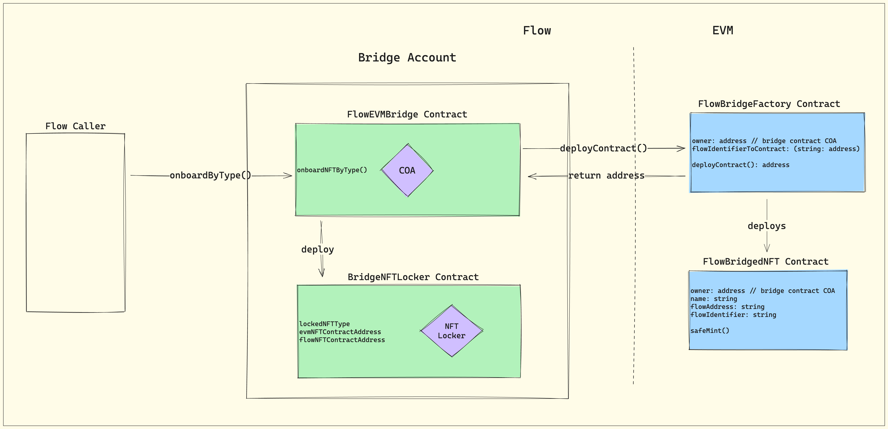
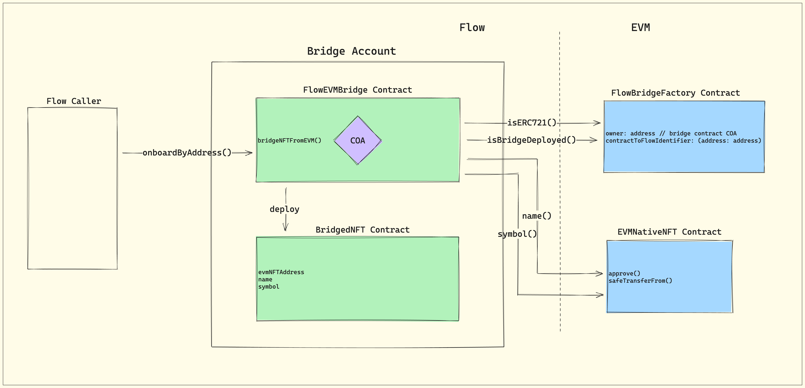

# FLIP 237: Flow VM Bridge

> A contract protocol enabling arbitrary token bridging atomically between Flow and FlowEVM

<details>

<summary>Table of contents</summary>

- [Objective](#objective)
- [Motivation](#motivation)
- [User Benefit](#user-benefit)
- [Bridge Specification](#bridge-specification)
  - [Cadence to EVM](#cadence-to-evm)
  - [EVM to Cadence](#evm-to-cadence)
- [Context](#context)
- [Overview](#overview)
- [In Aggregate](#in-aggregate)
- [Implementation Details](#implementation-details)
  - [Contract Roles \& Concerns](#contract-roles--concerns)
  - [Case Studies](#case-studies)
  - [Interfaces](#interfaces)
  - [Considerations](#considerations)
  - [Drawbacks](#drawbacks)
  - [Considered Alternatives](#considered-alternatives)
  - [Performance Implications](#performance-implications)
  - [Examples](#examples)
  - [Compatibility](#compatibility)
- [Prior Art](#prior-art)
- [Questions \& Discussion Topics](#questions--discussion-topics)
</details>

## Objective

This proposal outlines a contract-based protocol enabling the automated bridging of arbitrary Fungible (FT) and
Non-Fungible tokens (NFT) from Cadence into FlowEVM into the corresponding ERC-20 and ERC-721 token types. In the
opposite direction, it supports bridging of arbitrary FlowEVM ERC-20 and ERC-721 tokens into the corresponding
Cadence FT or NFT token types.

To facilitate users bridging tokens between VMs, the protocol internalizes capabilities to deploy new token contracts in
either VM state as needed. It serves as a request router & corresponding contract registrar to guarantee the
synchronization integrity of assets being bridged across VM states. It additionally automates account and contract calls
to enforce source VM asset burn or lock and target VM token mint or unlock. `CadenceOwnedAccounts` (COAs) introduced
in the [EVM support FLIP proposal](https://github.com/onflow/flips/pull/225) enable the Flow VM Bridge to operate across
both state spaces within the same, atomic transaction resulting in instantaneous asset exchange. 

## Motivation

The success and viability of EVM on Flow depends on the ability for assets to move unimpeded between VM states. The Flow
VM bridge resolves the need for token portability at the platform level. Its design is consistent with cross-chain
bridging protocols common in Web 3 in order to ensure onchain transparency. A generalized solution which addresses
scalability and security concerns arising from arbitrary token bridging can better ensure the security of users on the
platform.

## User Benefit

An efficient, easy to use bridge which modifies state across VMs simultaneously in a single transaction reduces
complexity for builders and improves end-user experience for the essential economic activity of moving tokens across
VMs. The abstraction afforded to users by the bridge means that multiple EVM transaction steps can be bundled together
using Cadence to securely realize bridging as a single transaction. The availability of a secure and proven platform
capability for cross-VM bridging can ensure a consistent, higher security bar than leaving developers to implement
project specific token bridges. It also significantly reduces the effort required of developers wishing to build
applications which need to bridge tokens between VMs for an optimal user experience.

## Bridge Specification

Specification outline of the Flow VM bridge for bi-directional flow of FT and NFTs between VM states. While the spec
references NFTs, the VM bridge will treat both FTs and NFTs alike, with the caveat that NFTs have more complexity due to
their more detailed metadata which needs to be made to work for both VMs. With that said, many FTs on Flow define useful
onchain metadata, so we may also choose to bridge select metadata for FTs as well.

### Cadence to EVM

Breakdown of the steps required to bridge a token across VMs from Cadence to EVM. 

#### VM bridge contract functionality

* Configure EVM-defining contract if needed
* Maintain Flow <-> EVM contract relationships
* Provide utility methods for information lookup about contracts for either state space

#### Prerequisites to user actions

1. Confirm counterparty contract deployed state, else deploy
2. Setup and configure NFT metadata
3. Safety/integrity checks as needed

#### Cadence transaction: bridge a Cadence NFT to CadenceOwnedAccount

1. Ensure prerequisites
2. Store NFT into VM bridge Cadence contract escrow
3. EVM transaction: mint corresponding NFT in EVM contract

### EVM to Cadence

Sequential breakdown of the flow for a user bridging a token from EVM to Flow. The high level paths below are broken
down into their respective forks to help with understanding.

#### VM bridge contract functionality

* Initialize Cadence NFT contract
* Maintain Flow <-> EVM contract relationships
* Provide utility methods for information lookup about contracts for either state space

**Path 1: Cadence originated NFT returning to Cadence**

#### Cadence transaction: COA A bridges an EVM NFT back to Cadence

* COA A calls bridge to request bridging of EVM NFT back into Cadence
* Bridge contract calls into EVM to confirm COA A is the owner of the requested NFT. If so, process continues; otherwise
  reverts
* Bridge executes the `approve` call provided by COA A, approving the bridge COA to act on the requested NFT
* Bridge contract calls into EVM contract to burn EVM NFT
* Bridge contract unlocks corresponding Cadence NFT from VM bridge contract escrow storage
* Returns NFT on call to bridge contract

#### Cadence transaction: COA B bought COA A's EVM NFT on FlowEVM, and then wants to bridge it back to Cadence

* COA B calls bridge contract to request bridging of EVM NFT back into Cadence
* Bridge contract calls into EVM to confirm COA B is the owner of the requested NFT. If so, process continues; otherwise
  reverts
* Bridge contract calls into EVM contract to burn EVM NFT
* Contract unlocks corresponding Cadence NFT from VM bridge contract escrow storage
* Returns NFT on call to bridge contract

**Path 2: EVM originated NFT bridging to Cadence**

#### Prerequisite steps to user actions

* VM bridge checks, else creates new NFT contract/collection if not registered
* Setup and configure NFT metadata

#### Cadence transaction: COA A wants to bridge an EVM NFT to Cadence

* Ensure prerequisites 
* Upon Cadence call to bridge, COA A must include EVM transaction approving bridge account to act on the NFT
* Bridge checks that caller is the owner of the NFT on EVM side before executing approval to Bridge account COA address
* Bridge ensures approval was successful then completes the transfer to the Bridge COA address
* Bridge validates its ownership of the NFT on EVM side after transfer, thus locking NFT to be bridged
* Bridge mints NFT from Flow bridge NFT contract and returns to caller
* Collection is configured if necessary and deposited to COA A's account

# Design Proposal

## Context

It's helpful to understand that the entrypoint to FlowEVM is mediated by the [`CadenceOwnedAccount`
(COA)](https://github.com/onflow/flips/pull/225). This Cadence resource provides access to FlowEVM, enabling encoded
calls into EVM originating from the calling COA's EVM address. In short, it's a resource that also functions as an EVM
account whose access is controlled by resource ownership instead of an offchain signature.

COAs are the only cross-VM objects universally available from Cadence. This type provides the means to use Solidity's identity-based approach for access and enables any address to receive assets; callers bridging *to* FlowEVM from Cadence may transfer tokens to any EVM address. In the opposite
direction, only COAs may initiate bridging *from* EVM since there is not yet a mechanism to initiate Cadence state
change from the EVM environment.

Hopefully, this context clarifies that bridging in either direction - Flow -> EVM & EVM -> Flow - is at all times
initiated via call to the bridge's Cadence contracts.

It's also interesting to note that any project could build an asset-specific bridge between VMs using the same
primitives and toolsets leveraged for the design below. However, the intention for this bridge is to provide public
infrastructure to seamlessly and permissionlessly move assets between VMs without requiring the support of the asset
developers while maintaining a high security bar for all users of the bridge.

## Overview

The central bridge contract will act as a request router & corresponding contract registrar, additionally configuring
contracts on either side of the VM to facilitate bridge requests as they arrive. Deployed contracts are “owned” by the
bridge, but owner interactions are mediated by contract logic on either end in addition to multi-sig patterns consistent
with other core network infrastructure accounts.

On the EVM side, a central contract factory will deploy Solidity ERC20 & ERC721 contracts as directed by calls from
the central Cadence contract’s COA. This factory will also implement a number of helper methods to give the bridge
account visibility into the EVM environment. These methods might include things like retrieving an asset type,
determining if EVM contracts are bridge-owned, validating asset ownership, etc. so the COA has a central trusted source
of truth for critical state assertions.

Diagrams depicting the call flows for both Flow- and EVM-native NFTs bridging according to the proposed design are included later in this FLIP. Immediately below is a birds-eye view of the contract suite across VMs.

## In Aggregate


*The bridge contract can be thought of here as a router for requests to bridge to and from Flow. It then handles the
request dependent on whether the asset is an NFT or FT and if it's Flow- or EVM-native. If needed, it performs contract
initialization on either side of the VM. From there, it routes requests to the appropriate contract which fulfills the
asset bridge request.*

## Implementation Details

### Contract Roles & Concerns

#### Flow

- **Bridge**
  - Unified entry point for bridging assets between VMs
  - Unified query point for NFT Locker contracts & to assess Flow x EVM contract associations
  - Owning (via contract COA) all deployed contracts on EVM side
  - Owning (via contract COA) all EVM-native assets on EVM side when bridged to Flow - equivalent to locking
  - Initializing NFT & FT Locker contracts when Flow-native assets are first bridged to EVM
  - Initializing BridgedFT & BridgedNFT contracts defining EVM-native assets when first bridged to Flow
- **FT/NFT Locker**
  - Lock Flow-native tokens bridging to EVM
  - Unlock Flow-native tokens bridging from EVM
  - Serve query requests about locked tokens
  - Point to the corresponding EVM-defining contract
- **Bridged FT/NFT**
  - Define EVM-native tokens bridged from EVM to Flow
  - Point to the corresponding EVM-native contract
  - Serve as secondary bridging interface, enabling easy bridging back to EVM
      - Result of implementing combination of `CrossVM` contract interface along with `EVMBridgeableVault` or
        `EVMBridgeableCollection` resource interfaces
      - e.g. `collection.bridgeToEVM(id: UInt64, to: EVMAddress, tollFee: @FlowToken.Vault)`
      - e.g. `vault.bridgeToEVM(amount: UFIx64, to: EVMAddress, tollFee: @FlowToken.Vault)`

#### EVM

> :information_source: Self-defined locking functionality is not required as “locked” assets will simply be transferred
> to the FlowEVMBridge.COA.EVMAddress

- **FlowBridgeFactory**
  - Deploys new instances of FlowBridgedFT/NFT
  - Maintains knowledge of all deployed contract addresses & their Flow token identifier correspondence
  - Aids visibility of bridge contract into the EVM environment with assistive methods

- **FlowBridgedFT/NFT**
  - Define Flow-native tokens bridged from Flow to EVM
  - Point to the corresponding Flow-native contract

### Case Studies

The task of bridging FTs & NFTs between VMs can be split into four distinct cases, each with their own unique path. An
asset can either be Flow- or EVM-native, and it can either be bridged from Flow to EVM or EVM to Flow. The following
sections outline an NFT bridge path for each case.

> :information_source: A note about bridge "onboarding" - assets moving from one VM to another must at minimum have
> contracts defining them in their target VM. These contracts must be deployed in a transaction preceding the movement
> of the asset as deployed contracts are not available in the Cadence's state space until the deploying transaction has
> finalized. Thus, onboarding cannot be done on the fly and must be a discrete step of the bridging process.

#### Flow-Native NFT Onboarding

1. Assert the asset is either an NFT or FT & has not yet been onboarded
2. Determine if the given type is an instance of FT Vault or NFT
3. Given a Cadence type, we assume the asset is Flow-native. We may also check for self-rolled cross-VM implementations
   and route the request to the self-rolled bridge
    - Bridging self-rolled cross-VM NFTs could lead to multiple definitions across VMs for what should be a single
      representation in each environment
4. Assuming the type is solely Flow-native...
    1. Deploy the ERC721 defining the NFT type in EVM, providing identifying information about the NFT type as defined
       in Flow
    2. Derive the Locker Cadence contract name
    3. Deploy the Locker to the bridge account from Cadence template, providing identifying information about the NFT
       type as defined in Flow & the deployed ERC721 address



#### Flow-Native: Flow -> EVM

*Lock in Cadence & Mint in EVM*

1. Assert the asset is either an NFT or FT & has been onboarded
2. Determine if asset is FT or NFT
    - Check if resource is an instance of FT.Vault or NFT.NFT (excluding overlapping instances, at least for POC)
3. Determine if asset is Flow or EVM-native
    - Check if resource is defined in bridge-hosted NFT or NFT contract - if so, EVM-native, else Flow-native
4. Borrow the relevant BridgeNFTLocker contract for this NFT type configured at onboarding
    1. Call into EVM, telling BridgedNFTFactory to deploy a new FlowBridgedNFT contract, passing identifying info about
       the NFT & noting new EVM contract address
    2. Derive a contract name from the NFT identifier, & deploy template-generated Cadence contract to bridge account,
       passing EVM contract Address
5. Borrow a reference to the newly deployed BridgeNFTLocker contract & passthrough bridge request
    1. Lock the NFT in the Locker resource
    2. Call to FlowBridgedNFT.sol to mint to caller
6. Locker contract calls corresponding EVM FlowBridgedNFT contract to mint NFT to the provided EVMAddress via the
   bridge's shared COA


#### Flow-Native: EVM -> Flow

*Unlock in Cadence & Burn in EVM*

1. Assert the asset is either an NFT or FT & has been onboarded  (it will be by construction)
2. Determine if asset is FT or NFT
    - Call into Coordinator to determine if EVM address target is ERC20 or ERC721 instance or invalid
3. Determine if asset is Flow or EVM-native
    - Call into Factory contract to determine if target of EVM call is IFlowCrossVMContract.sol instance && is contained in bridgedNFTContracts
4. Determine if an NFT Locker has been initialized (it will be by construction)
5. Borrow the BridgeNFTLocker.cdc contract, deriving name from from the type identifier returned from FlowBridgedNFT.sol
6. Validate the caller is the current owner (or getApproved(tokenID)) of the EVM NFT to be bridged
7. Execute the caller-provided approve() calldata
8. Validate the bridge contract COA is approved to manipulate the NFT in FlowBridgedNFT.sol as result of executed call
9. Bridge contract COA calls to FlowBridgedNFT.sol to burn the NFT
10. Bridge contract withdraws NFT from NFTLocker and returns to caller


#### EVM-Native NFT Onboarding

1. Assert the asset is either an NFT or FT & has not yet been onboarded
2. Determine if the given type is an instance of ERC721 or ERC20
3. The bridge determines if the address represents a Flow- or EVM-native contract by checking if it is bridge-deployed
    - We may also check for self-rolled cross-VM implementations and route the request to the self-rolled bridge as
      bridging these could lead to multiple definitions across VMs
4. Assuming the asset is solely EVM-native
    1. Gather identifying information about the ERC721 such as name & symbol
    2. Deploy a defining NFT contract to the bridge account from Cadence template, providing identifying information
       about the ERC721



#### EVM-Native: EVM -> Flow

*Mint in Flow & Transfer in EVM*

1. Assert the asset is either an NFT or FT & has been onboarded
2. Determine if asset is FT or NFT
    - Call into Factory to determine if EVM address target is ERC20 or ERC721 instance or invalid
3. Determine if asset is Flow or EVM-native
    - Call into Factory contract, checking if target of EVM call is IFlowCrossVMContract.sol instance && is contained in bridgedNFTContracts
4. Borrow the relevant BridgedNFT contract
    - Derive a contract name from the EVM NFT contract address + name
5. Borrow newly deployed BridgedNFT contract & passthrough
6. BridgedNFT validates the caller is currently owner (or getApproved(tokenID)) of EVM NFT
7. BridgedNFT executes EVM approve call provided by the caller, approving bridge COA to act on NFT
8. BridgedNFT executes NFT transfer from bridge COA, completing the transfer to the bridge account in EVM
9. BridgedNFT validates its contract COA is now the owner
10. BridgedNFT subsequently mints an NFT from itself & returns
11. Caller then creates & Collection from NFT & configures, finally depositing to their account


#### EVM-Native: Flow -> EVM

*Burn in Flow & Transfer in EVM*

1. Assert the asset is either an NFT or FT & has been onboarded  (it will be by construction)
2. Determine if asset is FT or NFT
    - Check if resource is an instance of FT.Vault or NFT.NFT (excluding overlapping instances, at least for POC)
3. Determine if asset is Flow or EVM-native
    - Check if resource is defined in bridge-hosted NFT or NFT contract - if so, EVM-native, else Flow-native
4. Borrow the relevant BridgedNFT contract
5. Borrow the BridgedNFT contract from the NFT type identifier & passthrough bridge request
6. BridgedNFT burns the NFT
7. BridgedNFT calls to EVM contract, transferring NFT to defined recipient
8. BridgedNFT confirms recipient is owner of the NFT post-transfer


### Interfaces

> :information_source: Solidity contracts will largely be boilerplate based on common standards. Interfaces are soon
> to follow

<detail>

<summary>EVM.cdc</summary>

```cadence
access(all)
contract EVM {
    // The following encompasses updates proposed to the EVM contract suite for EVM VM Bridge integration
    //
    access(all) entitlement Bridge

    access(all)
    resource CadenceOwnedAccount: Addressable {
        /* ... existing implementation ... */

        /* COA Additions */
        //
        /// Bridges the given NFT to the EVM environment, requiring a Provider from which to withdraw a fee to fulfill
        /// the bridge request
        access(all)
        fun depositNFT(
            nft: @{NonFungibleToken.NFT},
            feeProvider: auth(FungibleToken.Withdraw) &{FungibleToken.Provider}
        ) {
            EVM.borrowBridgeAccessor().depositNFT(nft: <-nft, to: self.address(), feeProvider: feeProvider)
        }
        /// Bridges the given NFT to the EVM environment, requiring a Provider from which to withdraw a fee to fulfill
        /// the bridge request
        access(Owner | Bridge)
        fun withdrawNFT(
            type: Type,
            id: UInt256,
            feeProvider: auth(FungibleToken.Withdraw) &{FungibleToken.Provider}
        ): @{NonFungibleToken.NFT} {
            return <- EVM.borrowBridgeAccessor().withdrawNFT(
                caller: &self as auth(Call) &CadenceOwnedAccount,
                type: type,
                id: id,
                feeProvider: feeProvider
            )
        }
        /// Bridges the given NFT to the EVM environment, requiring a Provider from which to withdraw a fee to fulfill
        /// the bridge request
        access(all)
        fun depositTokens(
            from: @{FungibleToken.Vault},
            feeProvider: auth(FungibleToken.Withdraw) &{FungibleToken.Provider}
        ) {
            EVM.borrowBridgeAccessor().depositTokens(from: <-from, to: self.address(), feeProvider: feeProvider)
        }

        /// Bridges the given NFT to the EVM environment, requiring a Provider from which to withdraw a fee to fulfill
        /// the bridge request
        access(Owner | Bridge)
        fun withdrawTokens(
            type: Type,
            amount: UInt256,
            feeProvider: auth(FungibleToken.Withdraw) &{FungibleToken.Provider}
        ): @{FungibleToken.Vault} {
            return <- EVM.borrowBridgeAccessor().withdrawTokens(
                caller: &self as auth(Call) &CadenceOwnedAccount,
                type: type,
                amount: amount,
                feeProvider: feeProvider
            )
        }
    }
    /// Returns a reference to the BridgeAccessor designated for internal bridge requests
    access(self)
    view fun borrowBridgeAccessor(): auth(Bridge) &{BridgeAccessor}

    /// Interface for a resource which acts as an entrypoint to the VM bridge
    access(all)
    resource interface BridgeAccessor {
        /// Endpoint enabling the bridging of an NFT to EVM
        access(Bridge)
        fun depositNFT(
            nft: @{NonFungibleToken.NFT},
            to: EVM.EVMAddress,
            feeProvider: auth(FungibleToken.Withdraw) &{FungibleToken.Provider}
        )
        /// Endpoint enabling the bridging of an NFT from EVM
        access(Bridge)
        fun withdrawNFT(
            caller: auth(Call) &CadenceOwnedAccount,
            type: Type,
            id: UInt256,
            feeProvider: auth(FungibleToken.Withdraw) &{FungibleToken.Provider}
        ): @{NonFungibleToken.NFT}
        /// Endpoint enabling the bridging of an fungible tokens to EVM
        access(Bridge)
        fun depositTokens(
            from: @{FungibleToken.Vault},
            to: EVM.EVMAddress,
            feeProvider: auth(FungibleToken.Withdraw) &{FungibleToken.Provider}
        )
        /// Endpoint enabling the bridging of an fungible tokens from EVM
        access(Bridge)
        fun withdrawTokens(
            caller: auth(Call) &CadenceOwnedAccount,
            type: Type,
            amount: UInt256,
            feeProvider: auth(FungibleToken.Withdraw) &{FungibleToken.Provider}
        ): @{FungibleToken.Vault}
    }
}
```
</detail>

<detail>

<summary>EVMBridgeRouter.cdc</summary>

```cadence
/// This contract defines a mechanism for routing bridge requests from the EVM contract to the Flow-EVM bridge as well
/// as updating the designated bridge address
access(all) contract EVMBridgeRouter {

    /// Entitlement allowing for updates to the Router
    access(all) entitlement RouterAdmin

    /// Emitted if/when the bridge contract the router directs to is updated
    access(all) event BridgeContractUpdated(address: Address, name: String)
    
    /// BridgeAccessor implementation used by the EVM contract to route bridge calls between VMs. A Router is saved in
    /// the EVM contract account for use in routing bridge requests, protecting COAs from direct access via callbacks
    /// while also mitigating dependencies on the bridge in the EVM contract.
    access(all) resource Router : EVM.BridgeAccessor {
        /// Address of the bridge contract
        access(all) var bridgeAddress: Address
        /// Name of the bridge contract
        access(all) var bridgeContractName: String

        /// Passes along the bridge request to dedicated bridge contract
        access(EVM.Bridge)
        fun depositNFT(
            nft: @{NonFungibleToken.NFT},
            to: EVM.EVMAddress,
            feeProvider: auth(FungibleToken.Withdraw) &{FungibleToken.Provider}
        ) {
            self.borrowBridge().bridgeNFTToEVM(token: <-nft, to: to, feeProvider: feeProvider)
        }
        /// Passes along the bridge request to the dedicated bridge contract, returning the bridged NFT
        access(EVM.Bridge)
        fun withdrawNFT(
            caller: auth(EVM.Call) &EVM.CadenceOwnedAccount,
            type: Type,
            id: UInt256,
            feeProvider: auth(FungibleToken.Withdraw) &{FungibleToken.Provider}
        ): @{NonFungibleToken.NFT}
        /// Passes along the bridge request to dedicated bridge contract
        access(Bridge)
        fun depositTokens(
            from: @{FungibleToken.Vault},
            to: EVM.EVMAddress,
            feeProvider: auth(FungibleToken.Withdraw) &{FungibleToken.Provider}
        )
        /// Passes along the bridge request to the dedicated bridge contract, returning the bridged Vault
        access(Bridge)
        fun withdrawTokens(
            caller: auth(Call) &CadenceOwnedAccount,
            type: Type,
            amount: UInt256,
            feeProvider: auth(FungibleToken.Withdraw) &{FungibleToken.Provider}
        ): @{FungibleToken.Vault}
        /// Sets the bridge contract the router directs bridge requests through
        access(RouterAdmin) fun setBridgeContract(address: Address, name: String)
        /// Returns a reference to the bridge contract
        access(self) fun borrowBridge(): &{IFlowEVMNFTBridge}
    }
}
```
</detail>

<details>
<summary>IFlowEVMNFTBridge.cdc</summary>

```cadence
access(all) contract interface IFlowEVMNFTBridge {
    
    /* Events */
    //
    /// Broadcasts an NFT was bridged from Cadence to EVM
    access(all)
    event BridgedNFTToEVM(
        type: Type,
        id: UInt64,
        evmID: UInt256,
        to: String,
        evmContractAddress: String,
        bridgeAddress: Address
    )
    /// Broadcasts an NFT was bridged from EVM to Cadence
    access(all)
    event BridgedNFTFromEVM(
        type: Type,
        id: UInt64,
        evmID: UInt256,
        caller: String,
        evmContractAddress: String,
        bridgeAddress: Address
    )

    /* Getters */
    //
    /// Returns the EVM address associated with the provided type
    access(all) view fun getAssociatedEVMAddress(with type: Type): EVM.EVMAddress?
    /// Returns the EVM address of the bridge coordinating COA
    access(all) view fun getBridgeCOAEVMAddress(): EVM.EVMAddress

    /* Public Bridge Entrypoints */
    //
    /// Public entrypoint to bridge NFTs from Cadence to EVM.
    access(all) fun bridgeNFTToEVM(
        token: @{NonFungibleToken.NFT},
        to: EVM.EVMAddress,
        feeProvider: auth(FungibleToken.Withdraw) &{FungibleToken.Provider}
    ) {
        pre {
            emit BridgedNFTToEVM(
                type: token.getType(),
                id: token.id,
                evmID: CrossVMNFT.getEVMID(from: &token as &{NonFungibleToken.NFT}) ?? UInt256(token.id),
                to: FlowEVMBridgeUtils.getEVMAddressAsHexString(address: to),
                evmContractAddress: FlowEVMBridgeUtils.getEVMAddressAsHexString(
                    address: self.getAssociatedEVMAddress(with: token.getType())
                        ?? panic("Could not find EVM Contract address associated with provided NFT")
                ), bridgeAddress: self.account.address
            )
        }
    }

    /// Public entrypoint to bridge NFTs from EVM to Cadence
    access(all) fun bridgeNFTFromEVM(
        owner: EVM.EVMAddress,
        type: Type,
        id: UInt256,
        feeProvider: auth(FungibleToken.Withdraw) &{FungibleToken.Provider},
        protectedTransferCall: fun (): EVM.Result
    ): @{NonFungibleToken.NFT} {
        post {
            emit BridgedNFTFromEVM(
                type: result.getType(),
                id: result.id,
                evmID: id,
                caller: FlowEVMBridgeUtils.getEVMAddressAsHexString(address: owner),
                evmContractAddress: FlowEVMBridgeUtils.getEVMAddressAsHexString(
                    address: self.getAssociatedEVMAddress(with: result.getType())
                        ?? panic("Could not find EVM Contract address associated with provided NFT")
                ), bridgeAddress: self.account.address
            )
        }
    }
}
```
</details>

<details>
<summary>IFlowEVMTokenBridge.cdc</summary>

```cadence
access(all) contract interface IFlowEVMTokenBridge {
    
    /* Events */
    //
    /// Broadcasts fungible tokens were bridged from Cadence to EVM
    access(all) event BridgedTokensToEVM(
        type: Type,
        ufixAmount: UFix64,
        uintAmount: UInt256,
        to: String,
        evmContractAddress: String,
        bridgeAddress: Address
    )
    /// Broadcasts fungible tokens were bridged from EVM to Cadence
    access(all) event BridgedTokensFromEVM(
        type: Type,
        ufixAmount: UFix64,
        uintAmount: UInt256,
        caller: String,
        evmContractAddress: String,
        bridgeAddress: Address
    )

    /* Getters */
    //
    /// Returns the EVM address associated with the provided type
    access(all) view fun getAssociatedEVMAddress(with type: Type): EVM.EVMAddress?
    /// Returns the EVM address of the bridge coordinating COA
    access(all) view fun getBridgeCOAEVMAddress(): EVM.EVMAddress

    /* Public Bridge Entrypoints */
    //
    /// Public entrypoint to bridge fungibleTokens from Cadence to EVM.
    access(all) fun bridgeTokensToEVM(
        tokens: @{FungibleToken.Vault},
        to: EVM.EVMAddress,
        feeProvider: auth(FungibleToken.Withdraw) &{FungibleToken.Provider}
    ) {
        pre {
            emit BridgedTokensToEVM(
                type: tokens.getType(),
                ufixAmount: tokens.balance,
                uintAmount: FlowEVMBridgeUtils.ufix64ToUInt256(value: tokens.balance, decimals: 8),
                to: FlowEVMBridgeUtils.getEVMAddressAsHexString(address: to),
                evmContractAddress: FlowEVMBridgeUtils.getEVMAddressAsHexString(
                    address: self.getAssociatedEVMAddress(with: token.getType())
                        ?? panic("Could not find EVM Contract address associated with provided NFT")
                ), bridgeAddress: self.account.address
            )
        }
    }

    /// Public entrypoint to bridge fungible tokens from EVM to Cadence
    access(all) fun bridgeTokensFromEVM(
        owner: EVM.EVMAddress,
        type: Type,
        amount: UInt256,
        feeProvider: auth(FungibleToken.Withdraw) &{FungibleToken.Provider},
        protectedTransferCall: fun (): EVM.Result
    ): @{FungibleToken.Vault} {
        post {
            emit BridgedTokensFromEVM(
                type: result.getType(),
                ufixAmount: result.balance,
                uintAmount: amount,
                caller: FlowEVMBridgeUtils.getEVMAddressAsHexString(address: owner),
                evmContractAddress: FlowEVMBridgeUtils.getEVMAddressAsHexString(
                    address: self.getAssociatedEVMAddress(with: result.getType())
                        ?? panic("Could not find EVM Contract address associated with provided NFT")
                ), bridgeAddress: self.account.address
            )
        }
    }
}
```
</details>

<details>
<summary>FlowEVMBridge.cdc</summary>

```cadence
access(all) contract FlowEVMBridge : IFlowEVMNFTBridge, IFlowEVMTokenBridge {

    /* Events */
    //
    /// Emitted any time a new asset type is onboarded to the bridge
    access(all)
    event Onboarded(type: Type, cadenceContractAddress: Address, evmContractAddress: String)
    /// Denotes a defining contract was deployed to the bridge accountcode
    access(all)
    event BridgeDefiningContractDeployed(
        contractName: String,
        assetName: String,
        symbol: String,
        isERC721: Bool,
        evmContractAddress: String
    )

    /* Onboarding */
    //
    /// Onboards a given asset by type to the bridge. Since we're onboarding by Cadence Type, the asset must be defined
    /// in a third-party contract. Attempting to onboard a bridge-defined asset will result in an error as the asset has
    /// already been onboarded to the bridge.
    access(all) fun onboardByType(_ type: Type, feeProvider: auth(FungibleToken.Withdraw) &{FungibleToken.Provider}) {
        pre {
            feeProvider.isAvailableToWithdraw(amount: FlowEVMBridgeConfig.onboardFee):
                "Insufficient fee available via feeProvider"
            self.typeRequiresOnboarding(type) == true: "Onboarding is not needed for this type"
            FlowEVMBridgeUtils.isCadenceNative(type: type): "Only Cadence-native assets can be onboarded by Type"
        }
    }
    /// Onboards a given EVM contract to the bridge. Since we're onboarding by EVM Address, the asset must be defined in
    /// a third-party EVM contract. Attempting to onboard a bridge-defined asset will result in an error as onboarding
    /// is not required.
    access(all) fun onboardByEVMAddress(
        _ address: EVM.EVMAddress,
        feeProvider: auth(FungibleToken.Withdraw) &{FungibleToken.Provider}
    ) {
        pre {
            feeProvider.isAvailableToWithdraw(amount: FlowEVMBridgeConfig.onboardFee):
                "Insufficient fee available via feeProvider"
        }
    }

    /* Public NFT Handling */
    //
    /// Public entrypoint to bridge NFTs from Cadence to EVM.
    ///
    /// @param token: The NFT to be bridged
    /// @param to: The NFT recipient in FlowEVM
    /// @param feeProvider: A reference to a FungibleToken Provider from which the bridging fee is withdrawn in $FLOW
    ///
    access(all)
    fun bridgeNFTToEVM(
        token: @{NonFungibleToken.NFT},
        to: EVM.EVMAddress,
        feeProvider: auth(FungibleToken.Withdraw) &{FungibleToken.Provider}
    ) {
        pre {
            !token.isInstance(Type<@{FungibleToken.Vault}>()): "Mixed asset types are not yet supported"
            self.typeRequiresOnboarding(token.getType()) == false: "NFT must first be onboarded"
        }
    }

    /// Public entrypoint to bridge NFTs from EVM to Cadence
    ///
    /// @param owner: The EVM address of the NFT owner. Current ownership and successful transfer (via
    ///     `protectedTransferCall`) is validated before the bridge request is executed.
    /// @param type: The Cadence Type of the NFT to be bridged
    /// @param id: The NFT ID to bridged
    /// @param feeProvider: A reference to a FungibleToken Provider from which the bridging fee is withdrawn in $FLOW
    /// @param protectedTransferCall: A function that executes the transfer of the NFT from the named owner to the
    ///     bridge's COA. This function is expected to return a Result indicating the status of the transfer call.
    ///
    /// @returns The bridged NFT
    ///
    access(all)
    fun bridgeNFTFromEVM(
        owner: EVM.EVMAddress,
        type: Type,
        id: UInt256,
        feeProvider: auth(FungibleToken.Withdraw) &{FungibleToken.Provider},
        protectedTransferCall: fun (): EVM.Result
    ): @{NonFungibleToken.NFT} {
        pre {
            feeProvider.isAvailableToWithdraw(amount: FlowEVMBridgeUtils.calculateBridgeFee(used: 0, includeBase: true)):
                "Insufficient fee paid"
            !type.isSubtype(of: Type<@{FungibleToken.Vault}>()): "Mixed asset types are not yet supported"
            self.typeRequiresOnboarding(type) == false: "NFT must first be onboarded"
        }

    /* Public FT Handling */
    //
    /// Public entrypoint to bridge NFTs from Flow to EVM - cross-account bridging supported
    ///
    /// @param vault: The FungibleToken Vault to be bridged
    /// @param to: The recipient of tokens in FlowEVM
    /// @param tollFee: The fee paid for bridging
    ///
    access(all) fun bridgeTokensToEVM(vault: @{FungibleToken.Vault}, to: EVM.EVMAddress, tollFee: @FlowToken.Vault) {
        pre {
            tollFee.balance == self.tollAmount: "Insufficient fee paid"
            vault.isInstance(of: Type<&{NonFungibleToken.NFT}>) == false: "Mixed asset types are not yet supported"
        }
        // Handle based on whether Flow- or EVM-native & passthrough to internal method
    }

    /// Public entrypoint to bridge fungible tokens from EVM to Flow
    ///
    /// @param caller: The caller executing the bridge - must be passed to check EVM state pre- & post-call in scope
    /// @param type: The Cadence Type of the tokens to be bridged
    /// @param amount: The amount of tokens to bridge
    /// @param feeProvider: A reference to a FungibleToken Provider from which the bridging fee is withdrawn in $FLOW
    /// @param protectedTransferCall: A function that executes the transfer of the tokens from the named owner to the
    ///     bridge's COA. This function is expected to return a Result indicating the status of the transfer call.
    ///
    access(all) fun bridgeTokensFromEVM(
        owner: EVM.EVMAddress,
        type: Type,
        amount: UInt256,
        feeProvider: auth(FungibleToken.Withdraw) &{FungibleToken.Provider},
        protectedTransferCall: fun (): EVM.Result
    ): @{FungibleToken.Vault} {
        pre {
            feeProvider.isAvailableToWithdraw(amount: FlowEVMBridgeUtils.calculateBridgeFee(used: 0, includeBase: true)):
                "Insufficient fee paid"
            !type.isSubtype(of: Type<@{NonFungibleToken.NFT}>()): "Mixed asset types are not yet supported"
            self.typeRequiresOnboarding(type) == false: "NFT must first be onboarded"
        }
    }

    /* Public Getters */
    //
    /// Returns the EVM address associated with the provided type
    access(all) view fun getAssociatedEVMAddress(with type: Type): EVM.EVMAddress?
    /// Returns the EVM address of the bridge coordinating COA
    access(all) view fun getBridgeCOAEVMAddress(): EVM.EVMAddress
    /// Returns whether an asset needs to be onboarded to the bridge
    access(all) view fun typeRequiresOnboarding(_ type: Type): Bool?
    /// Returns whether an EVM-native asset needs to be onboarded to the bridge
    access(all) fun evmAddressRequiresOnboarding(_ address: EVM.EVMAddress): Bool?

    /* Internal Helpers */
    //
    /// Deploys templated EVM contract via Solidity Factory contract supporting bridging of a given asset type
    access(self)
    fun deployEVMContract(forAssetType: Type): EVM.EVMAddress
    /// Deploys templated ERC721 contract supporting EVM-native asset bridging to Cadence
    access(self) fun deployERC721(_ forNFTType: Type): EVM.EVMAddress
    /// Deploys templated ERC721 contract supporting EVM-native asset bridging to Cadence
    access(self) fun deployERC20(_ forFTType: Type): EVM.EVMAddress
    /// Helper for deploying templated defining contract supporting EVM-native asset bridging to Cadence
    /// Deploys either NFT or FT contract depending on the provided type
    access(self) fun deployDefiningContract(evmContractAddress: EVM.EVMAddress)
}
```

</details>

<details>
<summary>FlowEVMBridgeConfig.cdc</summary>

```cadence
/// This contract is used to store configuration information shared by FlowEVMBridge contracts. May also serve as
/// repository of other shared configuration-related values
///
access(all) contract FlowEVMBridgeConfig {

    /* Contract values */
    //
    /// Amount of FLOW paid to onboard a Type or EVMAddress to the bridge
    access(all) var onboardFee: UFix64
    /// Flat rate fee for all bridge requests
    access(all) var baseFee: UFix64
    /// Fee rate per storage unit consumed by bridged assets
    access(all) var storageRate: UFix64
    /// Mapping of Type to its associated EVMAddress as relevant to the bridge
    access(self) let typeToEVMAddress: {Type: EVM.EVMAddress}
    
    /* Path Constants */
    //
    /// StoragePath where bridge Cadence Owned Account is stored
    access(all) let coaStoragePath: StoragePath
    /// StoragePath where bridge config Admin is stored
    access(all) let adminStoragePath: StoragePath
    /// Cannonical StoragePath for the ScopedProvider capability in caller accounts
    access(all) let providerCapabilityStoragePath: StoragePath

    /* Events */
    //
    /// Emitted whenever the onboarding fee is updated
    access(all) event BridgeFeeUpdated(old: UFix64, new: UFix64, isOnboarding: Bool)
    /// Emitted whenever baseFee or storageRate is updated
    access(all) event StorageRateUpdated(old: UFix64, new: UFix64)

    /* Getters */
    //
    /// Retrieves the EVMAddress associated with a given Type if it has been onboarded to the bridge
    access(all)
    view fun getEVMAddressAssociated(with type: Type): EVM.EVMAddress? {
        return self.typeToEVMAddress[type]
    }

    /* Bridge Account Methods */
    //
    /// Enables bridge contracts to update the typeToEVMAddress mapping
    access(account)
    fun associateType(_ type: Type, with evmAddress: EVM.EVMAddress) {
        self.typeToEVMAddress[type] = evmAddress
    }
    
    /* Config Admin */
    //
    // Admin resource enabling updating fee amounts
    access(all) resource Admin {
        /// Updates the onboarding fee
        access(all) fun updateOnboardingFee(_ new: UFix64)
        /// Updates the base fee
        access(all) fun updateBaseFee(_ new: UFix64)
        /// Updates the storage rate
        access(all) fun updateStorageRate(_ new: UFix64)
    }
}
```

</details>

<details>
<summary>FlowEVMBridgeUtils.cdc</summary>

```cadence
/// Util contract serving all bridge contracts
access(all) contract FlowEVMBridgeUtils {

    /// Address of the bridge factory Solidity contract
    access(all) let bridgeFactoryEVMAddress: EVM.EVMAddress
    /// Delimeter used to derive contract names
    access(self) let delimiter: String
    /// Mapping containing contract name prefixes
    access(self) let contractNamePrefixes: {Type: {String: String}}

    /* Public Bridge Utils */
    //
    /// Returns an EVMAddress as a hex string without a 0x prefix
    access(all) view fun getEVMAddressAsHexString(address: EVM.EVMAddress): String
    /// Returns an EVMAddress as a hex string without a 0x prefix, truncating the string's last 20 bytes if exceeded
    access(all) fun getEVMAddressFromHexString(address: String): EVM.EVMAddress?
    /// Validates the Vault used to pay the bridging fee
    access(all) view fun calculateBridgeFee(used: UInt64, includeBase: Bool): UFix64
    /// Returns whether the given type is allowed to be bridged as defined by the BridgePermissions contract interface.
    /// If the type's defining contract does not implement BridgePermissions, the method returns true as the bridge
    /// operates permissionlessly by default. Otherwise, the result of {BridgePermissions}.allowsBridging() is returned
    access(all) view fun typeAllowsBridging(_ type: Type): Bool
    /// Returns whether the given address has opted out of enabling bridging for its defined assets. Reverts on EVM call
    /// failure.
    access(all) fun evmAddressAllowsBridging(_ address: EVM.EVMAddress): Bool
    /// Identifies if an asset is Cadence- or EVM-native, defined by whether a bridge contract defines it or not
    access(all) fun isCadenceNative(type: Type): Bool
    /// Identifies if an asset is Cadence- or EVM-native, defined by whether a bridge-owned contract defines it or not
    access(all) fun isEVMNative(evmContractAddress: EVM.EVMAddress): Bool
    /// Determines if the given EVM contract address was deployed by the bridge by querying the factory contract
    /// Reverts on EVM call failure.
    access(all) fun isEVMContractBridgeOwned(evmContractAddress: EVM.EVMAddress): Bool
    /// Identifies if an asset is ERC721 && not ERC20
    access(all) fun isERC721(evmContractAddress: EVM.EVMAddress): Bool
    /// Identifies if an asset is ERC20 and not ERC721
    access(all) fun isERC20(evmContractAddress: EVM.EVMAddress): Bool
    /// Returns whether the given type is either an NFT or FT exclusively
    access(all) view fun isValidFlowAsset(type: Type): Bool
    /// Determines if the owner is in fact the owner of the NFT at the ERC721 contract address
    access(all) fun isOwnerOrApproved(ofNFT: UInt64, owner: EVM.EVMAddress, evmContractAddress: EVM.EVMAddress): Bool
    /// Determines if the owner has sufficient funds to bridge the given amount at the ERC20 contract address
    access(all) fun hasSufficientBalance(amount: UFix64, owner: EVM.EVMAddress, evmContractAddress: EVM.EVMAddress): Bool


    /* EVM Call Wrappers */
    //
    /// Retrieves the NFT/FT name from the given EVM contract address - applies for both ERC20 & ERC721
    access(all) fun getName(evmContractAddress: EVM.EVMAddress): String
    /// Retrieves the NFT/FT symbol from the given EVM contract address - applies for both ERC20 & ERC721
    access(all) fun getSymbol(evmContractAddress: EVM.EVMAddress): String
    /// Retrieves the number of decimals for a given ERC20 contract address
    /// Retrieves the NFT/FT symbol from the given EVM contract address - applies for both ERC20 & ERC721
    access(all) fun getTokenURI(evmContractAddress: EVM.EVMAddress, id: UInt256): String
    /// Retrieves the contract URI from the given EVM contract address.
    access(all) fun getContractURI(evmContractAddress: EVM.EVMAddress): String?
    /// Retrieves the number of decimals for a given ERC20 contract address.
    access(all) fun getTokenDecimals(evmContractAddress: EVM.EVMAddress): UInt8

    /// Determines if the provided owner address is either the owner or approved for the NFT in the ERC721 contract
    access(all)
    fun isOwnerOrApproved(ofNFT: UInt256, owner: EVM.EVMAddress, evmContractAddress: EVM.EVMAddress): Bool
    /// Returns whether the given owner is the owner of the given NFT.
    access(all)
    fun isOwner(ofNFT: UInt256, owner: EVM.EVMAddress, evmContractAddress: EVM.EVMAddress): Bool
    /// Returns whether the given owner is approved for the given NFT.
    access(all)
    fun isApproved(ofNFT: UInt256, owner: EVM.EVMAddress, evmContractAddress: EVM.EVMAddress): Bool
    /// Determines if the owner has sufficient funds to bridge the given amount at the ERC20 contract address
    access(all)
    fun hasSufficientBalance(amount: UFix64, owner: EVM.EVMAddress, evmContractAddress: EVM.EVMAddress): Bool
    
    /* Derivation Utils */
    //
    /// Derives the Cadence contract name for a given Type
    access(all) fun deriveLockerContractName(fromType: Type): String?
    /// Derives the Cadence contract name for a given EVM asset
    access(all) fun deriveBridgedAssetContractName(fromEVMContract: EVM.EVMAddress): String?

    /* Math Utils */
    //
    /// Raises the base to the exponent
    access(all) view fun pow(base: UInt256, exponent: UInt8): UInt256
    /// Converts a UInt256 to a UFix64
    access(all) view fun uint256ToUFix64(value: UInt256, decimals: UInt8): UFix64
    /// Converts a UFix64 to a UInt256
    access(all) view fun ufix64ToUInt256(value: UFix64, decimals: UInt8): UInt256
    /// Returns the value as a UInt64 if it fits, otherwise panics
    access(all) view fun uint256ToUInt64(value: UInt256): UInt64

    /* Type-identifier Utils */
    //
    /// Returns the a type's defining contract address
    access(all) view fun getContractAddress(fromType: Type): Address?
    /// Returns the a type's defining contract name
    access(all) fun getContractName(fromType: Type): String?
    /// Returns the object's name from the given Type's identifier
    access(all) view fun getObjectName(fromType: Type): String?
    /// Splits a standard type identifier of format A.<CONTRACT_ADDRESS>.<CONTRACT_NAME>.<RESOURCE_NAME>
    access(all) view fun splitObjectIdentifier(identifier: String): [String]?
    // Builds a composite type from the given identifier parts
    access(all)
    view fun buildCompositeType(address: Address, contractName: String, resourceName: String): Type?
    
    /* Shared Bridge Helpers */
    //
    /// Deposits fees to the bridge account's FlowToken Vault - helps fund asset storage
    access(account) fun depositTollFee(_ tollFee: @FlowToken.Vault)
    /// Enables other bridge contracts to orchestrate bridge operations from contract-owned COA
    access(account) fun borrowCOA(): &EVM.BridgedAccount
    /// Shared helper simplifying calls using the bridge account's COA
    access(account) fun call(
        signature: String,
        targetEVMAddress: EVM.EVMAddress,
        args: [AnyStruct],
        gasLimit: UInt64,
        value: UFix64
    ): EVM.Result
}
```
</details>

</details>

<details>
<summary>FlowEVMBridgeTemplates.cdc</summary>

```cadence
/// This contract serves Cadence code from chunked templates, replacing the contract name with the name derived from
/// given arguments - either Cadence Type or EVM contract address.
access(all) contract FlowEVMBridgeTemplates {
    /// Canonical path for the Admin resource
    access(all) let AdminStoragePath: StoragePath
    /// Chunked Hex-encoded Cadence contract code, to be joined on derived contract name
    access(self) let templateCodeChunks: {String: [[UInt8]]}

    /// Emitted whenever there is a change to templated code
    access(all) event Updated(name: String, isNew: Bool?)

    access(all) fun getBridgedAssetContractCode(evmContractAddress: EVM.EVMAddress, isERC721: Bool): [UInt8]?
    
    /* Internal */
    //
    access(self) fun getBridgedNFTContractCode(contractName: String): [UInt8]?
    access(self) fun joinChunks(_ chunks: [[UInt8]], with name: String): [UInt8]

    access(self) fun getNFTLockerContractCode(forType: Type): [UInt8]?
    access(self) fun getFTLockerContractCode(forType: Type): [UInt8]?

    /// Resource enabling updates to the contract template code
    access(all) resource Admin {
        access(all) fun addNewContractCodeChunks(newTemplate: String, chunks: [String]) {
            pre {
                FlowEVMBridgeTemplates.templateCodeChunks[newTemplate] == nil: "Code already exists for template"
            }
        }
        access(all) fun upsertContractCodeChunks(forTemplate: String, chunks: [String])
        access(all) fun removeTemplate(name: String): Bool
    }
}
```
</details>

<details>
<summary>ICrossVM.cdc</summary>

```cadence
/// Contract interface denoting a cross-VM implementation, exposing methods to query EVM-associated addresses
access(all) contract interface ICrossVM {
    /// Retrieves the corresponding EVM contract address, assuming a 1:1 relationship between VM implementations
    access(all) view fun getEVMContractAddress(): EVM.EVMAddress
}
```
</details>

<details>
<summary>IEVMBridgeNFTMinter</summary>

```cadence

/// Contract interface enabling FlowEVMBridge to mint NFTs
access(all) contract interface IEVMBridgeNFTMinter {
    /// Account-only method to mint an NFT
    access(account) fun mintNFT(id: UInt256, tokenURI: String): @{NonFungibleToken.NFT}
    /// Allows the bridge to update the URI of bridged NFTs. This assumes that the EVM-defining project may contain
    /// logic (onchain or offchain) which updates NFT metadata in the source ERC721 contract. On bridging, the URI can
    /// then be updated in this contract to reflect the source ERC721 contract's metadata.
    access(account) fun updateTokenURI(evmID: UInt256, newURI: String)
}
```
</details>

<details>
<summary>IEVMBridgeFTMinter</summary>

```cadence
/// Contract interface enabling FlowEVMBridge to mint NFTs
access(all) contract interface IEVMBridgeFTMinter {
    /// Account-only method to mint an NFT
    access(account) fun mintFT(amount: UFix64): @{FungibleToken.Vault}
}
```
</details>

<details>
<summary>CrossVMNFT.cdc</summary>

```cadence
/// Contract defining cross-VM NFT & Collection interfaces
access(all) contract CrossVMNFT {
    
    /* Supporting Views - see https://github.com/onflow/flow-nft/pull/203 for feedback on inclusion to MetadataViews */
    //
    /// A struct to represent a general case URI, used to represent the URI of the NFT where the type of URI is not
    /// able to be determined (i.e. HTTP, IPFS, etc.)
    access(all) struct URI : MetadataViews.File {
        /// The base URI prefix, if any. Not needed for all URIs, but helpful for some use cases
        /// For example, updating a whole NFT collection's image host easily
        access(all) let baseURI: String?
        /// The URI value
        /// NOTE: this is set on init as a concatenation of the baseURI and the value if baseURI != nil
        access(self) let value: String

        access(all) view fun uri(): String {
            return self.value
        }
    }

    /// Proof of concept metadata to represent the ERC721 values of the NFT
    access(all) struct EVMBridgedMetadata {
        /// The name of the NFT
        access(all) let name: String
        /// The symbol of the NFT
        access(all) let symbol: String
        /// The URI of the NFT - this can either be contract-level or token-level URI depending on where the metadata
        /// is requested. See the ViewResolver contract interface to discover how contract & resource-level metadata
        /// requests are handled.
        access(all) let uri: {MetadataViews.File}
    }

    /// A simple interface for an NFT that is bridged from EVM. This may be necessary in some cases as there is
    /// discrepancy between Flow NFT standard IDs (UInt64) and EVM NFT standard IDs (UInt256). Discrepancies on IDs
    /// gone unaccounted for have the potential to induce loss of ownership bridging between VMs, so it's critical to
    /// retain identifying token information on bridging.
    ///
    /// See discussion https://github.com/onflow/flow-nft/pull/126#discussion_r1462612559 where @austinkline raised
    /// differentiating IDs in a minimal interface incorporated into the one below
    access(all) resource interface EVMNFT : NonFungibleToken.NFT {
        access(all) let evmID: UInt256
        access(all) let name: String
        access(all) let symbol: String
        access(all) view fun tokenURI(): String
        access(all) view fun getEVMContractAddress(): EVM.EVMAddress
    }

    /// A simple interface for a collection of EVMNFTs
    access(all) resource interface EVMNFTCollection {
        access(all) view fun getEVMIDs(): [UInt256]
        access(all) view fun getCadenceID(from evmID: UInt256): UInt64?
        access(all) view fun getEVMID(from cadenceID: UInt64): UInt256?
        access(all) view fun contractURI(): String?
    }

    /// Retrieves the EVM ID of an NFT if it implements the EVMNFT interface, returning nil if not
    access(all) view fun getEVMID(from token: &{NonFungibleToken.NFT}): UInt256?
}
```
</details>

<details>
<summary>CrossVMFungibleToken.cdc</summary>

```cadence
/// Contract defining cross-VM NFT & Collection interfaces
access(all) contract CrossVMFungibleToken {
    /// A simple interface for a Vault to retain identifying information from its EVM definition.
    access(all) resource interface EVMVault : FungibleToken.Vault {
        access(all) let name: String
        access(all) let symbol: String
        access(all) let decimals: UInt8
        access(all) view fun contractURI(): String?
        access(all) view fun getEVMContractAddress(): EVM.EVMAddress
    }
}
```
</details>

<details>
<summary>FlowEVMBridgeNFTEscrow.cdc</summary>

```cadence
/// This escrow contract handles the locking of assets that are bridged from Flow to EVM and retrieval of locked
/// assets in escrow when they are bridged back to Flow.
///
access(all) contract FlowEVMBridgeNFTEscrow {

    /* Getters */
    //
    /// Returns whether the Locker has been initialized for the given NFT type
    access(all) view fun isInitialized(forType: Type): Bool
    /// Returns whether an NFT with the given ID is locked
    access(all) view fun isLocked(type: Type, id: UInt64): Bool
    /// Retrieves the locked NFT's Cadence ID as defined in the NFT standard's NFT.id value if it is locked
    access(all) view fun getLockedCadenceID(type: Type, evmID: UInt256): UInt64?
    /// Returns the EVM NFT ID associated with the Cadence NFT ID. The goal is to retrieve the ERC721 ID value
    /// corresponding to the Cadence NFT.
    /// As far as the bridge is concerned, a bridge-deployed ERC721 assigns IDs based on NFT.id value at the time of
    /// bridging unless it implements the CrossVMNFT.EVMNFT in such case .evmID is used.
    /// Following this pattern, if locked, the NFT is checked for EVMNFT conformance returning .evmID,
    /// otherwise the NFT's ID is returned as a UInt256 as this is how the bridge would handle minting in the
    /// corresponding ERC721 contract.
    access(all) view fun getLockedEVMID(type: Type, cadenceID: UInt64): UInt256?
    /// Returns the views supported by the defined NFT type and ID
    access(all) view fun getViews(nftType: Type, id: UInt256): [Type]
    /// Resolves the requested view type for the given NFT type if it is locked and supports the requested view type
    access(all) fun resolveLockedNFTView(nftType: Type, id: UInt256, viewType: Type): AnyStruct?

    /* Bridge Methods */
    //
    /// Initializes the Locker for the given NFT type if it hasn't been initialized yet
    access(account) fun initializeEscrow(forType: Type, erc721Address: EVM.EVMAddress)
    /// Locks the NFT in escrow, returning the amount of storage used by the locker after storing
    access(account) fun lockNFT(_ nft: @{NonFungibleToken.NFT}): UInt64
    /// Unlocks the NFT of the given type and ID, reverting if it isn't in escrow
    access(account) fun unlockNFT(type: Type, id: UInt64): @{NonFungibleToken.NFT}
    /// Retrieves a reference to the NFT of the given type and ID if it is locked, otherwise returns nil
    access(account) view fun borrowLockedNFT(type: Type, id: UInt64): &{NonFungibleToken.NFT}?

    /* Locker */
    //
    /// The resource managing the locking & unlocking of NFTs via this contract's interface
    ///
    access(all) resource Locker : CrossVMNFT.EVMNFTCollection, NonFungibleToken.Collection {
        /// The type of NFTs this Locker escrows
        access(all) let lockedType: Type
        /// Corresponding ERC721 address for the locked NFTs
        access(all) let erc721Address: EVM.EVMAddress
        /// Count of locked NFTs as lockedNFTs.length may exceed computation limits
        access(self) var lockedNFTCount: Int
        /// Indexed on NFT UUID to prevent collisions
        access(self) let lockedNFTs: @{UInt64: {NonFungibleToken.NFT}}
        /// Maps EVM NFT ID to Flow NFT ID, covering cross-VM project NFTs
        access(self) let evmIDToFlowID: {UInt256: UInt64}

        /* CrossVMNFT.EVMNFTCollection conformance */
        //
        /// Returns all the EVM IDs of the locked NFTs if the locked token implements CrossVMNFT.EVMNFT
        access(all) view fun getEVMIDs(): [UInt256]
        /// Returns the Flow NFT ID associated with the EVM NFT ID if the locked token implements CrossVMNFT.EVMNFT
        access(all) view fun getCadenceID(from evmID: UInt256): UInt64?
        /// Returns the EVM NFT ID associated with the Cadence NFT ID. The goal is to retrieve the ERC721 ID value.
        /// As far as the bridge is concerned, an ERC721 defined by the bridge is the NFT's ID at the time of bridging
        /// or the value of the NFT.evmID if it implements the CrossVMNFT.EVMNFT interface when bridged.
        /// Following this pattern, if locked, the NFT is checked for EVMNFT conformance returning .evmID if so,
        /// otherwise the NFT's ID is returned as a UInt256 since that's how the bridge would handle minting in the
        /// corresponding ERC721 contract.
        access(all) view fun getEVMID(from cadenceID: UInt64): UInt256?
        access(all) view fun contractURI(): String?

        /* NFT.Collection conformance */
        //
        /// Returns the number of locked NFTs
        access(all) view fun getLength(): Int
        /// Depending on the number of locked NFTs, this may fail.
        access(all) view fun getIDs(): [UInt64]
        /// Returns a reference to the NFT if it is locked
        access(all) view fun borrowNFT(_ id: UInt64): &{NonFungibleToken.NFT}?
        /// Returns a map of supported NFT types - at the moment Lockers only support the lockedNFTType defined by
        /// their contract
        access(all) view fun getSupportedNFTTypes(): {Type: Bool}
        /// Returns true if the NFT type is supported
        access(all) view fun isSupportedNFTType(type: Type): Bool
        /// Returns the NFT as a Resolver if it is locked
        access(all) view fun borrowViewResolver(id: UInt64): &{ViewResolver.Resolver}?
        /// Deposits the NFT into this locker, noting its EVM ID if it implements CrossVMNFT.EVMNFT
        access(all) fun deposit(token: @{NonFungibleToken.NFT})
        /// Withdraws the NFT from this locker, removing it from the collection and returning it
        access(NonFungibleToken.Withdraw) fun withdraw(withdrawID: UInt64): @{NonFungibleToken.NFT}
        /// Creates an empty Collection - added here for NFT.Collection conformance
        access(all) fun createEmptyCollection(): @{NonFungibleToken.Collection}
    }
}

```
</details>

<details>
<summary>FlowEVMBridgeFTEscrow.cdc</summary>

```cadence
/// This escrow contract handles the locking of assets that are bridged from Flow to EVM and retrieval of locked
/// assets in escrow when they are bridged back to Flow.
access(all) contract interface FlowEVMBridgeFTEscrow {

    /* Getters */
    //
    access(all) view fun getLockedBalance(forVault: Type): UFix64
    access(all) view fun getViews(forVault: Type): [Type]
    access(all) fun resolveView(forVault: Type, viewType: Type): AnyStruct?

    /* Bridge Methods */
    //
    /// Initializes the Locker for the given Vault type if it hasn't been initialized yet
    access(account) fun initializeEscrow(forType: Type, erc20Address: EVM.EVMAddress)
    /// Locks the tokens in escrow, returning the amount of storage used by the locker after storing
    access(account) fun lockVault(_ vault: @{FungibleToken.Vault}): UInt64
    /// Unlocks the NFT of the given type and ID, reverting if it isn't in escrow
    access(account) fun unlockTokens(type: Type, amount: UFix64): @{FungibleToken.Vault}

    /* Locker */
    //
    /// The resource managing the locking & unlocking of FTs via this contract's interface
    ///
    access(all) resource Locker : CrossVMFT.EVMFT, FungibleToken.Vault {
        /// The type of FT this Locker escrows
        access(all) let lockedType: Type
        /// Corresponding ERC721 address for the locked NFTs
        access(all) let erc20Address: EVM.EVMAddress
        // Vault to hold all relevant locked FTs
        access(self) let lockedVault: @{FungibleToken.Vault}
        /// Field that tracks the balance of a vault
        access(all) var balance: UFix64

        // Returns the relevant fungible token contract
        access(all) view fun borrowContract(): &FungibleToken
        /// Returns the number of locked tokens in this locker
        access(all) view fun getBalance(): UFix64
        /// Returns a map of supported FT types - at the moment Lockers only support the lockedNFTType defined by
        /// their contract
        ///
        access(all) view fun getSupportedFTTypes(): {Type: Bool}
        /// Returns true if the NFT type is supported
        access(all) view fun isSupportedFTType(type: Type): Bool
        /// Deposits the given FT vault into this locker
        access(all) fun deposit(from: @{FungibleToken.Vault})
        access(all) view fun getSupportedVaultTypes(): {Type: Bool}
        /// Withdraws an amount of FT from this locker, removing it from the vault and returning it
        access(FungibleToken.Withdraw) fun withdraw(amount: UFix64): @{FungibleToken.Vault}
        /// createEmptyVault allows any user to create a new Vault that has a zero balance
        access(all) fun createEmptyVault(): @{Vault}
        access(all) view fun getViews(): [Type]
        access(all) fun resolveView(_ view: Type): AnyStruct?
    }
}
```
</details>

<details>
<summary>BridgePermissions</summary>

```cadence
/// This contract defines a simple interface which can be implemented by any resource to prevent it from being
/// onboarded to the Flow-EVM bridge
///
/// NOTE: This is suggested only for cases where your asset (NFT/FT) incorporates non-standard logic that would
///      break your project if not handles properly
///      e.g. assets are reclaimed after a certain period of time, NFTs share IDs, etc.
///
access(all) contract interface BridgePermissions {
    /// Contract-level method enabling implementing contracts to identify whether they allow bridging for their
    /// project's assets. Implementers may consider adding a hook which would later enable an update to this value
    /// should either the project be updated or the bridge be updated to handle the asset's non-standard logic which 
    /// would otherwise prevent them from supporting VM bridging at the outset.
    access(all) view fun allowsBridging(): Bool
}

```
</details>

<details>
<summary>FlowEVMBridgeFactory.sol</summary>

```solidity
// Factory contract enabling ERC20 & ERC721 contract deployment and EVM inspection
contract FlowBridgeFactory is Ownable, IERC165 {
    mapping(string => address) public flowIdentifierToContract;
    mapping(address => string) public contractToflowIdentifier;

    constructor() Ownable(msg.sender) {}

    event ERC721Deployed(
        address contractAddress, string name, string symbol, string flowNFTAddress, string flowNFTIdentifier
    );

    // Returns the Flow type identifier associated with a given bridge-deployed EVM contract address
    function getFlowAssetIdentifier(address contractAddr) public view returns (string memory)
    // Returns the bridge-deployed EVM contract address associated with a given Flow type identifier
    function getContractAddress(string memory flowNFTIdentifier) public view returns (address)
    // Returns whether an EVM address was deployed by the bridge factory or not
    function isFactoryDeployed(address contractAddr) public view returns (bool)
    // Inspector method enabling ERC721 check for a given contract address
    function isERC721(address contractAddr) public view returns (bool)

    // Function enabling the bridge to deploy a new ERC721 contract
    function deployERC721(
        string memory name,
        string memory symbol,
        string memory flowNFTAddress,
        string memory flowNFTIdentifier
    ) public onlyOwner returns (address)

    // Function enabling the bridge to deploy a new ERC20 contract
    function deployERC721(
        string memory name,
        string memory symbol,
        string memory flowNFTAddress,
        string memory flowNFTIdentifier
    ) public onlyOwner returns (address)
}
```
</details>

<details>
<summary>FlowBridgedNFT.sol</summary>

```solidity
contract FlowBridgedERC721 is ERC721, ERC721URIStorage, ERC721Burnable, ERC721Enumerable, Ownable {
    string public flowNFTAddress;
    string public flowNFTIdentifier;

    constructor(
        address owner,
        string memory name,
        string memory symbol,
        string memory _flowNFTAddress,
        string memory _flowNFTIdentifier
    ) ERC721(name, symbol) Ownable(owner)

    // Enables minting of of Flow-native NFTs
    function safeMint(address to, uint256 tokenId, string memory uri) public onlyOwner
    // Retrieves the URI for the given NFT
    function tokenURI(uint256 tokenId) public view override(ERC721, ERC721URIStorage) returns (string memory)
    // ERC165 conformance & pass-through
    function supportsInterface(bytes4 interfaceId) public view override(ERC721, ERC721Enumerable, ERC721URIStorage) returns (bool)
    // Returns the Flow type identifier associated with this bridge-deployed contract
    function getFlowNFTAddress() public view returns (string memory)
    // Returns the Flow type identifier associated with this bridge-deployed contract
    function getFlowNFTIdentifier() public view returns (string memory)
    // Returns whether the given ID exists or not - deprecated by OZ, so added here for bridge validation
    function exists(uint256 tokenId) public view returns (bool)
    // Updates the URI for the given NFT which is done on bridging metadata from Cadence to EVM
    function updateTokenURI(uint256 tokenId, string memory uri) public onlyOwner
    // Getter for the contract's URI metadata
    function contractURI() public view returns (string memory)
}
```
</details>

<details>
<summary>FlowBridgedFT.sol</summary>

```solidity
// TODO - Template for bridged EVM-native FTs
```
</details>

<details>

<summary>BridgePermissions</summary>

```solidity
/**
 * @dev Contract for which implementation is checked by the Flow VM bridge as an opt-out mechanism
 * for non-standard asset contracts that wish to opt-out of bridging between Cadence & EVM. By
 * default, the VM bridge operates on a permissionless basis, meaning anyone can request an asset
 * be onboarded. However, some small subset of non-standard projects may wish to opt-out of this
 * and this contract provides a way to do so while also enabling future opt-in.
 *
 * Note: The Flow VM bridge checks for permissions at asset onboarding. If your asset has already
 * been onboarded, setting `permissions` to `false` will not affect movement between VMs.
 */
abstract contract BridgePermissions is ERC165, IBridgePermissions {
    // The permissions for the contract to allow or disallow bridging of its assets.
    bool private _permissions;

    constructor() { _permissions = false; }

    /**
     * @dev See {IERC165-supportsInterface}.
     */
    function supportsInterface(bytes4 interfaceId) public view virtual override(ERC165, IERC165) returns (bool)
    /**
     * @dev Returns true if the contract allows bridging of its assets. Checked by the Flow VM
     *     bridge at asset onboarding to enable non-standard asset contracts to opt-out of bridging
     *     between Cadence & EVM. Implementing this contract opts out by default but can be
     *     overridden to opt-in or used in conjunction with a switch to enable opting in.
     */
    function allowsBridging() external view virtual returns (bool)
    /**
     * @dev Set the permissions for the contract to allow or disallow bridging of its assets.
     *
     * Emits a {PermissionsUpdated} event.
     */
    function _setPermissions(bool permissions) internal
}

```
</details>

### Considerations

#### NFT Metadata

##### Problem

Platform expectations between EVM & Flow NFT metadata storage differ. Whereas Flow projects generally prioritize onchain
metadata (with the exception of image data), EVM projects typically store NFT metadata in offchain systems - typically
in json blobs found in IPFS, though other patterns are also commonly used.

Since the bridge is public infrastructure, there is a need to generalize the breadth of migrated metadata. Minimizing
metadata would mean:

- Looking solely at the Solidity contract, bridged Flow-native NFTs would have very little identifying information per
  the ERC721 standard - ID & perhaps an image pointer.
- Looking solely at the Cadence contract, bridged EVM-native NFTs would have very little available onchain metadata - ID
  & perhaps an IPFS URI.

For typical bridge infrastructure connecting separate zones of sovereignty, metadata migration could be handled by their
offchain system components. However, the requirement for atomic asset migration between VMs prevents the inclusion of
such offchain systems as they would break atomicity and introduce the need for undesirable trust assumptions. For
example, upon bridging an NFT from Flow to EVM, an offchain listener would need to recognize a request to post metadata
to IPFS, post the metadata, and commit that URI to the defining EVM contract for the relevant NFT. We must trust that a/
the request is served, b/ metadata committed to IPFS, c/ commitment to the EVM contract succeeds and d/ that URI is
correct and contains correct metadata. Then there is the issue of IPFS storage funding.

##### Potential Solutions
___
ℹ️ **Update:** Since the original writing of this FLIP, another solution was proposed and implemented (currently in review
[here](https://github.com/onflow/flow-evm-bridge/pull/20)). While ideating in conversation with
[@austinkline](https://github.com/austinkline), he pointed out that data URLs are a common method for formatting and
inscribing ERC721 token URIs and mentioned he had an initial implementation of serialization in Cadence. This format
opened the door for on-the-fly serialization during the bridging flow, enabling the bridge to take a given NFT and
serialize it according to JSON schemas most commonly recognized in EVM and commit the serialized value as a data URL for
the token's URI.

Since serialization and URI data is all onchain, this URI can be updated as the Cadence NFT's metadata
changes as is the case for NFTs with sub-NFTs for instance. The format targeted for this initial implementation happens
to be OpenSea's metadata standards ([reference docs](https://docs.opensea.io/docs/metadata-standards)). A Mainnet
compatible script can be run here against any account and NFT for easy use and feedback.

Also note that a metadata view serving URI values is leveraged and defaulted to in the event projects wish to define
their bridged asset's metadata themselves. This view is currently defined as `CrossVMNFT.EVMBridgedMetadata`, but is
also presented for considered inclusion as a standard view in `MetadataViews` in [this
PR](https://github.com/onflow/flow-nft/pull/203)
___

Alternatively, if Flow projects want their metadata to be served well across VMs, they may take it on themselves to add
offchain IPFS metadata. This would allow the ecosystem to both maintain onchain metadata advantages as well as reach
parity with EVM platform expectations. We may then want to consider a Cadence metadata view specifically for IPFS-stored
metadata to support this use case.

Yet another alternative, it may be possible to expose an API matching that of IPFS gateways so that bridge-stored NFTs
metadata could be served to IPFS clients as they would request URI material from any other provider. Imagine some IPFS
HTTP gateway say `https://ipfs.flow.com/ipfs/CID` where CID is some content-based addressing of the NFT. Requests to the
gateway could be served by access/observer or other data-availability node which, upon receiving a request, would derive
the information about where to locate the NFT from the CID, query for the NFT metadata and serialize it into a JSON blob
conforming to ERC721 metadata standards before returning the blob. On bridging a Flow-native NFT to Flow EVM, the IPFS
URI would be derived and committed to the minted NFT in the EVM side.

This construction would mean that NFT metadata never has to leave the Cadence runtime environment, but can be served on
request as if it was being retrieved from any other IPFS gateway. Of course, the engineering effort is then displaced to
Cadence serialization APIs, the mechanism to construct a CID from the provided NFT content, and an IPFS-like API bolted
on to some DA client-serving node.

Lastly, and likely more appropriately, there is also the option of creating an API similar to OpenSea's metadata API,
which would allow for querying of bridged NFT metadata from a centralized source. This service could in theory be run by
anyone - Flow Foundation or otherwise. While an offchain API would be a centralized solution, it would enable a
secondary source of truth platforms could leverage to serve metadata to their users and is in keeping with expectations
in the EVM ecosystem.

This problem and potential solutions are presented as a point of discussion and are not necessarily in scope for the
bridge's contract design. In the meantime, generalized scripts will be made available so that metadata can be retrieved
from locked NFTs using information solely available on ERC721 contracts defining bridged Flow-native NFTs (see
[@onflow/flow-evm-bridge#7](https://github.com/onflow/flow-evm-bridge/issues/7)).

#### NFT IDs
___
ℹ️ **Update:** While the id values on Cadence NFTs remains, the path forward on this problem was to introduce a simple
NFT interface (`CrossVMNFT.EVMNFT`) containing all ERC721 relevant values including name, symbol, EVM ID, token URI and
defining EVM contract address. Thanks again to [@austinkline](https://github.com/austinkline) for raising this idea in a
[GitHub comment](https://github.com/onflow/flow-nft/pull/126/files#r1463811764).
___

NFT ID values are some of the most critical token metadata, identifying each token as unique. While Flow NFTs define
IDs as `UInt64`, ERC721 IDs are `uint256`. It remains an open question as to how this reduction from `UInt256` to
`UInt64` would affect the uniqueness of NFTs bridged from EVM to Flow and how the bridge should handle such conversions
while safeguarding ownership guarantees upon bridging back.

### Drawbacks

- All contracts deployed by the bridge have the same minimized functionality restricted to their respective ecosystem
  standards
- Centralized storage of all bridged assets and their definitions presents a single, high-value target for potential
  hacks.
  - This vector is minimized by the fact that the bridge exists solely at the protocol and contract levels. Taking
    protocol security for granted, contract logic and key management are the primary considerations for compromise. This
    bridge benefits from the contained state space afforded by virtualizing the EVM environment in that offchain systems
    are not required for its function between VMs.

### Considered Alternatives

Motivated by the aforementioned drawback of centralized storage, previous iterations involved a network of distributed
accounts around a primary bridge account and contract. This primary contract served as the entrypoint for bridging
between VMs, deploying templated locking & asset-defining auxiliary contracts to distinct, contract-generated accounts.
The primary contract would conditionally deploy these auxiliary contracts on a per-asset basis as needed, maintaining a
registry for where each asset is locked/defined and routing bridge requests to their appropriate contracts.

The current approach was largely adapted from this design, but with auxiliary (locking & defining) contracts deployed to
the central bridge contract. Due to Cadence's contract namespace, it was also decided to dynamically name these
contracts using contract names derived from the relevant asset type. 

This design optimized for distributed asset storage and contract-mediated access. However, it also introduced additional
complexity and secondarily obscurity for what should be a highly transparent system. Additionally, since multisig access
is planned for the bridge and auxiliary accounts, centralization is ultimately no further improved by this design, at
least while custody is maintained on these accounts.

### Performance Implications

#### Migrations & Storage Usage

Previous network migrations have been complicated by single accounts using large amounts of storage. With a centralized
storage design, it's likely that (over time) the bridge account will consume a large amount of storage and that, given
the need to store bridged Flow-native assets indefinitely, that storage will likely only ever increase. Even if this
assumption is not true, it's to our benefit to consider and plan as if it is if account storage usage is a network-wide
issue.

Informed by initial conversations, saving state to a single account shouldn't be problematic until storage usage reaches
\>10GB of data which should give the team some time to figure out how to handle this edge case during migrations before
the problem is
encountered.

### Examples

At the current design stage, no working examples exist. However, examples will be a fast-follow as work on a proof of
concept continues. With that said, below are example transactions demonstrating the bridging of an NFT to and then from
EVM using the interface defined above.

<details>

<summary>Bridge Flow-Native NFT to EVM</summary>

```cadence
import "FungibleToken"
import "NonFungibleToken"
import "FlowToken"

import "EVM"

import "FlowEVMBridge"
import "FlowEVMBridgeConfig"
import "FlowEVMBridgeUtils"

/// Bridges an NFT from the signer's collection in Flow to the recipient in FlowEVM
///
transaction(id: UInt64, collectionStoragePathIdentifier: String, recipient: String?) {
    
    let nft: @{NonFungibleToken.NFT}
    let nftType: Type
    let evmRecipient: EVM.EVMAddress
    let tollFee: @FlowToken.Vault
    var success: Bool
    
    prepare(signer: auth(BorrowValue) &Account) {
        // Withdraw the requested NFT
        let collection = signer.storage.borrow<auth(NonFungibleToken.Withdrawable) &{NonFungibleToken.Collection}>(
                from: StoragePath(identifier: collectionStoragePathIdentifier) ?? panic("Could not create storage path")
            )!
        self.nft <- collection.withdraw(withdrawID: id)
        // Save the type for our post-assertion
        self.nftType = self.nft.getType()
        // Get the signer's COA EVMAddress as recipient
        if recipient == nil {
            self.evmRecipient = signer.storage.borrow<&EVM.BridgedAccount>(from: /storage/evm)!.address()
        } else {
            self.evmRecipient = FlowEVMBridgeUtils.getEVMAddressFromHexString(address: recipient!)
                ?? panic("Malformed Recipient Address")
        }
        // Pay the bridge toll
        let vault = signer.storage.borrow<auth(FungibleToken.Withdrawable) &FlowToken.Vault>(
                from: /storage/flowTokenVault
            ) ?? panic("Could not access signer's FlowToken Vault")
        self.tollFee <- vault.withdraw(amount: FlowEVMBridgeConfig.fee) as! @FlowToken.Vault
        self.success = false
    }

    execute {
        // Execute the bridge
        FlowEVMBridge.bridgeNFTToEVM(token: <-self.nft, to: self.evmRecipient, tollFee: <-self.tollFee)

        // Ensure the intended recipient is the owner of the NFT we bridged
        self.success = FlowEVMBridgeUtils.isOwnerOrApproved(
            ofNFT: UInt256(id),
            owner: self.evmRecipient,
            evmContractAddress: FlowEVMBridge.getAssetEVMContractAddress(type: self.nftType) ?? panic("No EVM Address found for NFT type")
        )
    }

    // Post-assert bridge completed successfully on EVM side
    post {
        self.success: "Problem bridging to signer's COA!"
    }
}
```
</details>

<details>

<summary>Bridge Flow-Native NFT Back to Flow</summary>

```cadence
import "FungibleToken"
import "NonFungibleToken"
import "FlowToken"

import "EVM"

import "FlowEVMBridge"
import "FlowEVMBridgeConfig"
import "FlowEVMBridgeUtils"

/// This transaction bridges an NFT from FlowEVM to Flow assuming it has already been onboarded to the FlowEVMBridge
///
transaction(nftTypeIdentifier: String, id: UInt256, collectionStoragePathIdentifier: String) {

    let evmContractAddress: EVM.EVMAddress
    let collection: &{NonFungibleToken.Collection}
    let tollFee: @FlowToken.Vault
    let coa: &EVM.BridgedAccount
    let calldata: [UInt8]
    
    prepare(signer: auth(BorrowValue) &Account) {
        // Get the ERC721 contract address for the given NFT type
        let nftType: Type = CompositeType(nftTypeIdentifier) ?? panic("Could not construct NFT type")
        self.evmContractAddress = FlowEVMBridge.getAssetEVMContractAddress(type: nftType)
            ?? panic("EVM Contract address not found for given NFT type")

        // Borrow a reference to the NFT collection
        let storagePath = StoragePath(identifier: collectionStoragePathIdentifier) ?? panic("Could not create storage path")
        self.collection = signer.storage.borrow<&{NonFungibleToken.Collection}>(from: storagePath)
            ?? panic("Could not borrow collection from storage path")

        // Get the funds to pay the bridging fee from the signer's FlowToken Vault
        let vault = signer.storage.borrow<auth(FungibleToken.Withdrawable) &FlowToken.Vault>(
                from: /storage/flowTokenVault
            ) ?? panic("Could not access signer's FlowToken Vault")
        self.tollFee <- vault.withdraw(amount: FlowEVMBridgeConfig.fee) as! @FlowToken.Vault

        // Borrow a reference to the signer's COA
        // NOTE: This should also be the ERC721 owner of the requested NFT in FlowEVM
        self.coa = signer.storage.borrow<&EVM.BridgedAccount>(from: /storage/evm)
            ?? panic("Could not borrow COA from provided gateway address")
        // Encode the approve calldata, approving the Bridge COA to act on the NFT
        self.calldata = FlowEVMBridgeUtils.encodeABIWithSignature(
                "approve(address,uint256)",
                [FlowEVMBridge.getBridgeCOAEVMAddress(), id]
            )
    }

    execute {
        // Execute the bridge
        let nft: @{NonFungibleToken.NFT} <- FlowEVMBridge.bridgeNFTFromEVM(
            caller: self.coa,
            calldata: self.calldata,
            id: id,
            evmContractAddress: self.evmContractAddress,
            tollFee: <-self.tollFee
        )
        // Deposit the bridged NFT into the signer's collection
        self.collection.deposit(token: <-nft)
    }

    // Post-assert bridge completed successfully by checking the NFT resides in the Collection
    post {
        self.collection.borrowNFT(
            FlowEVMBridgeUtils.uint256ToUInt64(value: id)
        ) != nil:
            "Problem bridging to signer's COA!"
    }
}
```
</details>

### Compatibility

This bridge design will support bridging fungible and non-fungible token assets between VMs, and doesn't account for
cases where the type instances overlap - i.e. semi-fungible tokens or multi-token contracts.

Of course, this bridge also dovetails with the ongoing virtualized EVM work, so is dependent on the existence of that
environment.

## Prior Art

While the work is happening concurrently, there may be some cross-pollination between this project and the [Axelar
Interchain Token Service](https://github.com/AnChainAI/anchain-axelar-dapper-flowbridge).

## Questions & Discussion Topics

- What does the interplay between risk vectors, tokenomics, and UX requirements imply for the fee amounts charged for
  bridging between VMs
  - Do we charge on a per instance or per locked storage unit basis?
- How will we handle either bridging or serving metadata for bridged Flow-native NFTs given the difference in metadata
  standards between Cadence & EVM?
- Is there an upper bound to how many contracts a single account can host?
- What if any issues with the NFT ID type differences - `UInt64` in Cadence & `uint256` in Solidity - present for
  potential overflow & collisions when moving between EVM -> Flow?
- Are there additional metadata mechanisms we should consider in the contract designs that would help platforms better
  represent bridged assets?