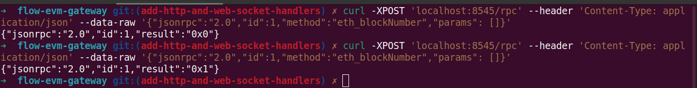
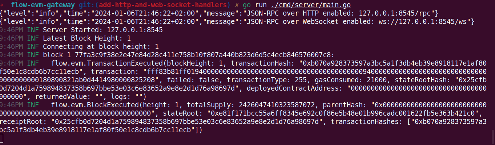

# FLIP 235: Flow EVM Gateway

An implementation of the Ethereum JSON-RPC specification.

## Objective

This proposal outlines the design and implementation of the [Ethereum JSON-RPC specification](https://ethereum.github.io/execution-apis/api-documentation/) into a standalone
service, which aims to provide a gateway to Flow EVM for developers and the
various existing tools.

## Motivation

The [JSON-RPC API](https://ethereum.org/en/developers/docs/apis/json-rpc/) specifies a
uniform set of methods that software applications, such as MetaMask or an Ethereum client,
can use to interact with the Ethereum blockchain, either by reading blockchain data or
sending transactions to the network. To achieve EVM compatibility, it is crucial to
provide a JSON-RPC API, which among other things, facilitates the onboarding of developers
that are already familiar with it and enables interoperability with the existing tools
built on top of the JSON-RPC API.

## User Benefit

Users will be able to use an EVM-compatible client to connect to the Flow EVM network,
by providing the network name, JSON-RPC URL, chain ID, currency etc.
Developers will be able to easily retrieve all sorts of information from Flow EVM,
such as block/transaction/account data, as well as define filters and subscribe
to changes regarding the previous entities. This will allow developers to focus
on building new tools and products, without having to write custom indexers from
scratch.

## Design Proposal

### Context

JSON-RPC is a stateless, light-weight remote procedure call (RPC) protocol.
It defines several data structures and the rules around their processing.
It is transport agnostic in that the concepts can be used within the same
process, over sockets, over HTTP, or in many various message passing
environments. It uses JSON (RFC 4627) as the data format.

### Existing RPC Server implementations

The Geth client offers a generic [RPC Server](https://github.com/ethereum/go-ethereum/blob/master/rpc/server.go) implementation, which will be used in the implementation
of the Flow EVM Gateway as well.

```go
type BlockChainAPI struct {
	config *Config
	Store  *storage.Store
}

func NewBlockChainAPI(config *Config, store *storage.Store) *BlockChainAPI {
	return &BlockChainAPI{
		config: config,
		Store:  store,
	}
}

// eth_chainId
// Returns the chain ID used for signing replay-protected transactions.
func (api *BlockChainAPI) ChainId() *hexutil.Big {
	return (*hexutil.Big)(api.config.ChainID)
}

// eth_blockNumber
// BlockNumber returns the block number of the chain head.
func (api *BlockChainAPI) BlockNumber() hexutil.Uint64 {
	latestBlockHeight, err := api.Store.LatestBlockHeight(context.Background())
	if err != nil {
		panic(fmt.Errorf("failed to fetch the latest block number: %v", err))
	}
	return hexutil.Uint64(latestBlockHeight)
}

// Create an RPC server.
srv := rpc.NewServer()

apis := []rpc.API{
	{
		Namespace: "eth",
		Service:   NewBlockChainAPI(config, store),
	},
}

// Register all the APIs exposed by the services
for _, api := range apis {
	if err := srv.RegisterName(api.Namespace, api.Service); err != nil {
		return err
	}
}
```

The above code snippet instantiates a new RPC server and registers a
service object (`*BlockChainAPI`) under the `eth` namespace.

The server can now accept HTTP requests with the following body:

```json
{"jsonrpc":"2.0","id":1,"method":"eth_chainId","params": []}
```

and respond with an appropriate result, such as:

```json
{"jsonrpc":"2.0","id":1,"result":"0x29a"}
```

Under the hood, the RPC server reads the value of the `"method"` key.
In this case `"eth_chainId"`, the part before the `_` is the namespace
(`eth`) and the part after the `_` is the method which should be called
on the registered service object (`ChainId`).

Some sample HTTP calls to the Flow EVM Gateway's JSON-RPC server, can
be seen below:



### Supported transport protocols

There are three transport protocols available in Geth: IPC, HTTP and WebSockets.

For the gateway, we are interested in supporting only JSON-RPC over HTTP and
JSON-RPC over WebSockets. The RPC methods with event subscription are available
only for WebSocket connections.

Again, the Geth client has an implementation of an [httpServer](https://github.com/ethereum/go-ethereum/blob/master/node/rpcstack.go) which is basically a proxy that routes `HTTP` &
`WebSocket` requests to a dedicated `rpc.Server` instance for each of the two
transport mediums. This allows for more fine-grained control over which namespaces
& RPC methods are available on which transport, and allows for better scaling.

Unfortunately, none of the relevant types in the `go-ethereum` package are exported,
so we cannot pull them directly from the `go-ethereum` package. But even if they
were exported, it comes with quite a lot of extras, such as `CORS` / `JWT` / `GZIP`
compression which might be overkill for what we currently need. For the time being,
we have extracted a minified version of it [here](https://github.com/onflow/flow-evm-gateway/blob/aaf3ba3f2ab78321fa377ecf5165a2f7dbc44865/api/server.go).

### Indexing FlowEVM events

Quoting some content from [EVM support](https://github.com/onflow/flips/pull/225) FLIP:

> To better understand the approach proposed in this Flip, consider EVM on Flow as a virtual blockchain deployed to the Flow blockchain at a specific address (e.g., a service account). EVM on Flow functions as a smart contract that emulates the EVM with its own dedicated chain-ID. Signed transactions are inputted, and a chain of blocks is produced as output. Similar to other built-in standard contracts (e.g., RLP encoding), this EVM environment can be imported into any Flow transaction or script.
This is made possible using selective integration of the core EVM runtime without the supporting software stack in which it currently exists on Ethereum. For equivalence we also provide an EVM compatible JSON-RPC API implementation to facilitate EVM on Flow interactions from existing EVM clients.

Since the gateway is not the only entrypoint for interacting with FlowEVM, we need
to track every event emitted from the `EVM` smart contract, consume it and build an
index which reflects the latest state of the chain.

For the indexing, we will be using the Event Streaming API offered from the
`flow-go-sdk`. A sample code snippet can be seen below:

```go
flowClient, err := grpc.NewBaseClient(
	grpc.EmulatorHost,
	goGrpc.WithTransportCredentials(insecure.NewCredentials()),
)
if err != nil {
	logger.Error().Msgf("could not create flow client: %v", err)
}

data, errChan, initErr := flowClient.SubscribeEventsByBlockHeight(
	ctx,
	latestBlockHeader.Height,
	flow.EventFilter{
		EventTypes: []string{
			"flow.evm.BlockExecuted",
			"flow.evm.TransactionExecuted",
		},
	},
	grpc.WithHeartbeatInterval(1),
)

// track the most recently seen block height. we will use this when reconnecting.
// the first response should be for latestBlockHeader.Height
lastHeight := latestBlockHeader.Height - 1
for {
	select {
	case <-ctx.Done():
		return

	case response, ok := <-data:
		if !ok {
			if ctx.Err() != nil {
				return // graceful shutdown
			}
			logger.Error().Msg("subscription closed - reconnecting")
			connect(lastHeight+1, 10)
			continue
		}

		if response.Height != lastHeight+1 {
			logger.Error().Msgf("missed events response for block %d", lastHeight+1)
			connect(lastHeight, 10)
			continue
		}

		logger.Info().Msgf("block %d %s:", response.Height, response.BlockID)
		if len(response.Events) > 0 {
			store.StoreBlockHeight(ctx, response.Height)
		}
		for _, event := range response.Events {
			logger.Info().Msgf("  %s", event.Value)
		}

		lastHeight = response.Height

	case err, ok := <-errChan:
		...
	}
}
```

The main events from the `EVM` smart contract are two:
- `flow.evm.BlockExecuted`,
- `flow.evm.TransactionExecuted`

To see the indexer & the events' payloads in action:



### Storage Integrity

While consuming events, it is very critical to make sure that they are processed
in a sequential manner, and no events response is missed for a single block.
If this were to happen, the storage index could end up corrupted, and we would
return incorrect data for things such as account balances, nonces etc.

In the code snippet below, we specify a heartbeat interval of `1` and check
that each received events response is for the expected block height, before
committing any changes to the storage.

```go
data, errChan, initErr := flowClient.SubscribeEventsByBlockHeight(
	...,
	grpc.WithHeartbeatInterval(1),
	// this will yield an events response for each block,
	// even if it has no events matching the filter criteria.
)

// track the most recently seen block height. we will use this when reconnecting.
// the first response should be for latestBlockHeader.Height
lastHeight := latestBlockHeader.Height - 1
for {
	select {
	case response, ok := <-data:
		...
		if response.Height != lastHeight+1 {
			logger.Error().Msgf("missed events response for block %d", lastHeight+1)
			connect(lastHeight, 10)
			continue
		}
		// make sure that the response is for the expected block height,
		// before committing any changes to the storage.
		...

		// mark the block height of the events response as processed.
		lastHeight = response.Height
	}
}
```

### Performance Implications

We should have some end-to-end tests, perhaps with the usage of the Flow Emulator.
As well as some benchmarks, to assess the service degradation with regards to the
increase of the storage, the incoming requests and possibly the emitted events.

### Dependencies

The Flow EVM Gateway is a standalone service, hosted in its own repository, so
it does not add any dependencies to existing core repositories. It is
build around some of Flow's core repositories, such as `flow-go-sdk` and
`flow-go`, so it depends on their public APIs.
Later on, it would be useful to expose the Flow EVM Gateway from the Emulator
as well, as we have done with the gRPC & REST Access API.

### Tutorials and Examples

A reference implementation addressing parts of this proposal can be found in
this [PR](https://github.com/onflow/flow-evm-gateway/pull/11#issue-2006802251).

### User Impact

The Flow EVM Gateway is a standalone service that complements the FlowEVM
functionality. It should be released at around the same time as FlowEVM,
in order to allow for better beta testing.

## Related Issues

As with any service, we need to think about logging, alerting, monitoring,
storage capacity and throughput.
Dockerizing the gateway would be nice, in order to allow developers to easily
start using it for development and testing.

## Prior Art

As explained above, the [Geth](https://github.com/ethereum/go-ethereum) client
was the main source of inspiration for the work on the JSON-RPC server.

## Questions and Discussion

- Do we expect to have one official EVM Gateway run by the Flow team and
  individual developers/team can also run their own? As is the case with
  Access Nodes, for example.
