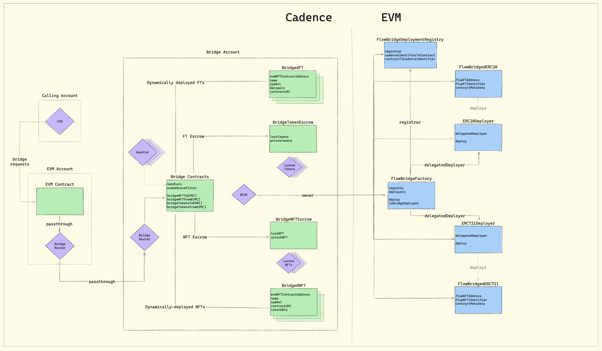

# FLIP 318: VM Bridge Support for Cross-VM NFTs

<details>
<summary>Table of Contents</summary>

- [Objective](#objective)
- [Current State](#current-state)
  - [Visual Overview](#visual-overview)
- [Functional Requirements](#functional-requirements)
- [High-Level Implementation Plan](#high-level-implementation-plan)
- [Proposed Processes](#proposed-processes)
  - [Scenarios](#scenarios)
  - [Updating Onboarded NFTs](#updating-onboarded-nfts)
  - [Asset Migration](#asset-migration)
- [Case Study: Integrating a Net New Cadence-Native Cross-VM NFT](#case-study-integrating-a-net-new-cadence-native-cross-vm-nft)
  - [Pre-Requisites](#pre-requisites)
  - [Deployment](#deployment)
  - [Verification](#verification)
- [Interfaces](#interfaces)
  - [Cadence-Native NFTs](#cadence-native-nfts)
  - [EVM-Native NFTs](#evm-native-nfts)
  - [Cross-VM Pointers](#cross-vm-pointers)
- [Limitations \& Considerations](#limitations--considerations)
- [Alternatives Considered](#alternatives-considered)
  - [Status Quo](#status-quo)
  - [Router Passthrough](#router-passthrough)
  - [Signature Verification Mechanism](#signature-verification-mechanism)
- [Open Questions](#open-questions)
- [Feedback](#feedback)
  - [EVM-Native NFT](#evm-native-nft)

</details>

## Objective

Enable developers to define their own cross-VM NFT associations allowing for seamless movement of NFTs between Cadence
and EVM while mitigating infrastructure fragmentation incurred by bespoke and disconnected self-rolled bridges.

The above implies the following:

- **Source of truth** - the canonical VM bridge serves as a source of truth regarding up to date asset associations
  across Cadence & EVM
- **Validity** - any declared associations are programmatically verifiable by the bridge contracts
- **Secure migration** - any assets that have thus far been onboarded to the VM bridge (and therefore have a
  bridge-defined representation in the non-native VM can be safely migrated to a custom non-native implementation.
    - Updating from a bridge-defined to a project-specified implementation is supported at most one time, allowing
      projects to update their non-native contract from the permissionlessly deployed bridged asset definition.
    - Migrations are initiated by asset owners, allowing users to move from bridge-defined assets to the native asset,
      and back into the non-native VM as the project-defined implementation.
    - The ability to update bridge-defined associations beyond this upgrade remains an [open question](#open-questions)
      inviting feedback.

## Current State

- NFTs are onboarded to the non-native VM by bridge-deployed contracts
    - Cadence-native NFTs are deployed to EVM as templated ERC721 collections
    - EVM-native ERC721s are deployed to Cadence as a relatively minimal templated NonFungibleToken implementation
- Once onboarded to the bridge, the associations between native and bridge-deployed contracts are considered static, and
  cannot be changed
- The templated nature of the bridge-deployed contracts means that projects are largely restricted in the non-native
  implementation of their asset
- Given the variety of ERC721 extensions and even various behavior among individual extensions, this restriction largely
  affects Cadence-native NFT collections that wish to tap into the ever growing number of platforms planned to launch on
  Flow EVM
- Also, since the associations are static and the bridge does not allow for standards beyond a basic ERC721, projects
  who wish to incorporate more feature-rich cross-VM functionality or unsupported ERCs must exert a lot of effort to
  implement these features
    - e.g. A Cadence-native NFT that wishes to “enforce” royalties with ERC721C must deploy their own Solidity contract,
      then implement some redemption mechanism by which the bridge-deployed ERC721 can be redeemed for the “official”
      ERC721C. While this is technically workable, the workaround falls short as ecosystem tools like Flow Wallet and
      Flow Port don’t know the NFT is supposed to be redeemed after bridging, and further have no standard for doing so.
- There are a number of potential negative outcomes from this workaround, primarily:
    1. **Asset fragmentation:** If the project deploys an alternate “official” EVM contract, any users bridging via
       ecosystem-wide tooling (Flow Port, Flow Wallet, etc) will need to complete a last leg outside of the context of
       those tools to reach a their final desired state.
    2. **Infrastructure fragmentation:** A project may choose to create their own VM bridge. In this case, the original
       Cadence NFT would bridge to their ERC721C, but since standardized tooling only integrates with the canonical
       bridge, users will be left with unofficial versions of assets that ultimately need to be redeemed outside of
       those tools. This could get messy and confusing very quickly.
- Ultimately, we want users to have a simple experience - move their assets securely from one VM to another with both
  the start and end state reflective of the official asset, all in a single Cadence transaction
- The proposed solution is then to verifiably register these project-deployed contracts and associate them internally to
  the bridge so the native token is bridged as this project-deployed contract instead of the bridge-deployed contract
    - Anywhere escrow is required, the bridge account and its COA will be the custodian of the escrowed asset. And by
      extension, bridge contract logic governs locking & unlocking any escrowed assets.

### Visual Overview


*Depicted is a high level overview of the current state of bridge contracts and core components across Cadence & EVM.*

## Functional Requirements

- Enable projects to define custom NFT <> ERC721 implementations while preserving the bridge as the primary escrow service and central source of truth about cross-VM associations
- These new NFT contracts (defined as an NFT and/or ERC721 that have not yet been onboarded to the bridge) can declare custom associations between their Cadence & EVM contracts as a field in the new contract.
- Native NFTs already onboarded to the bridge (via the “legacy” path) can update their non-native contract association such that:
    - The native asset is bridged as the updated asset in the non-native VM
    - Any legacy bridged assets from bridge-deployed contracts can be migrated by the owner of the asset. Migrations can be done in a single Cadence transaction by moving the bridged asset into the native VM, then the native asset back into the non-native VM. This would be functionally equivalent to a like-for-like redemption of the bridged NFT for the project-deployed NFT without the need to explicitly include such functionality in either contract.
- Cross-VM implementations must point to each other - a Cadence Type must point to its intended EVM implementation and its EVM implementation must point to its associated Cadence type
- Updates from permissionlessly onboarded, bridge-defined associations to custom associations is supported indefinitely
    - There is a risk of impersonation should contract owning keys be compromised
        - Though arguably this risk is no different than the existing risk vector of compromised keys, an issue present irrespective of the VM bridge
    - Requisite that both implementations point to each other means the bridge can check for intended associations during the permissionless onboarding path
        - If during that process its determined that the bridge lacks the Capability or permissions to fulfill bridging, permissionless onboarding should revert
            - e.g. If a minter Capability is required to fulfill an EVM-native NFT into Cadence, the bridge cannot complete onboarding and must then revert. In this case, only once the custom association process has completed by the project owner can the bridge fulfill requests.
- Once a custom association is declared, it cannot be updated
    - In other words, a custom cross-VM association can only be declared once
    - Contract upgrade patterns specific for either VM allow projects to hedge any risks here
        - On the Cadence side, retaining active keys allows projects to update their implementation. Cadence inherently is friendlier to contract upgradability.
        - On the EVM side, the use of a proxy pattern allows projects to update their implementation address while retaining a consistent EVM address association.

## High-Level Implementation Plan

- Add a verification mechanism to validate that a caller has authority over both the Cadence & EVM contracts. The proposed mechanism for this programatic verification is for both sides to point to each other.
    - **Cross-VM Pointers:** Contracts across VMs point to each other, indicating that their association is intended by the project and therefore valid. Note that since cross-VM associations are established on the basis of Type to EVMAddress, the pointers should reflect this degree of association. It cannot be assumed that a Cadence contract has a single associated EVM contract.
        - A Cadence asset type points to an EVM contract address, and an EVM contract points to a Cadence asset type. This may run counter to intuition which would deem associations on a contract to contract basis.
- Add a custom associations table (and reverse lookup) within a new `FlowEVMBridgeCustomAssociations` contract tracking NFTs that have been developer defined across VMs, associating Cadence types with single-token ERC721 contracts.
    - `associationsConfig: {Type: CustomConfig}`
    - `associationsByEVMAddress: {String: Type}`
- Add an EVM address target to the [protected COA callback](https://github.com/onflow/flow-evm-bridge/blob/main/cadence/contracts/bridge/FlowEVMBridgeAccessor.cdc#L55-L73) in `FlowEVMBridgeAccessor.withdrawNFT`
    - Within the callback, restrict to either the legacy or custom association EVM address
- After validating a cross-VM association, save information relevant for handling assets including:
    - Project-defined Type : EVM address association
    - Whether the association is originally “legacy” - defined as having been onboarded to the bridge prior to the project-defined specification
    - The native VM - Cadence or EVM - of the asset
- Contract and resource interfaces enabling the bridge privileged access to mint assets in the non-native VM as well as mechanisms for passing data from a Cadence NFT to an ERC721 contract at the time of minting
    - Cadence resource on which the bridge is granted a Capability, allowing it to mint an NFT being bridged from EVM
    - Solidity abstract contract with modified function such that the bridge can fulfill requests into EVM
- Provide generic transactions supporting the migration of user NFTs from bridged to updated implementations

## Proposed Processes

It’s helpful to consider the proposed changes from a process-driven frame. The processes when handling a given bridge request are primarily impacted by the particular scenario of the relevant NFT. The primary processes of the bridge are:

- Permissionlessly onboarding a given asset defined by its Cadence type or EVM address
- Verifying a custom association request
- Updating onboarded NFTs
- Bridging NFTs to EVM
- Bridging NFTs from EVM

And the particularities of the process behind bridging to and from EVM will be a function of both the association status and whether the requested asset must first be migrated

### Scenarios

#### Verifying Associative Claims

**Cross-VM Pointers**

1. Caller calls `FlowEVMBridge.onboardCrossVMAssetWithPointers()` , providing the Cadence Type and optional NFT minter Capability (provided for the bridge to fulfill EVM-native NFTs into Cadence)
2. If provided, check the minter Capability via `.check()`
3. Verify the provided type is an NFT implementation
4. Verify the provided type is not an FT Vault implementation
5. Validate the cross-VM association
    1. Resolves the `CrossVMPointer` view from the defining `NonFungibleToken` contract
    2. Calls to the resulting associated EVM contract address `ICrossVM.getCadenceIdentifier() (string)` and `ICrossVM.getCadenceAddress() (string)` 
    3. If both pointers match, the association is deemed valid
6. Validate the EVM contract is an ERC721 conformance via ERC165 route
7. Assuming validity, preserve configuration details in the custom associations table including any provided minter Capability

#### Onboarding Net New NFTs as Custom Associations

1. Verify neither the Type nor the EVM contract have been previously onboarded
2. Verify the associative claim
3. If EVM-native, check & store the provided minter Capability
4. Preserve configuration in the custom associations contract, indexed on type with a struct/resource value containing the following fields
    1. Cadence Type
    2. EVM address
    3. Optional minter Capability
    4. Native VM
    5. If the up to date association requires migration handling (i.e. if the custom association was asserted after a bridge-defined deployment) - net new NFTs will not require migration handling
5. Initialize escrow for the Cadence NFT

### Updating Onboarded NFTs

There are many NFT projects that had already been onboarded to the bridge with basic bridge-defined implementations of the non-native assets. At a high level, the following steps are required to update the association to a project-defined non-native asset. The specific process for each step is defined in the associated section of the document.

1. Ensure the stated native VM is consistent with the pre-configured native VM - an onboarded NFT cannot change its native VM as doing so would go against core assumptions about existence in escrow
2. Complete the verification process as stated in the “Verifying Associative Claims” section above, labeling the association as requiring migration handling. This will preserve the updated association in the new custom associations contract.
3. Users will then be able to migrate legacy NFTs and bridge new NFTs as described in the following sections.

#### Bridging to EVM

1. Check legacy association table for associated EVM address based on NFT type
2. Check custom association table for project-defined configuration, providing both the type and legacy EVM association
3. If **only legacy association** exists
    1. Escrow the provided Cadence NFT
    2. If the NFT is defined by a bridge-deployed contract in Cadence, assume the underlying asset is EVM-native → unlock from EVM escrow
        1. Assume escrowed in EVM, transfer from escrow to named recipient
    3. Otherwise, assume Cadence-native → mint or unlock from EVM escrow
        1. If exists in EVM, transfer to named recipient from escrow
        2. Otherwise, mint to named recipient
4. If only **project-defined association** exists, check its native VM
    1. Escrow the provided Cadence NFT
    2. If the NFT is Cadence-native, check if the corresponding NFT exists in the EVM side - cannot assume `exists()` is supported (`exists()` was [made internal](https://github.com/OpenZeppelin/openzeppelin-contracts/pull/1193/files)), so use `ownerOf()`  and check if returned address is `address(0)`
        1. If exists, assume the NFT is in escrow and transfer to the named recipient from escrow
        2. If it does not exist, assume the NFT must be minted (bridge should have minting permissions) and mint to the named recipient
            - Pass any `bytes` data returned from the Cadence NFT (via `CrossVMAsset.evmMetadataBytes(): EVM.EVMBytes?`) at time of minting
    3. If EVM-native, assume the NFT is in escrow on EVM side. Transfer from escrow to the named recipient.
5. Otherwise, **both a** legacy and project-defined association exists
    1. Check the config returned from the custom association table for the native VM
        1. If Cadence-native → mint or unlock from EVM escrow
            1. Escrow the provided Cadence NFT
            2. Check if the corresponding EVM NFT exists (defined by the custom association)
                1. If so, assume it’s in escrow and transfer to the named recipient
                2. Otherwise, it must be minted to the named recipient
                    - Pass any `bytes` data returned from the Cadence NFT (via `CrossVMAsset.evmMetadataBytes(): EVM.EVMBytes?`) at time of minting
        2. Otherwise, EVM-native → unlock from EVM escrow
            1. If the provided NFT is bridge-defined, this is considered a migration and the provided NFT will be **burned** as it is obsolete (replaced by the custom implementation)
            2. Since it’s EVM-native, it’s assumed the EVM NFT is escrowed. Transfer to the named recipient from escrow.

#### Bridging from EVM

1. Check legacy association table for associated EVM address based on requested type
2. Check custom association table for project-defined configuration, providing both the type and legacy EVM association
3. If **only legacy association** exists
    1. Escrow the ERC721, providing the relevant EVM contract address at which to target the escrow callback (callback is restricted to either legacy or custom EVM contract - this could also be a flag)
    2. Check escrow for the corresponding Cadence NFT
        1. If in escrow, unlock from escrow and return
        2. Otherwise, confirm the Cadence NFT is bridge-defined, mint and return
4. If only **project-defined association** exists, check its native VM
    1. Escrow the ERC721, providing the relevant EVM contract address at which to target the escrow callback (callback is restricted to either legacy or custom EVM contract - this could also be a flag)
    2. If Cadence-native, the corresponding NFT should be in escrow. Unlock the NFT from escrow and return
    3. Otherwise, EVM-native → mint or unlock from Cadence escrow
        1. If in escrow, unlock and return
        2. Otherwise, use the minter Capability granted at verification to mint the corresponding Cadence NFT & return
            - NOTE: If it’s decided to support passing data from EVM to Cadence at the time of minting, this should be done here
5. If **both** legacy and project-defined association exists, assume this is a migration case
    1. Check the config returned from the custom association table for the native VM
        1. If Cadence-native → unlock from Cadence escrow
            1. Check both EVM contracts to determine which ERC721 the caller owns
                1. If legacy bridged version, pass the legacy bridged contract address to target the escrow callback and burn the NFT.
                2. If project-defined version pass the relevant project-defined EVM contract address at which to target the escrow callback (callback is restricted to either legacy or custom EVM contract - this could also be a flag). Then escrow the EVM NFT.
            2. Since the NFT is Cadence-native, assume the NFT is in escrow. Unlock from escrow and return to the caller.
        2. Otherwise, EVM-native → mint or unlock from Cadence escrow
            1. Escrow ERC721, providing the relevant EVM contract address at which to target the escrow callback (callback is restricted to either legacy or custom EVM contract - this could also be a flag)
            2. Check if the corresponding NFT is in escrow
                1. If so, unlock and return
                2. Otherwise, use the minter Capability provided at verification to mint the corresponding Cadence NFT & return
                    - NOTE: If it’s decided to support passing data from EVM to Cadence at the time of minting, this should be done here

### Asset Migration

Migrating from a bridged-defined to a project-defined asset will be handled at the transaction level. Migration here implies that the user starts with a bridged representation of the asset in the non-native VM and ends with the project-defined asset in the same VM.

This process will consist of:

1. Bridging the bridged asset to the native asset
2. Bridging back to the non-native VM as the project-defined asset

Providing these generic transactions will allow projects wishing to enable users to migrate bridged assets to their updated implementations to do so simply with a single transaction on the basis of their native VM. This process also removes the need to include redemption logic in their contracts, but would only cover users migrating via COAs.

#### Example

Taking the concrete case of an updated TopShot EVM association and the prior existence of a bridged TopShot ERC721, a user would submit the `migrate_cadence_native_nft.cdc` transaction. This transaction would do the following:

1. Bridge the requested NFT from EVM, resulting in a TopShot NFT
2. Bridge that same TopShot NFT back to EVM

Since the bridge has internal knowledge of the updated association and checks within the scope of the bridge request which asset the caller holds in EVM - the bridged or custom representation - the specifics of which NFT is escrowed and transferred can be abstracted.

## Case Study: Integrating a Net New Cadence-Native Cross-VM NFT

Given the processes and adjustments proposed above, below is the process for a developer deploying a net-new NFT project and associating the Cadence & Solidity contracts with the VM Bridge.

### Pre-Requisites

1. Decide on the native VM in which NFTs will be distributed to users - we will assume this case study is Cadence-native
    1. If Cadence-native, the EVM contract will need to conform to `CrossVMBridgeFulfillment.sol` contract interface (see [Interfaces](#interfaces) below), granting the bridge COA access to mint NFTs. Additionally, the Cadence NFT will need to implement the `EVMBytesMetadata` view so metadata can be passed into the EVM contract at time of fulfillment into EVM.
    2. If EVM-native, the Cadence contract will need to implement an NFT minter conforming to `CrossVMBridgeFullfillmentMinter` interface and grant a Capability on that minter to the bridge 
2. Implement the `CrossVMPointer` view resolution at the Cadence contract & NFT level and the `ICrossVM` Solidity contract interface (see [Interfaces](#interfaces) below). Will also need to conform to and implement `CrossVMBridgeFulfillment` interface, allowing the bridge COA to fulfill requests from Cadence to EVM.

For the following case study, we will assume a **Cadence-native** distribution.

### Deployment

1. Cadence `ExampleNFT` contract is deployed to `0x123` as `NonFungibleToken`, defining a single NFT type
2. Solidity contract is deployed to EVM as `ExampleERC721 is ERC721, ICrossVM, CrossVMBridgeFulfillment` at `0x456`
    - Since the project is Cadence-native, the bridge must be granted permission to mint/transfer ERC721 when moving from EVM via the `CrossVMBridgeFulfillment` contract interface

### Verification

#### Developer Action

Developer calls to `FlowEVMBridge.onboardCrossVMAssetWithPointers()` , providing the following args:

- NFT Type: `A.123.ExampleNFT.NFT`
- Optional minter Capability: `nil`
    - `nil` here implies the NFT is Cadence-native

#### Bridge Contract Internals

**Verification**


Both the Cadence and EVM implementations point to each other. Since both declare association with each other, it can be assumed that the deployer of both contracts intended the association. Of course, it’s not sufficient to trust one contract’s declaration without also checking the other end of the connection without risk of impersonation.

1. Confirm the provided Type is an eligible type
    1. Conforms to Cadence NFT
    2. Does not conform to Cadence FT Vault
2. Confirm no prior associations to either `A.123.ExampleNFT.NFT` nor ERC721 `0x456` - this onboarding path is for net new NFT associations
3. Validate pointer from the Cadence side
    1. Derive Cadence contract address from provided type as `0x123`
    2. Borrow the defining contract as `&{NonFungibleToken}`
    3. Resolve the `CrossVMPointer` view for the given NFT Type
    4. Confirm the view was resolved and move on to validating pointer from the EVM side
4. Retrieve pointer from the EVM side
    1. Retrieve the associated Cadence address from the view’s associated EVM address
    2. Retrieve the associated Type identifier from the view’s associated EVM address
    3. Return a constructed `CrossVMPointer` view from retrieved values and the called EVM address
5. Compare the pointers, continuing if all pointer values match
6. Check conformance with expected `ICrossVMBridgeFulfillment` interface
    1. If false, panic
7. Check the designated VM bridge EVM address & compare against bridge COA address
    1. If mismatched, panic
8. If all of the above pass, continue to onboarding

**Onboarding**

1. Escrow configured for `A.123.ExampleNFT.NFT`
2. Configuration saved in `FlowEVMBridgeCustomAssociations` contract
    1. Construct a `CustomConfig` with the following
        1. Cadence Type: `A.123.ExampleNFT.NFT`
        2. EVM address: `0x456`
        3. Optional minter Capability: `nil`
        4. Native VM: `FlowEVMBridgeCustomAssociations.NativeVM.Cadence`
        5. Requires migration handling: `false`
    2. Preserve the `CustomConfig` in the `associationsConfig` mapping
    3. Preserve the reverse lookup in the `associationsByEVMAddress` mapping


After integration, ExampleNFT & ExampleERC721 will be associated in the CustomAssociations contract with the associative details preserved in the CustomConfig. Note the section outlined by the red box denoting the association created as a result of the developer action.

## Interfaces

### Cadence-Native NFTs

- `struct EVMBytesMetadata` - view resolved by the NFT
    - `access(all) fun bytes(): EVM.EVMBytes?`
        - Returns the bytes to be passed to the EVM contract on `fulfillToEVM` call, allowing the EVM contract to update the metadata associated with the NFT
- `interface ICrossVMBridgeFulfillment is ERC165`
- `abstract contract CrossVMBridgeFulfillment is ERC721, ICrossVMBridgeFulfillment`
    - `constructor(address vmBridge)`
        - Sets the bridge EVM address such that only the bridge COA can call the privileged methods
    - `modifier onlyVMBridge()`
        - Restricts modified methods such that only the bridge COA can call them
    - `function getVMBridgeAddress() public view returns (address)`
        - Returns the designated VM bridge’s EVM address
    - `function fulfillToEVM(address to, uint256 id, bytes data) external onlyVMBridge`
        - Fulfills the bridge request, minting (if non-existent) or transferring (if escrowed) the NFT with given ID to the provided address
    - `function supportsInterface(bytes4 interfaceId) public view virtual returns (bool)`
        - Allows a caller to determine the contract conforms to the `ICrossVMFulfillment` interface

### EVM-Native NFTs

- `resource interface CrossVMBridgeFullfillmentMinter`
    - `access(all) fun fulfillFromEVM(id: UInt64): @{NonFungibleToken.NFT}`
        - Mints an NFT on bridging from EVM, returning the minted NFT to the bridge context to complete the caller’s request

### Cross-VM Pointers

The following interfaces must be implemented in all cases whether the collection is Cadence- or EVM-native

#### Cadence

The following new view **must** be resolved at the contract level (`ViewResolver.resolveContractView`) for a given Type **and** at the NFT level (`ViewResolver.Resolver.resolveView`)

- `struct CrossVMPointer`
    - `access(all) let cadenceType: Type`
    - `access(all) let cadenceContractAddress: Address`
    - `access(all) let evmContractAddress: EVM.EVMAddress`
    - `access(all) let isCadenceNative: Bool`

#### Solidity

The following interface **must** be implemented in the IERC721 conforming contract and point to the associated Cadence NFT. [`ICrossVM` is already implemented](https://github.com/onflow/flow-evm-bridge/blob/main/solidity/src/interfaces/ICrossVM.sol) and in use in the bridged ERC721 and ERC20 templates.

- `interface ICrossVM`
    - `function getCadenceAddress() external view returns (string memory)`
        - Returns the Cadence address defining the associated type
    - `function getCadenceIdentifier() external view returns (string memory)`
        - Returns the Cadence Type identifier associated with the EVM contract

Taken together, the above can be used to verify an association given a Cadence Type.

```swift
access(all) fun validatePointers(forType: Type): Bool {
	// borrow the defining NFT contract
	let contractAddress = forType.address
	let nftContract = getAccount(contractAddress).contracts.borrow<&{NonFungibleToken}>(name: forType.contractName)
	if nftContract == nil { return false }

	// resolve the CrossVMPointer from the defining NFT contract
	let pointer = nftContract!.resolveContractView(
			resourceType: forType,
			viewType: MetadataViews.CrossVMPointer
		) as! MetadataViews.CrossVMPointer?
	if pointer == nil { return false }
	if pointer!.cadenceType != forType || pointer!.cadenceContractAddress != contractAddress {
		return false
	}
	
	// internal call to helper method that inspects EVM contract
	// and returns an optional CrossVMPointer view constructed from
	// EVM results - nil if ICrossVM calls fail implying non-conformance
	let evmPointer = self.getCrossVMPointer(fromEVMContract: pointer!.evmContractAddress)
	if evmPointer == nil { return false }

	// return true if pointers match
	return pointer!.cadenceType == evmPointer!.cadenceType &&
		pointer!.cadenceContractAddress == evmPointer!.cadenceContractAddress &&
		pointer!.evmContractAddress == evmPointer!.evmContractAddress
}
```

## Limitations & Considerations

- Given the Type to EVM address association, these changes still cannot support multi-token asset types (e.g. [ERC1155](https://eips.ethereum.org/EIPS/eip-1155)). Note: This may later also become an issue for fungible token associations as multi-token contract standards like [ERC6909](https://eips.ethereum.org/EIPS/eip-6909) gain adoption via Uniswap v4.
    - E.g. A multi-NFT Cadence contract would have to associate each NFT type to a distinct EVM address as a rule of bijective association given this mapping schema
- Projects must grant the VM bridge’s COA privileged access, thus trusting the VM bridge to act honestly, securely, and correctly (i.e. in accordance with expected business logic)
- All projects must choose a “native” VM, minting only in one VM and granting the bridge granted permissions or Cadence Capability
- Since projects cannot specify their own escrow signature, implementations are still limited in their EVM implementations to ERC721. For instance, escrowing an ERC721 involves calling `safeTransferFrom(address,address,uint256)` while escrowing an ERC1155 would involve calling `safeTransferFrom(address,address,uint256,uint256,bytes)`. Note the difference in number, type and order of parameters. Without an ERC1155 analogue in Cadence, there is no way to determine the `uint256 amount` to be transferred during escrow. Additionally, use of the available `bytes data` field on `ERC1155.safeTransferFrom` is a project-specific variability. It’s therefore recommended to retain the prescriptive use of ERC721 conformance on the EVM association. See alternatives below for how we might support alternative ERC implementations.

## Alternatives Considered

### Status Quo

#### Summary

Make no changes to the bridge, instead relying on redemption patterns implemented within the project-owned contracts that would internally exchange bridged assets for their updated asset.

#### Benefits

- Avoids adding complexity to VM bridge contracts, thus mitigating any additional risk incurred by making changes to an already complex onchain system

#### Drawbacks

- Fragmentation and therefore potential confusion among developers and users
- Complexity instead moves to project developers and ecosystem platforms facilitating cross-VM movement

### Router Passthrough

#### Summary

This alternative would treat the bridge as a router, passing through requests to self-rolled bridges that have been registered with the canonical bridge. A similar approach was suggested as an alternative in the [original bridge proposal](https://github.com/onflow/flips/blob/main/application/20231222-evm-vm-bridge.md) and explored as an early implementation.

#### Benefits

- Allows developers more flexibility in cross-VM associations, enabling novel and experimental use cases that would otherwise be unsupported
- Mitigates the privileged access required by the VM bridge to mint
- Minimizes complexity of the bridge by offloading responsibility of escrow and business logic to the project who would know how best to handle their assets between Cadence & Solidity.

#### Drawbacks

- Moves complexity to the project contracts which may ultimately be ill-handled. Issues here might be associated with the VM bridge.
- While this option alone relatively reduces effort and complexity with respect to VM bridge code, it would also add effort in the way of example, developer education, and followup support for projects experiencing issues with their self-rolled implementations.
- Could lead to issues in asset tracking between VMs as well as caching NFT metadata if assets are escrowed in a non-standardized manner.
- We would also need to consider how to restrict calls on COAs within the scope of the self-rolled bridge contract such that calls can only be made to the related EVM contract.

#### Notes

This option is not mutually exclusive with the proposed solution and is likely to be desirable by projects with more advanced and experimental use cases. It would then be up to developers how they implement use case specific business logic that would otherwise be non-standard and therefore unsupported by the VM bridge.

It’s possible that we could add this more advanced and flexible option at a later time. However, if it’s decided that legacy projects can only migrate from bridged to custom associations once, it’s unlikely this would be an option for those that take advantage of the changes proposed above.

Instead, it’s proposed that this alternative be explored and included in a subsequent update specifically for net new projects. This restriction would allow for new NFT (or really any type) projects to define their cross-VM implementations without the risk and complexities of an internal migration.

### Signature Verification Mechanism

#### Summary

The proposed method to verify cross-VM associations suggests that both implementations point to each other. However, this requires that both contracts include changes in order to support VM bridge integration. This requirement may be undesirable for some. For instance, a project may wish to deploy the same Solidity contract across various EVM chains.

An alternative was considered to verify associations on the basis of signatures. Callers are proven as authorized to declare associations by virtue of their validated privileged access on both contracts.

- Cadence Verification: Valid, full-weight signature signed by keys active on the contract account
- EVM Verification: Signature with the primary key of the owner of the NFT contract as defined by [OpenZeppelin’s `Ownable` interface](https://docs.openzeppelin.com/contracts/2.x/api/ownership#Ownable)

#### Potential Process

<aside>
ℹ️

Prior art verifying EOA signatures in [onflow/flow-cadence-eth-utils](https://github.com/onflow/flow-cadence-eth-utils/blob/main/cadence/contracts/ETHUtils.cdc)

</aside>

1. Contract owner signs valid messages as the authorized parties for both the Cadence & EVM contract (Message format TBD - `CADENCE_ADDRESS:EVM_ADDRESS`)
2. Caller calls `FlowEVMBridge.onboardCrossVMAssetWithSignatures()` , providing the Cadence contract account signature, EVM owner signature, Cadence Type, EVM contract address, and optional NFT minter Capability (if Cadence-native - presumed EVM-native otherwise)
3. Bridge validates the signed messages based on the format
    1. Valid if messages are provably signed by the provided Cadence and EVM contract owner addresses
    2. Additional requirement for validity is that the EVM address the owner of the EVM contract as proven by calling `owner()`
4. Bridge verifies the provided type is defined by a contract at the defined Cadence address
    1. Method of Verification:
        1. If included on TN/MN, use the new `Type.address: Address?` introduced in [onflow/cadence#3570](https://github.com/onflow/cadence/pull/3570)
        2. Otherwise, use existing `FlowEVMBridgeUtils.getContractAddress(fromType: Type): Address?` method
5. Bridge access to the mintable side confirmed
    1. If Cadence minter Capability is provided, validate the Capability with `Capability.check()`
    2. If EVM-mintable, call to Factory contract which will perform a call to the defined EVM contract, ensuring the bridge has mint access (insofar as is possible in Solidity via ERC165)
6. If signature & contract verification succeed, preserve configuration details in the custom associations table including any provided minter Capability

#### Benefits

- Fewer cross-VM specific changes required to integrate with the bridge
- Increased chance of backwards compatibility in the event already deployed contracts want to update their collection to a cross-VM implementation

#### Drawbacks

- Requires additional tooling to support projects in declaring and verifying cross-VM associations
- The greater complexity and requisite tooling would take longer to implement than the mechanism as proposed
- Being more complex, it also has greater risk of vulnerability

## Open Questions

- Should asset migrations to bridge-defined assets be supported beyond this update or should this only be allowed for legacy NFTs?
    - Options:
        - No migrations beyond legacy assets
        - Allow migrations to bridge-defined assets indefinitely
        - Allow for migrations within a set period after permissionless onboarding - e.g. custom associations allowed within one month of onboarding to the bridge
    - The issue here is one of security - if the keys to the account/owner become compromised at some point, an attacker could migrate a bridged NFT to an attacker owned NFT and compromise all NFTs in the collection
        - On one hand, this risk vector is not entirely different than the owned contract being compromised irrespective of the bridge
        - On the other hand, the existence of the bridge may in fact increase the blast radius by expanding the sorts of actions an attacker could take with compromised access
    - An edge case affecting EVM-native NFTs is one in which the bridged NFT becomes a base resource for attachments
        - Since those attachments are not made for the custom-defined NFT and the bridge will burn legacy Cadence NFTs on migration, any attachments will be lost to the bridging user. This is not likely to be an issue at the moment; however, may be encountered if migrations are supported indefinitely
    - Up to projects whether they want to take on the problem of migrations after the fact
        - Argument for support
- What does signature verification look like if an EVM contract is owned by a COA?
    - Can we leverage the existing COA ownership proof method exposed on the EVM contract?
    - And what if that COA is not saved in an account, but rather a contract?
    - Alternatively, the COA can temporarily transfer ownership to an EOA that can sign, and the EOA can then transfer ownership back to the COA after attestation is complete
- How does the event pattern emitted by migrating from a bridged to project-defined asset affect traceability of assets between VMs?
- Should passing data at time of bridging from Cadence to EVM be supported?
    - May be desirable for dynamic NFTs so metadata is reflected in EVM at time of bridging
    - Similar pattern is used for bridge-defined ERC721 - call `updateURI` whenever bridging a Cadence-native NFT into EVM
- While we expect to pass data to an EVM contract at the time of minting, it’s proposed (though not stated above) that Cadence contracts deserialize metadata on-demand at the time of resolution for any onchain metadata.
    - In other words, if metadata is sharded between EVM and Cadence, a Cadence NFT can simply inspect EVM state and return real-time data from its EVM contract instead of snapshotting at the time of minting.
    - Is this sufficient or should it also be expected that data should be passed from EVM to Cadence when the bridge mints a Cadence NFT?
- Burning in EVM when moving Cadence-native NFTs to Cadence
    - Currently, the bridge escrows NFTs in EVM, matching the pattern in Cadence - mint & escrow.
    - Would a mint & escrow pattern present edge cases for projects that would otherwise expect the bridge to mint & burn in EVM for a Cadence-native NFT?
- When will EVM bytes encoding/decoding be available on Testnet and Mainnet?
    - Slated for next HCU - February 10th & 11th
    - We will need to ensure this functionality is available in emulator & Cadence test suite for development and testing

---

## Feedback

Focus on most approachable case - net-new NFTs

- ~~Explain~~
- ~~Diagram~~

Add user-focussed section

- What to do for either case as a developer integrating with the bridge
    - Cadence-native
    - ~~EVM-native~~
- ~~How to declare custom association once both contracts are deployed~~

### EVM-Native NFT