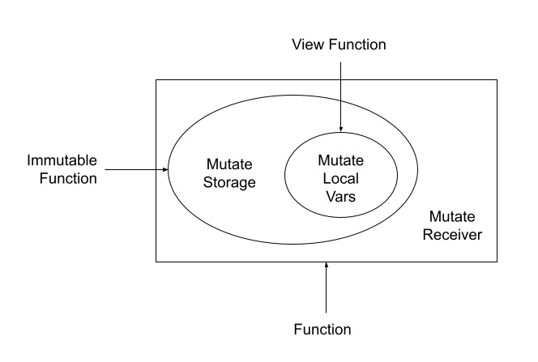

**# Improve Mutability Restrictions

| Status         | Proposed                                     |
|:---------------|:---------------------------------------------|
| **FLIP #**     |                                              |
| **Author(s)**  | Supun Setunga (supun.setunga@dapperlabs.com) |
| **Sponsor**    | Supun Setunga (supun.setunga@dapperlabs.com) |
| **Updated**    | 2022-11-22                                   |

## Objective

This proposal tightens and improves the mutability restrictions introduced in
[Cadence mutability restrictions FLIP](https://github.com/onflow/flips/blob/main/flips/20211129-cadence-mutability-restrictions.md).
The objective is to address the gaps and potential foot guns that still exist in current mutability restrictions.

## Motivation

A previous version of cadence (secure cadence release) restricted the potential foot-gun of mutating container-typed
`let` fields/variables via the
[Cadence mutability restrictions FLIP](https://github.com/onflow/flips/blob/main/flips/20211129-cadence-mutability-restrictions.md).

However, there are still ways to mutate such fields by:
- Directly mutating a nested composite typed field.
- Mutating a field by calling a mutating function on the field.
- Mutating the field via a reference.

### Mutating nested composite typed fields

The existing nested field mutation restrictions only apply to array-typed and dictionary-typed fields/variables.
Developers may still run into a foot-gun where a composite-typed field/variable declared with `let` keyword gets mutated
by mutating the nested fields of the composite value.

```cadence
struct Foo {
    let bar: Bar
}

struct Bar {
    var id: Int
}

fun test() {
    var foo = Foo()

    // Even though the `bar` field of `foo` is declared with `let` keyword,
    // the nested `id` field can be updated, resulting `bar` field being updated.
    foo.bar.id = 4
}
```

### Mutating through a function

Methods defined in composite types can also modify the receiver value.

```cadence
pub struct Foo {
    pub let bar: Bar
}

pub struct Bar {
    pub let array: [Int]

    pub fun mutate() {
        self.array.append(0)
    }
}

pub fun test() {
    let foo = Foo()

    // Error: Directly mutating the nested field is restricted.
    foo.bar.array.append(0)

    // However, mutating the nested `let` field via a function is allowed.
    foo.bar.mutate()
}
```

Like in the above example, it is currently allowed to mutate a nested composite value through a mutating function,
even if the field `bar` was defined using the `let` keyword.

### Mutating via a reference

It is also possible to mutate a container typed field, by taking a reference to it and then mutating the field
through that reference.

```cadence
pub struct Foo {
    pub let array: [Int]
}

pub fun test() {
    let foo = Foo()

    // Error: Directly mutating the field is restricted.
    foo.array.append(0)

    // However, mutating the field via a reference to the field is not restricted.
    let arrayRef = &foo.array as &[Int]
    arrayRef.append(0)
}
```

## User Benefit

Suggested changes of this proposal eliminate the potential of users accidentally exposing mutable fields,
thinking they are constants.

## Design Proposal

### Mutating nested composite typed fields

This proposal suggests making `let` variables behave more similarly to constants, by making the
`let` keyword to mark **both** the **variable** and the **value** as immutable.

```cadence
struct Foo {
    let bar: Bar
}

struct Bar {
    var a: Int
    let b: Int
}

fun test() {
    var foo = Foo()

    // All fields of `foo.bar` would be visible as if they are constants.
    // i.e: accessing a mutable field through a non-mutable variable/value would be prohibited.

    // This will be a static error because even though `a` is not defined with `let`,
    // it is accessed via `bar` field which is defined with `let`.
    foo.bar.a = 4

    // This is already a static error because `b` is defined with `let`.
    foo.bar.b = 5
}
```

This can be achieved by restricting the mutation of a mutable member that is accessed via an immutable member.
For eg: in a member access expression `v.x.y.z` or `v[x][y][z]`, even if member `z` is mutable,
if at least one of the members in the chain prior to `z` (i.e: `x` or `y`) is immutable,
then treat `z` also as immutable.

The only exception is the mutation of an array/dictionary-typed immutable member which is owned by the enclosing scope.
This is already supported - so there won't be any change to the existing behavior.

e.g:
```cadence
struct Foo {
    pub let bar: [Int]

    fun mutate() {
        self.bar[0] = 4    // Valid, because `bar` belongs to the enclosing scope
    }
}
```

### Mutating through functions

#### Built-in functions

Built-in container functions are already annotated/marked as mutating or not.
Using these annotations and the modifier of fields, the type checker can determine whether calling a particular
function is allowed or not on a given field.

#### User functions

Similar to built-in functions, user functions would also require to be annotated to indicate whether the function
mutates its receiver.
This can be done using the `immutable` keyword.
Immutable functions are a subset of normal functions, and a super-set of view functions.
Immutable functions guarantee that the function does not modify the receiver, whereas view functions guarantee
that the function does not mutate any form of state, including the receiver.

Thus, composite functions (i.e: attached functions) have the following relationship between `view` and `immutable` states:



All functions are treated mutable by default, because making functions `immutable` by default would conflict with
`view` functions, as functions are also non-`view` by default. A function being `immutable` as well as non-`view`
at the same time can lead to conflicting/confusing states.

It is invalid to mutate the receiver in an immutable function.
```cadence
pub struct Foo {
    pub let bar: Bar
}

pub struct Bar {
    pub let array: [Int]

    // Static error: Mutating the receiver inside an `immutable` function
    pub fun immutable mutate() {
        self.array.append(0)
    }
}
```

With the proposed change, `mutate()` function of the previous example in the [Motivation](#motivation) section,
will now be treated as a mutating function. Hence, invoking in on the `let bar` field (`foo.bar.mutate()`) would
result in a static error.

```cadence
pub struct Foo {
    pub let bar: Bar
}

pub struct Bar {
    pub let array: [Int]

    pub fun mutate() {
        self.array.append(0)
    }

    pub fun immutable log() {
        log("something")
    }
}

pub fun test() {
    let foo = Foo()

    // Static error: Calling a mutable function `mutate()` on a non-local field/variable is invalid.
    foo.bar.mutate()

    // No error: Calling an immutable function is allowed.
    foo.bar.log()
}
```

### Mutating through references

When a reference is obtained, it would need to be marked as whether it allows mutating operations or not.
A reference that allows mutating operations is called a "mutable reference" and otherwise it is an 
"immutable reference".

_Note: The syntax used in the below section is just a prototype to propose the core idea.
The syntax is not finalized and may be subject to change._

A reference taken to a `let` field that is outside the enclosing scope is `immutable`.

```cadence

pub struct Foo {
    pub let array: [Int]
}

pub fun test() {
    let foo = Foo()

    // Static error: Taking a mutable reference to a `let` field is invalid
    let arrayRef = &foo.array as &[Int]

    // Valid: Reference needs to be marked as `immutable` when taking a reference
    // to a field outside of the enclosing scope.
    let immutArrayRef = &foo.array as immutable &[Int]
}
```

Performing mutating operations on an immutable reference are statically rejected.

```cadence

// Error: Mutating the field via an immutable reference is restricted.

immutArrayRef.append(0)
```


### Dynamic checks

The restrictions suggested in the above sections can be enforced by the type checker.
For the specific problem addressed in this proposal, it would not require to have any dynamic checks at the interpreter.
This is because:
  - Concrete-type implementations cannot change the field type or the access modifier of the conforming interface.
  - Even though it is possible for fields to dynamically dispatch, the modifier is always known statically.
  - So it is always possible to statically determine if a mutable field is modified via an immutable field.

However, as described initially, marking the 'value' as immutable leaves room for adding dynamic
checks in the future if required. Whether such checks are required or not is out of the scope of this proposal.

### Drawbacks

- The proposed changes introduce more type-checking rules to the language semantics.
  It adds one more thing to learn/know for existing developers as well as for newcomers to the language.
  This affects the simplicity of the language, which is one of the design goals of Cadence.


- If a composite type needs to allow mutation of a deeply-nested field, all the composite types in the hierarchy would
  have to add wrapper functions that delegate the mutating operation.

    ```cadence
    pub struct Foo {
        pub let bar: Bar

        // A delegating function that explicitly exposes the mutating operation.
        pub fun mutate() {
            self.bar.mutate()
        }
    }

    pub struct Bar {
        pub let array: [Int]

        pub fun mutate() {
            self.array.append(0)
        }
    }

    pub fun test() {
        let foo = Foo()

        // Valid
        foo.mutate()
    }
    ```


- Developers may write immutable functions but may forget to (or might not see the need for) annotate them as `immutable`.
  A third-party code that wants to call this function in a context where an `immutable` function is expected would now
  face problems.
  They would have to go back and forth updating the original contract, but may even not have control over that code.


- Developers may not foresee the requirement for an interface function to be mutable/immutable.
  However, when implementing that interface, concrete types may have conflicting requirements.
  e.g: An interface function is declared with `immutable`, but the concrete implementation needs to maintain
  some internal state in the receiver to correctly implement the logic.


### Alternatives Considered

- Remove public fields.
- Remove `let` modifier.
- Disallow `pub let` fields. i.e: `let` fields can only be `priv`.
  FLIP: https://github.com/onflow/flips/pull/59
- Make `let` modifier behave similarly to constants.

### Performance Implications

This proposes an additional static check to the type checker.
The performance implication would be negligible.

### Dependencies

None

### Engineering Impact

This change has moderate complexity in the implementation.

### Compatibility

This change introduces some additional restrictions. Hence, it is backward incompatible.

### User Impact

Some existing contracts may become invalid with the newly added restrictions.
Developers will have to update their smart contracts to match the new type-checking rules.

## Prior Art

This has the same prior art mentioned in https://github.com/onflow/flips/blob/main/flips/20211129-cadence-mutability-restrictions.md

## Questions and Discussion Topics

- How `immutable` references co-exist with `auth` references?
