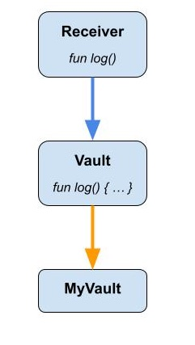
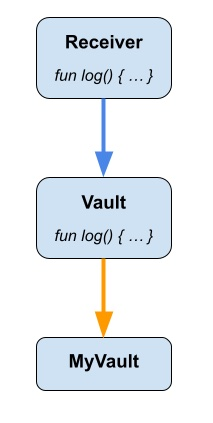
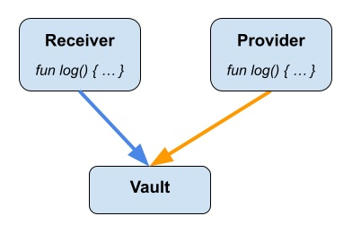
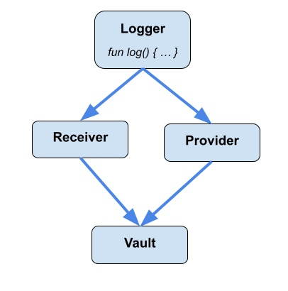

# FLIP 40: Interface inheritance in Cadence

## Objective

This FLIP proposes to allow interfaces to inherit other interfaces of the same kind.
This makes it easier for developers to structure their conformances and reduces a lot of redundant code.

## Motivation

Currently, concrete type implementations can conform to interfaces, but the interfaces cannot conform to other interfaces.
What this means is, an author of an interface has no way to mandate the implementations to conform to another interface.
The only way to enforce this at the moment is to duplicate all the fields, methods, and type requirements from
that other interface to the new interface.

e.g: Suppose there are two resource interfaces `Receiver` and `Vault`.

```cadence
pub resource interface Receiver {
    pub fun deposit(_ something: @AnyResource)
}

pub resource interface Vault {
    pub fun withdraw(_ amount: Int): @Vault
}
```

Suppose all implementations of the `Vault` would also need to conform to the interface `Receiver`.
Currently, there is no way to enforce this.

Anyone who implements the `Vault` would have to explicitly specify that their concrete type also implements the `Receiver`.
But it's not always guaranteed that all implementations would follow this informal agreement.

```cadence
pub resource MyVault: Vault, Receiver {

    pub fun deposit(_ something: @AnyResource) {}

    pub fun withdraw(_ amount: Int): @Vault {}
}
```

## User Benefit

Authors of interfaces would have the ability to mandate the implementations of their interfaces
to also conform to other interfaces.
They would no longer need to copy over methods, fields, or type requirements of other interfaces to their interface.
This also increases the re-usability of interfaces.

## Design Proposal

The solution proposed is to allow specifying interface conformance to interfaces. e.g:

```cadence
pub resource interface Receiver {
    pub fun deposit(_ something: @AnyResource)
}

pub resource interface Vault: Receiver {
    pub fun withdraw(_ amount: Int): @Vault
}
```

In the above example, the `Vault` interface conforms to the `Receiver` interface.
Anyone implementing the `Vault` interface would also have to implement the `Receiver` interface as well.

```cadence
pub resource MyVault: Vault {

    pub fun withdraw(_ amount: Int): @Vault {}

    pub fun deposit(_ something: @AnyResource) {}
}
```

The concrete type `MyVault` would not need to explicitly specify the `Receiver` interface conformance.
By conforming to the `Vault` interface, it is implicitly required to also conform to the `Receiver` interface.

```cadence
pub resource MyVault: Vault {

    pub fun withdraw(_ amount: Int): @Vault {}

    // Error: Missing implementation for `deposit(_ something: @AnyResource)` function.
}
```

However, having a chain of interface conformances would introduce some complexities.
Therefore, below restrictions apply for any interface inheritance.

### Duplicate interface members

When an interface implements another interface, it is possible for the two interfaces to have members
(functions, fields, and type requirements) with the same name.
It is important to resolve these ambiguities at the time of interface declaration (i.e: as early as possible),
rather than waiting for a concrete type declaration to face them when implementing that particular interface.
The following sections explain how to resolve these ambiguities for different scenarios.

#### Fields

If two fields of same kind (both are `let`, or both are `var`) have identical names, types and access modifiers,
then it will be valid to coexist, and will be treated as one field.

```cadence
pub resource interface Receiver {
    pub(set) var id: UInt64
}

pub resource interface Vault: Receiver {
    // `id` is a var-field that has the same type and access modifier as the `Receiver.id`.
    // Hence this is valid.
    pub(set) var id: UInt64
}
```

Otherwise, interface conformance is not valid.

```cadence
pub resource interface Receiver {
    pub(set) var id: Int
}

pub resource interface Vault1: Receiver {
    // `id` field is defined with `let` where as `Receiver.id` is defined with `var`.
    // Hence this is invalid.
    pub(set) let id: Int
}

pub resource interface Vault2: Receiver {
    // `id` field has a different type than the `Receiver.id`. Hence this is invalid.
    pub(set) var id: UInt64
}

pub resource interface Vault3: Receiver {
    // `id` field has `pub access modifer, where as `Receiver.id` as `pub(set)` access modifier.
    // Hence this is invalid.
    pub var id: Int
}
```

#### Functions

If two functions with identical names also have identical signatures, then it will be valid.

```cadence
pub resource interface Receiver {
    pub fun deposit(_ something: @AnyResource)
}

pub resource interface Vault: Receiver {

    // `deposit` function has the same signature as the `Receiver.deposit`.
    // Also none of them have any default implementations.
    // Hence this is valid.
    pub fun deposit(_ something: @AnyResource)
}
```

If the signatures of the two functions are different, then the interface conformance is not valid.

```cadence
pub resource interface Receiver {
    pub fun deposit(_ something: @AnyResource)
}

pub resource interface Vault: Receiver {
    // Error: `deposit` function has a different signature compared to the `Receiver.deposit`.
    // So these two cannot co-exist.
    pub fun deposit()
}
```

#### Functions with conditions

If the two functions with identical names and signatures have pre/post conditions, then it will still be valid.
However, the pre/post conditions would be linearized (refer [linearizing conditions section](#linearizing-conditions))
to determine the order of the execution of the conditions.
Given the pre/post conditions are `view` only, the order of execution would not have an impact on the conditions.

```cadence
pub resource interface Receiver {
    pub fun deposit(_ something: @AnyResource) {
        pre { self.balance > 100 }
    }
}

pub resource interface Vault: Receiver {

    // `deposit` function has the same signature as the `Receiver.deposit`.
    // Having pre/post condition is valid.
    // Both conditions would be executed, in a pre-determined order.
    pub fun deposit(_ something: @AnyResource) {
        pre { self.balance > 50 }
    }
}
```

#### Default functions

An interface can provide a default implementation to an inherited function.

<div style="text-align: left;">

</div>

```cadence
pub resource interface Receiver {
    pub fun log(_ message: String)
}

pub resource interface Vault: Receiver {
    // Valid: Provides the implementation for `Receiver.log` method.
    pub fun log(_ message: String) {
        log(message.append("from Vault"))
    }
}
```

However, an interface cannot override an inherited default implementation of a function.

<div style="text-align: left;">

</div>

```cadence
pub resource interface Receiver {
    pub fun log(_ message: String) {
        log(message.append("from Receiver"))
    }
}

pub resource interface Vault: Receiver {
    // Invalid: Cannot override the `Receiver.log` method.
    pub fun log(_ message: String) {
        log(message.append("from Vault"))
    }
}
```

It is also invalid to have two or more inherited default implementations for an interface.

<div style="text-align: left;">

</div>

```cadence
pub resource interface Receiver {
    pub fun log(_ message: String) {
        log(message.append("from Receiver"))
    }
}

pub resource interface Provider {
    pub fun log(_ message: String) {
        log(message.append("from Provider"))
    }
}

// Invalid: Two default functions from two interfaces.
pub resource interface Vault: Receiver, Provider {}
```

Having said that, there can be situations where the same default function can be available via different
inheritance paths.

<div style="text-align: left;">

</div>

```cadence
pub resource interface Logger {
    pub fun log(_ message: String) {
        log(message.append("from Logger"))
    }
}

pub resource interface Receiver: Logger {}

pub resource interface Provider: Logger {}

// Valid: `Logger.log()` default function is visible to the `Vault` interface
// via both `Receiver` and `Provider`.
pub resource interface Vault: Receiver, Provider {}
```

In the above example, `Logger.log()` default function is visible to the `Vault` interface via both `Receiver`
and `Provider`. Even though it is available from two different interfaces, they are both referring to the same
default implementation. Therefore, the above code is valid.

#### Conditions with Default functions

A more complex situation is where a default function is available via one inheritance path and a pre/post condition
is available via another inheritance path.

```cadence
pub resource interface Receiver {
    pub fun log(_ message: String) {
        log(message.append("from Receiver"))
    }
}

pub resource interface Provider {
    pub fun log(_ message: String) {
        pre { message != "" }
    }
}

// Valid: Both the default function and the condition would be available.
pub resource interface Vault: Receiver, Provider {}
```

In such situations, all rules applicable for default functions inheritance as well as condition inheritance
would be applied.
Thus, the default function from coming from the `Receiver` interface, and the condition comes from the `Provider`
interface would be made available for the inherited interface.

#### Types and event definitions

Type and event definitions would also behave similarly to the default functions.
Inherited interfaces can override type definitions and event definitions.

```cadence
pub contract interface Token {
    pub struct Foo {}
}

pub contract interface NonFungibleToken: Token {
    pub struct Foo {}
}

pub contract MyToken: NonFungibleToken {
    pub fun test() {
        let foo: Foo  // This will refer to the `NonFungibleToken.Foo`
    }
}
```

If a user needed to access the `Foo` struct coming from the super interface `Token`, then they can
access it using the fully qualified name. e.g: `let foo: Token.Foo`.

However, it is not allowed to have two or more inherited type/events definitions with identical names for an interface.

```cadence
pub contract interface Token {
    pub struct Foo {}
}

pub contract interface Collectible {
    pub struct Foo {}
}

// Invalid: Two type definitions with the same name from two interfaces.
pub contract NonFungibleToken: Token, Collectible {
}
```
Similar to default functions, there can be situations where the same type/event definition can be available
via different inheritance paths.

```cadence
pub contract interface Logger {
    pub struct Foo {}
}

pub contract interface Token: Logger {}

pub contract interface Collectible: Logger {}

// Valid: `Logger.Foo` struct is visible to the `NonFungibleToken` interface via both `Token` and `Collectible`.
pub contract interface NonFungibleToken: Token, Collectible {}
```

In the above example, `Logger.Foo` type definition is visible to the `NonFungibleToken` interface via both `Token`
and `Collectible`. Even though it is available from two different interfaces, they are both referring to the same
type definition. Therefore, the above code is valid.

However, if at least one of the interfaces in the middle of the chain also overrides the type definition `Foo`,
then the code becomes invalid, as there are multiple implementations present now, which leads to ambiguity.

```cadence
pub contract interface Logger {
    pub struct Foo {}
}

pub contract interface Token: Logger {
    pub struct Foo {}
}

pub contract interface Collectible: Logger {}

// Invalid: The default implementation of the `Foo` struct by the `Logger`
// interface is visible to the `NonFungibleToken` via the `Collectible` interface.
// Another implementation of `Foo` struct is visible to the `NonFungibleToken` via the `Token` interface.
// This creates ambiguity.
pub resource interface NonFungibleToken: Token, Provider {}
```

Many other languages that support multiple-inheritance also follow similar approaches, where inheritances that
cause ambiguities are rejected by the compiler (see: https://en.wikipedia.org/wiki/Multiple_inheritance).

### Linearizing Conditions

As mentioned in the [functions with conditions](#functions-with-conditions) section, it would be required to linearize
the function conditions, to determine the order in which pre- and post-conditions are executed.
This is done by linearizing the interfaces, and hence conditions, in a **depth-first pre-ordered manner, without duplicates**.

For example, consider an interface inheritance hierarchy as below:
```
       A
      / \
     B   C
    / \ /
   D   E

where an edge from X (top) to Y (bottom) means X inherits from Y.
```

This would convert to a cadence implementation as:

```cadence
struct interface A: B, C {
    pub fun test() {
        pre { print("A") }
    }
}
struct interface B: D, E {
    pub fun test() {
        pre { print("B") }
    }
}
struct interface C: E {
    pub fun test() {
        pre { print("C") }
    }
}
struct interface D {
    pub fun test() {
        pre { print("D") }
    }
}
struct interface E {
    pub fun test() {
        pre { print("E") }
    }
}
```

Any concrete type implementing interface `A` would be equivalent to implementing all interfaces from `A` to `E`, linearized.

```cadence
struct Foo: A {
    pub fun test() {
        pre { print("Foo") }
    }
}
```

The linearized interface order would be: [A, B, D, E, C].

i.e: same as having:
```cadence
struct Foo: A, B, D, C, E {
    pub fun test() {
        pre { print("Foo") }
    }
}
```

Thus, invoking `test` method of `Foo` would first invoke the pre-conditions of [A, B, D, E, C], in that particular order,
and eventually runs the pre-condition of the concrete implementations.

```cadence
let foo = Foo()
foo.test()
```

Above will print:

```
A
B
D
E
C
Foo
```

Similarly, for post-conditions, same linearization of interfaces would be used, and the post-conditions are executed
on the reverse order.
i.e: Replacing the `pre` conditions in above example with `post` conditions with exact same content, would result in an
output similar to:

```
Foo
C
E
D
B
A
```

### Interface Subtyping

When an interface `B` inherits from another interface `A`, `B` becomes a subtype of `A`.
This has the following implications on subtyping of restricted types and reference types.

#### Composite types

A composite type `S` which conforms to `B` is a subtype of restricted type `{A}`.

```cadence
struct interface A {}

struct interface B: A {}

struct S: B {}

var s1: S = S()

var s2: {A} = s1    // `S` conforming to `B`, is a subtype of `{A}`
```

#### Restricted types

A restricted type `{B}` is a subtype of restricted type `{A}`.

```cadence
struct interface A {}

struct interface B: A {}

struct S: B {}

var s1: {B} = S()

var s2: {A} = s1    // `{B}` is a subtype of `{A}`
```

A restricted type `{B, C, D}` where atleast one of `B`, `C` and `D` inherits from `A`, is a subtype of restricted type `{A}`.

```cadence
struct interface A {}

struct interface B: A {}

struct interface C {}

struct interface D {}

struct S: B, C, D {}

var s1: {B, C, D} = S()

var s2: {A} = s1    // `{B, C, D}` is a subtype of `{A}`
```

#### Reference types

A restricted reference type `&{B}` is a subtype of restricted reference type `&{A}`.

```cadence
struct interface A {}

struct interface B: A {}

struct S: B {}

var s1: &{B} = S() as &{B}

var s2: &{A} = s1    // `&{B}` is a subtype of `&{A}`
```

### Drawbacks

One drawback is, as mentioned in the above section, when there are complex inheritance chains with default functions
being available from multiple paths, overriding a default function by an interface in the middle of the chain
can lead to breaking the downstream codes that depend on this interface.

Disallowing multiple default implementations is done to avoid ambiguity and any unintuitive behaviors for the developers.
But it can also be argued that this can defeat the purpose of default functions: which is to avoid breaking downstream
dependencies.

### Alternatives Considered

#### Function with conditions

Another way to handle multiple inherited functions with conditions is to let a function at a lower level of the
inheritance chain override a condition at a higher level. However, it may not be safe to do so, as some
interfaces enforce certain restrictions through pre/post conditions, and overriding them is not desired.

#### Ambiguous default functions

An alternative solution for resolving ambiguity caused by having multiple default implementations is to order/linearize
the default functions in some way, and pick the 'closest' one to the current interface/concrete-type (i.e: the type that
faces the ambiguity). However, this has some disadvantages:
 - If the default functions in question have side effects (e.g: mutate state), then picking only one of them may result
   in unintended behaviors.
 - The chosen default implementation may not be obvious to the user. That will lead to surprising behaviors for the user.
 - Already disregarded this option for default functions ambiguity resolution in concrete type implementations.
   (They also behave very similarly to what is proposed in this FLIP)

### Performance Implications

None

### Dependencies

None

### Engineering Impact

This change has moderate implementation complexity.
Interface conformance for composite types (structs, resources, and contracts) is already implemented.
Interface inheritance can also follow the same approach, but may need additional work to handle complexities
in multiple inheritance, etc.

### Compatibility

Proposed changes are backward compatible.

### User Impact

This is a new feature addition, hence has no impact on the existing contracts.

## Related Issues

None

## Prior Art

- Many of the existing object-oriented languages such as C++, Go, Java, Kotlin, etc. supports interface inheritance.
- These languages also already deal with the complexities that come with multiple inheritance:
https://en.wikipedia.org/wiki/Multiple_inheritance
