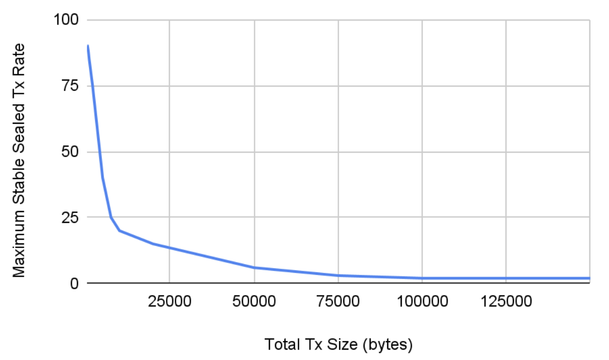
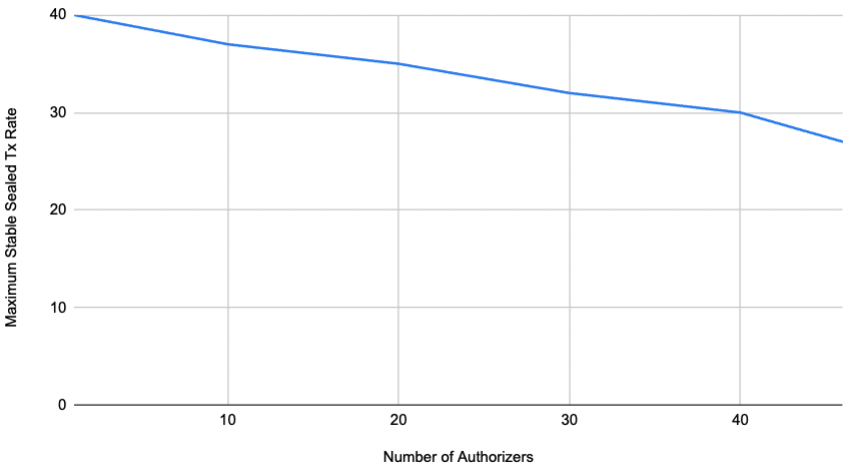
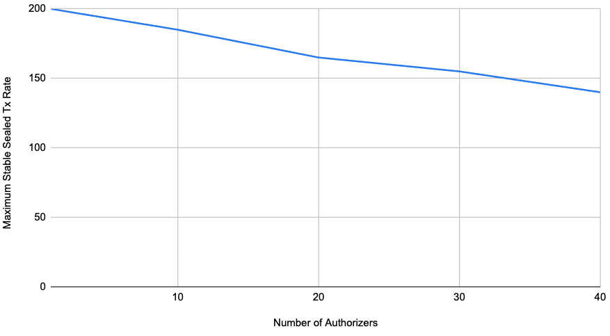
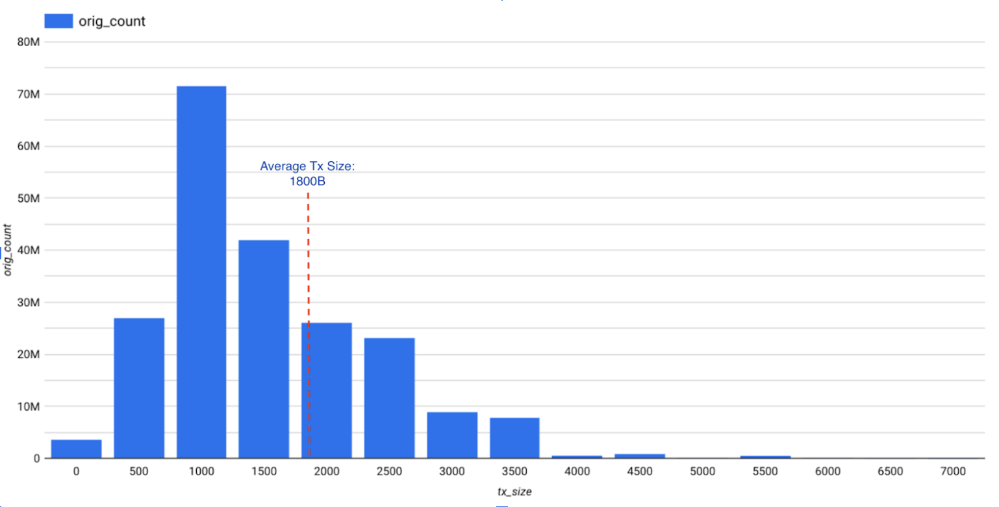

## Dynamic Inclusion Fees

#### Motivation

As mentioned in the FLIP of [Variable Transaction Fees](https://github.com/onflow/flow/blob/master/flips/20211007-transaction-fees.md): 
> Transaction fees should allow the Flow blockchain to self-regulate transaction throughput in a way where it would always tend to the optimum throughput. Fees should also discourage malicious actors from trying to destabilize the network by sending computationally or network heavy transactions, as the transaction fees on such transactions would be appropriately higher. 

Inclusion fee is part of the total fee of one transaction. It is meant to cover all costs of one transaction’s handling except for the execution part, which will be charged as the execution fee. Inclusion fee is supposed to cover resource utilization (network transmission, memory usage etc.) overhead after one transaction is submitted. Inclusion fee must be calculated without one transaction being executed.

The goal of this proposal is to come up with a formula incentivizing developers to create simpler transactions which will cost less, compared with more complex ones.

> 💬 We are not looking for perfectly precise math models this time, instead we are looking for a simple equation to calculate inclusion fees to reflect relative potential inclusion effort of a given transaction, including network transmission, memory usage etc. 

#### Proposal

In this FLIP we propose to replace the existing consistent inclusion fee charge into a dynamic charging pattern, in which total size of a transaction and its number of authoriers(signatures) will be factored in:

  = 287.1 * (6.39e-7 * **TxByteSize** + 3.29e-5 * **NumOfSignature** + 0.0023) * 1e-6 FLOW

Details on how we collect metrics, how the final equation is derived and validated will be elaborated in the rest part of this FLIP. 

> 💬 Mathematical terms in this FLIP are from [this parent FLIP](https://github.com/onflow/flow/blob/master/flips/20211007-transaction-fees.md#terminology).

#### How Transactions are Created in Load Test

To get performance metrics with a batch of fixed-sized transactions, we need to compose such transactions that we can control each of their:

* Total transaction size
* Number of signatures 
* Number of keys of payer
* Argument size
* Comment size

In [PR 2816](https://github.com/onflow/flow-go/pull/2816), we added this feature in the loader app. We first add all indicated number of signatures and keys of payer, compose transaction argument string, and at last leave all remaining bytes as comments. When these transactions are ready, the loader app will submit them to a given access cluster with give TPS.

#### How Transaction Size is Calculated

According to our [code](https://github.com/onflow/flow-go/blob/master/engine/access/rest/models/model_transaction.go#L11), we should consider these variant fields when calculating the total size of a given transaction:

* Byte size of transaction code
* Number of Signatures
* Authorizer/payer keys

The above fields are the only available information of one transaction which we can use to calculate inclusion fees, because we have to calculate it without executing one transaction.

However in the BigTable storing mainnet transactions dapperlabs-data.production_ddp_flow_on_chain_data_v2.transactions, there’s no information about number of keys per authorizer\payer, we will have to exclude that field from our mathematical modeling. And since we are only looking for estimated calculation instead of a precise modeling, plus that number of keys per authorizer\payer is not a major part of one given transaction, we don’t treat it as a blocking issue for our metrics collection.

#### Metrics Collection

We created a new loader type ([PR 2816](https://github.com/onflow/flow-go/pull/2816)) to generate fixed-sized (configurable) empty transactions to localnet and canary to check the stable peak TPS, as the max number of transactions that targeted network is able to handle (a.k.a the network saturation point).

We checked localnet, benchnet and canary to collect metrics. Except that benchnet failed to give stable peak TPS metrics (more details in the Limitation section below), both localnet and canary demonstrate a rough **Inverse** relationship between the total size of each transaction(all transactions in the same load test have the same size) and the stable peak TPS.

<i>chart for metrics from localnet</i>

<i>chart for metrics from canary</i>

Number of Signatures(one key for each authorizer) also demonstated a significant impact to TPS:

 
<i>chart for metrics from localnet</i>

 
<i>chart for metrics from canary</i>

#### Data Modeling

Assuming that with given configuration, relative inclusion fee is simply the inverse of stable peak TPS, and for the number of signatures, we want to charge it linearly by that number, now we have below linear equation, in which C1, C2, C3 are the constant coefficients in the equation:

 =  C1 * TxByteSize + C2 * NumOfSignature + C3

We used some existing math tool ([LINEST from Google Sheet](https://support.google.com/docs/answer/3094249?hl=en) in our case), plugging in the metrics data we collected (simply deriving the inclusion fee by 1.0/TPS) from canary and we got the equation below. The reason we use canary data to derive the equation is that its hardware\network configuration is closer to mainnet compared with localnet.

 =  6.39e-7 * TxByteSize + 3.29e-5 * NumOfSignature + 0.0023

We’d like to charge average sized transactions by 1.0 factor (1e-6 FLOW), which means we are trying to keep inclusion fees of average sized transactions the same as before. According to [this](https://console.cloud.google.com/bigquery?sq=1039464903934:01f22b6020e1403690eeb67822d56c87) BigQuery, we can tell that the average size of production transactions are around 1800B, and according to [this](https://console.cloud.google.com/bigquery?sq=1039464903934:8ce5d7d1677a4c5d99aa3341b46375cd) BigQuery, majority of transaction only have 1 authorizers, unfortunately on GCP we don't record number of keys per authorizer, so we are assuming that there's only one key for each authorizer. After plugging these data into the equation above and now we have the final equation as below:

 =  287.1 * (6.39e-7 * TxByteSize + 3.29e-5 * NumOfSignature + 0.0023)

#### Model Validation

To make sure our mathematical model above works as expected with real mainnet transactions, we ran the equation against sampled transactions in BigQuery where our recent production transactions are stored.

* New Inclusion Fee calculation in BigQuery

    From [this](https://console.cloud.google.com/bigquery?sq=1039464903934:9f7c25b503cf4fcdaf2301d2e51f539b) BigQuery where we calculate new inclusion fees for sampled transactions with different sizes, we can see that the new inclusion effort of transactions around 1800B are around 1.0 (or 1e-6 FLOW), and the smaller one tx is, the less the inclusion fee is, and vice versa. Listing several pieces of the result as below. Note that there's no number of keys per authorizer info on BigTable.

Transaction with size less than average

| Tx Size(Bytes) | Num of Auth | New Inclusion Effort |
|:----------:|:-------------:|:-------------:|
| 742	| 1	| 0.8059 |
| 757	| 1	| 0.8086 |
| 763	| 1	| 0.8097 |
| 766	| 1	| 0.8103 |
| 767	| 1	| 0.8104 |

Transaction with size around average

| Tx Size(Bytes) | Num of Auth | New Inclusion Effort |
|:----------:|:-------------:|:-------------:|
| 1756	| 1	| 0.9919 | 
| 1786	| 1	| 0.9974 | 
| 1804	| 3	| 1.0196 | 
| 1816	| 1	| 1.0029 | 
| 1843	| 2	| 1.0173 | 

Transaction with size above average

| Tx Size(Bytes) | Num of Auth | New Inclusion Effort |
|:----------:|:-------------:|:-------------:|
| 3386	| 1	| 1.2909 | 
| 3387	| 1	| 1.2911 | 
| 3412	| 2	| 1.3051 | 
| 3412	| 1	| 1.2957 | 
| 3418	| 1	| 1.2968 | 

* Min\Max charges

    Given the new inclusion fee calculation, we also want to know the extreme cases when 1) transaction is empty (minimal tx) and 2) transaction size reaches the limit.
<ol><ol>
<li>Inclusion Fee of Empty Transaction</li>

        Inclusion Effort(empty tx)
            = 287.1 * (6.39e-7 * 0 + 3.29e-5 * 1 + 0.0023)
            = 0.6697
After applying this new inclusion effort onto the existing inclusion effort charge(1e-6 FLOW), we get 1e-6 * 0.6697 as the new charge.
<li>Inclusion Fee of Maximal Transaction</li>

According to the [code](https://github.com/onflow/flow-go/blob/master/model/flow/constants.go#L32), the max possible byte size of one transaction is 1500000B, and if we simply set the number of signatures as the currently max value of authorizers, 14, in our BigQuery, now we have:

        Inclusion Effort(largest tx possible) 
            = 287.1 * (6.39e-7 * 1500000 + 3.29e-5 * 14 + 0.0023)
            = 275.9779

After applying this new inclusion effort onto the existing inclusion effort charge(1e-6 FLOW), we get 1e-6 * 275.9779 as the new charge.
</ol></ol>

* New inclusion fees for different types of transactions

    It will also be useful to see inclusion fee changes with the new equation, for some typical types of transactions we have. We are assuming there is only one signature in these transactions which is the most common scenario. Assuming all calculation below has only 1 signature.
<ol>
<ol>
<li>Create Account transaction</li>

Cadence script we use for the calculation: [link](https://github.com/onflow/flow-go/blob/master/integration/benchmark/scripts/createAccountsTransaction.cdc) - size: 984B

        New inclusion effort
        = 287.1 * (6.39e-7 * 984 + 3.29e-5 * 1 + 0.0023)
        = 0.8503

The new fee is roughly **15% less** than the existing inclusion charge (1e-6 FLOW) 	

<li>Token transfer transaction</li>

Cadence script we use for the calculation: [link](https://github.com/onflow/flow-go/blob/master/integration/benchmark/scripts/tokenTransferTransaction.cdc) - size: 718B

        New inclusion effort
        = 287.1 * (6.39e-7 * 718 + 3.29e-5 * 1 + 0.0023)
        = 0.8015

The new fee is roughly **20% less** than the existing inclusion charge (1e-6 FLOW)

<li>NFT transfer transaction</li>

Cadence script we use for the calculation: [link](https://github.com/onflow/flow-go/blob/master/fvm/fvm_bench_test.go) - size 818B

        New inclusion effort
        = 287.1 * (6.39e-7 * 818 + 3.29e-5 * 1 + 0.0023)
	    = 0.8198

The new fee is roughly **18% less** than the existing inclusion charge (1e-6 FLOW)

</ol>
</ol>

* Distribution of mainnet transaction sizes and their inclusion fees

	For understanding purposes, the mainnet transaction size distribution is also helpful (BigQuery [link](https://console.cloud.google.com/bigquery?sq=1039464903934:d43331c4103048c5886ec74feb2f2bc8)). Its histogram is as below:

    

    So most transactions are with sizes between 500 - 2000 bytes, and there are much fewer number of transactions with sizes above 4000B. The average transaction size from our mainnet is 1800B, which is marked on the diagram too. We used this value to calibrate our inclusion fees as mentioned above.
     

* Distribution of mainnet number of authorizers

	From [BigQuery](https://console.cloud.google.com/bigquery?sq=1039464903934:8ce5d7d1677a4c5d99aa3341b46375cd&project=dapperlabs-data) querying all our mainnet transactions, we can see the distribution of number of authorizers in below table:

| Number of Authorizers | Count of Transactions |
|:----------:|:-------------:|
| 1 |	216049901 |
| 2 |	41611744 |
| 3 |	7548509 |
| 4 |	1843914 |
| 5 |	869991 |
| 6 |	528975 |
| 7 |	442313 |
| 8 |	403601 |
| 9 |	272371 |
| 10 |	119965 |
| 11 |	181782 |
| 14 |	53 |

#### Limitations

* Using metrics from canary to estimate mainnet fees.
Since we were using the loader app to stress test certain environments (localnet, canary), it is impractical to run a similar stress test to mainnet which will impact production traffic. Thus, we are only able to apply the mathematical equation derived from those environments to mainnet directly. It is fine in our use cases because we are not looking for precise mathematical calculation to new inclusion fees, and we are looking for a better calculation than the current constant inclusion charge: we should charge less for smaller transactions and more for bigger transactions. So as long as the new equation demonstrates this characteristic on production transactions, we will treat it as a working math model.

* Benchnet didn’t give stable peak TPS metrics.
We also tried the loader app on benchnet configurations. However the existing benchnet didn’t give us stable peak TPS and it made it unusable to collect performance related metrics. The reason is still under investigation, but since we were still able to get metrics from canary, it is not a blocking issue for us.

* Other factors impacting stable peak TPS.
In our benchmark testing on both localnet and canary environments, we actually also found that number of keys can also impact the stable peak TPS. However the actual impact measured from data collection was not major enough for us to include it into the equation.

* More descriptive Cadence code will be discouraged.
For most cases, Cadence code takes a big portion of one transaction. With transaction size as one factor to charge for inclusion fees, it may discourage Cadence authors to write less readable and descriptive smart contract code on Flow.

**Future Work**

* Collecting more data points for a more accurate model.
Due to the limitation mentioned, it was quite a cumbersome process to collect even one single performance metrics data point, so we were only able to collect a limited amount of data for modeling purposes. We don’t need a super precise model for now, but if in the future when higher precision is required, we will need to collect more data to support the precision we want from a model.

* Self-adaptive Inclusion Fee model.
In this FLIP we propose a fixed-coefficient linear equation, however the hardware configuration, network capabilities and even Flow itself may change. In these cases, the coefficients we have now may not give optimal inclusion fee calculations accordingly. It will be ideal if we can have a self-adaptive mechanism, to automatically adjust parameters of the inclusion fee model, to continuously produce appropriate inclusion fee calculation.

* Checking balance of payer to see if  Inclusion Fees can be covered in access\collection nodes.
When we have a dynamic inclusion fee, we will have to check if a certain payer’s account balance can cover this new inclusion fee.

* Non-linear Inclusion Fees Calculation for extra large transactions.
We might want to charge extra more, like quadratically for super large transactions, whose total size exceeds a certain cutoff size, to encourage people to keep their transaction size within a reasonable limit. Transaction smart contract code compress may be something worth investigation.

* More infrastructure setup is nice-to-have for easier metrics collection in future.
As previously mentioned, for almost all existing testing environments(localnet, benchnet, canary), we had to do a trial-and-error method to collect one stable peak TPS with a given configuration. This process is a very cumbersome manual process and it does not scale with the number of metrics to collect. So in future when we need to collect similar metrics, we may want to have an easier or even automated process. It will enable us to collect relatively comprehensive metrics data for our future data related work. At the time of writing, the automation team has been actively working on this already.

#### References
* Parent FLIPs
[https://github.com/onflow/flow/blob/master/flips/20211007-transaction-fees.md](https://github.com/onflow/flow/blob/master/flips/20211007-transaction-fees.md) 
[https://github.com/onflow/flow/blob/master/flips/20220111-execution-effort.md](https://github.com/onflow/flow/blob/master/flips/20220111-execution-effort.md)

* Github Issue
[Localnet\Canary Inclusion Fees measurements](https://github.com/onflow/flow-go/issues/2850)
