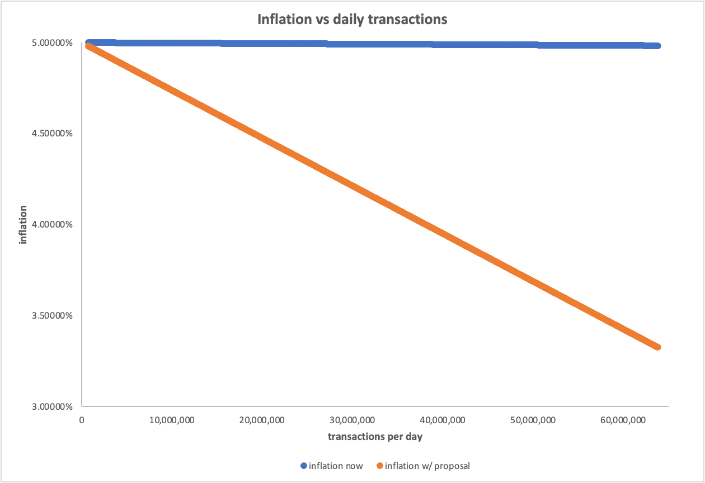

# FLIP-74: Revisiting Flow Transaction fee

| Status        | Proposed                                            |
:-------------- |:---------------------------------------------------- |
| **FLIP #**    | [74](https://github.com/onflow/flow/pull/74)
| **Author(s)** | Kshitij Chaudhary (kshitij.chaudhary@dapperlabs.com)           | 
| **Sponsor**   | Kshitij Chaudhary (kshitij.chaudhary@dapperlabs.com) |
| **Updated**   | 2023-03-23                                           |

## **Introduction**

In October 2021, with [FLIP-660](https://github.com/onflow/flow/blob/c05d847adf2f6fb509e42c17020484d7dd3e89bd/flips/20211007-transaction-fees.md) it was determined that the transaction fees on Flow should be proportional to the cost of effort to the network imposed by deployment of resources such as CPU and bandwidth. Fees were broken down into [three components](https://developers.flow.com/learn/concepts/variable-transaction-fees) - ‘*Inclusion Fee*’ that accounts for the resources required to process a transaction due to the transaction’s core properties (byte size, number of signatures); ‘Execution Fee’ that accounts for the operational cost of running the transaction script, processing the results, sending results for verification, generating verification receipt, etc; and a *Surge* factor as a multiplicative factor to dynamically account for network pressure and market conditions.

Despite the trifurcation however, transaction fees on Flow continue to remain incredibly low, posing threats of network attack, and potentially dis-balancing demand for transaction processing against network-capacity in future. This FLIP proposes an increase in transaction fee and seeks community feedback on the proposed changes.

## **Problem Statement**

**Low transaction fee poses threats of attack, necessitates continued token-issuance by the protocol (inflation), and makes FLOW use-cases seem peripheral vis-a-vis other networks.**

In early days of the Flow network, when the number of transactions were fewer, transaction fees were intentionally kept low to encourage network usage. Today however, with Flow’s purpose-built compute platform and web3 utility for the masses driving a growing user-base (18M+ accounts) on the network consistently sending 6M+ transactions in an epoch (week), there is a need to revisit the fees.

Today, the cost of attacking Flow with an inordinate number of transactions is incredibly low, making the network susceptible to attack by malicious actors. Additionally, as exhibited in the table below, despite ~900K daily transactions (sometimes exceeding 1M), total weekly fee collection (~50 FLOW) accounts for merely 0.004% of epoch rewards ([1.3M+ FLOW tokens](https://flowscan.org/staking/history)) paid out to node operators and delegators. During rewards pay-out, the protocol first draws from the transaction fee pool, thereafter issuing new tokens to achieve the target reward rate for each epoch ([explained here](https://developers.flow.com/nodes/staking/schedule)). Low fee collection thus remains a key factor behind Flow’s 5% annual inflation. *Note that a detailed discussion on Flow inflation is out-of-scope for this FLIP and will be comprehensively addressed in a separate proposal.*

Finally, Flow’s low transaction fee unfortunately makes FLOW use-cases less perceptible to many users. Competing networks such as Solana, NEAR and Avalanche for instance have 300x, 450x, and 1,300x average fee per transaction respectively vis-à-vis Flow, while on ETH, the average fee is ~480,000x (see table below). Given FLOW’s multiple use-cases including staking, delegating, paying transaction fees, paying storage fees, trading assets and participating in experiences built on Flow, it is crucial that FLOW token’s utility is priced appropriately to reflect and surface its value-proposition to users.

| Network | Daily total txns (est.) | Daily total fee (~$) | Avg fee/ txn (~$) | V/s Flow txn fee |
| --- | --- | --- | --- | --- |
| Avalanche | 2,000,000 | $ 22,375 | $ 1.12E-02 | 1,324 times |
| Bitcoin | 305,700 | $ 296,060 | $ 9.68E-01 | 114,612 times |
| BNB | 2,800,000 | $ 551,696 | $ 1.97E-01 | 23,318 times |
| Cardano | 77,300 | $ 9,599 | $ 1.24E-01 | 14,696 times |
| ETH | 1,000,000 | $ 4,063,415 | $ 4.06E+00 | 480,882 times |
| NEAR Protocol | 420,000 | $ 1,594 | $ 3.80E-03 | 449 times |
| Solana | 17,690,000 | $ 44,206 | $ 2.50E-03 | 296 times |
| Flow | 947,558 | $ 8.01 | $ 8.45E-06 | N/A |
1. *Market prices used are Year-to-date (YTD) moving averages*
2. *Average fee per transaction is calculated by daily total fee/ daily total transactions*
3. *The last column simply divides average transaction fee for a network to the average transaction fee on Flow* 

## **Proposal**

**Today**, the functional specification of transaction fee on Flow looks as follows.

**Transaction fee = {inclusion fee + (execution effort * unit cost)} x surge**

- *Inclusion fee = 1E-6 FLOW (currently constant, but [dynamic inclusion fee FLIP](https://forum.onflow.org/t/flip-dynamic-inclusion-fees/3700) was proposed last year);*
- *Execution Effort Unit Cost = 4.99E-08 FLOW (currently constant);*
- *Surge = 1.0 (currently constant);*
- *Execution Effort is variable based on transaction type, as [shown here](https://github.com/onflow/flow/blob/c05d847adf2f6fb509e42c17020484d7dd3e89bd/flips/20220111-execution-effort.md).*

**The proposal** entails the addition of a new multiplier, alongside the surge multiplier, to the transaction fee calculation, resulting in the following formula:

**Transaction fee = {inclusion fee + (execution effort * unit cost)} x surge x T**
 
- Presently, the Flow network fundamentally supports the dynamic adjustment of transaction fees in response to network congestion. The surge factor (`S`) facilitates fee modifications during periods of network congestion, ensuring optimal network functionality. Although currently fixed at `1.0`, adjustments to this value can be proposed through a FLIP in response to sustained periods of high network demand and saturation.
- While the surge factor accounts for network usage, it is agnostic of economic conditions. Introducing a Transaction Fee Multiplier (`T`) alongside the existing surge factor would enhance the adaptability and responsiveness of transaction fees to economic conditions in addition to network saturation. It would cater to future requirements for adjusting the unit cost of transactions on Flow in response to market forces. Keeping the multiplier separate, ensures transparency, ease of understanding, and readability of the formula for our community members.
- **The value of `T` will be set at 100** to increase the transaction fee by 100 times compared to the current rate, thus increasing costs of each transaction by 100x as shown in the table below.

| Transaction type | Effort | Current fee (FLOW) | Proposed fee (FLOW) | Proposed increase |
| --- | --- | --- | --- | --- |
| Empty Transaction (inclusion fee only) | 0 | 1.00E-06 | 1.00E-04 | 100 times |
| Create 1 account | 43 | 3.15E-06 | 3.15E-04 | 100 times |
| Create 10 accounts | 433 | 2.26E-05 | 2.26E-03 | 100 times |
| Add key to account | 0 | 1.00E-06 | 1.00E-04 | 100 times |
| FT transfer | 17 | 1.85E-06 | 1.85E-04 | 100 times |
| Deploying a 50kB contract | 574 | 2.96E-05 | 2.96E-03 | 100 times |
| Mint a small NFT | 18 | 1.90E-06 | 1.90E-04 | 100 times |

## Impact

First, if the proposal is accepted and implemented, users would pay a 100x transaction fee vis-à-vis today. Simply put, minting 1 million small NFTs on Flow costs ~1.9 FLOW today; with increased fee however, users would have to pay ~190 FLOW for such volume. By generally increasing the cost of mass attack by 100x, the proposal is aimed at disincentivizing malicious actors and enhancing network’s security and resilience against attacks.

Second, while this proposal by itself will only marginally reduce inflation (from ~5% to ~4.98%), it is a crucial step in the direction of addressing inflation on Flow in the long-term. As an example, the graph below exhibits the inflation rate with status-quo vis-a-vis with proposed fee increase, demonstrating a meaningful reduction in inflation if number of transactions grow multifold (ceteris paribus). Besides increased TPS however, a pragmatic approach that revisits other factors such as minimum staking requirements and annual yields would help guide lower inflation on Flow, to be explained and addressed in a separate FLIP soon.

Third, this change would make FLOW’s use-cases more perceptible and established, further accentuating its stature as a token of value. The table below shows the average transaction fees of various networks vis-a-vis Flow in the current and proposed scenarios. Simply put, for every dollar that users would pay to transact on the Flow network, they currently pay $450 on NEAR, $300 on Solana, and $480,000 on ETH - for the same transaction(s). This differential would reduce 100x with the approval and implementation of this proposal, yet even with the implementation of the new fee structure, Flow would continue to remain an economically attractive network to transact on. Note that given FLOW market price’s high correlation with the listed tokens’ prices (”R” averaging 0.8+), even a change in FLOW token price or stochastic market volatility would not substantially alter the competitiveness of the proposed Flow fees compared to other networks, as can be seen in the last two columns of the table below.

| Network | Current Avg txn fee | Current Multiple v/s Flow | Proposed avg txn fee | Proposed Multiple v/s Flow | Expected Multiple if FLOW/$ changes |
| --- | --- | --- | --- | --- | --- |
| ETH | $ 4.06E+00 | 480,882 times | $ 4.06E+00 | 4,808 times | 4,040 times |
| BSC | $ 1.97E-01 | 23,318 times  | $ 1.97E-01 | 233 times | 182 times |
| Bitcoin | $ 9.68E-01 | 114,612 times  | $ 9.68E-01 | 115 times | 940 times |
| Solana | $ 2.50E-03 | 296 times  | $ 2.50E-03 | 3 times | 2.4 times |
| Avalanche | $ 1.12E-02 | 1,324 times  | $ 1.12E-02 | 13 times | 10.6 times |
| Cardano | $ 1.24E-01 | 14,696 times  | $ 1.24E-01 | 147 times | 120.5 times |
| NEAR | $ 3.80E-03 | 449 times  | $ 3.80E-03 | 4.5 times | 3.4 times |
| FLOW | $ 1.21E-05 | N/A  | $ 1.21E-03 | N/A | N/A |

## **Final Word**

Transaction fees offer many benefits in Flow network’s economic design, including compensating the node operators for the resources deployed to process transactions and secure the network, protecting the network against spamming attacks, and generating long-term stability in the Flow economy via reduced inflation. In a mature state, transaction fees should allow the Flow blockchain to self-regulate transaction throughput in a way where it would always approach optimal throughput. This proposal however is meant to be a starting point for community discussions on how an increase in inclusion fees and unit cost of execution effort could lead to network-wide benefits including economically deterring network attacks and strengthening the overall FLOW economy. The community is invited to share feedback on this post and help shape the economics of FLOW.

## **Appendix 1**

**Comparison** **of** **Flow v/s Solana transaction fees (current scenario) for specific transaction types**

The table below demonstrates how Solana fees associated with different transaction types fare against Flow today, ranging from ~100x for empty transactions to 3x for an average contract deployment. 

|  | Flow txn fee (US$) | Solana txn fee (US$) | SOL : Flow fee ratio |
| --- | --- | --- | --- |
| Empty Transaction | 1.11E-06 | 1.09E-04 | 98 X |
| Create 1 account | 3.49E-06 | 1.09E-04 | 31 X |
| Create 10 accounts | 2.51E-05 | 1.09E-03 | 44 X |
| Add key to account | 1.11E-06 | 1.09E-04 | 98 X |
| FT transfer | 2.05E-06 | 1.09E-04 | 53 X |
| Deploying a 50kB contract | 3.29E-05 | 1.09E-04 | 3 X |
| Mint a small NFT | 2.11E-06 | 1.09E-04 | 52 X |
1. *Note that Solana also has a [prioritization fees](https://docs.solana.com/terminology#prioritization-fee) which is not considered in the analysis below but is paid by ~48% of non-voting transactions.*
2. *Assumed 1 signature per transaction & Solana’s fee of 5000 Lamports per signature, where 1 Lamport = 1E-9 SOL; and 1SOL = US$ 21.07 (YTD moving average of SOL/US$ market price)*
3. *To create 10 accounts, 10 signatures for creation of 10 accounts were assumed*
4. *Solana-Flow multiple is calculated by dividing Solana txn fee for a transaction type by Flow txn fee for the same type*

## Appendix 2

**Resources**

[https://developers.flow.com/learn/concepts/variable-transaction-fees](https://developers.flow.com/learn/concepts/variable-transaction-fees)

[https://developers.flow.com/nodes/staking/schedule#rewards-distribution](https://developers.flow.com/nodes/staking/schedule#rewards-distribution) 

[https://docs.solana.com/transaction_fees#basic-economic-design](https://docs.solana.com/transaction_fees#basic-economic-design)

[https://docs.solana.com/terminology#prioritization-fee](https://docs.solana.com/terminology#prioritization-fee) 

[https://forum.onflow.org/t/flip-dynamic-inclusion-fees/3700](https://forum.onflow.org/t/flip-dynamic-inclusion-fees/3700) 

[https://github.com/onflow/flow/blob/c05d847adf2f6fb509e42c17020484d7dd3e89bd/flips/20220111-execution-effort.md](https://github.com/onflow/flow/blob/c05d847adf2f6fb509e42c17020484d7dd3e89bd/flips/20220111-execution-effort.md)

[https://cryptofees.info/](https://cryptofees.info/)

[https://www.theblock.co/data/scaling-solutions/evm-chains-stats/transaction-count-for-evm-chains](https://www.theblock.co/data/scaling-solutions/evm-chains-stats/transaction-count-for-evm-chains)

[https://app.artemis.xyz/dashboard](https://app.artemis.xyz/dashboard)

[http://www.coinmarketcap.com](http://www.coinmarketcap.com/)

[https://ycharts.com/indicators/bitcoin_average_transaction_fee](https://ycharts.com/indicators/bitcoin_average_transaction_fee)

[https://docs.bnbchain.org/docs/overview](https://docs.bnbchain.org/docs/overview)

[https://solanacompass.com/statistics/fees](https://solanacompass.com/statistics/fees)

[https://beta-analysis.solscan.io/public/dashboard/06d689e1-dcd7-4175-a16a-efc074ad5ce2](https://beta-analysis.solscan.io/public/dashboard/06d689e1-dcd7-4175-a16a-efc074ad5ce2) 

[https://solscan.io/](https://solscan.io/)
