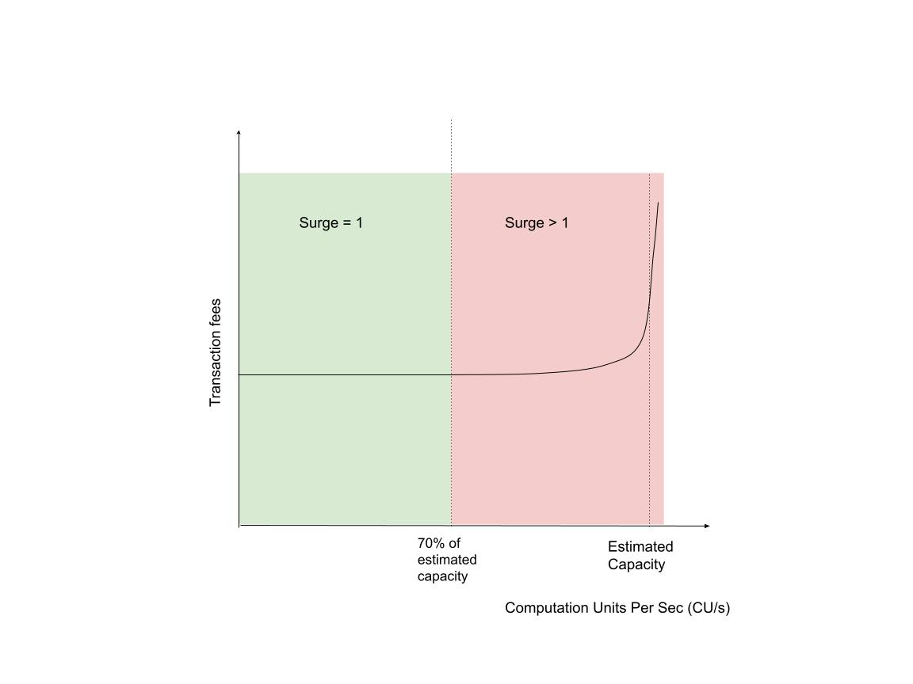

# FLIP 336: Dynamic Transaction Fees

## Introduction

As the Flow network scales, it is important that transaction fees evolve to reflect network usage and support long-term sustainability. While the current fee structure has successfully minimized friction for users and developers, it does not respond to changes in demand or congestion. This limits Flow’s ability to manage load, align incentives, and reduce reliance on token issuance.

This proposal introduces a surge pricing mechanism using the existing surge factor code in the [FlowFees](https://github.com/onflow/flow-core-contracts/blob/master/contracts/FlowFees.cdc) contract. The surge factor is already implemented on-chain in anticipation of this usage but has remained fixed at 1.0 since inception. This FLIP proposes actively adjusting it to reflect network conditions. The goal is to provide a simple, transparent model that enables congestion management, promotes network health, and lays the foundation for a sustainable, inflation-minimizing fee structure. Initially, surge pricing will be applied manually by the Service Committee and, over time, will transition to automatic, on-chain adjustment.

## Problem Statement

Flow’s current transaction fee model consists of an inclusion fee and an execution fee, both intentionally kept low to support adoption. While this has reduced onboarding friction, it creates limitations as the network scales:

Flow’s fee structure does not adjust based on real-time activity. All transactions are charged the same fee regardless of congestion. While Flow avoids prioritizing transactions by fee, the absence of a congestion-aware mechanism limits the network’s ability to nudge user behavior i.e. discouraging usage during peaks or encouraging it during off-peak periods.

Surge pricing can address this issue while maintaining Flow’s principles around fairness and accessibility.

## Proposal

This FLIP proposes activating and dynamically adjusting the existing surge factor defined in the `FlowFees` contract to respond to real-time network load. Although the surge factor is part of Flow's fee computation logic, it is currently fixed at 1.0 and has not been used in practice.

This proposal introduces a framework for setting the surge factor in a way that makes the network more responsive to network usage and sets the foundation for a sustainable, inflation-minimizing fee system. Initially the model will be applied manually, and later implemented algorithmically.

### 1. Surge Pricing Model

Transaction fees on Flow are calculated as:

```

Transaction Fee = (Inclusion Fee + Execution Fee) × Surge Factor

```

This logic is already implemented in the [FlowFees contract](https://github.com/onflow/flow-core-contracts/blob/master/contracts/FlowFees.cdc), and the [SurgeFactor](https://github.com/onflow/flow-core-contracts/blob/master/contracts/FlowFees.cdc#L61) field is stored on-chain. This FLIP does not propose changing the formula, but instead proposes adjusting the multiplier dynamically.

The proposed model uses the ratio of observed [computation units (CU)](https://developers.flow.com/build/basics/transactions#gas-limit) per second to the estimated computation capacity per second as the core signal. The estimated capacity is a performance benchmark informed by current network measurements.

```
Utilization Ratio (U) = Observed CU per sec / Estimated Capacity in CU per sec
```

The surge factor is then derived from this ratio,

```
Surge = f(Utilization Ratio)
```

The function is a two-phase curve:

- **Phase 1:** For utilization up to 70%, the surge factor remains fixed at 1.0 to ensure fee stability and predictability under normal conditions.
- **Phase 2:** For utilization above 70%, the surge factor increases exponentially to reduce load and discourage congestion, using a smooth non-linear curve to respond to sustained network pressure.



The surge formula is as below,

```
S(U) = {
         1                        if U ≤ 0.7  
         exp(16 × (U − 0.7))      if U > 0.7
       }
```

Alternatively,

```
S(U) = max(1, exp(16 × (U − 0.7)))
```

The surge function S(U) is defined piecewise to reflect two phases of network utilization:

- Up to and including 70% utilization (U ≤ 0.7), the surge multiplier remains flat at 1.0, representing an ideal operating zone where no additional incentives or disincentives are applied.
- Above 70% utilization (U > 0.7), an exponential increase in fees kicks in using the multiplier `exp(16 × (U − 0.7))`. The constant `16` is calibrated such that at full estimated capacity (U > 0.7), transaction fees are approximately `100×` higher than the baseline. The exponential form ensures that small increases just above 70% result in only slight fee increases, while larger increases in utilization cause transaction fees to rise sharply.

Assuming, the current estimated network capacity to be 20,000 CU per second, the surge will vary as follows:


#### 1.1 Computation Units per Second as a Proxy for Network Activity

Flow measures execution load using a metric called Execution Effort, which represents the computational work required to process a transaction. In this proposal, the term Computation Unit (CU) is used interchangeably with Execution Effort. Each CU reflects a fixed amount of compute consumed by execution nodes.

When a transaction is executed, each operation within it consumes a predefined number of computation units. For example, reading or writing to storage, creating an account, or invoking a function all have associated CU costs. The total effort for a transaction is the sum of these units, based on the number and type of operations it performs.

Alternately, Transactions Per Second (TPS) or **transaction** throughput could have been used. However, Computation Units per Second (CU/s) provides a more accurate and granular view of network load than TPS. Transactions can vary widely in complexity, so relying on TPS alone can obscure the actual strain on the network. CU/s directly measures the consumption of execution resources, making it a more precise and reliable input for determining surge pricing.

This proposal adopts CU/s as the basis for computing the surge factor, allowing the network to better align transaction fees with actual resource usage. Other signals may be incorporated over time to refine surge responsiveness.

#### 2. Fee Adjustment and Transaction Fairness

The surge factor in this proposal modifies the *cost* of transactions during periods of high or low network utilization, but it does **not** influence transaction *ordering*, *inclusion*, or *priority* in any way.

All transactions submitted to the Flow network are treated equally, regardless of the fee paid. Flow deliberately does **not** use an auction-style mechanism where users can “bid” to jump the queue. This design preserves fairness across the network by ensuring that no one can gain preferential access to block space simply by offering to pay more.

The surge factor acts as a coordination signal, not a prioritization mechanism. It encourages users to shift their activity toward less congested periods by making transactions temporarily more or less expensive, depending on network load. When the network approaches saturation, the factor rises exponentially to signal scarcity and disincentivize marginal transactions.

This approach avoids the negative side effects seen in fee-bidding models such as unpredictable spikes, front-running, or unfair advantages for wealthier users while still allowing the network to manage demand and reduce congestion.

#### 3. Short-Term Implementation (Manual Adjustment)

In the short term, the protocol governance committee a.k.a. [Service Committee](https://github.com/onflow/service-account), will manually set the surge factor using the existing governance transaction: [set_tx_fee_surge_factor.cdc](https://github.com/onflow/flow-core-contracts/blob/master/transactions/FlowServiceAccount/set_tx_fee_surge_factor.cdc)

Manual updates will be based on observed network activity and follow a transparent, spreadsheet-backed model that maps current utilization (measured in Computation Units per Second, or CU/s) to a recommended surge factor using the piecewise curve described earlier.

Manual adjustments will be infrequent however, if the network changes are frequent, surge charges may be more frequent. Updates will be published with clear rationale to ensure ecosystem readiness across wallets, apps, and users.

While updates will generally be infrequent, they may occur without warning and with little to no lead time in response to sudden increases in network utilization, in order to protect network performance and reliability. Conversely, reductions in the surge factor will be more measured and deliberate, minimizing volatility and maintaining a stable fee environment. This asymmetric approach enables the network to react swiftly to congestion while preserving predictability for developers, wallets, and users.

Manual updates are also intentional in this early phase to help us observe how the ecosystem reacts to surge pricing changes in practice. Once encoded on-chain, algorithms are harder to revise without coordination and upgrade overhead. With human-in-the-loop governance, we have the flexibility to experiment and iterate by adjusting parameters, curve shapes, and thresholds based on real usage patterns and developer feedback. This exploratory period will help surface key heuristics and inform the design of a more robust and automated on-chain surge pricing algorithm in the future.

#### 3.1 Operational Process

The following steps will govern how surge adjustments are handled during the manual phase:

1. **Continuous Monitoring**

   The network will be monitored for average CU/s, calculated over hourly intervals. This metric serves as the primary signal of execution load.

2. **Threshold Detection**

   If hourly averages approach the lower (5% of capacity) or upper (70% of capacity) thresholds consistently over a period of several hours, an alert will be triggered and shared with the Service Committee.

3. **Committee Review and Surge Calculation**

   The Service Committee will review the data. If surge adjustment is deemed necessary, the spreadsheet model will be used to calculate the appropriate surge factor for the current utilization level.

4. **On-Chain Update**

   Once the Service Committee has computed a reasonable surge factor, they will submit a transaction to update the value on-chain using a multisig transaction.

   All transactions submitted by the Service Committee will be logged publicly here - https://github.com/onflow/service-account.


This approach balances responsiveness with stability. By relying on hourly metrics and trend-based alerts, the process avoids unnecessary volatility while still adapting to meaningful shifts in network activity.

#### 4. Long-Term Implementation (Automated Adjustment)

In the long run, the protocol will compute and apply the surge factor automatically using real-time network metrics. These may include:

- Observed CU/s vs target CU/s
- Sealing delays or time-to-seal minus time-to-finalization
- Execution node performance and queue depth

Automated surge adjustments will be computed each block level and bounded by rate limits to avoid sharp swings. This approach will eliminate manual intervention while maintaining transparency and responsiveness.

While the specific utilization signals and adjustment mechanisms may evolve, the shape of the surge curve — with discounted fees at low usage, flat fees in the middle, and exponential increases under congestion — is expected to remain consistent with the manually applied version used during the short-term phase.

## Impact of this change

1. Network Stability and Load Management

Surge pricing will help the network stay healthy under load by signaling congestion to users and application developers. It enables Flow to discourage excessive activity during peaks, reduce transaction pileups, and incentivize activity during low demand periods.

2. Improved Economic Sustainability

By collecting more in transaction fees during periods of high activity, the network can begin offsetting validator rewards currently funded by inflation. Over time, this enables a path toward zero-inflation economics and aligns usage with validator incentives.

3. User and Developer Experience

Surge pricing introduces some variability in transaction fees, but the model is designed for clarity and predictability. Wallets and apps can enforce user-defined fee caps or notify users when the surge factor is high. Over time, tooling can evolve to expose real-time fee estimates.

Developers and infrastructure providers are encouraged to build automated mechanisms that respond to surge pricing dynamically. For example, non-essential or batch workloads such as NFT minting, background syncs, or scheduled maintenance transactions can be deferred to periods of lower network usage to benefit from lower fees. These systems should monitor the current surge factor (for example, from on-chain state or public dashboards) and implement logic to adjust activity accordingly.

Slowing down or deferring non-critical user activity when the surge factor exceeds 100x is prudent. Developers and infrastructure providers are encouraged to build safeguards or throttling mechanisms that back off high-frequency operations during such rare but high-stress periods.

4. Minimal Technical Disruption

Because the surge factor and fee formula are already implemented in the protocol, no additional smart contract changes are required. Surge pricing can begin immediately through governance-controlled updates. The shift to automated computation will be incremental and compatible with the existing design.

## Comparison with Ethereum

Ethereum’s EIP-1559 combines short-term congestion pricing and long-term fee targeting into a single mechanism. It adjusts the base fee per gas unit based on past block usage and allows users to add a tip to gain priority. This creates a lagging, market-driven system that also affects ETH supply through fee burning.

In contrast, this FLIP introduces a surge factor that adjusts fees proactively based on live network usage such as compute utilization, but does not affect transaction ordering or minimum fees. All users pay the same multiplier regardless of the fee they offer.

This FLIP does not modify the base fee. A separate proposal will address base fee changes, which are expected to evolve slowly to reflect long-term cost and inflation targets. Surge pricing in this proposal is strictly a short-term load management tool, decoupled from broader economic policy.

Surge price is for short term usage changes, base fee flip coming later will adjust the min.

## Comparison with other chains

- **Solana**: Does not implement surge pricing. Fees are generally low and fixed. Network load is managed via compute unit limits and optional prioritization fees during congestion.
- **Aptos**: Uses a flat fee structure. There is no surge pricing mechanism; transactions may fail under heavy load if capacity is exceeded.
- **Sui**: Does not have surge pricing. Uses a sponsor-pay model where fees can be paid by third parties. Congestion is handled through validator throughput limits.
- **Polygon, Avalanche, BSC**: Generally follow Ethereum-style gas fee models or fixed gas parameters, without separate surge mechanisms.

## Conclusion

This FLIP proposes leveraging the existing surge factor to make Flow transaction fees responsive to real-time network conditions. By starting with manual adjustments and moving toward protocol-level automation, the network can manage congestion more effectively, reduce inflation, and improve economic alignment while preserving Flow’s core values around fairness and usability.

## Appendix

### Transaction Price at Surge 100x

- Maximum Compute per Transaction: `9,999 computation units`
- Execution Cost per CU: `4.99 × 10⁻⁸ FLOW`
- Execution Fee: `9,999 × 4.99e-8 = 0.000499 FLOW`
- Inclusion Fee: `0.000001 FLOW`
- Transaction Fee without Surge: `0.0005 FLOW`
- Transaction Fee with Surge = `0.0005 FLOW × 100 = 0.05 FLOW`

## **Supporting Materials**

- [FlowFees contract definition](https://github.com/onflow/flow-core-contracts/blob/master/contracts/FlowFees.cdc)
- [Surge factor setter transaction](https://github.com/onflow/flow-core-contracts/blob/master/transactions/FlowServiceAccount/set_tx_fee_surge_factor.cdc)
