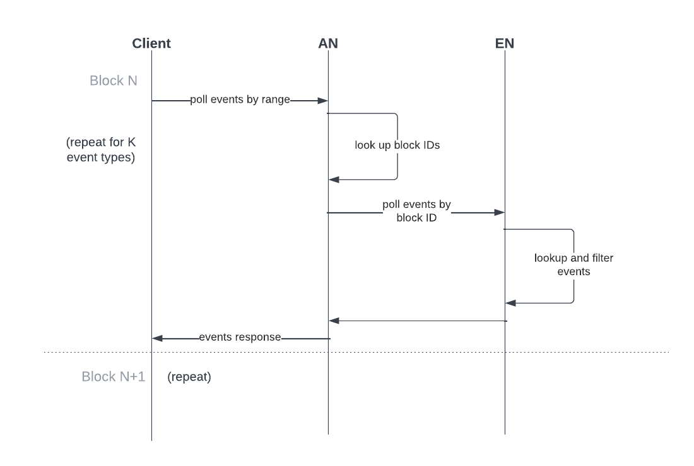

# FLIP Draft] Event Streaming API (alpha version)

## Objective

Application developers could benefit from having an easier and more standard way 
to subscribe and consume on-chain events on Flow. The current `GetEvents*` endpoints
available on Access Nodes support polling for a single event at a time. This works 
fine for simple use cases, but can be cumbersome for applications that need to query
for a large number of events, or events from every block. 

This FLIP proposes a new execution and event data streaming API for Access nodes, 
which simplifies consumption of on-chain events by providing a simple pub/sub 
asynchronous event streaming endpoint.

## Motivation

The Flow Access API presently only offers non-streaming REST/gRPC endpoints. 
Builders wishing to track events must build clients that poll by ranges of blocks. 
This pattern adds a number of pain points including more complex client code, 
having to juggle rate limits, and race conditions when polling is load balanced 
across different nodes. For node operators it may be harder to predict resource 
utilization, since certain use-cases necessitate considerably more API call volume.

The most common way to consume events would be: 

1. Periodically call `GetLatestBlockHeader` to get the latest block height
2. Call `GetEventsForHeightRange` with `start_height` as the previous `end_height` from the last iteration and `end_height` as the latest height.
    1. If the request fails because the amount of data to return is too large, reduce the range size and try again.
3. Repeat 2 for each eventID you want



While simple request/response APIs like this are straight forward to implement 
and reason with, they lack the flexibility and scalability needed by builders 
with more complex workflows.

## User Benefit

How will users (or other contributors) benefit from this work? What would be the
headline in the release notes or blog post?

## Design Proposal

The Access node API could offer the following new streaming endpoints:

- **SubscribeExecutionData**
- **SubscribeEvents**


### SubscribeExecutionData

Subscribes to a stream of execution data (collections, events, and account updates) starting at a block provided by the client calling the API. When execution data for a new block becomes available on the Access node, a message is broadcast to the subscribed clients containing:

- **BlockHeight** (block of the execution data chunk that is being broadcasted)
- **BlockExecutionData** (contains all execution data for the block, providing exactly one message per height)
Usage example:

```go
req :=  &executiondata.SubscribeExecutionDataRequest{
	// If no start block is provided, the latest block is used
	StartBlockId: startBlockID[:],
	// or StartBlockHeight: 1234,
}

stream, err := client.SubscribeExecutionData(ctx, req)
if err != nil {
	log.Fatalf("error subscribing to execution data: %v", err)
}

for {
	resp, err := stream.Recv()
	if err == io.EOF {
		break
	}
	if err != nil {
		log.Fatalf("error receiving execution data: %v", err)
	}

	execData, err := convert.MessageToBlockExecutionData(resp.GetBlockExecutionData(), chain)
	if err != nil {
		log.Fatalf("error converting execution data: %v", err)
	}

	log.Printf("received execution data for block %d %x with %d chunks", resp.BlockHeight, execData.BlockID, len(execData.ChunkExecutionDatas))
}
```

### SubscribeEvents

Similar to the previous endpoint, it subscribes to a stream of block events starting at a block provided by the client. When new events matching the subscription’s filter are processed by the Access node, they are aggregated per block and a message is broadcast containing:

- **BlockHeight** (block height of the events being streamed)
- **BlockId** (block id of the events being streamed)
- **Events** (array of events matching the client’s filter)
  <br/>While each event contains the fields listed below (see [protobuf](https://github.com/onflow/flow/blob/d58e3316e008ac764f283a98b6eba9204339ca6c/protobuf/flow/entities/event.proto#L8)):
    
    - **Type**
    - **TransactionID**
    - **TransactionIndex**
    - **EventIndex**
    - **Payload**

Event subscriptions can filter which events to include using the `EventFilter` request parameter. Any events that match at least one of the conditions are returned.

- `EventType`: Event’s type exactly matches one from the list
- `Contract`: Event was emitted from any contracts from the list
- `Address`: Event was emitted from any contract held by any address from the list

Usage example:

```go
req := &executiondata.SubscribeEventsRequest{
	// If no start block is provided, the latest block is used
	StartBlockHeight: 1234,
  // or StartBlockId: startBlockID[:],

	// Return any events that match at least one of the provided conditions
	Filter: &executiondata.EventFilter{
		// Any events with these types
		EventType: []string{
			"A.1234567890abcdef.SomeToken.TokensWithdrawn",
			"A.1234567890abcdef.SomeToken.TokensDeposited",
		},

		// Any events from this contract
		Contract:  []string{"A.0987654321fedcba.SomeContract"},

		// Any events from contracts at this address
		Address:   []string{"fedcba0987654321"},
	},
}

stream, err := client.SubscribeEvents(ctx, req)
if err != nil {
	return nil, err
}

for {
	resp, err := stream.Recv()
	if err == io.EOF {
		break
	}
	if err != nil {
		log.Fatalf("error receiving execution data: %v", err)
	}

	log.Printf("received %d events for block %d %x", 
		len(resp.GetEvents()),
		resp.GetBlockHeight(),
		resp.GetBlockId(),
	)
}
```

### Performance Implications

Providing event-streaming endpoints to push events to consumers is ultimately the 
more scalable option for a blockchain given that events are explicitly targeted to
off-chain consumers. The performance implications may likely be significant given
widespread adoption. Over time traffic patterns will change, and overall the change
is expected to be positive by eliminating the overheads of the polling model. It
would also considerably improve efficiency for use-cases where clients wish to 
consume large numbers of events at every block, side-stepping response size 
limitations. 

It will still be worthwhile to understand and load test the scalability of a given 
node, in terms of the limits of concurrent connections, event throughput and how 
those variables affect the resource utilization profile of Access nodes. 

### Nodes

- Performance Wins
    - Fewer requests due to polling → lower request handling overhead
    - Events served directly from AN → lower latency and fewer requests to ENs
    - More scaling options for blocks/tx with large numbers of events
- Performance Hits
    - Higher persistent memory overhead from streams
    - Processing execution data adds memory/CPU overhead

### Clients

- Performance Wins
    - Fewer http requests, lower processing overhead
    - Only required data is returned
    - No need to tune event range sizes to work around response size limits
    - Simpler logic
    - No polling delays to be configured
- Performance Hits
    - Events only available after they are sealed, so potentially higher latency from block execution to response for some use cases

### Dependencies

The proposal lays the basic infrastructure to improve support for consuming events 
from Flow. We plan to follow up on this FLIP in the near future with a proof-of-concept
implementation PR to enable the community to experiment and review. We present this as 
a first proposal to refine with the community through discussions on the solution, 
trade-offs, concerns and/or new use cases and requirements that may be brought forward.

### Engineering Impact

* Do you expect changes to binary size / build time / test times?
* Who will maintain this code? Is this code in its own buildable unit? 
Can this code be tested in its own? 
Is visibility suitably restricted to only a small API surface for others to use?

### Best Practices

* Does this proposal change best practices for some aspect of using/developing Flow? 
How will these changes be communicated/enforced?

### Tutorials and Examples

* If design changes existing API or creates new ones, the design owner should create 
end-to-end examples (ideally, a tutorial) which reflects how new feature will be used. 
Some things to consider related to the tutorial:
    - It should show the usage of the new feature in an end to end example 
    (i.e. from the browser to the execution node). 
    Many new features have unexpected effects in parts far away from the place of 
    change that can be found by running through an end-to-end example.
    - This should be written as if it is documentation of the new feature, 
    i.e., consumable by a user, not a Flow contributor. 
    - The code does not need to work (since the feature is not implemented yet) 
    but the expectation is that the code does work before the feature can be merged. 

## Additional resources

Endpoint implementation:

- https://github.com/onflow/flow-go/pull/3723

Protobuf definitions:

- https://github.com/onflow/flow/pull/1275
