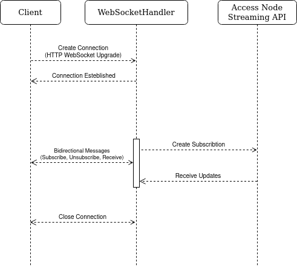

# [FLIP 229] Access Streaming API Expansion

## Objective

This FLIP document aims to logically extend the functionality proposed in [FLIP73](https://github.com/onflow/flips/blob/main/protocol/20230309-accessnode-event-streaming-api.md).

## Motivation and User Benefit

The newly implemented Access Streaming API offers limited functionality, featuring a single gRPC subscription, `SubscribeExecutionData`, and one gRPC/REST subscription, `SubscribeEvents` (see [onflow/flow-go#3723](https://github.com/onflow/flow-go/pull/3723) for implementation detail). On the other hand, the regular polling Access API version has a variety of endpoints for use. This FLIP identifies essential subscriptions within the current Access Subscription API, crucially based on user proposals, aiming to expand its functionality. Furthermore, it addresses recommended improvements to existing REST WebSocket connections, as suggested by the community, aimed at resolving issues arising from a large number of connections while maintaining granularity within the subscription API.

The enhanced version seeks to provide a simpler and more efficient REST WebSocket connection, offering a broader range of useful subscription endpoints for obtaining blockchain updates.

## Design Proposal

The Access Node Subscription API would introduce the following new streaming endpoints:

- SubscribeBlocks
- SubscribeBlockHeaders
- SubscribeBlockDigests
- SendAndSubscribeTransactionStatuses
- SubscribeAccountStatuses

Additionally, it proposes an improved version of the REST WebSocket Subscription with a single connection.

### WebSocket Subscriptions with a Single Connection

In the existing REST subscription implementation, a new WebSocket connection is established for each subscription request, as seen [here](https://github.com/onflow/flow-go/blob/9577079fd24aad4c1fc1fc8710ef2686ead85ca4/engine/access/rest/routes/websocket_handler.go#L288). However, as the number of available endpoints for subscription grows, this approach becomes less favorable due to several reasons:

- It leads to complex client-side connection handling that is hard to maintain.
- It causes unnecessary network load, adversely affecting overall application performance.
- Eventually, it could reach connection limits, imposing constraints.
- It complicates future scalability efforts.

To address this, a proposed improvement involves modifying WebSocket behavior by implementing a single connection for each subscription. This adjustment requires a shift in the core concept of REST WebSocket connections for the Access node. While the current concept of `WSHandler` should be retained for backward compatibility, a new concept needs to run in parallel.

The proposed new concept draws inspiration from the ["Web Application Messaging Protocol"(WAMP)](https://wamp-proto.org/), considering a modification to the Access node's REST WebSocket connections. However, existing Go implementations of this protocol, like  ["Nexus V3"](https://github.com/gammazero/nexus/tree/v2), contain numerous unnecessary features unsuitable for this purpose.

#### Client

Let's explore the visual representation of the proposed communication concept before delving into further details:



- The client establishes a single WebSocket connection with the Access Node (AN) through `ws://localhost:8080/ws` and maintains this connection until closed by the AN WebSocketHandler or the client itself.
  ```js
  const ws = new WebSocket('ws://localhost:8080/ws');
  ```

- Upon connection establishment, both the AN and the client can exchange messages.
  
- To subscribe to necessary topics, the client sends a special message through the WebSocket connection:
  ```js
  const subscribeMsg = {
    action: 'subscribe',
    topic: 'events',
  };
  ws.send(subscribeMsg);
  ```

  The client can subscribe to multiple topics through a single connection but should manage messages from the connection itself. The return message from the AN with updates will resemble:
  ```js
  ws.onmessage = (event) => {
    const message = JSON.parse(event.data);
    /*
    For the above subscription, the JSON message should appear as:

    {
      topic: 'events',
      data: [...]
    }
    */
    console.log('Received publication for topic:', message.topic, 'with message:', message.data);
  };
  ```

- To unsubscribe from topics, the client sends a special message through the WebSocket connection:
  ```js
  const unsubscribeMsg = {
    action: 'unsubscribe',
    topic: 'events',
  };
  ws.send(unsubscribeMsg);
  ```

- The connection can be closed by the client if no longer needed or by the AN if the client has unsubscribed from all topics.

#### Access Node WebSocketHandler

The WebSocketHandler acts as a broker between the client and the Access Subscription API, akin to WAMP. It retains most functionalities from its predecessor, `WSHandler`, with added features and responsibilities:

- Sets up WebSocket connections for different clients at the `/ws` route and manages these connections (addition, removal, ping).
- Manages subscriptions/unsubscriptions and maintains a mapping of topics for subscribed clients.
- Handles updates from the AN streaming API and broadcasts messages to all subscribers interested in the respective topics.

Additionally, the Access Subscription API requires modifications, as all streamed updates should now include an additional `Topic` field. This inclusion enables WebSocketHandler to differentiate messages based on topics.

### SubscribeBlocks

This endpoint enables users to subscribe to the streaming of blocks, commencing from a provided block ID or height. Additionally, users are required to specify the desired status of the streamed blocks to receive. Each block's response should include the full or light `Block` depends on `FullBlockResponse` argument. The "full" response contains all data needed to reproduce the block's hash, while the "light" response only contains the most commonly used fields.

**Arguments:**

- **StartBlockHeight** (Block height of the streamed block)
- **StartBlockId** (Block ID of the streamed block)
- **BlockStatus** (`BlockStatusSealed` or `BlockStatusFinalized`. )
- **FullBlockResponse** (Boolean value determining the response: 'full' if `true`, 'light' otherwise)

Either one of the two arguments, `StartBlockHeight` or `StartBlockId`, should be set but not both. If none of these arguments is set, the last sealed block will be considered as the starting block.

The `BlockStatus` cannot be set as `BlockStatusUnknown`.

**Expected response:**

- **Block** (The new sealed or finalized `Block` that, has `entities.Block` type)

**Usage example:**

```go
req := &access.SubscribeBlocksRequest{
    // If no start block height or ID is provided, the latest block is used
    StartBlockHeight: 1234,
    // or StartBlockID: startBlockID[:],
    BlockStatus: BlockStatus.BlockStatusFinalized, // Use BlockStatusSealed to receive only finalized or only sealed blocks
    FullBlockResponse: false, // Return 'light' version of block in response
}

stream, err := client.SubscribeBlocks(ctx, req)
if err != nil {
    log.Fatalf("error subscribing to blocks: %v", err)
}

for {
    resp, err := stream.Recv()
    if err == io.EOF {
        break
    }

    if err != nil {
        log.Fatalf("error receiving block: %v", err)
    }

    block := resp.GetBlock()

    log.Printf("received block with ID: %x, Height: %d, and number of CollectionGuarantees: %d",
        block.ID(),
        block.BlockHeader.Height,
        len(block.CollectionGuarantees),
    )
}
```

### SubscribeBlockHeaders

This endpoint enables users to subscribe to the streaming of block headers, commencing from a provided block ID or height. Additionally, users are required to specify the desired status of the streamed blocks to receive. The response for each block header should include the block's `BlockHeader`. This is a lighter version of `SubscribeBlocks` as it will never include the heavy `BlockPayload`.

**Arguments:**

- **StartBlockHeight** (Block height of the streamed block)
- **StartBlockId** (Block ID of the streamed block)
- **BlockStatus** (`BlockStatusSealed` or `BlockStatusFinalized`)

Either one of the two arguments, `StartBlockHeight` or `StartBlockId`, should be set but not both. If none of these arguments is set, the last sealed block will be considered as the starting block.

The `BlockStatus` cannot be set as `BlockStatusUnknown`.

**Expected response:**

- **BlockHeader** (The header of new sealed or finalized `Block` that has `entities.BlockHeader` type)

**Usage example:**

```go
req := &access.SubscribeBlockHeadersRequest{
    // If no start block height or Id is provided, the latest block is used
    StartBlockHeight: 1234,
    // or StartBlockId: startBlockID[:],
    BlockStatus: BlockStatus.BlockStatusFinalized // Use BlockStatusSealed to receive only finalized or only sealed blocks headers
}

stream, err := client.SubscribeBlockHeaders(ctx, req)
if err != nil {
	log.Fatalf("error subscribing to blocks headers: %v", err)

}

for {
	resp, err := stream.Recv()
	if err == io.EOF {
		break
	}

	if err != nil {
		log.Fatalf("error receiving block header: %v", err)
	}

    blockHeader := resp.GetBlockHeader()

	log.Printf("received block header with ID: %x, Height: %d and Payload Hash: %x",
		blockHeader.ID(),
		blockHeader.Height,
        blockHeader.PayloadHash,
	)
}
```

### SubscribeBlockDigests

This endpoint enables users to subscribe to the streaming of lightweight block information, commencing from a provided block ID or height. Additionally, users are required to specify the desired status of the streamed blocks to receive. The response for each block should include only the block's `ID`, `Height` and `Timestamp`. This is the lightest version among all block subscriptions.

**Arguments:**

- **StartBlockHeight** (Block height of the streamed block)
- **StartBlockId** (Block ID of the streamed block)
- **BlockStatus** (`BlockStatusSealed` or `BlockStatusFinalized`)

**Expected response:**

- **BlockId** (The ID of the new sealed or finalized block)
- **BlockHeight** (The height of the new sealed or finalized block)
- **BlockTimestamp** (The timestamp of the new sealed or finalized block)

Either one of the two arguments, `StartBlockHeight` or `StartBlockId`, should be set but not both. If none of these arguments is set, the last sealed block will be considered as the starting block.

The `BlockStatus` cannot be set as `BlockStatusUnknown`.

**Usage example:**

```go
req := &access.SubscribeBlockDigestsRequest{
    // If no start block height or Id is provided, the latest block is used
    StartBlockHeight: 1234,
    // or StartBlockId: startBlockID[:],
    BlockStatus: BlockStatus.BlockStatusFinalized // Returns only finalized blocks. Use BlockStatusSealed to receive only sealed blocks
}

stream, err := client.SubscribeBlockDigests(ctx, req)
if err != nil {
	log.Fatalf("error subscribing to lightweight blocks : %v", err)

}

for {
	resp, err := stream.Recv()
	if err == io.EOF {
		break
	}

	if err != nil {
		log.Fatalf("error receiving block lightweight: %v", err)
	}

	log.Printf("received lightweight block with ID: %x, Height: %d, parent block ID: %x and Timestamp: %s",
		resp.GetBlockId(),
		resp.GetBlockHeight(),
        resp.GetBlockTimestamp().String(),
	)
}
```

### SendAndSubscribeTransactionStatuses

This endpoint enables users to send a transaction and immediately subscribe to its status changes. The status is streamed back until the block containing the transaction becomes sealed. Each response for the transaction status should include the `ID`, `Status` and `SequenceNumber` fields.

**Arguments:**

- **TransactionMsg** (transaction submitted to stream status)

**Expected response:**

- **ID** (The ID of the tracked transaction)
- **Status** (The status of the tracked transaction)
- **SequenceNumber** (The SequenceNumber of the response message. Used by the client to ensure they received all messages.)

**Usage example:**

```go
txMsg, err := transactionToMessage(tx)
if err != nil {
    log.Fatalf("error converting transaction to message: %v", err)
}

req := &access.SendTransactionRequest{
    Transaction: txMsg,
}

stream, err := client.SendAndSubscribeTransactionStatuses(ctx, req)
if err != nil {
    log.Fatalf("error subscribing to transaction statuses: %v", err)
}

for {
    resp, err := stream.Recv()
    if err == io.EOF {
        break
    }

    if err != nil {
        log.Fatalf("error receiving transaction status: %v", err)
    }

    txResult := resp.GetTransactionResult()

    log.Printf("received transaction status with tx ID: %x, status: %s, and error: %v",
        resp.ID,
        resp.Status.String(),
        resp.SequenceNumber
    )
}
```

### SubscribeAccountStatuses

This endpoint enables users to subscribe to the streaming of account status changes. Each response for the account status should include the `Address` and the `Status` fields ([built-in account event types](https://developers.flow.com/build/basics/events#core-events)). In the future, this endpoint could potentially incorporate additional fields to provide supplementary data essential for tracking alongside the status.

**Arguments:**

- **StartBlockHeight** (Block height of the acount status being streamed)
- **StartBlockId** (Block ID of the acount status being streamed)
- **Address** (address of the account to stream status changes)
- **Filter** (array of statuses matching the client’s filter)
- **HeartbeatInterval** (Interval in block heights at which the server should return a heartbeat message to the client)

Either one of the two arguments, `StartBlockHeight` or `StartBlockId`, should be set but not both. If none of these arguments is set, the last sealed block will be considered as the starting block.

If the `Filter` is empty, all account statuses will be returned. If filters are set, only statuses that precisely match one of these filter conditions will be returned.

The API will send a heartbeat message periodically. This will configure a regular response message containing the `Address` and `BlockId` fields, but no `Status`. If the `HeartbeatInterval` is not set by the caller, the default heartbeat interval will be used.

**Expected response:**

- **BlockId** (The block ID of the block containing the statuses)
- **Address** (The adress of the tracked account)
- **Status** (The status of the tracked account)

Usage example:

```go
req := &executiondata.SubscribeAccountStatusesRequest{
    // If no start block height or ID is provided, the latest block is used
    StartBlockHeight: 1234,
    // or StartBlockID: startBlockID[:],
    Address: "123456789abcdef0",
    Filter: []string{
        "flow.AccountContractUpdated",
    }
}

stream, err := client.SubscribeAccountStatuses(ctx, req)
if err != nil {
    log.Fatalf("error subscribing to account statuses: %v", err)
}

for {
    resp, err := stream.Recv()
    if err == io.EOF {
        break
    }

    if err != nil {
        log.Fatalf("error receiving account status: %v", err)
    }

    log.Printf("received account status with address: %s and status: %s",
        resp.Address.String(),
        resp.Status.String(),
    )
}

```

### Future Subscriptions

The `SubscribeResourcesChanges` would allow users to subscribe to the streaming of account resource movement and account resource changes. As these functionalities necessitate additional research and discussions, they will be described and developed in the future.

### Performance Implications

The addition of more subscription endpoints aims to provide users with an efficient means to retrieve promptly available blockchain data, potentially shifting the focus away from polling toward subscription-based access. This transition should decrease unnecessary polling requests for commonly sought-after data, thereby reducing the overall system load. Consequently, users will effortlessly obtain commonly used data without additional complexity on the client side.

Regarding the REST aspect, it's crucial to emphasize the importance of evaluating the efficiency gained by transitioning websocket subscriptions from multiple connections to a single connection. This evaluation should encompass testing for potential limitations, edge cases, and overall performance metrics under normal and critical load conditions.

### Nodes and Clients

The anticipated performance gains and drawbacks should correspond to those outlined in [FLIP73 -> Nodes](https://github.com/onflow/flips/blob/main/protocol/20230309-accessnode-event-streaming-api.md#nodes) and [FLIP73 -> Clients](https://github.com/onflow/flips/blob/main/protocol/20230309-accessnode-event-streaming-api.md#clients). However, these outcomes will correlate with a broader range of available endpoints and their respective usage.

### Dependencies

This FLIP should not necessitate any new dependencies. Its foundation will primarily rely on the existing functionality of the Access Streaming API and involve modifications and enhancements to the current codebase.

