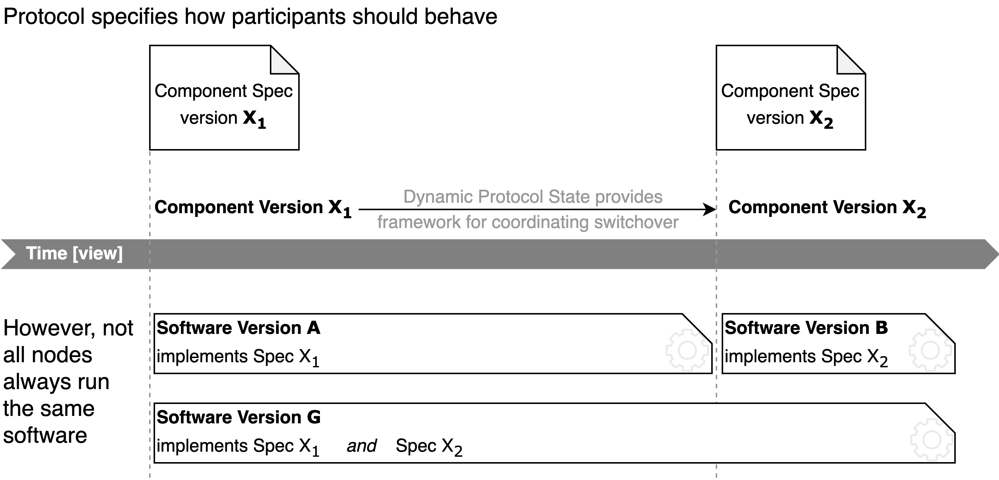

# FLIP 296: Utilize Dynamic Protocol State for Version Beacon (coordinating upgrades of the Execution Stack) 

## Objectives
For a few years, we have been using a mechanism for upgrading Flow's execution stack. In April 2024, we have finished the implementation
of the Dynamic Protocol State, which provides a significantly more robust and generally applicable framework for coordinating upgrades
(for details, please see next section).

This FLIP focuses on the following short term objective, but there is also the goal to foster our long-term development roadmap:
* **Direct goal [focus of this flip]: transition the existing mechanism for upgrading Flow's execution stack to using Dynamic Protocol State**.
  A more detailed scoping is necessary, but my gut feeling is that there is only a limited amount of work needed. In essence, we want to avoid
  extending the old upgrade mechanism in a way that is incompatible with the Dynamic Protocol State and needing to be rewritten later.
* Midterm goal: upgrades of the execution stack are by far the most frequent. By utilizing the Dynamic Protocol State for those upgrades, we
  want to generate learnings on where the new framework should be improved.
* Midterm goal: we are starting to use the Dynamic Protocol State for coordinating upgrades of other parts of the protocol.
  We want to utilize the same framework as for execution stack upgrades, to reduce code and intellectual complexity that would
  otherwise result from using significantly different approaches.    
* Longer-term goal:  Access Nodes [ANs] can decide on whose blocks’ execution states they can run scripts for across different version of the execution stack. 

## Motivation
A blockchain is a distributed system without a central authority controlling the underlying IT infrastructure.
Hence, scenarios must be considered where nodes run different software, node operators potentially don't update in time,
and it is very difficult and time-intensive to coordinate upgrades via means outside the protocol. Hence, we desire
that the protocol itself provides mechanisms to coordinate and enforce behaviors upgrades of honest nodes, whose operators
are responsive on reasonable time scales.

Here, we largely focus on the process by which the protocol specifies how certain component should behave, i.e. the component
specification. Over time, the Flow protocol evolves and the specification for some components changes.
Hence, we version component specifications for ease of referencing them.

### Status Quo (as of Nove 2024)
At the moment, we have a mechanism for upgrading Flow's execution stack only. 
This is by far the most frequently updated part of the node software and updates are frequently time-sensitive security fixes.
We have a component called the Version Beacon, which specifies how the implementation _should_ behave and when that "expected behaviour"
is supposed to change. In a nutshell, the Version Beacon for the execution stack currently specifies a block height and a "version" for the
behaviour that should become active when nodes (that are concerned with execution, i.e. ENs, VNs, ANs) reach this height. 
The updates themselves are triggered based on block height, and are therefore called Height-Coordinated Upgrades [HCUs]. 

### Reasons we want to move away from the existing Version Beacon:

Current Version Beacon:
1. focused solely on the software stack for execution, where many aspects would need to be re-implemented if we wanted to apply the same upgrade progress to other parts of the protocol 

   Better: some framework that unifies and encapsulates common functionality for broad protocol upgrades (including but not limited to the execution stack)  

2. requires that nodes have (potentially long) history (have seen version beacon service event, which is not guaranteed for nodes joining at epoch boundaries)

   Better: each block specifies which component version is to be used for processing it

3. based on height and hence not usable for upgrading most protocol-related aspects (such as consensus, processing of information beyond transaction execution).

   Better: using View instead of height for triggering behaviour changes is generally applicable and more robust (view monotonously increases over time, while height might also decrease).

### Dynamic Protocol State provides a framework for more generally applicable and more robust upgrades

💡 In a nutshell, the Protocol State tracks information about each block, including a mechanism to transfer information from the Execution state to the Protocol State in a BFT manner.

- Flow’s Protocol State to tracks and provides simple access to information about each blocks (such as epoch number, staking phase, staked nodes allowed to participate as of this block, nodes public keys, etc) 👉[code](https://github.com/onflow/flow-go/blob/3496c0f02d51602994d4fe60b32fcb00aab084f4/state/protocol/protocol_state.go#L91).
- The Protocol State now also tracks the Component Versions of the most critical consensus component (at the moment: its own version)  👉[code](https://github.com/onflow/flow-go/blob/3496c0f02d51602994d4fe60b32fcb00aab084f4/state/protocol/protocol_state.go#L100).

☑️ The Protocol State already tracks its own Component Version. You can take a look at these places in the code:
- Protocol State reports its own [version](https://github.com/onflow/flow-go/blob/3496c0f02d51602994d4fe60b32fcb00aab084f4/state/protocol/kvstore.go#L30-L43) as part of every block
- mechanism for [scheduling version upgrades (at future view)](https://github.com/onflow/flow-go/blob/a6b157ce2770be9356e1cf35d1b0fff63f5e4a76/state/protocol/protocol_state/kvstore/upgrade_statemachine.go#L78-L142) exists
- mechanism [enforcing that node supports and uses correct](https://github.com/onflow/flow-go/blob/a6b157ce2770be9356e1cf35d1b0fff63f5e4a76/state/protocol/protocol_state/state/protocol_state.go#L235-L248) version as specified by the protocol

## User Benefit

Upgrades without significant downtime are very important:
* For large-scale adoption, a good user and developer experience, the flow platform must be reliably available.
* However, we have the need to ship security fixes and evolve Flow, which requires software upgrades. The more frequently
  we can deploy upgrades, the less risk there is for unforeseen problems caused by upgrades. Furthermore, frequent code deployments
  generally reduce engineering efforts. 

# Proposal

## Terminology

See blog post [[1](https://forum.flow.com/t/protocol-version-upgrade-mechanisms-discussion/5717)] for further details:

**Software Version** - The version identifier of a binary distribution of Flow Node software.
By convention, we use semver-ish tag in Git and Docker releases.

Software has bugs and is frequently incomplete (e.g. API returning ‘not yet implemented’).
The software version is a meaningful reference to describe what the software does in the real world. 

However, we also desire a compact identifier [which we will call the ‘Component Version’] of how a Flow node *should* behave. 

**Component Version:** version identifier for a component of the flow protocol.
It references one specific behaviour of a sub-system (e.g. Execution Stack or HotStuff) of Flow, as prescribed by the protocol. 

In the nutshell, for every block there is one and only one correct way of how to process that block, and how to evolve the execution state.
For distributed BFT systems, we need this notion of ‘correct behaviour’, which is inherently implementation agnostic.
We want to explicitly express that up to a certain view $v$, we want the protocol to behave in one way and for higher views differently. 

### Relationships between **Software and Component Version**

- Conceptually, for every block, each component of Flow has one and only one component version.
 
- A software version can implement multiple Component Versions.
E.g. AN supporting script execution across HCU boundaries
    
    ❗Don’t couple the software version to the component version! We know there will be scenarios where we want one software to implement multiple
    Component Versions and at that point, any one-to-one coupling of Software and Component Version will necessarily break. Instead, for each software
    version, we conceptually have a _list_ of Component Versions that this software supports (even if that list only contains a single element most of the time).
    

# Roadmap: Dynamic Protocol State for coordinating Execution Stack upgrades (including Cadence changes)

Biggest change (and possibly only significant change):

- Dynamic Protocol State should ingest Version Beacon Service Event and track’s the Execution Stack’s Component Version

.png)

Example:

.png)

## Semantic versioning

$$
\textnormal{Software Version :}\quad  \underbrace{\texttt{major}\,.\,\texttt{minor}\,}_{\textnormal{Component Version}}.\,\texttt{patch}
$$

- Software with identical  $\texttt{major}.\texttt{minor}$ is cross-compatible irrespective of patch version,
  because they all implement the same specification (represented by the Component Version). Hence, the $\texttt{patch}$ version is not
  part of the Component Version, because it does not influence the conceptual behaviour. Though, it represents implementation details,
  so it is part of the Software Versio.
- In addition, we introduce compatibility requirement from semantic versioning:
    
    $\textnormal{Component Version :} \quad \texttt{major}\,.\,\texttt{minor}$
    
    - Protocol specifications with the same  $\texttt{major}$ must be fully backwards compatible (in practise, mostly additive changes)

## Limitations

For the core protocol, changes are often not backwards compatible. Furthermore, maintaining backwards compatibility can cause
subtle edge cases and drives implementation complexity. 

Lastly, the benefits from backwards compatibility are strong in case we want to process inputs of mixed versions over a prolonged period of time.
In contrast, the protocol abruptly switches at a specific view from one behaviour to another. 

For Flow, controlling complexity and codifying compatibility is essential.
The **compatibility expectations, associated risks and additional complexity** of semantic versioning are not beneficial in *some* areas
of the core protocol. For example the **Component Version** of the Protocol State is specified by a **single integer** (👉[code](https://github.com/onflow/flow-go/blob/c1a1cc0e05f0d323ab2f83dd5d74d8ad486d451e/state/protocol/kvstore.go#L30-L43)). 

**Component Version** guidelines

- Use semantic versioning for areas where
  - benefit from backwards compatibility outweigh the implementation and complexity cost
  - we want to maintain backwards compatability over a longer period of time and across multiple upgrades
- In areas where we can’t easily provide backwards compatibility (e.g. for security or BFT reasons), we should make this explicit by using a single-integer for the Component Version.

## Next Steps

Challenge: missing seed for starting engineering work:

- complex topic, spanning three areas of Flow [execution, Protocol, Data Availability]
- everyone is worried they are missing something, but we have limited time / priority to flesh out a holistic vision for versioning each and every aspect of the protocol  
- keep talking about it, bigger picture remains hazy, 
so ICs keep extending our existing but insufficiently general solution (existing Version Beacon, solely based on service events, where tracking and complying to service events is entirely left to the implementation)

***Approach*:**

**We work towards transitioning the _existing_ Version Beacon to use the Protocol State.**

- Decide now what convention we use for:
    - Component Version format of Execution Stack? (e.g. $\texttt{major}.\texttt{minor}$ or single integer? Currently, the Version Beacon uses semver,
      but Bastian thinks this might be unnecessary complex for Cadence)
    - One Component Version for Cadence only?
        
        or one Component Version for Cadence+FVM combined?
        
        or two separate Component Versions (one for Cadence and one for FVM)  
        
- Start by including Component Version for Execution Stack into Dynamic Protocol State
  
  Breakdown of steps:
  .png)
        

## Outlook

[Bastian recommended](https://github.com/onflow/flips/pull/296#discussion_r1825273426) that we specify a component version for the "Cadence Language",
which specifies the available language features and their behaviour. This is useful when incrementally adding new features, where it is relatively trivial
to have one binary supporting the different feature sets.

In addition, [Bastian recommended](https://github.com/onflow/flips/pull/296#discussion_r1825273426) to consider Component Versions for subcomponents
of Cadence/FVM, such as "storage format" (how are objects stored in account storage encoded?),
"CCF format" and
"JSON format" (how are "external" objects encoded?).

## Further reading

- [[1](https://forum.flow.com/t/protocol-version-upgrade-mechanisms-discussion/5717)] Jordan’s [**Protocol Version Upgrade Mechanisms Discussion**](https://forum.flow.com/t/protocol-version-upgrade-mechanisms-discussion/5717) (flow forum post)
- [Core-Protocol WG Meeting on Versioning, May 23, 2024](https://github.com/onflow/Flow-Working-Groups/blob/main/core_protocol_working_group/meetings/2024-05-23_Versioning_sub-working-group.md)
- [*[Brainstorming] HCU-style upgrades for all node roles* ](https://www.notion.so/Brainstorming-HCU-style-upgrades-for-all-node-roles-b6b0ab084075432782cd0407b73479c7?pvs=21)

# Question and Answers:

### Do we want to track a Component Version for _every_ component of Flow? 

**Answer**: For most components, we do _not_ track their version explicitly. Necessary updates are infrequent and not time sensitive, so that we
can just bundle all changes across many components and ship them all together as part of a major upgrade (aka Spork).

However, for very few components, upgrades are frequent and time sensitive (e.g. security fixes in Cadence), so that we cannot
wait for the major upgrade (aka Spork). In that case, we want to deploy the upgrades into the running network and need to specify
what should happen (i.e. the component version) and when that is going to change. Only for those components we want to track their component version
via the protocol state. 