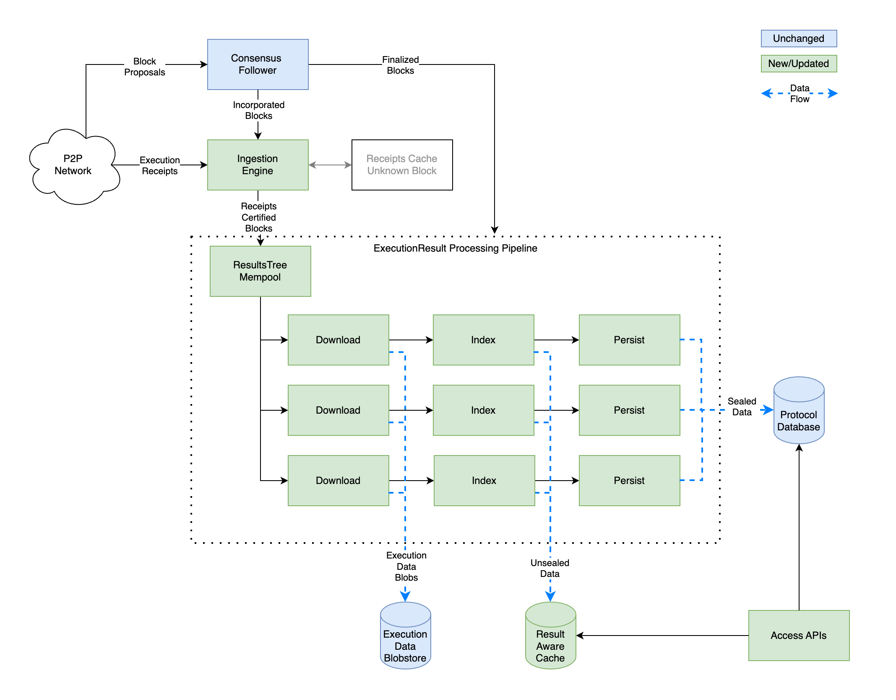
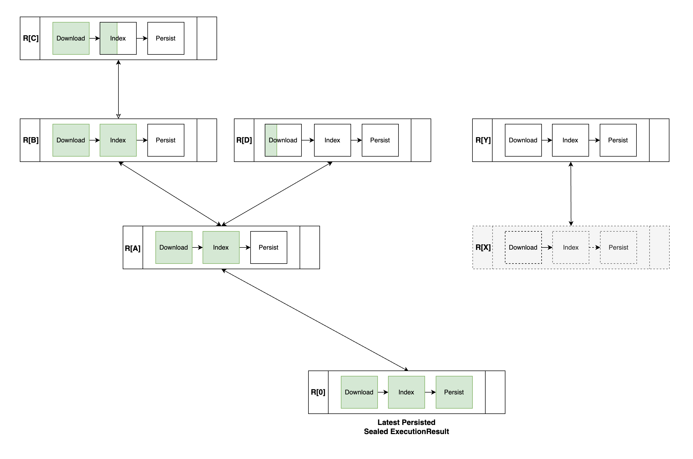
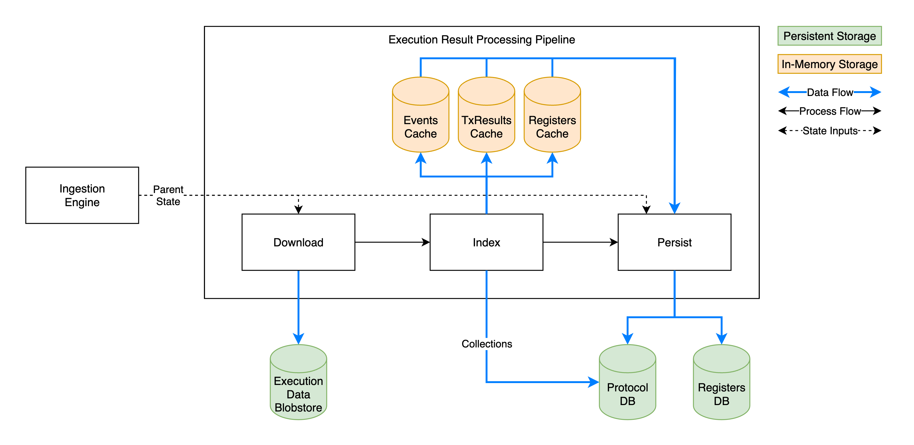
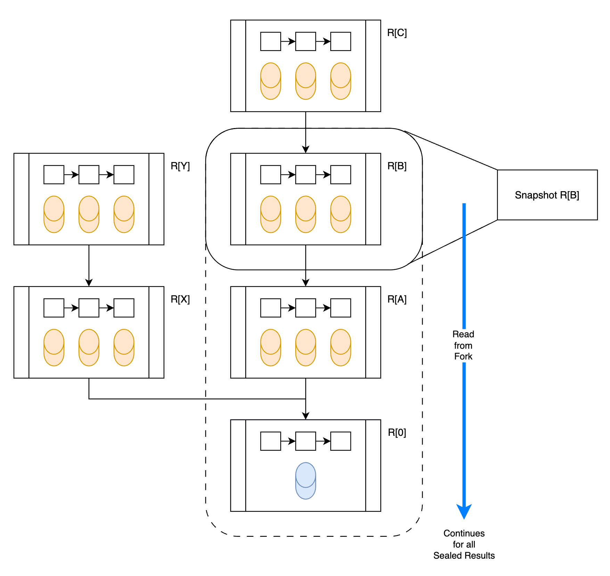

# FLIP 322: Optimistic Syncing of Execution Data

## Objective

Access and observer nodes retrieve execution data from execution nodes to power the Access API.
This FLIP introduces an optimistic syncing mechanism that minimizes latency, ensuring that data for
the latest block becomes available faster.

## Motivation

The Flow protocol’s unique multi-node architecture allows each role to scale independently, offering
exceptional flexibility and resilience. However, this design requires a different approach to data
synchronization than most other blockchains.

Currently, Access nodes retrieve execution data from Execution nodes only after a block’s execution
result has been sealed, which typically occurs several seconds after the block execution completes.
Users who need access to the latest data must query Access nodes, which then forward these requests
to Execution nodes. This approach increases the load on Execution nodes and can negatively impact
overall network performance.

In the mature protocol, all data queries will be handled by Access and observer nodes, enabling
horizontal scaling to accommodate more users and dapps. By synchronizing results immediately after a
block is executed, Access nodes can deliver low-latency data to users while alleviating the burden
on Execution nodes.

## User Benefit

Users that run their own Access or observer nodes will have unrestricted access to the latest
executed data. This allows dapps to provide faster and more responsive experiences to their users.

## Design Proposal

### Overview

ANs currently download and index execution data only after a block’s result is sealed. With optimistic syncing, an AN
can begin downloading data as soon as it obtains an `ExecutionResult` for a certified block. Processing is optimized for
the ideal scenario of one unique result per block. To manage the relatively rare execution forks, unsealed data is
stored separately from main storage until sealed, making it easy to discard data from abandoned forks.

ANs also receive notifications for new `ExecutionReceipts` as they are produced by ENs. Once an ExecutionResult for a
certified block is available, the processing pipeline downloads and indexes the data. Unsealed block data is temporarily
held in an in-memory cache until the result is sealed or abandoned, reducing latency for API access.

Since there could be more than one result for a block, the API logic will be updated to select the best result for the
client’s request (see [details](#access-apis)),
and query the node’s execution state indexes using data from that result’s fork.

This will require changes across the pipeline, as depicted below



### Ingestion Engine

Currently, the ingestion engine processes `ExecutionReceipts` and `ExecutionResults` from the network in two ways:

1. Directly from Execution nodes on the `push-receipts` channel.
2. Extracted from finalized blocks after processing by the consensus follower.

On the fast path when execution is ahead of finalization and all messages are received over the network, receipts are
first received from Execution nodes. All relevant results are guaranteed to be *eventually* delivered by the consensus
follower (incorporated in finalized blocks).

To make it more byzantine fault tolerant [BFT], the ingestion processing will be changed in the following ways:

- On startup, load unprocessed results into the mempool. This will include the chain of unprocessed sealed results,
  followed by the persisted execution results for certified blocks.

  Since there are limited resources on a node, there will be some configurable limits to control how many in-progress
  results to allow. This limit applies back pressure to the ingestion engine to limit how many future results to add for
  processing. This mostly comes into play during backfill, but could also occur when there are many blocks in a row with
  a large amount of execution data that take longer to complete.

- When a receipt is received from `push-receipts`, add it to the mempool to be persisted when its block is finalized.
  Consensus nodes have an
  existing [mempool](https://github.com/onflow/flow-go/blob/1ba41690954621d15d59dcabcc8f0dfc0b56f1bd/module/mempool/execution_tree.go#L15)
  for receipts that we can likely reuse or extend.
    - BFT considerations:

      This mempool could be vulnerable to a flooding attack by Byzantine ENs publishing execution results for made-up
      blocks. While consensus nodes have to deal with this attack vector for latency reasons, ANs could just **drop all
      execution receipts for unknown blocks**. In this case, they would be entirely immune to this attack. This is fine
      for the following reasons:

        - The consensus follower component within an EN or ANs notifies the node's higher-level about a new block $B$ as
          soon as $B$ is certified (i.e. $B$ received a quorum certificate, guaranteeing that $B$ is a valid extension
          of the chain).

          On the happy path, the AN should learn about block $B$ approximately at the same time as ENs start
          executing $B$ (within an estimated time window of 200ms - 300ms). Therefore, ANs are expected to receive
          receipts for unknown blocks only relatively rarely - unless an AN is behind or the EN is byzantine (in this
          latter case, we accepting the longer latency of the fallback path described below). Furthermore, there is some
          temporal distribution of the ENs publishing their receipts. If an AN happens to drop receipts from the fastest
          ENs, due to not having seen the corresponding block yet, this AN has still the chance to pick up the result
          from one of the later ENs.

          To confirm this reasoning holds in practise, we should include metrics for:

            - How many *receipts* pushed by the ENs are actually dropped by the ANs due to not knowing the block.
            - How many *results* are successfully ingested from the `push-receipts` channel (de-duplicated by result ID)
            - How many *results* are successfully ingested from incorporated blocks (de-duplicated by result ID -
              results that were previously been successfully ingested from the `push-receipts` channel are not counted)

          Hence, ANs rejecting Execution Results / Receipts for unknown blocks should not significantly impact the happy
          path.

        - All relevant results are guaranteed to be *eventually* delivered by the consensus follower (incorporated in
          finalized blocks).

          Hence, ANs rejecting Execution Results / Receipts for unknown blocks does not prevent new result from
          eventually becoming available through the Access API.

        Two potential option to avoid dropping the data:
        
        1. Add a size-limited cache for `ExecutionReceipts` for unknown blocks. I the cache is filled by a flooding attack, the resources used are limited and main impact is the cache is no longer effective. When new certified blocks are discovered, we can check if there are any receipts in the cache and add them to the mempool.
        2. Add a configuration option for operators to specify a list of trusted Execution nodes. Any receipt received from a trusted execution node could be added to the mempool immediately.
        
        Before we do any optimization, we will first want to collect some data to understand how often receipts will be dropped, and how much latency that actually adds.

- Add a consumer for `OnBlockIncorporated` notifications (node-internal, emitted by the consensus follower when learning
  about a new certified block). For each incorporated block, add all contained receipts to the mempool. This ensures
  that any receipts that were missed from the push channel are caught as soon as possible.
- Each of the `ExecutionResults` added to the mempool will initiate their processing pipeline.

Criteria for starting to process a result should be configurable by the operator with the following options:

- Sealed → wait for the result to be included in a seal in a finalized block.

  This is what we have today and is the most conservative option.

- Finalized → wait for the result’s block to be finalized

  This significantly reduces the likelihood of processing data that is not eventually sealed and balances latency with
  network bandwidth.

- Certified → wait for the result’s block to be certified

  This is the lowest latency, with some network bandwidth overhead.

On mainnet, we see that approximately 5% of blocks proposed by consensus nodes are abandoned. This number is likely
lower for executed blocks. We also see that execution forks on finalized blocks is very rare (< 1 block per month). 
I don’t have an exact number for the amount of latency between certified and finalized, but it’s likely on the order of
1 second.

The ingestion engine will need to track the latest persisted sealed result in the database.

Since we no longer require that processed data is for a finalized block, we can no longer use block height to track the
sequence. Instead, we will switch to view which is guaranteed to be unique and monotonically increasing for certified
blocks. I’m not sure yet if it is necessary to use view to track the processed result, or if the `ResultID` and
`PreviousResultID` are sufficient. I suspect they are.

### New Pipelined Processing Approach

The existing system uses separate components, each with its own local state. As data passes through the system, it is
processed by one step, then handed off to the next. This was simple to implement and works well for a single chain of
data. However, making it fork aware multiplies the state tracking complexity by each step.

Instead, we will implement an unified fork-aware results mempool that tracks the relationship between all unprocessed
`ExecutionResults`. Results that extend the sealed chain form a tree starting at the latest persisted sealed execution
result. Those that do not, form disconnected trees within the forest. The graph structure allows us to easily track the
relationships between results, even when they extend an abandoned fork. (See
the [note](#a-note-on-pruning) below on pruning).

At startup, the node loads all unprocessed results from disk into to the mempool. These will be a combination of sealed
and unsealed results since the node needs to catch up with the chain. As new results are discovered from the network,
they are added to the forest. We will likely want to put some limits on the number of results added into the forest to
manage node resources.

Among the different trees in the `Results Forest`, we primarily care about the tree descending from the latest persisted
sealed result. The execution results in this tree will be actively worked on by the AN to index. The `Results Forest`
maintains a pointer to the root of this tree (i.e. latest persisted sealed result). By protocol convention, this
distinguished root vertex (latest persisted sealed result) always exists in the Results Forest (never nil).

Each pipeline has a series of steps: download, index and persist. Descendants can inspect the state of their parent to
inform state transitions (or we can propagate status changes up the fork, such as “this fork just got orphaned, cancel
all processing and do not download data for additional results added to this fork”). For example, all pipelines are able
to download and index data as soon as it’s available, but persisting is only possible when all ancestors are also
persisted. We may also set some limits on the number of incomplete vertices allowed (specifically: we would track and
limit the number of vertices in the tree descending from the latest persisted sealed result). This allows concurrent
processing of data during catchup, while maintaining a consistent state in the database.


**Illustration of the `Results Forest` data structure:** Each vertex in the graph represents the data processing
pipeline for a result. At the bottom of the figure is the distinguished vertex representing the latest persisted sealed
`ExecutionResult`. Each additional result is either a descendent of this result or part of another disconnected tree,
using the `PreviousResultID` to form the relationship.
For each execution result, the `Results Forest` maintains parent-child lookups (these form the forest graph), and in
addition a lookup-by-view for the execution results. In this context, we are using the view of the executed block. By
convention we keep all vertices (result-processing pipelines) whose views are larger or equal to the view of the latest
persisted sealed result. We prune only vertices with strictly smaller
views.

`R[X]` depicts a result (for a certified block) that has not yet been discovered. It is represented in the disconnected
forest, however processing may not start in any descendants until we receive `R[X]`. This is for BFT reasons *(so ENs
cannot mount resource exhaustion attacks by publishing results for known blocks whose parent result is never revealed)*.
If `R[X]` was eventually added, it would connect to its parent `R[0]`, and signal to its descendants that they are also
now connected to `R[0]`.

If `R[A]` was eventually sealed, the fork `R[X]` becomes disconnected and is eventually pruned.

##### A note on pruning:

- When a fork is disconnected, we do not remove the results from the tree, but simply abort the processing and free
  working memory (caches, etc).
- The vertices remain in the tree which allows us to identify when a new result extends from the pruned fork, in which
  case we can skip optimistic processing.
- Vertices are pruned by level, so we will eventually prune all disconnected vertices since nodes will eventually stop
  extending the fork.

### Result Processing

Each individual `ExecutionResult` will go through the following processing sequence:

1. Download `BlockExecutionData`
2. Index `BlockExecutionData`
3. Persist data

Downloading and indexing can happen concurrently with other results. Since the datastores used by the indexer are
fork-aware, data can be safely written out of order. Data can only be *read* for connected forks.

After data is downloaded and indexed for a result, it will check if the data can be persisted. To persist data for a
result, the following conditions must be met:

1. A seal for the result is included in a finalized block *and*
2. the parent must be persisted.

After data for a result is persisted, its vertex becomes the new latest persisted sealed `ExecutionResult`, and
processing is aborted for all vertices in the forest that do not descend from the latest persisted result. Such vertices
are eventually pruned (by view).

Processing for each step must be idempotent. While we will be using in-memory caches for some of the data, others like
the execution sync blobstore will continue to use persistent storage. Downloading data for a result with a previous
partial or completed download must be safe.

Below is an illustration of the processing flow, highlighting the data stores, processing flow and state inputs.



### Worker Pool

We recommend to have a single worker pool serving all the pipelines in the tree. To progress a pipeline by one step, we
queue a task for the worker pool. With such a design, we can tune the “look ahead horizon” ie. memory consumption
independently from the CPU consumption (worker pool size). This design will hopefully be very scalable with
well-controlled resourcing limits for our BFT environment. It seems more complicated at first, but the implementation is
generally not while the code becomes strongly modularized.

### Core Logic Refactor

All of the existing components will need to be refactored to align with the new approach.

#### Execution Data Requester

The logic related to downloading data for a block will be extracted into a new `Core` module, which can be used within
the processing pipeline. The majority of the logic in the requester is related to managing state for downloads and
notifications. Since orchestration is moving to a new system, this logic can be removed.

#### Indexer

The indexer is already structured with a `Core` module that handles indexing for individual results. This can likely be
used directly with minor modifications to make it fork-aware. Most of the complexity for this can be abstracted into the
result-aware storage.

Note: collections from execution data can be saved immediately so long as the hash matches the expected value from the
block’s guarantees (otherwise, the AN is observing a protocol violation and should log a warning message with
a [dedicated logging keyword](https://github.com/onflow/flow-go/blob/b334c811f5c88941e7a1fa3a7e067c4a5e291350/utils/logging/consts.go#L4-L23)).
We will need to add this explicit check to allow storing non-sealed data, which will simplify access for collections and
transactions.

### Storage

Storage for the unsealed data will need to be fork aware. Internally we can utilize the same ResultsTree, by finding the
pipeline for a particular `ExecutionResult`, and querying the in-memory storage from the object. The external API will
implement the same interface as the persistent storage, requiring that the caller first select a snapshot by `ResultID`.
The returned snapshot object can be queried the same as the existing databases. The caller could also request a snapshot
for persisted data, allowing queries using an identical API for sealed or unsealed data.

The storage layer will need to be aware of the processing state of the underlying pipeline object. If the requested
result or any ancestors have not completed indexing, requesting the snapshot should fail with a “not found” error.

A special cacheing layer will be needed for the register DB since scripts need to get the most recent version of a
register as of the specified block. This means that each lookup may need to traverse the fork until it finds a value.
There is similar logic implemented for storehouse that could be used as a reference ([
`InMemoryRegisterStore`](https://github.com/onflow/flow-go/blob/76ffa809efb055c955d44cfdb2d23be747946eff/engine/execution/storehouse/in_memory_register_store.go#L39))




### Access APIs

Currently, the Access API follows 2 paths for execution data:

1. Sealed data can be queried from the local indexes or requested from Execution nodes
2. Unsealed data can be requested from Execution nodes.

Which Execution nodes are chosen depends on the `ExecutionReceipts` the Access node has in its storage, and the node’s
configuration ([code](https://github.com/onflow/flow-go/blob/b00090937858da28bbfa2742f698fd1e6d057177/engine/common/rpc/execution_node_identities_provider.go#L68)).
The Access node only sends queries to Execution nodes it knows have executed the block, and only to nodes that produced
the majority result (execution result with the most agreeing
ENs) ([code](https://github.com/onflow/flow-go/blob/b00090937858da28bbfa2742f698fd1e6d057177/engine/common/rpc/execution_node_identities_provider.go#L142-L192)).
In addition, the AN requires that at least 2 ENs produced matching `ExecutionResults`. Note: over the years some of
these guarantees have been softened, so they are not strictly true in all cases.

The external behavior of the API will not change. However, users will gain greater control and visibility into the data
they receive. Instead of exclusively using hard-coded or operator-set config, endpoints returning execution data will
have additional options to allow the user to specify their desired security-guarantees. For example:

- Set of trusted ENs
- Minimum number of agreeing ENs (out of the set of trusted ENs) to consider a result having “soft finality”
- Whether or not to include execution metadata (see below)

Defaults should fall back to the node operator’s setting.

<aside>
We may want to also include the option to query with an `ExecutionResult.ID` to signal that the user wants the query to
use the fork containing that result.

Otherwise, it’s possible that multiple requests to the same Access node could return data from different forks as
execution receipts are received.
</aside>

On the response side, endpoints that return execution data should optionally include metadata about the origin of the
data. Namely

- `ExecutionResult.ID`
- List of executor IDs that committed to that result

Any `ExecutionResult` used to serve data must be available using the `GetExecutionResult*` endpoint.

Streaming endpoints include the same metadata and request options, plus have a control message (or sentinel error?) that
indicates unsealed data was returned, and which sealed height the client should roll back to. This is important for easy
integration with the EVM Gateway and other data ingestion systems.

### Access API Backends

The API backends will need a variety of changes:

- API backends will need to support the new request and response arguments.
- The existing Execution node selection logic will need to be updated to allow using the client’s parameters
- All execution state endpoints will need to use the `ExecutionResult` selection logic
- All execution state db queries will need to be updated to use the cache, and query using the selected
  `ExecutionResult`.

### Appendix

#### Forks

Consensus Fork: when 2 or more consensus leaders extend the chain from the same parent block.

Execution Fork: when 2 or more execution nodes produce different `ExecutionResults` for the same block

#### Choosing when to ingest ExecutionResults

There are several options to choose from when deciding when to ingest an ExecutionResult

0. Immediately after receiving the first receipt → this is the most aggressive, and is vulnerable to attack by byzantine
   execution nodes (see [below](#bft-considerations-when-ingesting-executionresults)).
   This option will not be allowed.
1. After result’s block is certified → this is the earliest a node could *safely* start processing the data. Since the
   result’s block is certified, the execution node’s stake is on the line for their result. However, the block is not
   finalized yet so it’s possible that it becomes part of an abandoned *consensus fork*, wasting resources if we were to
   optimistically process it. Consensus forks occur at a low but persistent frequency of around ~5% of blocks. This
   provides the lowest latency, with some resource (memory/network) overhead.
2. After the result’s block is finalized → at this point the block is guaranteed, but an execution result that we
   download could still turn out to be on an abandoned *execution fork*. Execution forks are currently rare, occurring
   less than once per month. This is a balance of latency and resource overhead.
3. After receiving N (>1) `ExecutionReceipts` with the same result → the more agreeing executors there are, the more
   likely the result is correct since it increases the amount of stake behind the result. This is a risk-reduction
   variant of approach 1. or 2. above, applicable to either certified or finalized blocks.
4. Sealed result → this is the most conservative and ensures the node only invests resources on data that is guaranteed
   by the network to be correct.

Options 1-4 should be configurable by the operator. I think option 2 is a good default.

Ideally, the implementation for all 4 options are identical, with a simple check that’s run before allowing the pipeline
to start processing.

#### BFT Considerations when ingesting ExecutionResults

A major attack vector by a byzantine EN is to publish execution results for made up blocks. Consensus nodes have to deal
with this attack vector for latency reasons. However, the AN can drop all execution results for unknown blocks. This is
because finalization of block $B$ and ENs publishing results for $B$ happens nearly at the same time.

Similarly, a byzantine EN could publish a valid execution result for a certified block using a made up parent
ExecutionResult.

If the EN publishes an execution result for a certified block, it could be slashed.

#### Collection Indexing

Currently, collections are indexed following 2 code paths:

- When the ingestion engine receives new block finalized events, it requests all collections within the block from
  Collection nodes.
- When `BlockExecutionData` is indexed, any collections that are not yet stored are added to the db

This effectively ensures that collections are stored for all sealed blocks, and for finalized blocks as quickly as
possible.

In practice, fetching collections from collection nodes lags a 1-5 second behind finalization, depending on the
performance of the requester engine and whether the node gets lucky that the first node queried returns the collection.

With optimistic syncing, Access nodes will get collections after the block is executed at the latest. This is probably
faster than when collections are received from the ingestion engine. We will need to collect some data on this and
decide if it’s worth continuing to request collections from collection nodes at all once optimistic syncing is enabled.

#### Processing limits/resource management

When a node is catching up after being offline, it may have a large number of results to process. To avoid using all of
the system’s resources and impacting performance of other subsystems, there should be configurable limits on the number
of results in progress.

When a node starts, it will load unprocessed results into the mempool. There will be a limit on the total number of
in-process results. When the limit is reached, the ingestion engine will stop adding until there is more room.

All results in the tree that extend from the latest persisted result can be in progress. Vertices in abandoned forks
that have stopped do not count towards the limit since they use minimal resources.

A less common scenario is when sealing halts for an extended period of time. In this case, there could be a large number
(hundreds to thousands) of executed unsealed blocks. Since this data will be stored in memory, there is a limit to the
number of results that can be cached, so nodes will need a way to gracefully handle this.

### Drawbacks

The main drawback is that this will increase the complexity of the syncing system. There are also
tradeoffs between latency and resource usage to consider, but these will be configurable and left
to the operators to decide.

### Alternatives Considered

* Make sure to discuss the relative merits of alternatives to your proposal.

### Performance Implications

Syncing unsealed results means the node will be processing more data than it currently does increasing
CPU and network usage. It will also store the unsealed data in memory, increasing memory utilization.

Settings to tune the amount of memory, CPU, and networking used will be provided to operators. We will
also do some performance testing to determine appropriate defaults using the recommended hardware
specifications for Access nodes.

### Dependencies

This proposal does not add any new external dependencies. There are also no dependencies on other
projects.

### Engineering Impact

This code will be included in the `flow-go` repository. The changes will be localized to Access node
modules and bootstrapping.

The code will be maintained by the Flow Foundation and community contributors.

### Best Practices

This proposal does not introduce any new best practices.

### Tutorials and Examples

Access API endpoints that return execution data will need to be updated to include the new request and
response parameters.

#### Request Parameters
Here is an example of the additional request parameters that will be added to the Access API. Similar
parameters will be available for the REST endpoints.
```protobuf
message ExecutionRequestMetadata {
    uint32 min_executor_count = 1;  # Minimum number of Execution nodes that committed to the result
    repeated bytes executor_id = 2; # List of trusted Execution nodes that must have committed to the result
    bool include_metadata = 3;      # Whether to include ExecutionResponseMetadata in the response
}

message Request {
    ExecutionRequestMetadata metadata = 1;
    ...
}
```

#### Response Parameters
Here is an example of the additional response parameters that will be added to the Access API. Similar
parameters will be available for the REST endpoints.
```protobuf
message ExecutionResponseMetadata {
  bytes execution_result_id = 1;  # ID of the ExecutionResult used when serving the data
  repeated bytes executor_id = 2; # List of Execution nodes that committed to the result
}

message Response {
    ExecutionResponseMetadata execution_metadata = 1;
    ...
}
```

### Compatibility

This change will be fully backwards compatible, both for Access node operators and API users.

### User Impact

Most of the changes are internal to the Access node. API users will have new optional parameters they
can use to control the data they receive. The default behavior will remain the same.

## Related Issues

Once Access nodes can sync and index data for unsealed executed blocks, Execution operators will no
longer be required to serve Access node's API queries. This will take place over several months after
the feature is released.

## Prior Art

Flow is unique in it's need to share data between different node roles. Other blockchains have systems
for syncing execution data for past blocks, but that is more similar to syncing sealed data.

Parts of this system are similar to other existing subsystems on Flow. The `Results Forest` is inspired
by the [`ExecutionTree`](https://github.com/onflow/flow-go/blob/2dd0f32454837a02b0e407cd468f83a2859313ee/module/mempool/consensus/execution_tree.go#L12)
used by Consensus nodes to track execution results. Similarly, the design for the register database
cache will be similar to the existing storehouse cache.

## Questions and Discussion

Please leave any questions or comments as comments on this pull request.