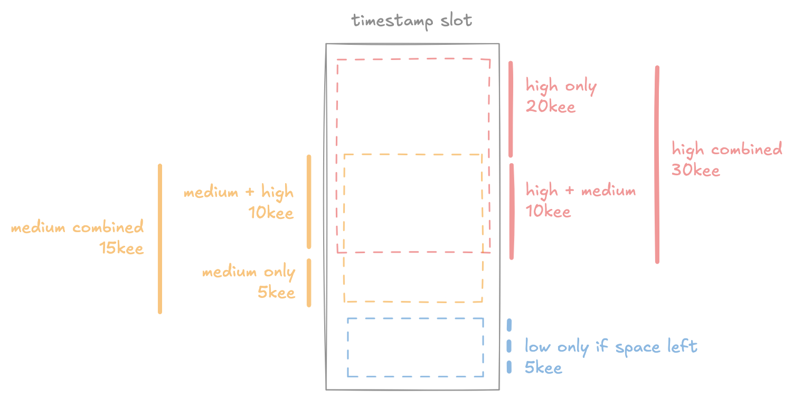
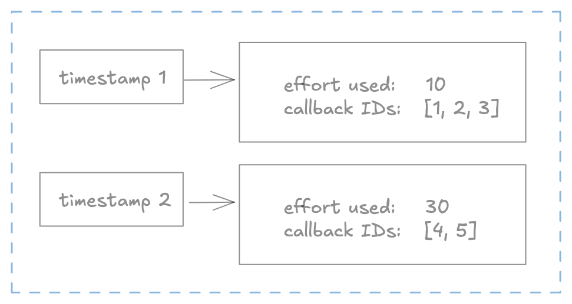
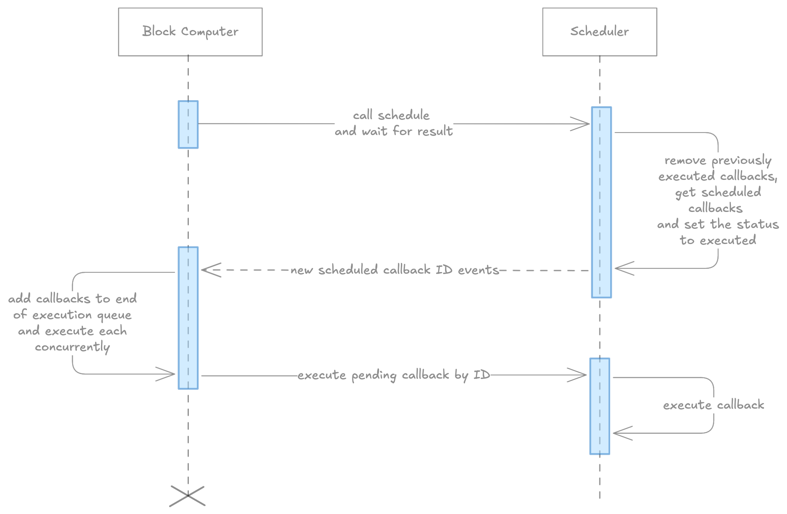

# FLIP 330: Scheduled Callbacks

## Objective

Introduce scheduled callbacks, a novel mechanism that enables smart contracts to autonomously trigger actions at predefined times.

## Motivation

In traditional blockchain architectures, application state transitions occur only in response to externally submitted transactions. This design limits the autonomy of on-chain applications, preventing them from operating independently.

Scheduled callbacks enable a contract to “wake up” and execute logic based on on-chain state, allowing for recurring tasks, deferred operations, or reactive behaviors. This unlocks a wide range of powerful use cases, such as autonomous arbitrage bots, recurring subscription services, automated transaction batching, self-destructing wallets, and other advanced decentralized logic patterns.

## User Benefit

Users will be able to implement novel blockchain patterns natively (such as autonomous arbitrage bots) without relying on off-chain processing in a centralised manner.

## Design Proposal

The system architecture comprises two primary components:

1. **Scheduler** – Responsible for defining, ordering, and prioritizing future callbacks
2. **Execution Engine** – Handles the deterministic execution of callbacks and ensures fault tolerance.

By decoupling execution from external input and enabling persistent autonomous behavior, scheduled callbacks redefine what’s possible in decentralized application design.

## **Scheduling**

When scheduling a callback, three key parameters must be specified:

- **Timestamp** – The target time at which the callback is intended to be triggered. This defines when the execution becomes eligible.
- **Priority** – A relative value used by the scheduler to order callbacks competing for execution at the same time. Higher priority increases the likelihood of earlier execution under resource restrictions.
- **Computation Limit** – The maximum amount of computational effort allocated to the callback, ensuring predictable execution costs.

### **Priorities**

Callback execution may not occur exactly at the scheduled timestamp due to variable network load and the assigned priority level. The earliest a callback can be triggered is the first block whose timestamp is greater than or equal to the specified target timestamp.

The scheduler defines three priority levels, each with different guarantees regarding execution timing and predictability:

- **High Priority**
    
    The callback is guaranteed to execute in the first eligible block. If the network cannot accommodate this execution due to limits, the scheduling request is rejected at submission.
    
- **Medium Priority**
    
    The callback is expected to execute in the first eligible block as well, but could be deferred if the network is under load. 
    
- **Low Priority**
    
    The callback is executed opportunistically, only in blocks after the scheduled timestamp when the block has excess capacity. There are no timing guarantees (for example, in a "CryptoKitties scenario," low-priority tasks could be delayed by days or even weeks).
    

For high and medium priorities, the scheduler provides a scheduled timestamp as part of the scheduling response. This enables developers to design around an expected execution window with a high degree of confidence.

In contrast, low-priority scheduling returns no such prediction, developers must treat execution time as non-deterministic and opportunistic. In both cases, a developer has the option to cancel the scheduled execution of a callback in case the scheduled time is unfavorable. 

### Fees

Priority also determines the submission fee multiplier. High-priority callbacks cost 10x the base fee, medium-priority 5x, and low-priority 2x. These values can be modified through governance (via the service account). In particular, the low-priority multiplier could be set to a fractional value less than one, making scheduled transactions cheaper than manual ones. This would incentivize users to allow the network to balance its own load. Since this is a new model for blockchain execution, the first release will be incredibly conservative and charge a premium for all scheduling to mitigate potential attack scenarios.

Storing the data argument used for callback execution also requires a storage reserve. On Flow storing 1MB requires 0.01 Flow of balance as a storage reserve. The limitation on the data provided to the schedule function is 100 bytes, which equates to 0.000001 Flow (`0.0001 MB * 0.01 Flow`). Converted from Flow to execution effort, it is 0.00000004, which is covered by 10 execution effort minimum.  

### Economics
Fees for scheduled callbacks are paid upfront and held in escrow by the scheduler contract. Upon execution, a portion of the fee—based on the callback's specified executionEffort and the network’s base cost parameters—is transferred to the FlowFees contract, ensuring rewards are distributed to validators through the existing mechanism. Any remaining premium, determined by the callback’s priority level is burned. Higher-priority callbacks burn a larger share of the premium, adding a deflationary pressure that scales with network congestion.

If a callback is canceled, only 50% of the originally deposited fee is refunded. The remaining 50% is burned to discourage abusive mass-scheduling and cancellation. All fee multipliers, burn ratios, and refund parameters can be adjusted via governance through the Service Account.

### Validation

Each callback submission undergoes validation to ensure it meets the following criteria:

- **Future Timestamp**: The specified timestamp must be strictly greater than the current block timestamp. Scheduling a callback in the past or for the current block is not permitted. The special timestamp value "0" can be used to mean "as soon as possible".
- **Payload Size Limit**: The callback data must not exceed 100 bytes. This constraint ensures sufficient storage reserves. If more data is needed, the callback data structure should include a Capability (or other mechanism) for referencing data stored elsewhere.
- **Sufficient Fees**: The provided vault must contain enough balance to fully cover the declared computation effort. Insufficient funds will result in rejection of the scheduling request.
- **Execution effort**: The provided execution effort value must be bigger than 10, which is a bit more than an empty transaction would use.

### Cancellation

Upon successful scheduling, a `ScheduledCallback` struct instance is returned to the caller. This object contains ID, timestamp, status, and a cancel function.

When a callback is canceled using the `cancel` function, the system returns a Vault resource, refunding a portion of the originally deposited amount. However, only 50% of the initial deposit is refunded. The remaining portion is retained as a cancellation penalty to protect the system against denial-of-service (DoS) attacks involving mass scheduling and subsequent cancellation of callbacks. (This percentage can be adjusted in the future through governance via the Service Account.)

We must make sure the cancel function does not allow canceling arbitrary callbacks, but only the callback on which the cancel function is called. This can be achieved in multiple ways (closures, protected initializers etc) and is an implementation detail.

### Limits

Internally, callbacks are scheduled into one-second time slots, determined by truncating the fractional portion of the desired timestamp. Each of these time slots has a maximum execution effort (ee) limit. When callbacks are scheduled for a time slot their individual effort limits are summed toward this maximum. Once the limit is reached, additional callbacks are scheduled for later time slots—except for high-priority callbacks, which are rejected at submission. 

Each time slot has a limit of 35,000 execution effort (35kee). This value can be adjusted in the future through governance via the Service Account. The value is based on the average execution effort used for the following operations:

- Fungible Token transfer ~20 → 1750 transfers
- Non-fungible token transfer (normal size) ~180 → 195 transfers
- Simple EVM transaction ~20 → 1750 transactions
- Maximum transaction limit 9999 → ~3.5 transactions

The time slot limit is divided between high-priority and medium-priority callbacks. Both high-priority and medium-priority callbacks can use up to 10kee per slot. Additionally, each slot reserves 10kee exclusively for high-priority callbacks and 5kee exclusively for medium-priority callbacks. This reservation ensures that both priority levels can always be scheduled within each slot. 



Low-priority callbacks are scheduled only when space remains after high and medium-priority callbacks, determined at execution time by the block's low-priority execution effort limit of 5,000. The system subtracts any medium or high-priority callback executions from this limit. This approach prevents system overload, since a single block may contain multiple timestamp slots that are individually under-capacity but collectively demand significant execution effort.

Here is the execution effort limit breakdown:

Timestamp slot total execution effort limit = 35,000

High-priority exclusive execution effort limit = 20,000

Medium-priority exclusive execution effort limit = 5,000

High and medium-priority execution effort limit = 10,000

Block low-priority execution effort limit = 5,000

These values can all be modified in future through governance via the Service Account.

To implement this scheduling system, we maintain three data structures in Cadence: 

- a timestamp-ordered queue for low-priority tasks
- a map that links callback IDs to callbacks
- a map that links scheduled timestamps to IDs, along with the sum of execution effort



## Execution

Execution of callbacks happens at each new block triggered by a system transaction that calls the scheduler contract. The algorithm checks what the next smallest scheduled timestamp is and compares it to the current block timestamp (the lowest timestamp is cached). If the next smallest timestamp is smaller than the block timestamp, it starts executing. 

If there are callbacks to be executed in the high and medium-priority lists, it retrieves the callbacks and executes them one by one. It then subtracts the execution effort used by these callbacks from the total block low-priority execution effort limit, and if there is space left, it executes low-priority callbacks until the limit is reached.  

### Order of execution

Callback execution is triggered in each new block by a system transaction that invokes the scheduler contract. The scheduler maintains a cached value of the lowest scheduled callback timestamp for both high/medium and low-priority queues, ensuring efficient execution checks.

On each invocation, the scheduler:

1. Checks the cached minimum scheduled timestamp against the current block’s timestamp.
2. If the minimum timestamp is less than or equal to the block timestamp, execution begins.

Based on the minimum cached timestamp, it starts to execute the callbacks from:

- **High and Medium Priority**
    
    All callbacks that have a scheduled timestamp lower than or equal to the current block are retrieved from the map and executed sequentially. Each execution consumes computation effort, deducted from the block’s overall budget.
    
- **Low Priority**
    
    After high and medium-priority executions, the system checks whether remaining computation capacity exists within the block's low-priority execution budget. If so, eligible low-priority callbacks are executed in order, until the limit is reached or no further callbacks are eligible.
    

This staged approach ensures deterministic execution for high and medium-priority callbacks while opportunistically utilizing spare capacity for low-priority tasks.

### Execution Isolation

Each callback is executed in isolation as an independent transaction. This design ensures that the failure of one callback, due to logic errors, execution effort exhaustion, or contract reverts, does not impact the execution of others. From a developer perspective, this also provides better observability since each callback receives its own transaction ID and emits events from the transaction domain, allowing for better traceability.

To support concurrent execution by the FVM, the internal callback logic must avoid introducing state dependencies, particularly through shared resources like the scheduling contract. This requires careful separation of state and logic during the scheduling and execution phases.

The block computation process introduces a new coordination procedure structured as follows:

1. A new type of procedure (run within the execution node block computer) awaits the result of a transaction that performs the following actions on the scheduler contract by calling the contract `schedule()` function:
    - Removes previously executed, failed, or canceled callbacks from the queue.
    - Schedules new pending callback IDs from the scheduling queue, based on readiness and priority (also checks if low-priority callbacks can be executed and adds them to the list).
    - Emit an event for each new scheduled callback, which includes the callback ID and the computation limit.
2. For each ready callback, the system generates a standalone transaction and adds it to the end of the execution queue.

This architecture guarantees:

- Transactional isolation: Each callback operates in its own execution context.
- Concurrent execution: No locks or shared mutable state blocks parallelism in the FVM.



**Step 1: Callback Coordination and Garbage Collection**

The block computer initiates a transaction that performs a blocking operation to retrieve a list of pending callback IDs scheduled for execution in the current block. An event is emitted that contains the callback ID and computation effort. As part of this process, it also performs garbage collection by removing callbacks that were already executed, failed, or canceled in the previous block cycle. For all the callbacks it emits in the events, it sets the status to processed.

Since this transaction is already a blocking operation, the additional cleanup introduces no additional overhead.

After cleanup, the transaction marks the newly scheduled callbacks as "executed", ensuring they are not rescheduled or executed redundantly.

**Step 2: Isolated Execution Scheduling**

For each callback ID retrieved in Step 1, the block computer generates a dedicated execution transaction and enqueues it in the FVM’s execution queue. It also sets the computation effort as the limit for this transaction. 

These transactions are designed to operate in full isolation and do not write to the shared state. This enables parallel execution, constrained only by the behavior of the callback code itself. If two callbacks write to overlapping storage paths or depend on external contract state, concurrency limits may still apply, but that is out of our hands.

This design ensures high throughput, predictable scheduling behavior, and resilience against partial failures.

## API

The contract defines a `Scheduler` resource interface, which is instantiated as part of the scheduler contract as a singleton. This implementation pattern is suggested so we can issue entitlements to the `ScheduledCallback` for cancelation and status retrival, and have this fine grained-access control, which would not be possible if we would only implement the methods as part of the contract without the underlaying singleton resource. 

### `schedule`

The `schedule` function is the primary entry point for scheduling a new callback within the scheduler contract. If scheduling the callback is not possible either due to invalid arguments or due to unavailable slots, the function panics. 

The schedule function accepts the following arguments:

- `handler`: A capability to an object (struct or resource) in storage that implements the callback handler interface. This handler will be invoked at execution time and will receive the specified data payload.
- `data`: Data payload that is passed into the handler function during the callback execution. The type is `AnyStruct?` and can be nil. The data content encoding/decoding and type casting should be implemented by the handler.
- `timestamp`: Specifies the earliest block timestamp at which the callback is eligible for execution (fractional seconds values are ignored). It must be set in the future.
- `priority`: An enum value (`high`, `medium`, or `low`) that influences the scheduling behavior and determines how soon after the timestamp the callback will be executed.
- `computationEffort`: Defines the maximum computational resources allocated to the callback. This also determines the fee charged. Unused computation effort is not refunded.
- `fees`: A Vault resource containing sufficient funds to cover the required computation effort.
- Return Value: The function returns a `ScheduledCallback` object, which includes:
    - ID of the scheduled callback, which can only be read, not set, to protect against changing the ID to another callback and canceling it
    - timestamp at which the callback was scheduled
    - The status of the scheduled callback (e.g., pending, processed, canceled, rejected),
    - A cancel method, which can be used to cancel callbacks with `Scheduled` status. The cancel function returns a fee resource, which is used to refund 50% of paid fees to the caller.

### `estimate`

The `estimate` function calculates the required fee in Flow and expected execution time for a callback based on its data (ignored for now, but can be used in the future for data-based fees), timestamp, priority, and computation effort. 

Return value: The function returns an optional `EstimatedCallback` object, which includes:

- The fee in Flow tokens needed to cover execution.
- The estimated timestamp at which the callback will likely be executed.

If the provided arguments are invalid or the callback cannot be scheduled (e.g., due to insufficient computation effort or unavailable time slots) the `estimate` function returns `nil`.

This helps developers ensure sufficient funding and preview the expected scheduling window, reducing the risk of unnecessary cancellations.

### `CallbackHandler`

The `CallbackHandler` is an interface that defines a single method `executeCallback` that must be implemented by the contract that would like to schedule the callback. The callback gets executed by the scheduler contract by calling the handler provided to `schedule` function with `Callback` entitlement. The arguments are:

- ID of the scheduled callback (this can be useful for any internal tracking)
- The data that was passed in during the `schedule` call

```jsx
access(all) entitlement mayExecuteCallback
access(all) entitlement mayCancelCallback
access(all) entitlement mayReadCallbackStatus

access(all) resource interface CallbackHandler {
	access(Callback) fun executeCallback(ID: Uint64, data: AnyStruct?)
}

access(all) enum Priority: UInt8 {
	access(all) case High
	access(all) case Medium
	access(all) case Low
}

access(all) struct interface ScheduledCallback {
		access(all) let ID: UInt64
    access(all) let timestamp: UFix64
    access(all) let fees: @FlowVault?

    access(all) let cancel: (fun(): @FlowVault)?
}

access(all) struct interface EstimatedCallback {
	access(all) var flowFee: UFix64
	access(all) var timestamp: UFix64
}

access(all) event CallbackScheduled(id: UInt64, timestamp: UFix64, priority: UInt8, computationEffort: UInt64)
access(all) event CallbackProcessed(id: UInt64, computationEffort: UInt64)
access(all) event CallbackExecuted(id: UInt64)
access(all) event CallbackCanceled(id: UInt64)

access(all) resource interface Scheduler {
    access(all) fun schedule(
        callback: Capability<auth(mayExecuteCallback) &{CallbackHandler}>,
        data: AnyStruct?,
        timestamp: UFix64,
        priority: Priority,
        executionEffort: UInt64,
        fees: @FlowToken.Vault
    ): ScheduledCallback

    access(all) fun estimate(
        data: AnyStruct?,
        timestamp: UFix64,
        priority: Priority,
        executionEffort: UInt64
    ): EstimatedCallback?

    access(mayReadCallbackStatus) fun getStatus(ID: UInt64): Status
    
    access(mayCancelCallback) fun cancel(ID: UInt64): @FlowToken.Vault
}
```

**Internal API**

The scheduler contract interfaces with the Flow Virtual Machine (FVM) through two core APIs:

1. **Callback Fetch & Cleanup API**
    
    `process` method is responsible for retrieving pending callbacks from the `Scheulder` contract queue and performing garbage collection by removing callbacks that have already been processed. It emits `CallbackProcessed` event for each callback that is ready for execution in the current block. It also sets all these callbacks to processed status.
    
2. **Callback Execution API**
    
    `execute` method executes a single callback by its unique ID, invoking the corresponding handler with the provided input data. Each callback is processed in isolation, enabling parallel execution and fault containment. It marks sets the status of callback to executed and emits an event.
    

These APIs ensure efficient coordination between the scheduler and the FVM.

```jsx
access(all) contract interface CallbackScheduler {
	access(self) fun process()
	access(self) fun execute(ID: UInt64)
}
```

### Alternatives Considered

Several alternative approaches were evaluated during the design process, each with distinct trade-offs regarding decentralization, reliability, complexity, and user experience.

#### 1. Off-Chain Scheduling Services

**Approach**: Implement external services that monitor blockchain state and trigger scheduled contract interactions through regular transactions.

**Advantages**:
- Lower protocol complexity - no changes to consensus or execution layers
- Flexibility in scheduling logic and retry mechanisms
- Easier to upgrade and modify scheduling behavior
- No additional on-chain storage or computation overhead

**Disadvantages**:
- **Centralization risk**: Relies on external operators to maintain service availability
- **Reliability concerns**: Single points of failure if scheduling services go offline
- **Trust assumptions**: Users must trust that operators will execute callbacks as promised
- **Coordination complexity**: Multiple operators may lead to duplicate executions or gaps in service
- **Economic challenges**: Unclear incentive structure for service operators

**Conclusion**: While simpler to implement, this approach fundamentally undermines the decentralized nature of blockchain systems and creates new trust dependencies.

#### 2. Collection node Scheduling

**Approach**: Require collection nodes to include scheduled transactions as part of their block construction duties.

**Advantages**:
- Leverages existing collection node infrastructure
- Strong execution guarantees tied to block production incentives
- No additional network coordination required

**Disadvantages**:
- **Validator burden**: Increases complexity and resource requirements for block producers
- **Consensus changes**: Requires modifications to block validation rules
- **Limited flexibility**: Difficult to implement sophisticated prioritization and fee structures
- **Protocol coupling**: Tightly couples scheduling logic with consensus mechanisms

**Conclusion**: This approach was rejected due to the significant complexity it adds to the core consensus layer and the burden it places on validators.

#### 3. Chosen Approach: Protocol-Native Implementation

**Rationale**: The protocol-native approach was selected because it provides:

- **Guaranteed execution**: System-level integration ensures callbacks are processed as part of normal block production
- **Decentralization**: No reliance on external operators or separate networks
- **Cadence scheduling**: Scheduling logic is implemented in Cadence and can be governance-controlled by service account
- **Developer experience**: Simple, reliable API similar to existing transaction patterns

While this approach requires protocol changes and adds complexity to the execution layer, it provides the strongest guarantees for autonomous smart contract behavior while maintaining the security and decentralization properties of the Flow blockchain.


### Tutorials and Examples


Here are some examples for using the scheduler contract.

**Test contract**

This is an example contract that implements an execute callback and would be called by a scheduled callback.

```jsx
import "UnsafeCallbackScheduler"

// Test contract that implements a callback handler
access(all) contract TestCallback {
    // Resource that implements the callback handler interface
    access(all) resource TestCallbackHandler: UnsafeCallbackScheduler.CallbackHandler {
        access(UnsafeCallbackScheduler.Callback) fun executeCallback(data: AnyStruct?) {
            log("The future is now!")
        }
    }
 
    // Function to create a new callback handler
    access(all) fun createHandler(): @TestCallbackHandler {
        return <- create TestCallbackHandler()
    }
} 
```

**Schedule Transaction**

This is a transaction example that would schedule the above contract.

```jsx
import "FlowToken"
import "UnsafeCallbackScheduler"
import "TestCallback"
import "FungibleToken"

transaction(
    timestamp: UFix64,
    executionEffort: UInt64
) {
    prepare(signer: auth(Storage, Capabilities) &Account) {
        let priority = UnsafeCallbackScheduler.Priority.High

        let estimate = UnsafeCallbackScheduler.estimate(
            data: nil,
            timestamp: timestamp,
            priority: priority,
            executionEffort: executionEffort
        ) ?? panic("Could not estimate callback fee")

				// Prepare required fees
				let vaultRef = signer.storage.borrow<auth(FungibleToken.Withdraw) &FlowToken.Vault>(from: /storage/flowTokenVault)
            ?? panic("Could not borrow FlowToken vault")
        let feesVault <- vaultRef.withdraw(amount: estimate.flowFee) as! @FlowToken.Vault
        
        // Create callback handler capability
        let handler <- TestCallback.createHandler()
        signer.storage.save(<-handler, to: /storage/TestCallbackHandler)
        let handlerCap = signer.capabilities.storage.issue<auth(UnsafeCallbackScheduler.Callback) &{UnsafeCallbackScheduler.CallbackHandler}>(/storage/TestCallbackHandler)
        
        // Scheduled the callback
        let scheduledCallback = UnsafeCallbackScheduler.schedule(
            callback: handlerCap,
            data: nil,
            timestamp: timestamp,
            priority: priority,
            executionEffort: executionEffort,
            fees: <-feesVault
        )    
    }
} 
```

### Compatibility

Scheduled callbacks introduce a new system-level feature that maintains full backward compatibility with existing Cadence code. No modifications to current smart contracts, transactions, or scripts are required to continue operating as before.

The feature is implemented as:
- A new system contract (`UnsafeCallbackScheduler`) that provides the scheduling interface
- Additional system-level transaction processing for callback execution
- New FVM procedures that operate independently of existing transaction flows

The Flow Emulator will include a complete implementation of the scheduled callback system that mirrors the production network behavior. This ensures consistent development and testing experiences across all environments, allowing developers to test callback scheduling functionality locally before deployment to mainnet.

### User Impact

**Positive Impact:**
- **New Capabilities**: Developers gain access to autonomous smart contract execution, enabling previously impossible use cases such as recurring payments, automated arbitrage, and time-based contract logic
- **Reduced Infrastructure Dependency**: Applications no longer require off-chain infrastructure to trigger time-based actions, reducing centralization and operational complexity
- **Enhanced User Experience**: End users benefit from autonomous application behaviors without manual intervention

**Considerations:**
- **Learning Curve**: Developers will need to understand priority levels, fee structures, and execution timing to effectively utilize scheduled callbacks
- **Cost Implications**: Scheduled callbacks require upfront payment with priority-based fee multipliers (2x-10x base transaction fees)
- **Execution Guarantees**: Only high-priority callbacks guarantee execution timing; medium and low-priority callbacks may experience delays during network congestion

**Migration Path:**
No migration is required for existing applications. The feature is purely additive, allowing developers to gradually adopt scheduled callback functionality as needed for new features or enhanced automation.
