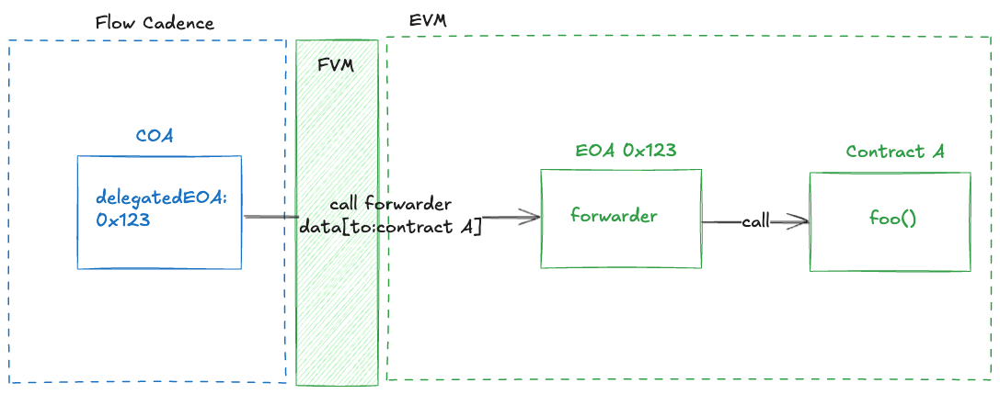

# FLIP NNN: EOA Upgrade

## Objective

Introduce ability to upgrade existing exeternally owned account (EOA) to the Cadence owned account (COA) with 
shared control from Cadence and private key.

An **EOA (Externally Owned Account)** is a standard Ethereum account managed by a private key, with no smart contract code. It can send transactions and hold assets, but cannot execute custom logic. The account's address is derived from the private key, and since this derivation is consistent across EVM-compatible blockchains, the same private key controls the same address on multiple chains.

A **COA (Cadence Owned Account)** is a smart contract wallet (SCW) on Flow EVM, controlled by a Cadence resource. Calls made from that contract are always authorized since they can only be triggered from the Cadence account that owns the resource. Furthermore, access to the SCW can also be authorized via EIP-1271, using a `isValidSignature` method that verifies signatures according to custom logic. On Flow EVM, this logic ensures the signature comes from the Cadence account that owns the resource linked to the SCW.

## Motivation

Users often bring their existing private keys from other EVM networks to Flow EVM and begin accumulating assets under the corresponding EOA. Later, they may realize they want the enhanced functionality that a COA provides, but migrating requires creating a new COA and manually migrating assets, which is inconvenient and error-prone. 

Additionally, there's a risk of confusion: COAs use a unique address derivation that doesn’t exist on other EVM networks, so users might mistakenly assume their COA address is controlled by their original private key elsewhere. To improve the developer and user experience, we aim to support seamless upgradability of EOAs into COAs.

COAs introduce conceptual and technical complexity that can be overwhelming for new users (while at the same time requiring new users to decide which to use upfront), and this complexity should be hidden behind a seamless experience. By enabling upgradability from EOAs to COAs, we allow developers to leverage the advanced capabilities of COAs while users continue interacting with familiar EOA-based accounts. When additional functionality is needed, the EOA can be transparently upgraded to a COA, preserving the user experience while unlocking the full potential of the Flow EVM.


## Design Proposal

An existing EOA should be able to optionally delegate control to a COA, creating a new account type called a **Shared Ownership Account (SOA)** - (name TBD WIP). This allows the EOA to retain its normal private key control while gaining access to the advanced functionality of a COA. 

At the same time, an SOA should remain fully controllable by the original private key, allowing transactions to be sent just as they would from a standard EOA.

Upgrading from an EOA to an SOA must be secure, explicitly authorized by the EOA's private key, and fully reversible. Downgrading back to a standard EOA should require only a signature from the original key, allowing the user to revoke COA control at any time.

The COA controlling the SOA can be either newly deployed or an existing one. In more advanced scenarios, multiple COAs could share control over a single EOA by enforcing rules through the delegated logic. 

This model improves flexibility and user experience by allowing smart contract capabilities to be layered onto EOAs without requiring users to migrate assets or change addresses.


## Setup

This upgrade mechanism is based on the newly introduced [EIP-7702](https://eip7702.io/), which allows an existing Externally Owned Account (EOA) to have code permanently associated with it (technically, by storing a pointer to a pre-deployed contract rather than deploying full bytecode). This enables the EOA to behave like a smart contract wallet (SCW) without changing its address or disrupting existing asset ownership.

By leveraging this mechanism, we can deploy a minimal SCW implementation that delegates control to a Cadence-Owned Account (COA). 

The deployed contract will include a simple forwarder call, which would allow for only the delegated COA source to call the forwarder `onlyDelegatedCOA`, and it would forward to the destination. 

An example implementation would look something like:

```jsx
function forwardTo(address target, bytes calldata data) external payable onlyDelegatedCOA returns (bytes memory) {
        require(target != address(0), "Target cannot be zero address");
                
        (bool success, bytes memory result) = target.call{value: msg.value}(data);
        
        if (!success) {
		        // revert reason
            if (result.length > 0) {
                assembly {
                    let returndata_size := mload(result)
                    revert(add(32, result), returndata_size)
                }
            } else {
                revert("Forward call failed");
            }
        }
        
        return result;
    }
```

For maximum compatibility with wallets and other receiver contracts the SCW would also implement [ERC-1271](https://eips.ethereum.org/EIPS/eip-1271), specifically through a custom `isValidSignature` function that verifies whether a signature or action was authorized by the linked COA. This allows the COA to validate and approve operations on behalf of the EOA in a secure, programmable way. 

Importantly, the original EOA private key remains valid and can still be used to sign and send transactions, preserving backwards compatibility while enabling a transition to COA control.

## Authorization

Now that we have an ability to forward the call coming from a specific COA source, we must make sure the COA resource knows about the EOA address with the forwarder. In order to do that we must store the EOA address on the COA as part of an upgrade functionality. 

There are two options we could take with this:

- we overwrite existing COA EVM address with the new EOA address
- we create additional optional field on COA that stores a delegated EOA address `delegatedEOA` (I prefer it)

This upgrade function has to also make sure the upgrade call was actually authorized by the EOA and signed with its private key, so others can’t fake this request. Furthermore we must make sure the request can’t be replayed and it can’t be spoofed. 

A proposed solution could involve a function on the COA that would check get the public key of the EOA, which it can use to derive the EOA address that will be used to set the `delegatedEOA` and it will also be used to verify the signed data.

The proof will be signed data with the private key generated using `ECDSA_secp256k1` and hashed using `KECCAK_256` both of which are supported in Cadence for verification.

The signed data format could be simple as:

```jsx
 Ethereum Signed Message:
 upgradeEOA-{COA address}-{EOA address}-{nonce}-{Flow block height}
```

Or even better it could support EIP-712 structure so it’s human readable in the clients.

The important parts in any schema are:

- action: `upgradeEOA` prevents any other actions to be triggered
- COA address: the COA that the EOA will delegate access to - this is needed to prevent using signed payload to give access to other COAs
- EOA address: the self EOA address that is used to upgrade to SOA
- nonce: increasing counter to prevent reply attacks
- Flow block height: current block height to guard against delayed delegation, meaning a signed delegation can have an expiration

This authorization would be coordinated through precompile CadenceArch so the EOA can call a function inside EVM called `upgradeCOA` with provided signed data and public key and the COA EVM address, that function would after validation call CadenceArch to call the `COA.upgradeEOA` function.

An example of upgrade EOA function on COA could look something like:

```jsx
access(all)
fun upgradeEOA(publicKey: [UInt8], proof: [UInt8]) {
    // TODO: we should probably add a nonce as well and maybe use EIP-712 for structured data
    
    // Derive Ethereum address from public key first
    // Remove the first byte (0x04 prefix) from uncompressed public key
    let publicKeyWithoutPrefix = publicKey.slice(from: 1, upTo: publicKey.length)
    let publicKeyHash = HashAlgorithm.KECCAK_256.hash(publicKeyWithoutPrefix)
    
    // Take the last 20 bytes as the Ethereum address
    let addressBytes = publicKeyHash.slice(from: 12, upTo: 32)
    
    let derivedAddress = EVMAddress(bytes: addressBytes.toConstantSized<[UInt8; 20]>()!)
    
    // Construct the message that should have been signed (match Go format)
    let message = "upgradeEOA-".concat(self.address().toString().toLower()).concat("-").concat(derivedAddress.toString().toLower())
    let messageBytes = message.utf8
    
    // Create the Ethereum-style signed message format
    let prefix = "\u{19}Ethereum Signed Message:\n".concat(messageBytes.length.toString())
    let fullMessage = prefix.utf8.concat(messageBytes)
    
    // Hash the full message with KECCAK_256
    let messageHash = HashAlgorithm.KECCAK_256.hash(fullMessage)
    
    // Verify the signature using the provided public key (without 0x04 prefix for Flow)
    let publicKeyObj = PublicKey(
        publicKey: publicKeyWithoutPrefix,
        signatureAlgorithm: SignatureAlgorithm.ECDSA_secp256k1
    )
    
    let isValidSignature = publicKeyObj.verify(
        signature: proof,
        signedData: messageHash,
        domainSeparationTag: "", // Empty for raw ECDSA
        hashAlgorithm: HashAlgorithm.KECCAK_256
    )
    
    if !isValidSignature {
       panic("Upgrade EOA: Invalid signature proof, message required: \(message), proof: \(String.encodeHex(proof))")
    }
    
    // Verify the derived address is an EOA (has no code)
    if derivedAddress.code().length > 0 {
        panic("Upgrade EOA: Derived address is not an EOA")
    }
    
    // Update the COA's address
    self.delegatedEO = derivedAddress.bytes
}
```

## Deauthorization

Maybe as important as authorization of upgrade is deauthorization (for lack of a better word) a way to make sure EOA alone can prevent COA to have the delegation over it. That is why we introduced a proxy forwarder contract on the EOA. Using EIP-7702 we can remove the proxy contract by signing a transaction with EOA private key. This would break the COA call to the forwarder. The COA should at that point be useless if it doesn’t participate in the deauthorization flow. 

Normal deauthorization Flow would involve a precompile Cadence arch function that would remove the `delegatedEOA` address, making the COA behave the same way as it did before. Of course, deauthorization would also have to check the request has been made by the EOA private key in a similar check than the authorization for upgrade.

 

## Interaction

An SOA keeps the functionality of sending transactions using EOA private key so that flow remains unchanged. After the upgrade, the existing COA will start forwarding all the calls to the EOA forwarder contract.





### Drawbacks

**Technical Complexity:**
- **Increased System Complexity**: The SOA model introduces a new account type that requires coordination between EVM execution layer and Cadence resource management
- **State Management**: Managing the relationship between EOA, COA, and SOA states adds complexity to account lifecycle management
- **EIP-7702 Dependency**: Relies on EIP-7702 implementation which adds another layer of dependencies and potential edge cases

**Security Concerns:**
- **Expanded Attack Surface**: New authorization/deauthorization flows create additional vectors for potential exploits
- **Key Management Risks**: Users must secure both their original private key and understand COA resource management

**User Experience Challenges:**
- **Conceptual Complexity**: Users must understand the relationship between EOA, COA, and SOA, which may be confusing

**Operational Risks:**
- **Irreversible Mistakes**: Incorrect delegation setup could lock users out of advanced functionality
- **Gas Cost Implications**: Forwarding calls through proxy contracts increases transaction costs

### Alternatives Considered

Several alternative approaches were evaluated for enabling EOA to COA transitions, each with distinct trade-offs regarding complexity, security, and user experience.

#### 1. Manual Asset Migration

**Approach**: Users manually transfer all assets from their EOA to a newly created COA.

**Advantages**:
- Simple implementation - no protocol changes required
- Clear separation of concerns - no hybrid account types
- Users maintain full control over migration timing and asset selection

**Disadvantages**:
- **User Experience**: Requires users to identify and manually transfer each asset
- **Cost**: Multiple transactions required, each incurring gas fees
- **Risk**: Potential for user error leading to lost assets or incomplete migrations
- **Address Change**: Users lose their familiar EOA address, breaking existing integrations

**Conclusion**: While simple, this approach places significant burden on users and doesn't address the core UX problem.

#### 2. Native Account Type Conversion

**Approach**: Implement a native Flow EVM feature to convert EOA accounts directly to COA accounts.

**Advantages**:
- Clean conversion with no hybrid states
- Potentially simpler implementation than delegation model
- Maintains single account paradigm

**Disadvantages**:
- **Irreversibility**: Once converted, users cannot revert to EOA functionality
- **Private Key Loss**: Original private key control would be completely replaced
- **Compatibility**: May break existing tools and integrations expecting EOA behavior
- **Implementation Complexity**: Requires deep changes to account state management

**Conclusion**: The irreversible nature and potential compatibility issues make this approach too restrictive.

#### 3. Proxy Contract with Full EOA Replacement

**Approach**: Deploy a proxy contract that completely replaces EOA functionality while maintaining the same address.

**Advantages**:
- Maintains address continuity
- Could provide more comprehensive smart contract functionality

**Disadvantages**:
- **Private Key Obsolescence**: Original private key would become useless
- **Wallet Incompatibility**: Standard wallets would no longer work with the account
- **Recovery Complexity**: Users would need new recovery mechanisms

**Conclusion**: This approach sacrifices too much backward compatibility for the benefits gained.

#### 4. Multi-Signature Account Upgrade

**Approach**: Convert EOAs to multi-signature accounts where both the original private key and COA resource can authorize transactions.

**Advantages**:
- Maintains private key functionality
- Provides enhanced security through multiple authorization requirements
- Clear authorization model

**Disadvantages**:
- **Transaction Complexity**: All transactions would require multiple signatures
- **User Experience**: Significantly more complex for simple operations
- **Gas Costs**: Higher costs due to multiple signature verification
- **Implementation Overhead**: Complex coordination between signature schemes

**Conclusion**: While secure, the added complexity for routine operations makes this approach impractical for most users.

#### 5. Chosen Approach: Shared Ownership Account (SOA)

**Rationale**: The SOA approach was selected because it provides:

- **Backward Compatibility**: Original private key continues to work normally
- **Reversibility**: Users can downgrade back to pure EOA if needed
- **Gradual Adoption**: Users can explore COA functionality while maintaining familiar EOA operations
- **Address Preservation**: No need to change addresses or migrate assets
- **Flexible Control**: COA can provide enhanced functionality when needed, EOA for simple operations

While this approach introduces complexity through the hybrid model, it provides the best balance of functionality, usability, and safety for users transitioning from EOA to COA capabilities.

### Performance Implications

The SOA implementation introduces measurable performance overhead across multiple dimensions of the system. Transaction execution experiences the most significant impact, as SOA transactions routed through COA functionality require additional call forwarding that adds approximately 2,000-5,000 gas per transaction compared to direct EOA calls. This overhead stems from the proxy pattern where calls must be validated and forwarded through the delegation mechanism.

From a storage perspective, each upgraded EOA necessitates deployment of a forwarder contract, consuming additional block space and node storage. The COA resources also require an additional storage slot for the `delegatedEOA` field, creating a persistent state footprint for each delegation relationship. While these storage requirements are relatively modest on a per-account basis, they accumulate as adoption increases across the network.

Network-level implications become apparent during periods of high SOA usage. The increased transaction complexity may reduce overall throughput by 3-5% during peak usage periods, as validators must perform additional verification steps and state lookups. However, this impact is offset by the reduced need for asset migration transactions that would otherwise be required for users transitioning from EOA to COA functionality.


### Dependencies

No dependencies.


### Tutorials and Examples

#### Example 1: Basic EOA to SOA Upgrade

**Scenario**: A user with an existing EOA wants to upgrade to gain COA functionality while keeping their familiar address.

**Step 1: Prepare COA Resource**
```cadence
// Deploy or use existing COA
transaction {
    prepare(signer: AuthAccount) {
        // Assume COA resource already exists at /storage/evm
        let coa = signer.storage.borrow<&EVM.CadenceOwnedAccount>(from: /storage/evm)
            ?? panic("COA resource not found")
        
        log("COA address: ".concat(coa.address().toString()))
    }
}
```

**Step 2: Generate Authorization Signature (Client Side)**
```javascript
// Using ethers.js or similar
const privateKey = "0x..." // User's EOA private key
const wallet = new ethers.Wallet(privateKey)
const eoaAddress = wallet.address
const coaAddress = "0x..." // COA address from Step 1
const nonce = 1 // Increment for each authorization
const blockHeight = await provider.getBlockNumber()

const message = `upgradeEOA-${coaAddress.toLowerCase()}-${eoaAddress.toLowerCase()}-${nonce}-${blockHeight}`
const signature = await wallet.signMessage(message)
const publicKey = ethers.utils.recoverPublicKey(ethers.utils.hashMessage(message), signature)
```

**Step 3: Execute Upgrade**
```cadence
transaction(publicKey: [UInt8], proof: [UInt8]) {
    prepare(signer: AuthAccount) {
        let coa = signer.storage.borrow<&EVM.CadenceOwnedAccount>(from: /storage/evm)
            ?? panic("COA resource not found")
        
        // This calls the upgradeEOA function shown in the design
        coa.upgradeEOA(publicKey: publicKey, proof: proof)
        
        log("EOA successfully upgraded to SOA")
    }
}
```

**Step 4: Deploy Forwarder Contract (EVM Side)**
```solidity
// This would be done via EIP-7702 transaction signed by EOA private key
// The forwarder contract is deployed to the EOA address
```

#### Example 2: Using SOA for Advanced Functionality

**Scenario**: User wants to set up recurring payments using their upgraded SOA.

```cadence
transaction(recipient: Address, amount: UFix64, interval: UFix64) {
    prepare(signer: AuthAccount) {
        let coa = signer.storage.borrow<&EVM.CadenceOwnedAccount>(from: /storage/evm)
            ?? panic("COA resource not found")
        
        // Use COA's advanced capabilities for recurring payments
        // This would interact with a recurring payment contract
        let calldata = EVM.encodeABIWithSignature(
            "setupRecurringPayment(address,uint256,uint256)",
            [recipient, amount, interval]
        )
        
        let result = coa.call(
            to: EVM.addressFromString("0x..."), // Recurring payment contract
            data: calldata,
            gasLimit: 100000,
            value: EVM.Balance(attoflow: 0)
        )
        
        log("Recurring payment setup successful")
    }
}
```

#### Example 3: SOA Deauthorization

**Scenario**: User wants to revoke COA control and return to pure EOA functionality.

**Step 1: Remove EIP-7702 Delegation (Client Side)**
```javascript
// Sign transaction to remove code from EOA address
const tx = {
    to: eoaAddress,
    value: 0,
    data: '0x', // Empty data removes the code
    // EIP-7702 specific fields to remove delegation
    authorizationList: []
}

const signedTx = await wallet.signTransaction(tx)
const receipt = await provider.sendTransaction(signedTx)
```

**Step 2: Update COA State**
This will also automatically be done via CadenceArch.

```cadence
transaction(publicKey: [UInt8], proof: [UInt8]) {
    prepare(signer: AuthAccount) {
        let coa = signer.storage.borrow<&EVM.CadenceOwnedAccount>(from: /storage/evm)
            ?? panic("COA resource not found")
        
        // Similar signature verification as upgrade, but for deauthorization
        coa.deauthorizeEOA(publicKey: publicKey, proof: proof)
        
        log("SOA successfully downgraded to EOA")
    }
}
```

The integration testing strategy encompasses comprehensive end-to-end validation covering the complete upgrade → usage → downgrade flow, ensuring that all state transitions work correctly under various conditions. Error condition testing focuses on invalid signatures, replay attacks, and edge cases that could compromise security or functionality. Performance testing under simulated load conditions validates that the system maintains acceptable response times and gas costs even during peak usage periods. Compatibility testing with existing wallets and dApps ensures that the SOA implementation doesn't introduce regressions or unexpected behavior in the broader ecosystem.


### Compatibility

The SOA implementation maintains full backward compatibility with the existing Flow ecosystem. All current EOAs and COAs continue to function exactly as before, with no changes required to existing smart contracts, transactions, or user workflows. The `delegatedEOA` field is implemented as an optional addition that doesn't affect existing operations.

Forward compatibility relies on EIP-7702 support and standard cryptographic primitives (ECDSA secp256k1, KECCAK-256) ensuring seamless integration with existing Ethereum tooling. Forwarder contracts implement ERC-1271 for broad ecosystem support. The gradual rollout approach allows incremental adoption without forcing changes on existing users or applications.


### User Impact

SOAs provide significant user experience improvements by enabling advanced smart contract capabilities while maintaining familiar EOA interfaces. Users gain access to programmable logic, automated transactions, and sophisticated DeFi features without migrating assets or changing addresses. The flexible control model allows choosing between simple EOA operations for basic transactions or COA functionality for complex operations, eliminating upfront commitment to advanced features.

Economically, SOAs eliminate asset migration costs and provide access to enhanced DeFi opportunities. Users can choose the most cost-effective execution path for each transaction type, though SOA transactions may have slight gas cost variations due to proxy forwarding.

The main challenges involve conceptual complexity around the dual control model, where users must understand EOA, COA, and SOA relationships while managing both private key and COA resource access. Security considerations expand as users must secure both control mechanisms and understand authorization processes for upgrade/downgrade operations. Recovery scenarios become more complex if access to either mechanism is lost.

Operationally, users need enhanced monitoring tools to track activity across both execution paths. The adoption strategy focuses on gradual rollout with comprehensive education and support systems.