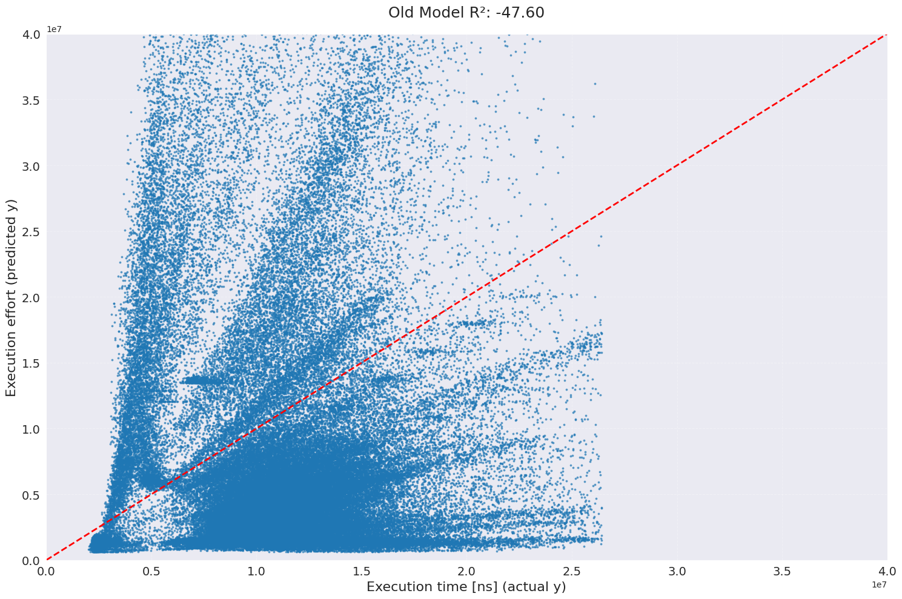
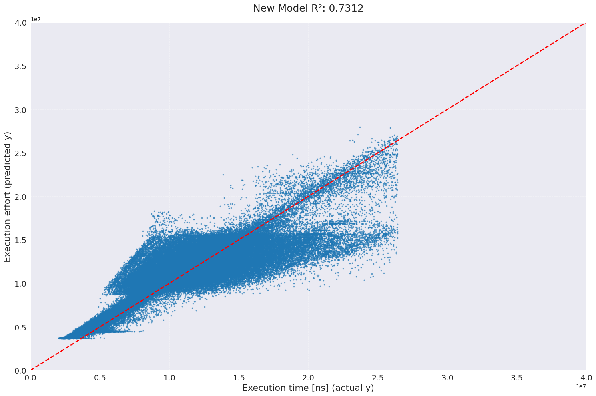

# FLIP 346: Execution effort calibration II.

## Objective

This FLIP proposes an update to Flow’s execution effort weights, originally introduced in [FLIP 660: Variable Transaction Fees](https://github.com/onflow/flips/blob/main/protocol/20211007-transaction-fees.md#flip-660-variable-transaction-fees). The update reflects changes in the execution environment and expands coverage to a broader set of actions possible within Cadence on Flow.

The goals are to:

- Improve **fee fairness** by better aligning costs with actual resource usage.
- Strengthen **network stability** and resilience to resource exhaustion attacks.
- Provide a transparent methodology for future calibrations.
- Minimize the impact of this change to existing users

## Motivation

### Calibrating Execution Effort Weights

Execution effort is a deterministic estimate of how long a transaction takes to execute. It is computed by accumulating effort contributions every time a transaction or script invokes a **feature** (e.g., “get value from storage”). Each feature has an associated **weight**, which represents its relative cost. The contribution is calculated as:

```math
\text{execution\_effort} \;=\; \text{intensity} \times \text{feature\_weight}
```

where *intensity* represents the magnitude of the action (e.g., number of bytes read from storage).

The existing weights were established under earlier performance conditions, and since then the efficiency of transaction execution has improved substantially. Consequently, the legacy weights no longer provide an accurate representation of execution effort, resulting in transaction fees that do not accurately reflect the actual computational resources consumed.

The aim of calibration is to adjust these weights so that execution effort is **proportional** to actual execution time. Absolute alignment to wall-clock time is less important, since performance can vary across machines. What matters is relative proportionality: if transaction A takes twice as long to execute as transaction B, its execution effort should also be roughly twice as large.

Accurate modeling of execution effort benefits both users and the network:

- **For users**: fees become fairer, smaller operations cost less, and more lightweight actions can fit into a single transaction.
- **For the network**: improved defense against compute-exhaustion attacks and more reliable upper bounds on transaction execution time.

### Tooling for Future Calibration

A secondary objective of this FLIP is to improve the **tooling** that supports calibration. The goal is to streamline future recalibrations of execution effort weights, making the process more repeatable and less manual as the Cadence language and Flow protocol evolve.

## Methodology

### Data Generation and Collection

To calibrate execution effort weights, a broad and representative dataset of Cadence transactions was required. A new transaction loader was developed to generate pseudo-randomized transactions from a library of 73 independent templates. These templates exercise a wide range of Cadence features, ensuring broad model coverage beyond typical user traffic.

Using this loader, we collected approximately 1,000,000 pseudo-random transactions on a dedicated test network configured to closely match mainnet parameters.

In addition, a sample of live mainnet traffic was collected to determine the overall execution effort throughput of the network.

- Approximately a day of transaction activity, covering about 550,000 user (non-system) transactions, were recorded on mainnet26.
- Approximately a day of transaction activity, covering about 624,000 user (non-system) transactions, were recorded on mainnet27.
- These measurements provide a baseline of computation throughput on mainnet26 and sample transactions for analysis of the calibration results on mainnet27.

### Feature Instrumentation

For each transaction, the following data was collected:

- **Execution time** (nanoseconds) measured at the VM level.
- **Feature intensities**, i.e., counts or magnitudes of each Cadence operation (e.g., number of storage reads, array operations, cryptographic calls, etc.).

Each intensity corresponds to a modeled “feature” that contributes to execution effort.

### Data Preprocessing

To reduce noise:

- Transactions with anomalously high runtimes (top 1% tail) were excluded.
- **Execution time** was collected from all foundation run ENs (3) and only the smallest **Execution time** was taken. This further reduces the **Execution time** error.

### Model Fitting Approach

The calibration task was formulated as a **linear regression problem**:

```math
\text{execution time} \;\approx\; \sum_{i=1}^{n} \big( \text{feature\_intensity}_i \times \text{feature\_weight}_i \big)
```

To ensure interpretability and stability:

- **ElasticNet regression** was used, combining L1 (sparsity) and L2 (ridge) regularization.
- **Positive weight constraints** were enforced, since execution costs cannot be negative.
- Highly correlated features (Pearson > 0.9) were flagged and either consolidated or carefully monitored to avoid multicollinearity.

### Validation Strategy

The dataset was randomly split into training and test sets (90% / 10%). Model performance was evaluated on the test set using:

- **R² and residual analysis** to confirm proportionality of predicted effort to measured runtime.
- **Cross-validation** across random splits to ensure robustness.
- Comparison against **organic traffic** to verify alignment with real user transactions.

This methodology yields a reproducible process for deriving execution effort weights, while keeping the model interpretable and resilient to noise. Detailed results and fitted weights are presented in the following chapter.

### Conversion Factor Adjustment for Constant Execution Effort

The calibration process not only produces new execution effort weights but also requires a re-evaluation of the **conversion factor between time and computation**.

Originally, Flow defined the maximum transaction execution time as **1 second**, corresponding to **9,999 computation = 9,999 × 65,536 CU**. This setting was chosen when Cadence operations were significantly more time-intensive and metering accuracy was limited.

With the improved calibration and more precise metering, this FLIP proposes to reduce the maximum available execution time per transaction in a controlled and deliberate manner, while minimizing impact on users.

The new conversion factor is:

- **9,999 computation = 333.4 ms**

This change effectively reduces the average computation throughput per transaction on mainnet by **71%** and at the same time, it maintains near-complete compatibility with existing workloads — allowing **99.995% of user transactions** (of a sample of 624,000 transactions) to continue executing successfully without hitting computation limits.

## Model comparison

Below are the two scatter-plots of estimated execution time compared to actual execution time for the current fee model and the proposed fee model.

- Current model



- Proposed model



## Impact

### User Impact

The recalibrated weights deliver fairer and more proportional pricing for transactions. Users benefit in two main ways:

1. Lower costs for common transactions

    Many everyday operations are now significantly cheaper in terms of computation:

    - **Flow token transfer**: reduced from 27 → 19 computation
    - **Single NFT transfer (NFL)**: reduced from 48 → 26 computation
    - **EVM token transfer**: reduced from 143  → 28 computation

    This makes lightweight operations more affordable and allows users to bundle more actions within a single transaction. (Rarer operations do see an increase, such as account creation going from 19 → 41.)

2. Increased EVM gas capacity
    - The maximum EVM gas that fits within a Flow transaction has increased from 50 ****million → 220 million. (Note that, to match the behaviour of the Fusaka update to Ethereum, each _EVM transaction_ is limited to 16 million gas. This increase is still notable, since a single Cadence transaction can include multiple EVM transactions. A single Cadence transaction has more gas capacity than an entire Ethereum block...)
3. Decreased max transaction time from 1000ms to 333.4ms

### Network Impact

The network benefits from greater stability, resilience, and predictability:

- **Improved security**: calibration closes several potential vectors for **resource exhaustion attacks**, reducing the risk of denial-of-service via cheap but costly operations.
- **Tighter execution bounds**: with weights now more accurately reflecting real execution time, the system can enforce transaction and block execution limits more reliably. This ensures that block production remains timely and prevents runaway execution.

## Future of the Model

The updated methodology significantly simplifies the process of recalibrating execution effort weights. Going forward, calibration should be re-run whenever:

- Protocol or runtime changes may affect execution performance.
- New execution effort weights are introduced, or existing ones are modified.

While the current model provides strong overall alignment, differences remain across certain templates in how well they fit the regression. Templates with weaker fit warrant further investigation to determine whether the discrepancies arise from modelling limitations, template design, or underlying execution semantics.

Looking ahead, the goal is to further automate and strengthen the calibration process:

- **Automatic calibration on new versions**: each new protocol or runtime release should trigger an automatic re-calibration run, ensuring weights remain consistent with execution behavior.
- **Continuous monitoring** (longer term): calibration should evolve into a system that continuously tracks live transaction data, flags outliers, and detects weight drift over time.

Continued iteration on both the calibration process and template coverage will help ensure the model remains accurate, fair, and resilient as Flow evolves.

## Q & A

**Q:** How can I test my app with new metering?

The new weights will be deployed to emulator and testnet before they are deployed on mainnet.

**Q:** How will this change the maximum and minimum transaction fees?

1. Minimum and maximum fees for a transaction will be the same.
2. In general the fees for transactions should be lower.
