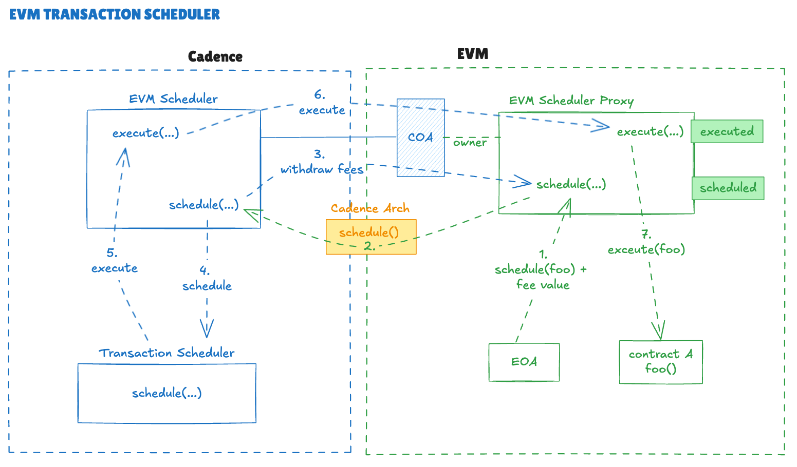

# FLIP 348: EVM Scheduled Transactions

# Objective

Scheduled transactions on the Flow blockchain enable smart contracts to autonomously execute predefined logic at specific future times without requiring continuous off-chain triggers. This functionality is currently provided by the Cadence `FlowTransactionScheduler` contract.

The limitation today is that **Flow’s EVM environment cannot directly access this scheduler**, meaning that Solidity contracts deployed in Flow EVM cannot natively leverage scheduling.

The objective of this document is to explore a design that would **expose Flow’s scheduling feature to the EVM world**. 

# EVM Scheduler Design

The implementation of the **EVM Scheduler** introduces new components that integrate with the existing `FlowTransactionScheduler` contract to enable the scheduling and execution of EVM transactions on Flow. The design ensures coordination between Cadence and Solidity contracts, enabling reliable scheduling, execution, and status tracking of cross-environment transactions.

## Components

### 1. FlowTransactionScheduler (Existing, Unchanged)

- **Description**: The existing and unchanged Flow transaction scheduler contract.
- **Role**:
    - Provides the scheduling and triggering mechanism for transaction execution.
    - Remains unchanged and serves as the base scheduler on Flow.

---

### 2. EVM Scheduler (New, Cadence Contract)

- **Description:** A Cadence contract that bridges EVM transactions into the Flow scheduling framework, intended to be called by Cadence Arch. It defines a schedule function that does not track transaction details, only reserving an execution slot based on effort. During execution, control passes to the Solidity scheduler proxy, which holds the full transaction context. This separation of concerns ensures that scheduling is only possible through the EVM scheduler proxy and data is deduplicated. 
- **Responsibilities**:
    - Registers transactions with the `FlowTransactionScheduler`.
    - Registers itself as the transaction handler in the `FlowTransactionScheduler`
    - Stores data for EVM transaction execution (gas limit, fees)
    - Withdraws EVM Flow tokens into Cadence during scheduling
- **API:**
    - The access is restricted to `access(self)` to ensure only the system call can execute it, this means only the FVM will be able to invoke it through Cadence Arch.
    - The contract also implements the `FlowTransactionScheduler.Handler` interface which is used during execution by the Flow transaction scheduler contract.
    
    ```jsx
    access(all) interface EVMScheduler {
    	// Schedules a new EVM transaction
    	// - timestamp: timestamp for scheduled transaction
    	// - priority: priority of the transaction
    	// - gasLimit: maximum gas allowed for execution
    	// - fees: Flow tokens to fund the scheduling
    	// Returns: an ID of the scheduled transaction
    	access(self) fun schedule(
    		timestamp: Uint64, 
    		priority: Priority, 
    		gasLimit: UInt64, 
    		fees: UFix64
    	): UInt64
    }
    ```
    

---

### 3. EVM Scheduler Proxy (New, Solidity Contract)

- **Description**: An EVM Solidity contract for interacting with the EVM Scheduler using Cadence Arch. The owner of the contract must be the EVM Scheduler COA.
- **Motivation**: Direct calls to the EVM Scheduler via Cadence Arch are possible but since they cannot pay for the operation, they will fail. The proxy enables additional features that ensure observability, fund management, and user control. It also stores all the scheduled transaction data that will be used during execution. It can add an overhead in fees for storing that data.
- **Responsibilities**:
    - Stores EVM transaction data (handler address, owner, args…)
    - Emits events in the EVM layer during scheduling and execution.
    - Forwards funds to the Cadence Owned Account (COA), enabling withdrawal into Cadence EVM Scheduler.
    - Supports transaction cancellation (without refunds) prior to execution.
    - Exposes status retrieval functions for tracking execution outcomes.
- **API:**

    ```solidity
    /// @notice Handler interface that contracts must implement to receive scheduled callbacks
    interface IScheduledTransactionHandler {
        /// @notice Called by the scheduler when a scheduled transaction executes
        /// @param id The scheduled transaction ID
        /// @param data Arbitrary data passed during scheduling
        function executeTransaction(uint64 id, bytes calldata data) external;
    }

    interface IFlowTransactionScheduler {

        enum Priority {
            High,
            Medium,
            Low
        }

        enum Status {
            Unknown,
            Scheduled,
            Executed,
            Canceled
        }

        event Scheduled(
            uint64 indexed ID,
            address indexed handler,
            address indexed owner,
            uint8 priority,
            uint256 timestamp,
            uint64 gasLimit,
            uint256 fees,
            // add indexed calldata - check for cost
        );

        event Executed(
            uint64 indexed ID,
            address indexed handler
        );

        event Canceled(
            uint64 indexed ID,
            address indexed handler
        );

        /// @notice Schedule a transaction for future execution
        /// @param handler Address of the handler contract (must implement IScheduledTransactionHandler)
        /// @param cdata Arbitrary data to pass to the handler's executeTransaction function
        /// @param timestamp Desired execution timestamp
        /// @param priority Transaction priority level
        /// @param gasLimit Gas limit set on execution
        /// @return id Scheduled transaction ID
        /// @return timestamp Actual scheduled timestamp
        /// @return ok Whether scheduling succeeded
        function schedule(
            address handler,
            bytes cdata,
            uint64 timestamp,
            Priority priority,
            uint64 gasLimit
        ) payable external returns (uint64 id, uint64 timestamp, bool ok);

        /// @notice Estimate fees and validate scheduling parameters
        /// @param data Encoded data for the transaction
        /// @param timestamp Desired execution timestamp
        /// @param priority Transaction priority level
        /// @param gasLimit max gas used
        /// @return fee Estimated fee in wei
        /// @return timestamp Actual scheduled timestamp
        /// @return ok Whether parameters are valid
        function estimate(
            bytes calldata data,
            uint64 timestamp,
            Priority priority,
            uint64 gasLimit
        ) external view returns (uint64 fee, uint64 timestamp, bool ok);

    	/// @notice Cancel existing scheduled transaction, msg.sender must match the caller of schedule()
    	/// @param id ID of the scheduled transaction
    	function cancel(uint64 id) external;

        /// @notice Get the status of a transaction
        /// @param id Transaction ID
        /// @return status Current status of the transaction
        function getStatus(uint64 id) external view returns (Status status);

        /// @notice Executes a scheduled transaction by its ID (internal, called by scheduler)
        /// @param id The identifier of the scheduled transaction
        function execute(uint64 id) external;
    }
    ```
    

---

### 4. Cadence Arch Functions (New Functions)

- **Description**: New EVM functions to facilitate cross-environment scheduling.
- **Functions**:
    - **schedule**: Accepts arguments needed for transaction scheduling. Returns a new scheduled transaction ID. Defines an overhead of gas needed to pay for this action, independent of the gas needed for later execution of transaction.
    - **estimate**: Provides cost estimation for scheduling a transaction initiated from the EVM, enabling users to predict and provision fees accurately.
- **API:**
    
    ```go
    type EVMScheduler interface {
    
        Schedule(timestamp uint64, priority Priority, gasLimit uint64, fee uint64) (uint64, error)
    
        Estimate(timestamp uint64, priority Priority, gasLimit uint64, data any) (uint64, error)
    }
    ```
    

---

## Scheduling Workflow

Scheduling involves coordination between all the above components and should be initiated from EOA using the EVM Scheduler proxy Solidity contract.

1. **EOA**
    1. Submits an EVM transaction that calls the EVM Scheduler Proxy with all required arguments as well as the amount needed to pay for execution.
2. **Solidity EVM Scheduler Proxy**
    1. The EVM Scheduler Proxy receives a scheduling request in Solidity with all arguments (handler address, data, priority, timestamp, gas limit). It stores the arguments internally and it also records the sender as the owner of the transaction data.
    2. If provided funds are sufficient, it forwards them to the EVM Scheduler COA.
    3. Call EVM Scheduler using the Cadence Arch function invocation and pass only gas limit for execution allocation.
    4. Records the ID it receives from the Cadence Arch invocation and map it to the previously stored transaction arguments. 
    5. Emit a new “Scheduled” event with the received ID.
3. **Cadence Arch Function**
    1. Forwards the call to the EVM Scheduler passing over only gas limit.
4. **Cadence EVM Scheduler**
    1. The schedule function is invoked, which internally stores the gas limit.
    2. It withdraws the funds from EVM to a vault it will use to schedule with Flow transaction scheduler.
    3. If the funds were successfully withdrawn, it calls the Transaction Scheduler schedule function and provides the funds, priority, effort limit (converted from gas limit), and timestamp. For the handler, it provides its own function. It doesn’t forward any other EVM data.
    4. It records the scheduled transaction ID it received from the Transaction scheduler contract.
5. **Transaction Scheduler**
    1. Handles scheduling as it would for any other transaction.

--- 




*The complete flow depiction for scheduling and execution (each arrow is marked with number representing the step in the process).*

## Execution Workflow

Execution is initiated by the Transaction Scheduler once the timestamp of the scheduled transaction is reached. 

1. **Transaction Scheduler**
    1. Calls the EVM Scheduler handler method with the ID and empty data
2. **Cadence EVM Scheduler**
    1. The handler method is invoked with the ID. Internally it checks the mapped EVM transaction data to the ID. 
    2. It constructs the ABI-encoded data with the EVM Scheduler proxy `execute(id)` function signature and the transaction ID as an argument.
    3. It uses COAs direct call with previously encoded data, and it sets the gas limit on the call that matches the gas limit provided during schedule.
    4. Garbage collects the EVM transaction data after the call is made.
3. **EVM Scheduler Proxy**
    1. Checks that the execute was called by the contract owner (COA).
    2. Checks that the passed ID exists and was not canceled.
    3. Retrieves the stored handler address and transaction data for the ID.
    4. Calls the handler's `executeTransaction(uint64 id, bytes cdata)` function with the transaction ID and stored data.
    5. If the execution fails it stores failed status for the ID.
    6. Emits an executed event.
    7. Garbage collects the transaction data. 

## Cancellation Workflow

Cancellation follows a circuit-breaker pattern. Execution is still initiated on the Cadence side, but the EVM Scheduler Proxy drops it, preventing the EVM callback from running. 

This effectively cancels execution on the EVM side but without a refund, since Cadence has already executed its portion. Because Cadence Arch cannot authorize calls or forward environment data (such as `msg.sender`), it cannot enforce authorization for cancellation at the Cadence side. As a result, a scheduled transaction cannot be fully canceled. 

While refunding would be theoretically possible, it adds significant complexity that is not desirable at this stage.

1. **EOA**
    1. Submits a cancellation transaction to the EVM Scheduler Proxy with the target ID.
2. **EVM Scheduler Proxy**
    1. Verifies that the transaction owner matches the sender.
    2. Deletes the ID and associated transaction data from its internal mapping.

## Implementation Benefits

The proposed approach delivers several key benefits:

- **Single source of truth**: Scheduling and execution logic remain centralized in the existing Flow scheduler contract. By avoiding a reimplementation in Solidity, we reduce the surface for bugs, simplify maintenance, and ensure that all configuration changes are managed in one place. Cadence remains the authoritative source of truth.
- **Lazy execution**: EVM contracts are only executed when a scheduled transaction exists, so the Flow transaction scheduler incurs no additional overhead when no EVM transactions are pending.
- **Non-intrusive design**: The existing Flow transaction scheduler remains unchanged. Only lightweight Cadence Arch functions and two adapter contracts are introduced, minimizing complexity.
- **Reused effort reserve**: The same execution effort reserve mechanism used in Cadence applies to EVM scheduling, enabling priority execution and preserving existing scheduling capabilities.

## Implementation Limitations and Security Concerns

The primary limitation of this design is the absence of refundable cancellation. Once a transaction is scheduled on Flow, its Cadence callback cannot be revoked. Although execution can be stopped on the EVM side, the resources reserved for Cadence execution are still consumed. Cancellation therefore only prevents the EVM callback, not the underlying Cadence cost.

The new APIs also introduce security considerations. The Cadence Arch `schedule` function is designed to be called exclusively by the Solidity EVM Scheduler Proxy, but in practice any account could invoke it. Successful scheduling, however, requires funds in the EVM Scheduler’s Cadence Owner Account (COA), which prevents most unauthorized use. An attacker could pre-fund the COA and schedule a transaction, yet execution would fail since the proxy would not recognize the transaction ID. This might leave gaps in the proxy’s ID mapping but would not compromise functionality beyond wasted resources.

To guarantee execution integrity, the EVM Scheduler Proxy must consistently maintain the mapping between transaction IDs and their metadata. IDs must only be created through the proxy and registered only by the COA, ensuring that no transaction can be executed unless it was scheduled through the intended flow.

# Alternatives

There were multiple alternatives considered, some of which proved to be unviable, most elegant ones due to limitation of Cadence Arch authorization mechanism. The Cadence Arch is a precompile that must follow the [EVM precompile interface](https://github.com/ethereum/go-ethereum/blob/1487a8577d1566497e161a04f8cee3204d4b3d36/core/vm/contracts.go#L52) and unless we fork the EVM we can not introduce more arguments to it. Forking of EVM is not acceptable at this point.

### Solidity-Based Scheduler

This approach implements an EVM-native scheduler contract, written in Solidity and deployed on Flow EVM. It mimics the functionality of `FlowTransactionScheduler` but within Solidity’s execution environment.

**The scheduler contract**:

- Allows users to `schedule()` callbacks with target, calldata, gas limit, and deposit.
- Stores scheduled transactions in an array.
- Provides a `process()` function that executes all scheduled transactions due

**Execution flow:**

- The Cadence scheduler’s `process()` would also trigger this EVM contract’s `process()` with a maximum gas limit
- EVM Scheduler would internally execute all scheduled transactions that are due each in its own try/catch block so they wouldn’t influence each other

**Disadvantages**

- **Extra Effort Reserve:** We can’t share reserved execution effort for scheduling transactions defined in Cadence, so we would have to reserve extra effort for EVM only.
- **Overhead**: `process()` must be executed on every Flow block, regardless of whether scheduled callbacks exist. This adds cost to execution of process, which is cost added to every Flow block.
- **Duplication**: Full scheduling logic must be reimplemented and maintained in Solidity. Any updates in Cadence scheduling logic must be mirrored in Solidity to stay consistent as well as config updates.

**Overhead Cost Analysis**

Analysis of the cost for the most common check performed on each call to the process, which results in no transactions to be executed. 

```solidity
    function needsToExecute() external view returns (bool) {
        // ---- Gas breakdown ----
        // SLOAD scheduledTimestamp:
        //   ~2100 gas (cold) / ~100 gas (warm) - but normally cold
        //
        // TIMESTAMP opcode (block.timestamp):
        //   2 gas
        //
        // Comparison (>):
        //   ~3 gas
        //
        // Total: ~2200 gas (cold)

        return scheduledTimestamp > block.timestamp;
    }
```
Analysis:
- EVM Code Gas usage: `2200 gas` 
- Intrinsic Gas: `21000 gas` 
- Total Gas: `23200 gas`
- Execution effort: `23200 * 1/5000 = 4.46`


### Dependencies

This proposal introduces dependencies across multiple layers of the Flow ecosystem:

**Infrastructure**:
- **Cadence Arch**: New precompile functions (`schedule`, `estimate`) must be implemented in the EVM runtime to bridge Solidity calls to Cadence.
- **Flow Transaction Scheduler**: No changes required. The existing scheduler serves as the foundation for EVM scheduling.

**Contracts**:
- **EVM Scheduler (Cadence)**: New contract that bridges EVM transactions into Flow's scheduling framework.
- **EVM Scheduler Proxy (Solidity)**: New contract that provides the EVM-facing API and manages transaction metadata.

**Tooling and Observability**:
- **Block Explorers**: Should index scheduled transaction data by listening to `Scheduled`, `Executed`, and `Canceled` events emitted by the EVM Scheduler Proxy contract. This enables developers to query and monitor scheduled transactions.
- **RPC Nodes**: Standard `eth_getLogs` queries can retrieve scheduling events without additional modifications.
- **Developer Tools**: Existing Solidity toolchains (Hardhat, Foundry, etc.) work without modification since the scheduler uses standard EVM patterns.

**Documentation**:
- API reference documentation for the EVM Scheduler Proxy interface
- Integration guides for contract developers
- Explorer integration specifications for indexing scheduled transactions


### Tutorials and Examples

The following example demonstrates a minimal implementation of scheduled transaction handling. The contract implements a handler function that gets called when the scheduled transaction executes.

```solidity
// SPDX-License-Identifier: MIT
pragma solidity ^0.8.0;

import "./IFlowTransactionScheduler.sol";

/**
 * @title HelloScheduler
 * @notice A minimal example showing how to schedule and handle transactions
 */
contract HelloScheduler is IScheduledTransactionHandler {
    IFlowTransactionScheduler public scheduler;

    event TransactionExecuted(uint64 indexed id, bytes data);

    constructor(address _scheduler) {
        scheduler = IFlowTransactionScheduler(_scheduler);
    }

    /**
     * @notice Handler function called by the scheduler when the transaction executes
     * @dev This function must be implemented as part of IScheduledTransactionHandler
     * @param id The scheduled transaction ID
     * @param data The calldata passed during scheduling
     */
    function executeTransaction(uint64 id, bytes calldata data) external override {
        emit TransactionExecuted(id, data);
    }

    /**
    * Schedule the transaction in the future. We have called the estimate() beforehand 
    * to figure ou the msg.value we use in this transaction.
    **/
    function scheduleGreeting(
        uint64 timestamp,
        IFlowTransactionScheduler.Priority priority,
        uint64 gasLimit,
        bytes memory message
    ) external payable returns (uint64) {
        (uint64 id, uint64 scheduledTime, bool ok) = scheduler.schedule{value: msg.value}(
            address(this),  // handler address (this contract)
            message,        // data to pass to executeTransaction
            timestamp,      // when to execute
            priority,       // execution priority
            gasLimit        // gas limit for handler
        );

        require(ok, "Scheduling failed");
        return id;
    }
}
```

**Usage Flow**:
1. Deploy the `HelloScheduler` contract with the EVM Scheduler Proxy address
2. Call `scheduleGreeting()` with a future timestamp, priority, gas limit, and message data (plus sufficient ETH to cover fees)
3. The scheduler will automatically call `executeTransaction(id, message)` at the specified time
4. The handler emits an event with the transaction ID and data

**Key Points**:
- Handler contracts must implement the `IScheduledTransactionHandler` interface
- The scheduler always calls the predefined `executeTransaction(uint64, bytes)` function
- The `data` parameter passed during scheduling is forwarded to `executeTransaction`


### Compatibility

This proposal is fully backwards compatible and introduces no breaking changes:

**EVM Compatibility**:
- Standard Solidity patterns (interfaces, events, payable functions) are used throughout
- No modifications to the EVM execution model or opcodes
- Existing contracts continue to function without any changes

**Flow Ecosystem Compatibility**:
- The existing `FlowTransactionScheduler` contract remains unchanged
- Cadence scheduling functionality is unaffected
- No impact on transaction execution, block production, or consensus

**Novel APIs**:
- The `IFlowTransactionScheduler` interface introduces functionality not present in standard EVM environments
- Contracts using this interface will be Flow-specific and cannot be deployed to other EVM chains without modification
- Standard Solidity tooling (compilers, linters, testing frameworks) works without modification since the interface uses standard Solidity syntax


### User Impact

**Smart Contract Developers**:
- Gain access to native scheduling capabilities without relying on off-chain infrastructure (e.g., Chainlink Keepers, centralized cron services)
- Can build autonomous contract systems that execute logic at predetermined times
- Reduce operational complexity and improve decentralization for time-dependent applications

**Application Developers**:
- New use cases become possible: vesting schedules, automated liquidations, recurring payments, time-locked governance actions
- Can rely on Flow's execution guarantees rather than external keeper networks
- Improved user experience for applications requiring scheduled actions

**End Users**:
- Access to new DeFi and automation features built on scheduled transactions
- Reduced dependency on centralized scheduling services
- Transparent, on-chain scheduling with event-based monitoring

**Migration Path**:
- Existing contracts continue to work without modification
- Developers can opt-in to scheduling functionality by integrating the new interface
- No forced upgrades or breaking changes


## Related Issues

**Out of Scope**:
- **Refunds on Cancellation**: Full refunding of scheduled transaction fees when canceled is technically feasible but adds significant complexity. This is deferred to a future proposal.

