# FLIP NNN: Execution effort calibration III.

## Abstract

Successor to **FLIP-346** (_Execution Effort Calibration II_), recalibrating Flow's per-kind execution-effort weights for FVM and runtime changes since FLIP-346 shipped. Methodology: a **joint non-negative least-squares fit** against the live mainnet scrape (**3.39 M** user transactions) and the migrationtestnet synthetic-load scrape (**0.22 M** labelled transactions), aligned to a common mainnet-hardware timescale via the published **2025 weights**.

The proposed fit (α = 0.40) lifts mainnet per-transaction R² from **0.15** to **0.80** and cuts mean absolute relative error from **88.6 %** to **37.4 %** (vs raw **2025 weights**; HW-adjusted comparison in §5.3). It retains **52 of 71 union kinds**; the remaining 19 are catalogued in the four-bucket exclusion ledger (§3). GroupKFold cross-validation holding out entire **transaction groups** stays at R² = 0.81 ± 0.01 on the synthetic side but drops to **0.67 ± 0.21** on mainnet (range 0.39–0.93), with the spread driven by a small set of tail fingerprints (§6). A 100-resample bootstrap confirms the top-10 weights are all **`stable_nonzero`** with CIs inside ±5 % of the point estimate, except `update_account_contract_code` (≈ ±15 %); full per-kind table in §5.4.

The largest moves vs **2025 weights** are **`blsaggregate_public_keys: +15,755 %`**, **`blsaggregate_signatures: +13,743 %`**, **`uint_parse: +2,587 %`**, **`int_parse: +2,550 %`**, and **`loop: +2,396 %`**. The hardware factor $c_{\text{main}} = 5.09$ confirms **2025 weights** under-predicted mainnet wall-clock times by ~5× (cause analysis in §2.5). Under the new weights, **0.49 %** of mainnet transactions (16,499 of 3.39 M, ~90 % from a single fingerprint) would exceed the production cap of 9999, vs FLIP-346's 0.003 %. Excluding cap-exceeders and holding the mix constant, per-transaction fee revenue rises **+443.8 %** (mean **+1.03 × 10⁻² FLOW** per kept tx) under the FLIP-351 companion fee schedule ([onflow/flips#352](https://github.com/onflow/flips/pull/352)).

## 1. Motivation

### 1.1 What changed since FLIP-346

Between FLIP-346 acceptance (2025-10-08) and the data freeze for this recalibration, Flow shipped **Mainnet 27 (Forte)**, deployed the FLIP-346 weights themselves, and ran a sequence of **Mainnet 28** height-coordinated upgrades. The period also included roughly two dozen Cadence releases (v1.8.2 → v1.10.2). Each change below shifts the mix of computation kinds in production traffic, the cost of individual kinds, or both.

- **FLIP-346 weights deployed live** (flow-go v0.43, Nov 2025). The mainnet sample in this document is post-deployment, so **2025 weights** is the live baseline.
- **EVM made unconditional** on every execution node, followed by a multi-PR EVM-cost optimization wave that lowers per-call computation for ABI encode/decode, `dryCall`, and several other common EVM functions.
- **Cadence VM (compiler-based runtime) reached the execution path**, replacing the AST interpreter on hot paths. Per-kind execution time at fixed intensity changes; per-kind intensity does not.
- **`atree` storage layer rewritten** across multiple releases (v0.12 → v0.16), changing storage-read and slab-construction kind costs.
- **New computation kinds instrumented**, notably BLS aggregation (`blsaggregate_public_keys`, `blsaggregate_signatures`, `blsverify_pop`), additional parsing primitives, and `get_account_balance`. These appear non-zero in the migrationtestnet synthetic load but rarely or never in the mainnet scrape (see §2.3), and they dominate the largest weight moves in §4.

### 1.2 Why the joint mainnet + migrationtestnet approach

FLIP-346 fit weights on the migrationtestnet synthetic load and used mainnet only for validation. That choice was forced by the data available at the time (the rapid cadence of flow-go, Cadence, and `atree` releases left no contiguous mainnet window long and stationary enough to fit against), and it had the side-effect of minimizing error on a distribution that does not look like production traffic. This recalibration benefits from a longer post-Forte stabilisation window where mainnet _is_ fittable.

This recalibration fits jointly against both datasets, with their roles intentionally split:

- **Mainnet anchors the production distribution.** The objective is to predict execution time on the transaction mix users actually submit. Mainnet rows dominate the joint row count and carry the natural co-occurrence patterns of computation kinds as they appear together in real transactions.
- **Migrationtestnet fills coverage gaps.** A handful of kinds (notably the BLS aggregation primitives flagged in §1.1) barely show up on mainnet. The synthetic load supplies the orthogonal samples needed to identify their weights at all.

The two scrapes ran on different hardware, so timings are reconciled to a common mainnet-hardware scale before fitting (§2.5), and a row-weight blend `α` then trades off how much each dataset contributes to the loss (§2.6). This calibration uses `α = 0.40` (a slight mainnet lean).

---

## 2. Methodology

### 2.1 Data sources

Two scrapes drive the joint fit, both captured during **April–May 2026** against flow-go **v0.48.0-rc.1**:

- **Mainnet (3,386,055 transactions).** User-submitted transactions; preprocessing per §2.4.
- **Migrationtestnet calibration (224,539 labelled transactions).** Synthetic transactions from the load generator, each carrying its originating `dna_label`. The network was configured to match v0.48.0-rc.1 mainnet protocol parameters. Same preprocessing as mainnet (only failed-tx exclusion applies; the generator emits no system transactions).

**Sample composition:**

| Dataset          |      Rows | Group identifier   | Block-height range (span)               | Median duration | p99 duration |
| ---------------- | --------: | ------------------ | --------------------------------------- | --------------: | -----------: |
| Mainnet          | 3,386,055 | script fingerprint | 148,014,722 – 150,686,259 (Δ 2,671,537) |         11.9 ms |     131.4 ms |
| Migrationtestnet |   224,539 | `dna_label`        | n/a                                     |         26.0 ms |     117.3 ms |

Durations are as collected; migrationtestnet timings are rescaled to a common mainnet-hardware scale in §2.5.

### 2.2 Fingerprinting: the mainnet grouping unit

Mainnet transactions are grouped throughout this document by a **script fingerprint**: a SHA-256 hash of the transaction script, truncated at the first whitespace-bounded `execute` keyword before hashing. Two transactions with the same imports, parameters, and `prepare` block share a fingerprint regardless of what their `execute` body computes. The body is where parameter values, loop bounds, and dynamic data enter, so cutting it off keeps the fingerprint pointing at the **shape** of the transaction rather than its content.

Fingerprints are computed at scrape time. Migrationtestnet rows have no fingerprint; on the synthetic side the natural group identifier is the `dna_label` produced by the load generator.

Fingerprints serve as the grouping unit for GroupKFold cross-validation (§2.7), per-group linearity scoring (§6), and the over-cap table in §7.3. When earlier and later chapters refer to **"transaction groups"**, on mainnet the group is the script fingerprint and on migrationtestnet it is the `dna_label`.

### 2.3 Feature instrumentation

Each transaction is recorded as a vector of **computation kinds**: discrete counters tracked by the FVM and Cadence runtime during execution. A kind's **intensity** is its counter value (how many times that kind of operation occurred during the transaction); its contribution to total execution effort is `weight × intensity`. The model and the set of kinds were introduced in [FLIP-660 (Variable Transaction Fees)](https://github.com/onflow/flips/blob/main/protocol/20211007-transaction-fees.md) and last recalibrated in [FLIP-346 (Execution Effort Calibration II)](https://github.com/onflow/flips/pull/347); the additions and removals since FLIP-346 are catalogued in §1.1.

**Final model: kinds count, this calibration vs last.** FLIP-346 shipped a final model with **43 non-zero kind weights**. The proposed fit in this calibration ships **52 non-zero kind weights**, a net gain of **+9 kinds**, reflecting the wider set of kinds instrumented post-Forte. The full feature union sees **71 kinds non-zero in at least one of the two scrapes** (after the preprocessing rules in §2.4); the **19 kinds** in the union that the NNLS still drives to zero are accounted for in the four-bucket exclusion ledger of §3.

Of those 71, **65 are seen in both datasets and 6 only in the synthetic load** (the BLS-aggregation and parsing primitives from §1.1). The per-kind **coverage matrix** below lists how often and how strongly each kind appears in each dataset, sorted to highlight where the two disagree most; these are the kinds whose weights would be unidentifiable from mainnet alone.

**Per-kind coverage, top 10 by coverage gap (full table in Appendix A):**

| Kind                           | Mainnet (frac / mean) | Migrationtestnet (frac / mean) | Coverage gap |
| ------------------------------ | --------------------: | -----------------------------: | -----------: |
| `word_slice_operation`         |              0.26 / 9 |                   0.95 / 8,224 |         0.69 |
| `encode_value`                 |         0.93 / 10,155 |                  0.25 / 30,126 |         0.69 |
| `set_value`                    |          0.98 / 7,348 |                  0.31 / 50,772 |         0.68 |
| `allocate_slab_index`          |              0.75 / 8 |                     0.15 / 296 |         0.60 |
| `atree_map_pop_iteration`      |             0.82 / 43 |                     0.30 / 571 |         0.53 |
| `transfer_composite_value`     |            0.92 / 142 |                   0.42 / 1,033 |         0.50 |
| `emit_event`                   |          0.79 / 2,013 |                  0.32 / 37,595 |         0.47 |
| `encode_event`                 |             0.79 / 11 |                     0.32 / 164 |         0.47 |
| `atree_map_batch_construction` |             0.92 / 83 |                     0.44 / 786 |         0.47 |
| `atree_map_read_iteration`     |             0.92 / 98 |                   0.48 / 1,086 |         0.44 |

`frac` = fraction of rows in which the kind is non-zero; `mean` = mean intensity over the rows where it is non-zero. Gap = `|main_frac − mig_frac|`. The six migrationtestnet-only kinds (BLS aggregation and parsing primitives) sit lower in this sort because their mig-side fraction is itself modest; see Appendix A for the full ordering.

### 2.4 Data preprocessing

Four preprocessing rules are applied uniformly to both scrapes before any fitting begins.

1. **Deduplicate by transaction id, keeping the fastest execution.** Each transaction is recorded once and only the fastest reported execution is retained. Mainnet rows come from the **two** foundation execution nodes (the only two the foundation operates); migrationtestnet rows come from all **three** execution nodes the migration-testnet network runs. Per-node scheduling jitter is the dominant measurement-noise source, so taking the minimum across nodes is a near-zero-cost noise reducer that does not bias the time-vs-effort relationship.
2. **Drop failed transactions.** A failed transaction halts before completing its effort vector, so its `execution_duration` does not correspond to its recorded intensities. Including failed rows would inject systematic outliers.
3. **Drop system transactions.** The fit targets the user-traffic distribution; system transactions follow a different shape (block-housekeeping, scheduled execution, etc.) and would skew the loss away from user-relevant predictions. On mainnet this is an explicit filter; on migrationtestnet it falls out implicitly because only labelled transactions enter the scrape and the load generator emits no labels for system transactions.
4. **Strip the four non-deterministic kinds.** `resolve_location`, `get_code`, `get_account_contract_code`, and `get_or_load_program` have intensities that depend on per-node program-cache state at the time of execution. A weight fitted for them would be measuring cache behaviour, not work; they go into the `non_deterministic` bucket of the §3 exclusion ledger.

**What this calibration deliberately does _not_ do.** FLIP-346 trimmed the top 1% of `execution_duration` before fitting; this calibration leaves the tail in. NNLS through the origin is robust against extreme tail observations, and the slow-tail transactions carry exactly the signal investigated in the §6 worst-linearity analysis. Removing them would erase the very cases §6 exists to characterise.

### 2.5 Hardware alignment

The two scrapes run on different hardware. Hardware alignment isolates the per-machine speed difference into a single scalar per dataset, applied to migrationtestnet timings before fitting.

**Method.** Apply the published **2025 weights** to each dataset's intensities to produce a baseline-predicted duration $\hat d_i$. Fit a single scalar $c$ that best maps that prediction to the actual duration in the least-squares sense:

$$c \;=\; \frac{\sum_i \hat d_i \cdot a_i}{\sum_i \hat d_i^{\,2}}$$

where $a_i$ is the actual duration of row $i$. The fit is restricted to the 1st–99th percentile of $a$ on each dataset so extreme tails do not dominate. The result is a per-dataset scalar: `c_main` from mainnet, `c_mig` from migrationtestnet.

**Application.** Migrationtestnet's `execution_duration` is multiplied by `c_main / c_mig` so every row reads as if it had been measured on mainnet hardware. Mainnet itself is left untouched, since it is the target timescale.

**This calibration.** `c_main = 5.09` and `c_mig = 1.27`, giving `c_main / c_mig = 4.01`. Mainnet runs the same kind-mix roughly **4× slower** than migrationtestnet, because mainnet ENs must hold the much larger production state in memory (which forces memory-heavy hardware with slower CPUs); migration-testnet ENs, with a far smaller state to carry, run on cheaper and faster CPUs. More importantly, **`c_main = 5.09` is itself a signal** that the published **2025 weights** under-predict mainnet wall-clock times by a factor of 5; this is the proximate cause of the largest weight moves in §4.

This does **not** mean mainnet hardware got slower since FLIP-346. The mainnet/synthetic-hardware gap that `c_main` measures has existed throughout; FLIP-346 simply could not recover it. That calibration relied almost entirely on synthetic data because the rapid cadence of flow-go, Cadence, and `atree` releases meant no single contiguous mainnet window was long and stationary enough to fit against (cf. §1.2). The longer post-Forte stabilisation window available for this calibration is what finally makes the scalar identifiable from production data.

**HW alignment density:**

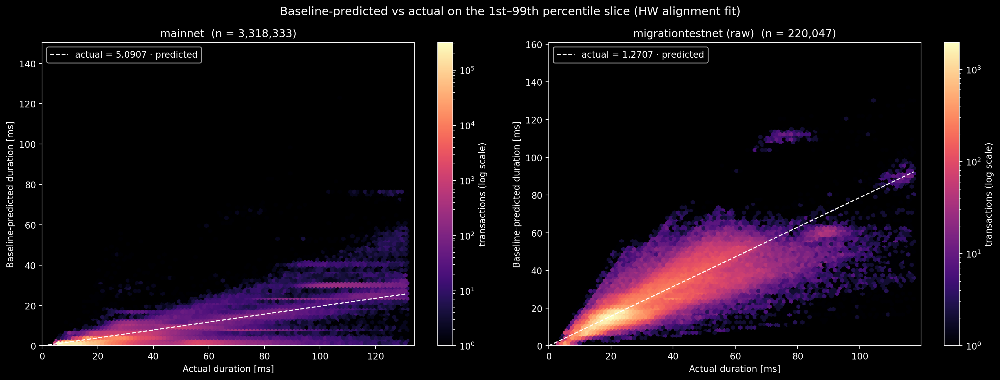

**`c_main` / `c_mig` under different percentile cuts:**

| Estimator                           |     c_main |    n_main |      c_mig |   n_mig | c_main / c_mig |
| ----------------------------------- | ---------: | --------: | ---------: | ------: | -------------: |
| **LS scalar [0.01, 0.99]** _(used)_ | **5.0907** | 3,318,333 | **1.2707** | 220,047 |     **4.0061** |
| LS scalar [0.05, 0.95]              |     7.1743 | 3,047,449 |     1.2306 | 202,085 |         5.8298 |
| LS scalar [0.10, 0.90]              |     7.5664 | 2,708,844 |     1.2045 | 179,631 |         6.2818 |
| LS scalar [0.25, 0.75]              |     7.6451 | 1,693,027 |     1.1945 | 112,269 |         6.4000 |
| LS scalar [0.00, 1.00]              |     3.8626 | 3,386,055 |     1.2729 | 224,539 |         3.0344 |
| median(actual / predicted)          |     9.4624 | 3,386,055 |     1.3538 | 224,539 |         6.9892 |

`c_mig` is stable across the entire range (1.19–1.35). `c_main` is markedly less stable (3.86–9.46), reflecting mainnet's heavy upper tail: tighter cuts that exclude the slow transactions push the recovered scalar up. The chosen [0.01, 0.99] cut keeps the slow-tail mass in (those are legitimate production transactions, not measurement noise) at the cost of pulling `c_main` somewhat below the bulk-of-distribution value.

### 2.6 Joint NNLS fit with α-blending

The model is linear in the kind intensities, with non-negative weights and no intercept:

$$\hat d_i \;=\; \sum_k w_k \cdot x_{i,k}, \quad w_k \geq 0$$

where $x_{i,k}$ is the intensity of kind $k$ on transaction $i$ and $\hat d_i$ is the predicted execution duration. Non-negative weights forbid negative time; the missing intercept anchors zero-intensity transactions at zero duration so no per-transaction overhead is absorbed into a free term.

The solver is scikit-learn's `LinearRegression(positive=True, fit_intercept=False)`: non-negative least squares through the origin.

**α-blending.** Mainnet contributes about 15× as many rows as migrationtestnet (3.39M vs 0.22M); uniform row weighting would drown the synthetic load, and with it the kinds production traffic rarely touches (§1.2). Each row therefore receives a sample weight:

- mainnet rows: $(1-\alpha) / n_\text{main}$
- migrationtestnet rows: $\alpha / n_\text{mig}$

Aggregate dataset influence on the loss is $(1-\alpha)$ for mainnet and $\alpha$ for migrationtestnet. $\alpha = 0.5$ gives the two datasets equal influence; $\alpha \to 0$ recovers a mainnet-only fit; $\alpha \to 1$ recovers a migrationtestnet-only fit.

**This calibration uses α = 0.40** (a slight mainnet lean). The choice is empirical: at $\alpha = 0.5$ the mainnet R² is noticeably lower than at $\alpha = 0.40$ without a comparable gain on the migrationtestnet side; 0.40 is the lowest α that still keeps the migrationtestnet-only kinds clearly identified.

### 2.7 Validation strategy

Three cross-validation variants on the proposed model at the chosen α, each answering a different generalization question:

1. **Random 5-fold over the joint dataset.** Rows are randomly assigned to five folds; the model is refit on four and scored on the fifth. This is the conventional CV metric, but is inflated by within-group repetition: a held-out row's fingerprint or `dna_label` also typically appears in training, so the model is effectively scored on shapes it has already seen.
2. **GroupKFold on mainnet by `script_fingerprint`.** Folds are formed so every fingerprint sits in exactly one fold. The held-out fold contains _unseen transaction shapes_, the strongest generalization test on the production side.
3. **GroupKFold on migrationtestnet by `dna_label`.** Same construction on the synthetic side: each `dna_label` is held out entire.

**This calibration:**

| Variant                                     | folds | mean R² |    std |    min |    max |
| ------------------------------------------- | ----: | ------: | -----: | -----: | -----: |
| 5-fold (joint, random)                      |     5 |  0.8845 | 0.0011 | 0.8829 | 0.8858 |
| group-kfold (mainnet by script fingerprint) |     5 |  0.6669 | 0.2072 | 0.3918 | 0.9345 |
| group-kfold (mig by `dna_label`)            |     5 |  0.8055 | 0.0120 | 0.7885 | 0.8200 |

The synthetic side is clean (0.81 ± 0.01 across folds; no detectable memorization). Mainnet shows substantial memorization: the 0.88 random R² drops to 0.67 ± 0.21 under group-kfold, with one fold as low as 0.39 and another as high as 0.93. The wide spread is the **"tail-driven" signal**: a handful of high-volume fingerprints carry most of the model's mainnet R², and folds that hold them out underperform sharply. §6 dissects the worst-fold contributors.

## 3. Feature inventory and exclusions

Every computation kind tracked by the FVM ends up in exactly one of five labels: `kept` (received a positive proposed weight) or one of four exclusion buckets. The four-bucket framework mirrors FLIP-346's Appendix 3, but it is auto-generated by the notebook on every run rather than maintained by hand, so a kind moves between buckets automatically as the underlying data changes.

**The four exclusion buckets:**

1. **`non_deterministic`**: kinds whose intensity depends on per-node program-cache state at the time of execution (`resolve_location`, `get_code`, `get_account_contract_code`, `get_or_load_program`). Stripped during preprocessing (§2.4); a weight fitted for them would be measuring cache behaviour, not work.
2. **`impossible_or_disabled`**: kinds that exist in the FVM but were never observed non-zero in either scrape during this calibration's data window. Either gated off on the production runtime (e.g. `stdlibpanic`, which would terminate the transaction before recording the kind), or unreachable from current Cadence (`add_encoded_account_key`, `remove_account_contract_code`), or instrumented for features no transaction exercised (`stdlibrlpdecode_string`, `get_random_source_history`).
3. **`correlated_and_dropped`**: kinds with Pearson |r| > 0.9 against another kind, where the NNLS retained the partner and zeroed this one. The partner carries the weight that should morally be split between them; the multicollinearity audit below lists every such pair.
4. **`zero_fitted_despite_coverage`**: kinds that have non-zero intensity in the data but the NNLS still drives their weight to zero. Causes vary: the kind may co-occur with a heavier kind that absorbs its contribution, its mean intensity may be too small to matter, or its production-data variance may be too low for identification.

**Counts for this calibration (33 kinds total):**

| Bucket                         | Count |
| ------------------------------ | ----: |
| `non_deterministic`            |     4 |
| `impossible_or_disabled`       |    10 |
| `correlated_and_dropped`       |     1 |
| `zero_fitted_despite_coverage` |    18 |

**The single `correlated_and_dropped` entry** is `atree_array_read_iteration`, which has Pearson `r = +0.94` with `atree_array_batch_construction`; the NNLS retained the partner. This is the only `|r| > 0.9` pair flagged by the multicollinearity audit, a notable improvement over the seven correlated-and-dropped kinds in FLIP-346 Appendix 3.

**Correlation heatmap.** Full Pearson matrix on the joint design matrix, rows sorted by total off-diagonal |r|. The strong red diagonal is the self-correlation; the cluster of warmer cells in the top-left corner shows the only neighbourhood with non-trivial off-diagonal correlations (the atree-array and atree-map families), with the single flagged pair sitting inside it. The rest of the matrix is near-zero, confirming the joint feature union is broadly orthogonal.

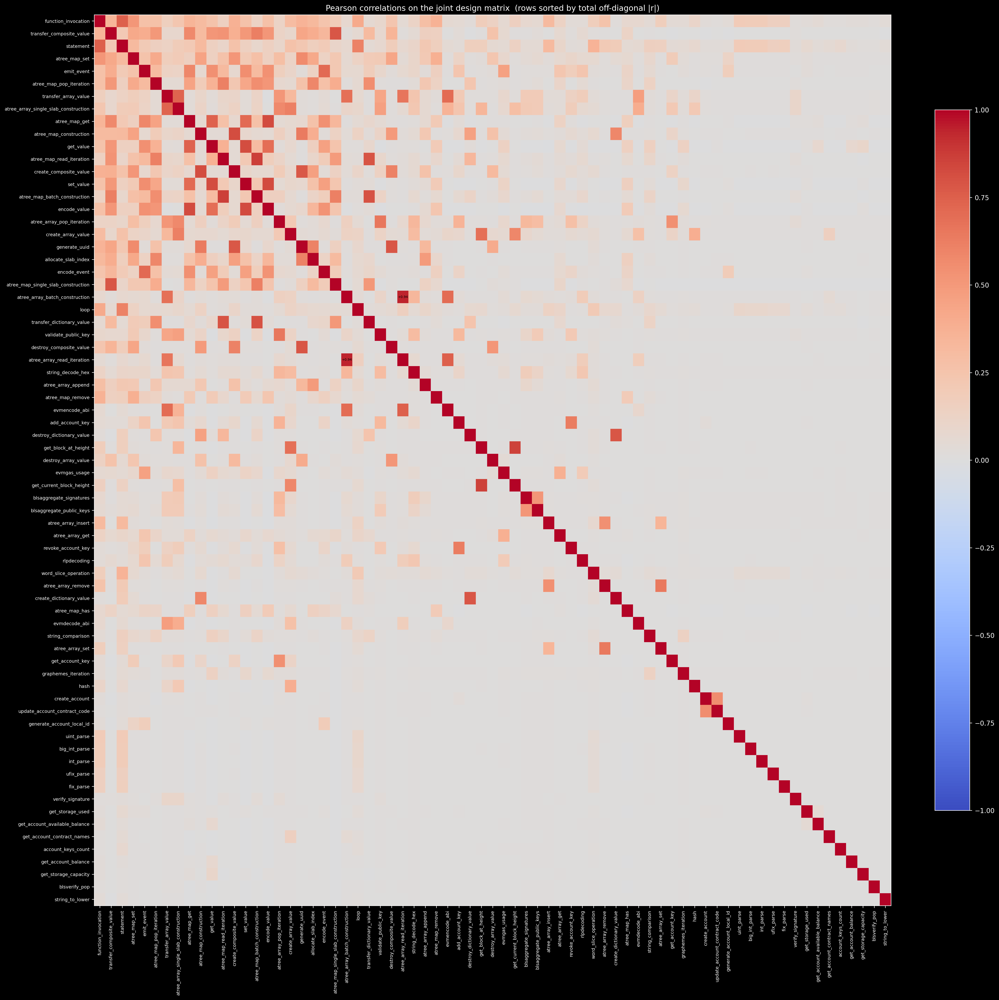

**The `impossible_or_disabled` set** (10 kinds): `add_encoded_account_key`, `get_random_source_history`, `remove_account_contract_code`, `rlpencoding`, `stdlibassert`, `stdlibpanic`, `stdlibrevertible_random`, `stdlibrlpdecode_list`, `stdlibrlpdecode_string`, `value_exists`.

**The `zero_fitted_despite_coverage` set** (18 kinds): `add_account_key`, `atree_array_remove`, `atree_map_pop_iteration`, `atree_map_single_slab_construction`, `create_dictionary_value`, `destroy_composite_value`, `encode_value`, `evmencode_abi`, `get_account_key`, `get_block_at_height`, `get_current_block_height`, `revoke_account_key`, `string_comparison`, `string_decode_hex`, `transfer_array_value`, `transfer_composite_value`, `transfer_dictionary_value`, `validate_public_key`. Most actionable items for the next cycle are in §8.1.

The full ledger with `reason`, `main_frac_nz`, `mig_frac_nz`, and `weight` columns for every row is in Appendix B.

---

## 4. Calibrated weights

Per-kind comparison of the proposed weights vs **2025 weights**. The table below is the canonical record; the figure summarises the same data as a horizontal bar chart.

**Per-feature relative weight change.** Each bar is `(proposed − baseline) / baseline · 100`; colour-coded by move type (see figure legend).

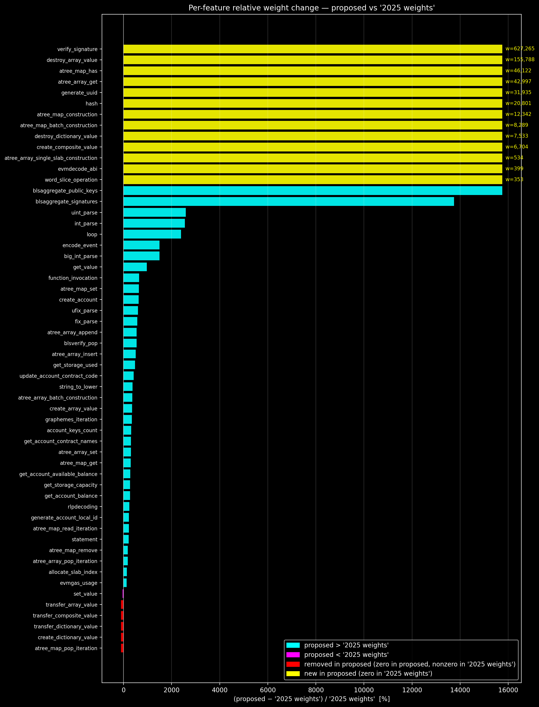

Almost everything moves up: 37 of 38 changed kinds rise, 13 kinds are new, 5 are removed, and only `set_value` falls (−37.5 %).

**Full weight comparison, 56 kinds.** Sorted by `|Δ%|` descending; `new` kinds (Δ% undefined) follow the `changed` and `removed` block at the bottom.

| Kind                                   | ns/intensity (proposed) | CU (proposed) | ns/intensity (**2025 weights**) | CU (**2025 weights**) |        Δ% | status  |
| -------------------------------------- | ----------------------: | ------------: | ------------------------------: | --------------------: | --------: | ------- |
| `blsaggregate_public_keys`             |           32,487,308.93 |    63,851,230 |                      204,906.76 |               402,728 | +15,754.7 | changed |
| `blsaggregate_signatures`              |           22,911,656.04 |    45,031,044 |                      165,516.21 |               325,309 | +13,742.5 | changed |
| `uint_parse`                           |                  423.60 |           833 |                           15.77 |                    31 |  +2,587.1 | changed |
| `int_parse`                            |                  377.44 |           742 |                           14.25 |                    28 |  +2,550.0 | changed |
| `loop`                                 |                2,272.68 |         4,467 |                           91.07 |                   179 |  +2,395.5 | changed |
| `encode_event`                         |               23,694.20 |        46,569 |                        1,481.11 |                 2,911 |  +1,499.8 | changed |
| `big_int_parse`                        |                  560.92 |         1,102 |                           35.11 |                    69 |  +1,497.1 | changed |
| `get_value`                            |                  125.93 |           247 |                           11.70 |                    23 |    +973.9 | changed |
| `function_invocation`                  |                5,366.28 |        10,547 |                          711.81 |                 1,399 |    +653.9 | changed |
| `atree_map_set`                        |               13,702.83 |        26,932 |                        1,860.16 |                 3,656 |    +636.7 | changed |
| `create_account`                       |            8,014,160.40 |    15,751,197 |                    1,090,574.13 |             2,143,437 |    +634.9 | changed |
| `ufix_parse`                           |                  919.28 |         1,807 |                          130.76 |                   257 |    +603.1 | changed |
| `fix_parse`                            |                  767.10 |         1,508 |                          113.46 |                   223 |    +576.2 | changed |
| `atree_array_append`                   |                6,253.45 |        12,291 |                          970.28 |                 1,907 |    +544.5 | changed |
| `blsverify_pop`                        |            5,031,434.46 |     9,888,886 |                      782,834.93 |             1,538,600 |    +542.7 | changed |
| `atree_array_insert`                   |               11,237.72 |        22,087 |                        1,858.13 |                 3,652 |    +504.8 | changed |
| `get_storage_used`                     |               74,878.05 |       147,167 |                       12,931.58 |                25,416 |    +479.0 | changed |
| `update_account_contract_code`         |              978,659.83 |     1,923,478 |                      187,953.14 |               369,407 |    +420.7 | changed |
| `string_to_lower`                      |                   12.45 |            24 |                            2.54 |                     5 |    +380.0 | changed |
| `atree_array_batch_construction`       |                  422.05 |           830 |                           90.06 |                   177 |    +368.9 | changed |
| `create_array_value`                   |               10,212.60 |        20,072 |                        2,220.39 |                 4,364 |    +359.9 | changed |
| `graphemes_iteration`                  |                  633.21 |         1,245 |                          141.45 |                   278 |    +347.8 | changed |
| `account_keys_count`                   |               52,653.55 |       103,486 |                       12,571.86 |                24,709 |    +318.8 | changed |
| `get_account_contract_names`           |               69,126.86 |       135,863 |                       16,673.78 |                32,771 |    +314.6 | changed |
| `atree_array_set`                      |                3,662.59 |         7,199 |                          883.78 |                 1,737 |    +314.5 | changed |
| `atree_map_get`                        |               18,136.47 |        35,646 |                        4,496.24 |                 8,837 |    +303.4 | changed |
| `get_account_available_balance`        |              734,299.54 |     1,443,208 |                      190,918.41 |               375,235 |    +284.6 | changed |
| `get_storage_capacity`                 |              762,149.85 |     1,497,945 |                      202,036.64 |               397,087 |    +277.2 | changed |
| `get_account_balance`                  |              930,147.63 |     1,828,131 |                      247,008.69 |               485,476 |    +276.6 | changed |
| `rlpdecoding`                          |                  911.31 |         1,791 |                          262.54 |                   516 |    +247.1 | changed |
| `generate_account_local_id`            |              127,050.67 |       249,708 |                       38,417.73 |                75,507 |    +230.7 | changed |
| `atree_map_read_iteration`             |                5,527.65 |        10,864 |                        1,691.75 |                 3,325 |    +226.7 | changed |
| `statement`                            |                2,854.25 |         5,610 |                          900.57 |                 1,770 |    +216.9 | changed |
| `atree_map_remove`                     |               10,613.55 |        20,860 |                        3,751.36 |                 7,373 |    +182.9 | changed |
| `atree_array_pop_iteration`            |                1,044.24 |         2,052 |                          374.47 |                   736 |    +178.8 | changed |
| `allocate_slab_index`                  |               18,786.57 |        36,924 |                        7,821.23 |                15,372 |    +140.2 | changed |
| `evmgas_usage`                         |                    3.64 |             7 |                            1.53 |                     3 |    +133.3 | changed |
| `create_dictionary_value`              |                    0.00 |             0 |                        1,942.59 |                 3,818 |    −100.0 | removed |
| `atree_map_pop_iteration`              |                    0.00 |             0 |                          615.64 |                 1,210 |    −100.0 | removed |
| `transfer_composite_value`             |                    0.00 |             0 |                        1,199.74 |                 2,358 |    −100.0 | removed |
| `transfer_dictionary_value`            |                    0.00 |             0 |                           63.60 |                   125 |    −100.0 | removed |
| `transfer_array_value`                 |                    0.00 |             0 |                           24.42 |                    48 |    −100.0 | removed |
| `set_value`                            |                   15.31 |            30 |                           24.42 |                    48 |     −37.5 | changed |
| `atree_map_batch_construction`         |                4,217.63 |         8,289 |                            0.00 |                     0 |       n/a | new     |
| `atree_map_construction`               |                6,279.42 |        12,342 |                            0.00 |                     0 |       n/a | new     |
| `atree_array_get`                      |               21,876.88 |        42,997 |                            0.00 |                     0 |       n/a | new     |
| `atree_array_single_slab_construction` |                  271.62 |           534 |                            0.00 |                     0 |       n/a | new     |
| `atree_map_has`                        |               23,466.60 |        46,122 |                            0.00 |                     0 |       n/a | new     |
| `create_composite_value`               |                3,410.86 |         6,704 |                            0.00 |                     0 |       n/a | new     |
| `destroy_array_value`                  |               79,264.43 |       155,788 |                            0.00 |                     0 |       n/a | new     |
| `destroy_dictionary_value`             |                3,832.55 |         7,533 |                            0.00 |                     0 |       n/a | new     |
| `evmdecode_abi`                        |                  203.11 |           399 |                            0.00 |                     0 |       n/a | new     |
| `generate_uuid`                        |               16,248.30 |        31,935 |                            0.00 |                     0 |       n/a | new     |
| `hash`                                 |               10,583.48 |        20,801 |                            0.00 |                     0 |       n/a | new     |
| `verify_signature`                     |              319,150.70 |       627,265 |                            0.00 |                     0 |       n/a | new     |
| `word_slice_operation`                 |                  179.42 |           353 |                            0.00 |                     0 |       n/a | new     |

**Reading the table.** The top of the sort is dominated by two distinct categories of kinds. The first is the **BLS aggregation primitives** (`blsaggregate_public_keys`, `blsaggregate_signatures`, `blsverify_pop`), rare on mainnet but heavily exercised on migrationtestnet (§2.3), so their weights are identified almost entirely from the synthetic side. The second is the **foundational primitives that every transaction touches** (`loop`, `function_invocation`, `get_value`, `int_parse`, `uint_parse`, `statement`). The first group sets the absolute ceiling of the new weight set (over 10 ms per BLS aggregation intensity at HW-adjusted mainnet timing); the second group is what moves mainnet `computation_used` upward by ~5× (the `c_main` factor from §2.5) and produces the fee-revenue swing in §7.4.

The **only kind that moves down** is `set_value` (−37.5%), a one-off where the proposed fit gives the kind less weight than **2025 weights** did. The **5 `removed` kinds** are all data-mutation primitives (`create_dictionary_value`, `transfer_composite_value`, `transfer_dictionary_value`, `transfer_array_value`, `atree_map_pop_iteration`); their effects are absorbed into kindred kinds the NNLS retained (see §3's `zero_fitted_despite_coverage` discussion).

---

## 5. Fit quality

### 5.1 Global R² summary

Training R² for the proposed fit and **2025 weights** on each dataset, alongside the cross-validation R² variants from §2.7. **MARE** = `mean(|actual − predicted| / actual)` (% units), a scale-free companion to R²:

| Model / variant                                | R² (or mean R²) |             Notes |
| ---------------------------------------------- | --------------: | ----------------: |
| **2025 weights** (raw, mainnet)                |           0.151 |     MARE = 88.6 % |
| Proposed fit, mainnet (training R²)            |       **0.796** | **MARE = 37.4 %** |
| Proposed fit, migrationtestnet (HW-adj, train) |           0.788 |               n/a |
| 5-fold CV (joint, random)                      |          0.8845 |        std 0.0011 |
| GroupKFold, mainnet by `script_fingerprint`    |          0.6669 | std 0.2072 (§2.7) |
| GroupKFold, migrationtestnet by `dna_label`    |          0.8055 |        std 0.0120 |

The proposed fit lifts mainnet R² by roughly **5×** over **2025 weights** and cuts the mean absolute relative error in half.

### 5.2 Residual diagnostics

2×2 diagnostics on the residual `actual − predicted` (ms), one panel per dataset.

**Mainnet (n = 3,386,055):** mean = 5.0 ms, std = 12.4 ms, skew = 4.28, excess kurtosis = 705.9, fraction within ±2σ = 0.972.

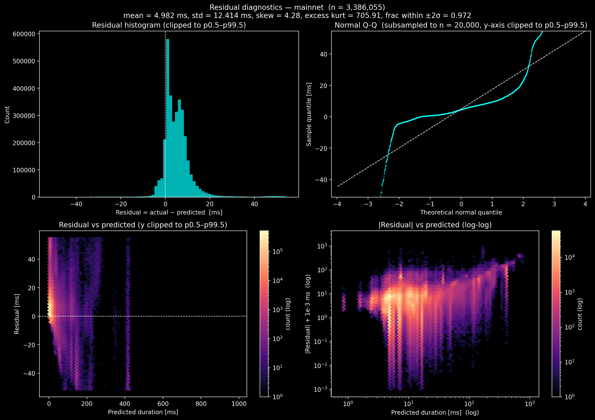

**Migrationtestnet, HW-adjusted (n = 224,539):** mean = 4.8 ms, std = 40.5 ms, skew = 5.65, excess kurtosis = 153.8, fraction within ±2σ = 0.957.

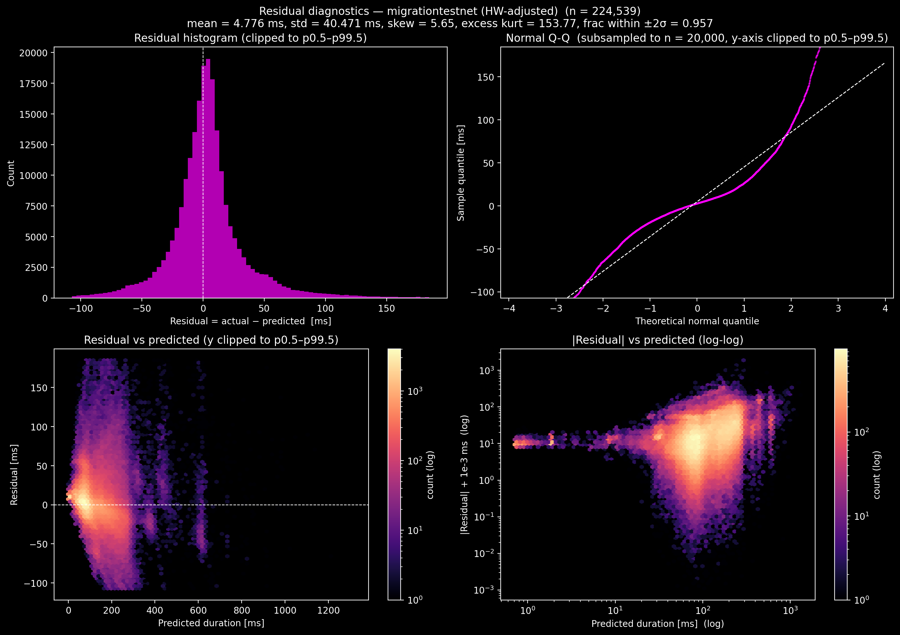

Both panels share three features worth calling out:

- **Residuals centred near zero, with a small positive mean** (≈ 4.6–4.8 ms on both sides): the proposed fit slightly under-predicts on average. The bias is small relative to the typical predicted duration.
- **Heavy tails:** excess kurtosis ≫ 0 (706 on mainnet, 154 on mig) means the residual distribution is far from Gaussian and the slow-tail transactions dominate the second moment. The Q-Q plot tracks the dashed normality line through the central 95% of the distribution but bends sharply at both ends.
- **Heteroscedasticity:** variance grows with predicted duration, consistent with the multiplicative-noise structure of execution-time measurements (visible in both the residual-vs-predicted and |residual|-log-log panels).

### 5.3 Predicted vs actual

**Global prediction diagnostics.** Top row: actual vs predicted; bottom row: relative error vs actual (log-log). Left: mainnet; right: migrationtestnet HW-adjusted.

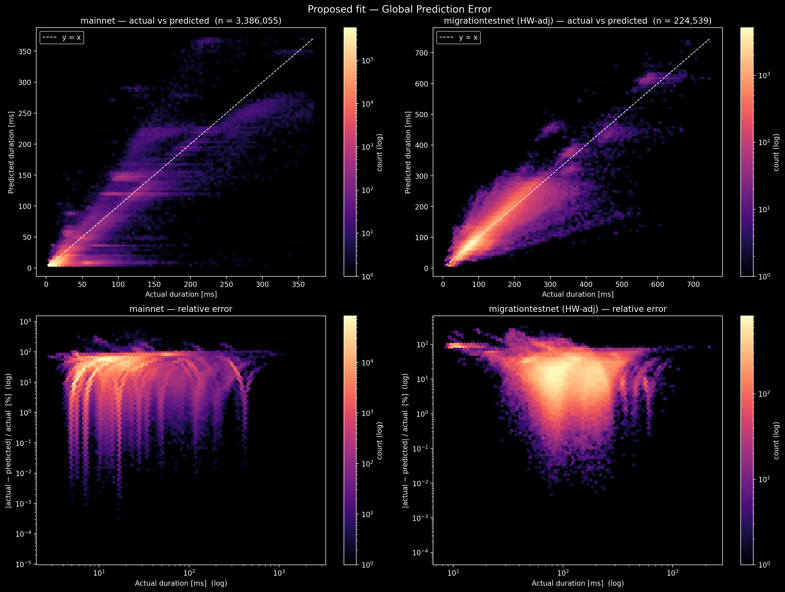

**HW-adjusted density, proposed vs 2025 weights.** Side-by-side hexbin density on the same mainnet rows:

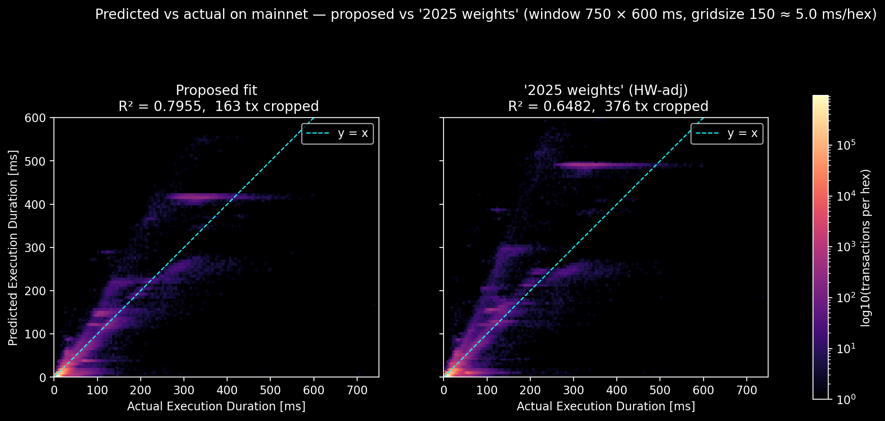

The proposed-fit density tracks y = x across the full predicted-duration range. Under **2025 weights** the cloud sits noticeably _below_ the diagonal: predicted durations systematically underestimate actuals, the visual signature of the `c_main` factor from §2.5.

**Relative-error distributions:**

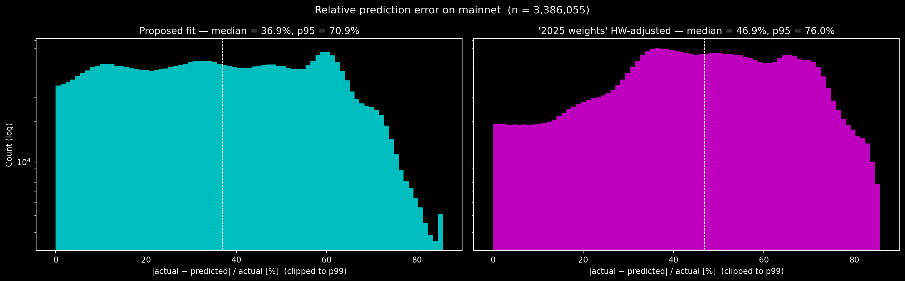

Top-line numbers from the panel titles:

| Model                        | Median relative error | p95 relative error |
| ---------------------------- | --------------------: | -----------------: |
| Proposed                     |            **36.9 %** |         **70.9 %** |
| **2025 weights** HW-adjusted |                46.9 % |             76.0 % |

The proposed fit pushes the median down by ≈ 10 percentage points and the p95 down by ≈ 5 pp. Both distributions remain broad (neither fit produces tight-around-zero predictions), consistent with the heavy-tail residual diagnostics in §5.2. The improvement is in the bulk: more of the proposed-fit mass is concentrated below 40 % relative error, while **2025 weights** has a noticeable hump in the 40–60 % range.

### 5.4 Bootstrap stability

100-resample bootstrap NNLS at α = 0.40 (sample fraction 0.5); per-kind p5/p50/p95 and stability classification:

- **`stable_nonzero`**: p5 > 0 (the kind keeps a positive weight in ≥ 95% of resamples).
- **`stable_zero`**: p95 = 0 (the NNLS drives the weight to zero in ≥ 95% of resamples).
- **`unstable`**: between the two.

**Stability breakdown across the 71 in-scope kinds:**

| Bucket           | Count |
| ---------------- | ----: |
| `stable_nonzero` |    50 |
| `stable_zero`    |    16 |
| `unstable`       | **5** |

The top weights by p50 (the largest-magnitude coefficients in the proposed fit) all classify as **`stable_nonzero`** with 5–95 % bootstrap CIs inside ±5 % of the point estimate, except `update_account_contract_code` (±15 %). Per-kind CIs in Appendix C.

**Five `unstable` kinds**, whose bootstrap CI straddles zero (p5 = 0 but p95 > 0):

| Kind                      | Point estimate |   p5 |      p50 |       p95 |
| ------------------------- | -------------: | ---: | -------: | --------: |
| `atree_map_construction`  |       6,279.42 | 0.00 | 5,832.01 |  7,267.15 |
| `emit_event`              |           0.20 | 0.00 |     0.00 |     11.91 |
| `create_dictionary_value` |           0.00 | 0.00 |     0.00 |  7,095.19 |
| `get_block_at_height`     |           0.00 | 0.00 |     0.00 |    391.93 |
| `revoke_account_key`      |           0.00 | 0.00 |     0.00 | 11,817.29 |

Two patterns in this set: (1) **flip-zero kinds**, where `atree_map_construction` has a sizeable positive point estimate but the bootstrap occasionally drives it to zero (and `emit_event` is right at the identifiability boundary, with non-zero point estimate but p50 = 0); (2) **flip-on kinds**, where `create_dictionary_value`, `get_block_at_height`, and `revoke_account_key` are zero in the proposed fit but the bootstrap occasionally gives them a non-zero weight, meaning the proposed fit's decision to zero them is not robust. All five are candidates for template / instrumentation follow-ups in the next calibration cycle (§8.1).

**Bootstrap CI bar chart:**

![Bootstrap CI per kind: p50 bar with [p5, p95] whiskers, point estimate marked](./20260611-execution-effort-3/5.4-bootstrap-ci-chart.png)

The full bootstrap-summary table (`kind`, `point`, `p05`, `p50`, `p95`, `stability` for all 71 kinds) is in Appendix C.

---

## 6. Worst-linearity fingerprints

Which real mainnet transaction shapes does the proposed fit handle poorly? Mainnet rows are first filtered to those with `execution_duration > 100 ms` (the slow tail), then grouped by `script_fingerprint`; groups with ≥ 50 surviving rows are kept. An OLS regression of `predicted` against `actual` is fit _on the surviving rows of each group_ and scored:

$$\text{score} \;=\; (1 - r^2) \;+\; |1 - \text{slope}|$$

A perfectly-linear group scores 0; a group whose predicted values are uncorrelated with actuals scores 2 (`r² ≈ 0`, slope ≈ 0). The chart below ranks the 10 worst groups by this score.

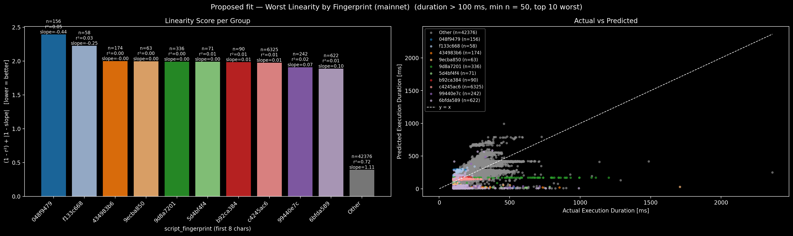

**Sample composition.** 24 groups have ≥ 50 surviving rows after the > 100 ms filter; 3,232 groups have fewer and are excluded. The `n_tx` column in the table below is the count of _surviving_ rows per fingerprint (rows above the 100 ms threshold), not the total mainnet count for that fingerprint. The 10 worst (left panel) all score between **2.0 and 2.5**: their per-group `r²` is approximately 0 and their slope is at most ~0.10, meaning **within each of these groups the proposed fit produces a roughly constant predicted duration regardless of the kind intensities the transactions actually invoke**. The "Other" bar (the remaining 14 groups plus a sample of off-screen rows; n = 42,376) sits at score 0.72 with slope ≈ 1.11; the bulk of mainnet traffic is well-fit, and the failure is concentrated in this small set of high-volume fingerprints.

**Flowscan links: slowest transaction in each of the 10 worst groups.**

| Fingerprint (prefix) | n_tx in group | Slowest tx duration | Slowest tx                                                                                                                                                                   |
| -------------------- | ------------: | ------------------: | ---------------------------------------------------------------------------------------------------------------------------------------------------------------------------- |
| `048f9479…`          |           156 |            531.2 ms | [`7c4d87aadeb32b87ae74fb20c0f036d9a2a15d46e74f4ebc5d56843bc2d42f1f`](https://www.flowscan.io/tx/7c4d87aadeb32b87ae74fb20c0f036d9a2a15d46e74f4ebc5d56843bc2d42f1f?tab=script) |
| `f133c668…`          |            58 |            503.0 ms | [`2b9281b844c3e01e9217879af9123aa57825a394bee33f2e318309ed4f12f50b`](https://www.flowscan.io/tx/2b9281b844c3e01e9217879af9123aa57825a394bee33f2e318309ed4f12f50b?tab=script) |
| `434983b6…`          |           174 |            854.0 ms | [`138fa915d97df893f70d2523681856f00ebcd67dd4a324150ecc385406b941cc`](https://www.flowscan.io/tx/138fa915d97df893f70d2523681856f00ebcd67dd4a324150ecc385406b941cc?tab=script) |
| `9ecba850…`          |            63 |          1,708.2 ms | [`0d02b7284f1db1f9caa93219b5bb0d928c82bd3be459c4b040ef5bb80e01875d`](https://www.flowscan.io/tx/0d02b7284f1db1f9caa93219b5bb0d928c82bd3be459c4b040ef5bb80e01875d?tab=script) |
| `9d8a7201…`          |           336 |          1,203.3 ms | [`a55b04ad2a1f89b98c3f22b3edb31ec0fd510e8ba4da8f0e91d0df8f32b75698`](https://www.flowscan.io/tx/a55b04ad2a1f89b98c3f22b3edb31ec0fd510e8ba4da8f0e91d0df8f32b75698?tab=script) |
| `5d4bf4f4…`          |            71 |            784.1 ms | [`a8095451ff8c56b0c555b80fa72205e710999d1b3da36c38c5c43e0555f7c9d0`](https://www.flowscan.io/tx/a8095451ff8c56b0c555b80fa72205e710999d1b3da36c38c5c43e0555f7c9d0?tab=script) |
| `b92ca384…`          |            90 |            227.7 ms | [`ff1bca0db1a4a520843cc6e299fa6383d0fb4d49c0e0ab7665ea66341f7ed564`](https://www.flowscan.io/tx/ff1bca0db1a4a520843cc6e299fa6383d0fb4d49c0e0ab7665ea66341f7ed564?tab=script) |
| **`c4245ac6…`**      |     **6,325** |            357.1 ms | [`e1ef72fabdc37b0a423e4d24029e8fa720ed9908014b74a9617af83dfb77a378`](https://www.flowscan.io/tx/e1ef72fabdc37b0a423e4d24029e8fa720ed9908014b74a9617af83dfb77a378?tab=script) |
| `99440e7c…`          |           242 |            712.8 ms | [`ddd5d99ae4af8c9377ceb45d1813b8496e355723efc5b2de8b6472eedd59beae`](https://www.flowscan.io/tx/ddd5d99ae4af8c9377ceb45d1813b8496e355723efc5b2de8b6472eedd59beae?tab=script) |
| `6bfda589…`          |           622 |            991.2 ms | [`96b06180987f7b0a69609355ca9acc839f2f7d12ed7778608b7844659107210f`](https://www.flowscan.io/tx/96b06180987f7b0a69609355ca9acc839f2f7d12ed7778608b7844659107210f?tab=script) |

`c4245ac6…` is bolded because it dominates the volume in this set: **6,325 surviving rows** (out of 7,141 total `c4245ac6…` transactions in the kept-rows sample of §7.4), an order of magnitude larger than any other group. Its slowest tx is 357 ms; the score-2 ranking means within those 6,325 above-threshold rows the proposed predicted duration barely moves while the actual duration spans a wide range.

**Why these groups misfit.** All ten slowest-per-group transactions sit between 228 ms and 1,708 ms, well above the typical mainnet median of 11.9 ms (§2.1). The per-group OLS slope being ~0 says intensity variation _within_ these groups does not predict duration variation: two transactions in the same group with very different recorded intensities still take similar (long) wall-clock times. This pattern most often arises when:

- The group's heavy cost comes from a kind that is **constant across its members** (so intensity variation cancels and the proposed fit looks "flat"); the real cost is elsewhere.
- The group's transactions hit **runtime states the fit does not see** (cache misses, network IO, or external dependencies) that dominate execution time independently of the recorded computation kinds.

These ten groups account for the bulk of the **GroupKFold mainnet R² shortfall** in §2.7 (mean R² 0.667, one fold as low as 0.39), the _tail-driven signal_ the cross-validation surfaces. Investigation backlog for the next cycle is in §8.1.

## 7. Impact

Mainnet impact under the proposed weights, holding the transaction mix constant: effort attribution (§7.1), `computation_used` distribution (§7.2), over-cap exposure (§7.3), and per-transaction fee revenue (§7.4).

### 7.1 Effort attribution: where the budget lands

Each kind's share of total mainnet predicted execution time, `Σᵢ (intensity_{i,k} · weight_k) / Σ_total`. Top 20 kinds shown side-by-side under both weight sets; remainder in "Other". Full 71-row table in Appendix D.

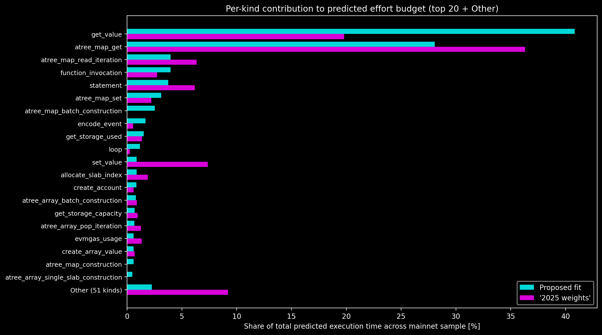

The shape is heavily concentrated: under the proposed weights, **just two kinds (`get_value` and `atree_map_get`) account for ~69 %** of all predicted execution time on mainnet, and the top 10 kinds together account for **~91 %**. The three movers worth calling out:

- **`get_value` doubles its share**, from 19.8 % under **2025 weights** to 40.8 % under the proposed fit. Reads dominate the mainnet workload, and the proposed weights re-price each read accordingly: the per-intensity weight rises +974 % (§4 table).
- **`atree_map_get` loses share**, from 36.3 % → 28.1 %, but absolutely is _not_ down-weighted (its per-intensity weight rises +303 %). What changes is the _relative_ allocation: kinds previously folded into `atree_map_get`'s share (`function_invocation`, `statement`, `atree_map_set`, the new `atree_map_batch_construction`) are now individually priced, so the same workload's effort is distributed more evenly.
- **`atree_map_batch_construction` appears at 2.5 %** despite having a zero weight in **2025 weights**. It is one of the 13 `new` kinds (§4), and this section is where its impact materialises on real mainnet traffic.

The reorganisation matters for the fee model in §7.4: total mainnet predicted effort rises ~5× (the `c_main` factor from §2.5), but the share rebalancing is what determines which transaction families pay more and which pay roughly the same. A uniform 5× scaling would not, on its own, change relative pricing. Per-fingerprint winners and losers are in §7.4.

### 7.2 `computation_used` distribution under the new weights

Mainnet `computation_used` under the proposed weights vs **2025 weights** (log-y, cap at 9999 marked):

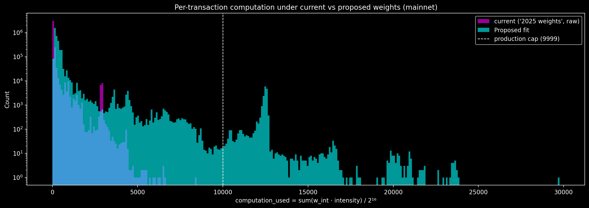

Consistent with §7.1 and §2.5: the distribution shifts right by roughly a factor of five. Under **2025 weights** the bulk clusters around 30–80 CU and the cap is virtually unreachable; under the proposed weights the bulk moves to roughly 150–500 CU and a meaningful tail begins to approach the cap, the data behind §7.3.

The proposed-weights distribution also has a clearly visible **secondary peak around 12,500 CU**, just past the cap. This is the `00b366ed…` fingerprint family from §7.3 (14,916 over-cap transactions, top `comp_new = 12,727`): a single high-volume fingerprint whose intensity profile lands it consistently a few CU into the over-cap zone, and the single-fingerprint signature behind §7.3's 0.49 % rate.

### 7.3 Over-cap impact

Under the proposed weights, **16,499 of 3,386,055 mainnet transactions (0.49 %)** would exceed the 9999 CU production cap; under **2025 weights** (raw scrape), **0**. FLIP-346's proposed weights pushed 0.003 % over the cap, so this calibration is a much larger move at the extreme.

The breakdown by `script_fingerprint` is, however, **extremely concentrated**. A single fingerprint family, `00b366ed…`, accounts for **14,916 of the 16,499 over-cap transactions (~90 %)**. Excluding that single family drops the over-cap rate to **0.047 %**, still ~15× FLIP-346's number but qualitatively in the same range:

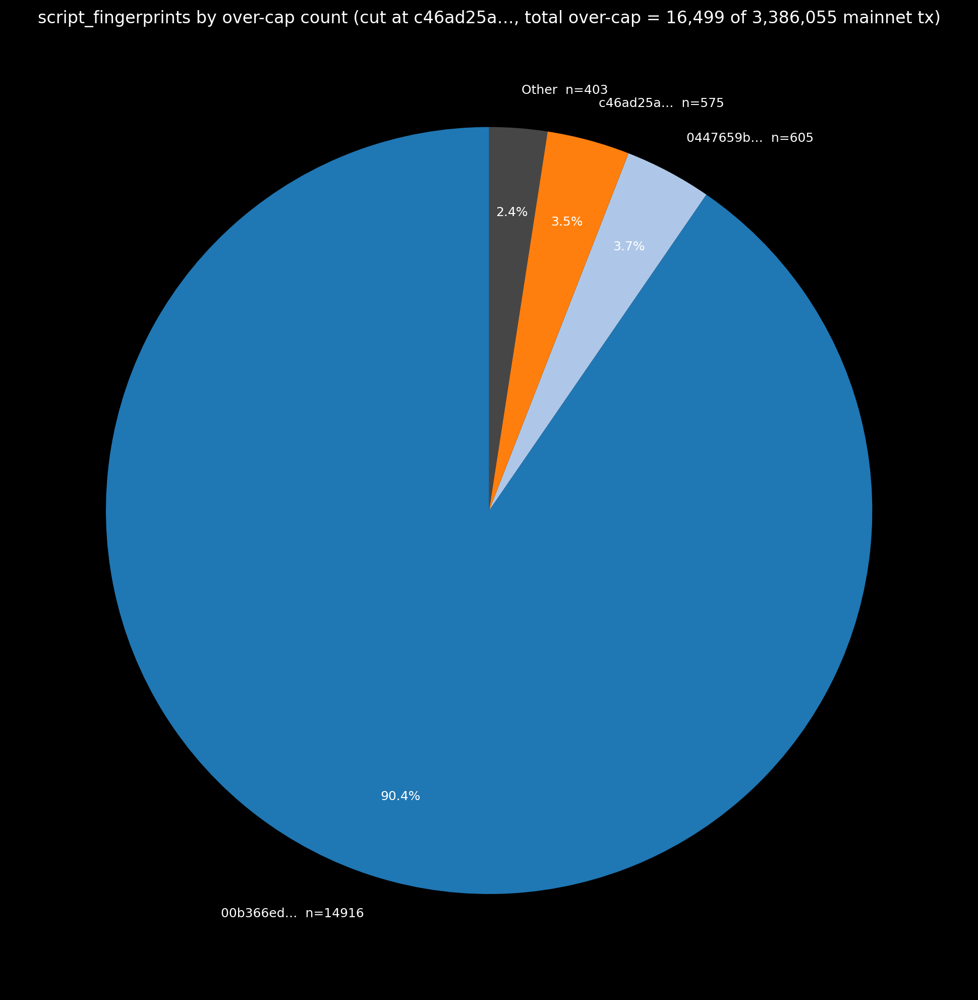

**Top 10 over-cap transactions** (sorted by proposed `computation_used`):

| `tx_id` (Flowscan)                                                                                                                                                           | `fingerprint` | `comp_new` | `comp_old` | `actual_ms` |
| ---------------------------------------------------------------------------------------------------------------------------------------------------------------------------- | :------------ | ---------: | ---------: | ----------: |
| [`41f5afec575f8d6ea4b1def0de213110146bb7c260994fb1143254f929dd6600`](https://www.flowscan.io/tx/41f5afec575f8d6ea4b1def0de213110146bb7c260994fb1143254f929dd6600?tab=script) | `0447659b…`   |   29,754.2 |    8,410.6 |       460.0 |
| [`a97322be55a7cd7686b6956820d3bd2412ee37eb9337e5b64b405b7f48b6e963`](https://www.flowscan.io/tx/a97322be55a7cd7686b6956820d3bd2412ee37eb9337e5b64b405b7f48b6e963?tab=script) | `fc9c4472…`   |   23,879.4 |    4,178.8 |       482.8 |
| [`5a6acc08d001a737223cf63b5c1a0f38ade6ff2f26ec6bb1e7d3cb1bd633f38e`](https://www.flowscan.io/tx/5a6acc08d001a737223cf63b5c1a0f38ade6ff2f26ec6bb1e7d3cb1bd633f38e?tab=script) | `fc9c4472…`   |   23,755.7 |    4,262.2 |       727.3 |
| [`5ffb7a789d174632d21ffa7549eca01a2f213624bfb1dd237523dab2c5acc4f1`](https://www.flowscan.io/tx/5ffb7a789d174632d21ffa7549eca01a2f213624bfb1dd237523dab2c5acc4f1?tab=script) | `fc9c4472…`   |   23,723.1 |    4,132.9 |       569.7 |
| [`1586baed06727f57bbf77d53d756dc46dbbd28eef914db35b01f7bfd0745a709`](https://www.flowscan.io/tx/1586baed06727f57bbf77d53d756dc46dbbd28eef914db35b01f7bfd0745a709?tab=script) | `0447659b…`   |   23,681.2 |    6,520.4 |       401.7 |
| [`a6d99bfc31554bf4a5a0571f9fa3aa6d91f502b18a7d5bd3bc31bae21033d003`](https://www.flowscan.io/tx/a6d99bfc31554bf4a5a0571f9fa3aa6d91f502b18a7d5bd3bc31bae21033d003?tab=script) | `b410314b…`   |   23,638.2 |    6,493.8 |       388.5 |
| [`7d2baa266c253be8599545ab9b66a798ff4a0b07cb63c58d4294a78cd0d3d639`](https://www.flowscan.io/tx/7d2baa266c253be8599545ab9b66a798ff4a0b07cb63c58d4294a78cd0d3d639?tab=script) | `fc9c4472…`   |   23,637.3 |    4,189.7 |       589.1 |
| [`97c8061566a90c13eabb4a302bf9c43583a3eba86069ab335d743cce8467e1a0`](https://www.flowscan.io/tx/97c8061566a90c13eabb4a302bf9c43583a3eba86069ab335d743cce8467e1a0?tab=script) | `b410314b…`   |   23,630.8 |    6,493.1 |       392.7 |
| [`a036b287dd91d219545ac69eb31da06a57e53f9ee04ae274023ce0e4931dd0a1`](https://www.flowscan.io/tx/a036b287dd91d219545ac69eb31da06a57e53f9ee04ae274023ce0e4931dd0a1?tab=script) | `0447659b…`   |   23,596.3 |    6,623.7 |       347.3 |
| [`29bbaf0ab9babd386390e19bc2b2ee22bbf2987a0493a84dccc4b12f896cbc09`](https://www.flowscan.io/tx/29bbaf0ab9babd386390e19bc2b2ee22bbf2987a0493a84dccc4b12f896cbc09?tab=script) | `fc9c4472…`   |   23,581.7 |    4,131.8 |       540.4 |

All ten ran under 1 s wall-clock: not pathological executions, but transactions whose intensity vectors are unusually large in re-priced kinds. The biggest jump (`41f5afec…`: 8,410 → 29,754 CU = 3.5×) is below the global 5× shift, so these are kinds being hit _harder_ than the average mainnet transaction.

**Top 10 `script_fingerprint`s by over-cap count** (sample tx per fingerprint linked to Flowscan):

| `fingerprint` | n_over | top `comp_new` | sample tx                                                                                                                                                                    |
| :------------ | -----: | -------------: | :--------------------------------------------------------------------------------------------------------------------------------------------------------------------------- |
| `00b366ed…`   | 14,916 |       12,726.5 | [`e49272a27a0eb9356160f27cc144e2d73d09f0bf6e339dc9a4ade5869bd6d2bd`](https://www.flowscan.io/tx/e49272a27a0eb9356160f27cc144e2d73d09f0bf6e339dc9a4ade5869bd6d2bd?tab=script) |
| `0447659b…`   |    605 |       29,754.2 | [`41f5afec575f8d6ea4b1def0de213110146bb7c260994fb1143254f929dd6600`](https://www.flowscan.io/tx/41f5afec575f8d6ea4b1def0de213110146bb7c260994fb1143254f929dd6600?tab=script) |
| `c46ad25a…`   |    575 |       21,875.4 | [`6b805e4fad07c76c67f0b5c11ed8840ebdbb00665482c6568f108c95355f3f3e`](https://www.flowscan.io/tx/6b805e4fad07c76c67f0b5c11ed8840ebdbb00665482c6568f108c95355f3f3e?tab=script) |
| `eda2c56a…`   |    192 |       11,192.3 | [`37a19df4b89de2e064d00f09593308a2dd45318ec4abfb2d487c5f4a474a5543`](https://www.flowscan.io/tx/37a19df4b89de2e064d00f09593308a2dd45318ec4abfb2d487c5f4a474a5543?tab=script) |
| `fc9c4472…`   |    106 |       23,879.4 | [`a97322be55a7cd7686b6956820d3bd2412ee37eb9337e5b64b405b7f48b6e963`](https://www.flowscan.io/tx/a97322be55a7cd7686b6956820d3bd2412ee37eb9337e5b64b405b7f48b6e963?tab=script) |
| `b410314b…`   |     43 |       23,638.2 | [`a6d99bfc31554bf4a5a0571f9fa3aa6d91f502b18a7d5bd3bc31bae21033d003`](https://www.flowscan.io/tx/a6d99bfc31554bf4a5a0571f9fa3aa6d91f502b18a7d5bd3bc31bae21033d003?tab=script) |
| `030d41ed…`   |     16 |       10,518.9 | [`86377590a9ba83ff1f1c5858b612a84c3547817335dfb7bf1c7a26124d64017c`](https://www.flowscan.io/tx/86377590a9ba83ff1f1c5858b612a84c3547817335dfb7bf1c7a26124d64017c?tab=script) |
| `9586f7c0…`   |     15 |       12,601.2 | [`cf3b6ab5fffc793a2a243a966a8cac39d7d1097de7b2aff4b1f8c18da3c9f05e`](https://www.flowscan.io/tx/cf3b6ab5fffc793a2a243a966a8cac39d7d1097de7b2aff4b1f8c18da3c9f05e?tab=script) |
| `2faad2b9…`   |      7 |       11,431.0 | [`82c310a7824dedc288d4d54f1b5cedf2898fd7d9d3f8d2fb31a909ba2a9ab937`](https://www.flowscan.io/tx/82c310a7824dedc288d4d54f1b5cedf2898fd7d9d3f8d2fb31a909ba2a9ab937?tab=script) |
| `1e45fb90…`   |      6 |       11,066.2 | [`e02f2cf6a37975af3c3fa9d123a8f9dfdd04e3c0713d587d97bfbfb338884cb2`](https://www.flowscan.io/tx/e02f2cf6a37975af3c3fa9d123a8f9dfdd04e3c0713d587d97bfbfb338884cb2?tab=script) |

These ten cover **16,481 of 16,499** over-cap rows (18 in the long tail). `00b366ed…` warrants per-template investigation before publication; if it represents a legitimate mis-priced workload, the cap-or-weights trade-off needs revisiting (§8.1).

### 7.4 Fee revenue impact

The Flow fee formula (FLIP-660, restated in FLIP-346 Appendix 5) is

$$\text{fee}_i = S \cdot (C_i \cdot I_i + C_e \cdot E_i)$$

with $S$ the surge factor (held at 1), $C_i, C_e$ the per-unit FLOW costs for inclusion-effort and execution-effort, and $I_i, E_i$ the corresponding per-tx efforts ($E_i$ is the `computation_used` value). The proposed recalibration changes **only $E_i$** (inclusion-effort and the unit costs are held constant), so

$$\Delta \text{fee}_i = C_e \cdot (E_i^{\text{new}} - E_i^{\text{old}}) \quad \text{for } i \in \{i : E_i^{\text{new}} \leq 9999\}.$$

The "kept rows" filter excludes the 16,499 over-cap transactions from §7.3 (those would fail and pay no fee). The unit cost $C_e$ tracked here is the **FLIP-351** companion fee re-pricing ([onflow/flips#352](https://github.com/onflow/flips/pull/352)), `FLOW_PER_CU = 4e-5`, chosen to keep aggregate fee revenue roughly stable once the weight changes from this calibration are applied.

**Aggregate summary** (mainnet, kept rows, $C_e = 4 \times 10^{-5}$ FLOW/CU, $S = 1$):

|                                  metric |                               value |
| --------------------------------------: | ----------------------------------: |
|                               `n_total` |                           3,386,055 |
|      `n_excluded` (over-cap, from §7.3) |                              16,499 |
|                                `n_kept` |                           3,369,556 |
| `Σ computation_used` (**2025 weights**) |                      195,400,771 CU |
|         `Σ computation_used` (proposed) |                    1,062,538,743 CU |
|                                   Δ (%) |                       **+443.77 %** |
|                      Mean Δ per kept tx | **+257.35 CU = +1.029 × 10⁻² FLOW** |

Normalised to monthly mainnet traffic (trailing 6 mo: ~100 M tx → **~16.7 M tx/month**, kept rate 99.51 % per §7.3):

|                          metric |               projection |
| ------------------------------: | -----------------------: |
|              Tx/month (mainnet) |                  ~16.7 M |
|           Kept tx/month (≤ cap) |                  ~16.6 M |
| **Projected monthly Δ revenue** | **~+171,000 FLOW/month** |
|     Projected 6-month Δ revenue |            ~+1.02 M FLOW |

Under the FLIP-351 unit cost the recalibration adds **~+171 k FLOW/month** of execution-fee revenue at current volume: modest per-transaction (+0.0103 FLOW ≈ 100× the inclusion-fee floor `INCLUSION_FEE_FLOW = 1e-4`) but non-trivial in aggregate.

**Per-fingerprint fee delta, top 10 by aggregate Δ_CU** (kept rows, $C_e = 4 \times 10^{-5}$ FLOW/CU; sample tx linked to Flowscan):

| `fingerprint` |  `n_tx` |    `sum_Δcu` | `mean_Δcu` | `sum_Δflow` | sample tx                                                                                                                                                                    |
| :------------ | ------: | -----------: | ---------: | ----------: | :--------------------------------------------------------------------------------------------------------------------------------------------------------------------------- |
| `9586f7c0…`   | 138,614 | 63,260,074.9 |     456.38 |   +2,530.40 | [`0000550b205ef9f88b2f7ae881606879db1ee7314ea4f5c7663c660938a135b5`](https://www.flowscan.io/tx/0000550b205ef9f88b2f7ae881606879db1ee7314ea4f5c7663c660938a135b5?tab=script) |
| `4e8dbc09…`   | 286,038 | 50,847,887.9 |     177.77 |   +2,033.92 | [`00000e73082fe880042cb10bc2f0d494008d6a5634e2f5de77c8ff1d248cec52`](https://www.flowscan.io/tx/00000e73082fe880042cb10bc2f0d494008d6a5634e2f5de77c8ff1d248cec52?tab=script) |
| `eda2c56a…`   |  28,954 | 46,166,666.3 |   1,594.48 |   +1,846.67 | [`0002e5e87e0b0d3aaef90139e0c0e81eff0b273cab5bd78bc3db4ed84a7d2151`](https://www.flowscan.io/tx/0002e5e87e0b0d3aaef90139e0c0e81eff0b273cab5bd78bc3db4ed84a7d2151?tab=script) |
| `5d4bf4f4…`   | 120,559 | 41,643,498.5 |     345.42 |   +1,665.74 | [`0002763a601cb32105da64f34ee2c1e00fc017903f64bc9d70bee6eb16f70956`](https://www.flowscan.io/tx/0002763a601cb32105da64f34ee2c1e00fc017903f64bc9d70bee6eb16f70956?tab=script) |
| `99440e7c…`   |  85,961 | 38,561,749.8 |     448.60 |   +1,542.47 | [`00004e4c355f45b92cd28bfef370e9ea8c1d8520ce881b9e0c827ad21dd0d9d0`](https://www.flowscan.io/tx/00004e4c355f45b92cd28bfef370e9ea8c1d8520ce881b9e0c827ad21dd0d9d0?tab=script) |
| `434983b6…`   |  75,666 | 35,735,520.9 |     472.28 |   +1,429.42 | [`0000bc9ceb3d05f83720773f3df44dff085918a106af272d1e477aea59580fa7`](https://www.flowscan.io/tx/0000bc9ceb3d05f83720773f3df44dff085918a106af272d1e477aea59580fa7?tab=script) |
| `6bfda589…`   | 172,427 | 29,628,771.7 |     171.83 |   +1,185.15 | [`00000bb5ceca39c2c06b3eb32b5c4623913f993d5498b6f2efc2ab60717c1932`](https://www.flowscan.io/tx/00000bb5ceca39c2c06b3eb32b5c4623913f993d5498b6f2efc2ab60717c1932?tab=script) |
| `442468fb…`   | 242,935 | 26,963,428.7 |     110.99 |   +1,078.54 | [`000052156e510f1f038e56e7b1416b71de6483694e05904c3974d37cfba9abc1`](https://www.flowscan.io/tx/000052156e510f1f038e56e7b1416b71de6483694e05904c3974d37cfba9abc1?tab=script) |
| `c4245ac6…`   |   7,141 | 24,894,917.7 |   3,486.20 |     +995.80 | [`000ba6638cddb04b62bd49359257f9451290300250a21c3cacea1a110a21f6fe`](https://www.flowscan.io/tx/000ba6638cddb04b62bd49359257f9451290300250a21c3cacea1a110a21f6fe?tab=script) |
| `9ecba850…`   |  33,460 | 23,868,742.4 |     713.35 |     +954.75 | [`0000a87e11205f184025c7f52b9bde7032525c7a9c659edac86cbb0fd3010798`](https://www.flowscan.io/tx/0000a87e11205f184025c7f52b9bde7032525c7a9c659edac86cbb0fd3010798?tab=script) |

Two patterns stand out:

- **`c4245ac6…`**: only 7,141 transactions but the _highest mean Δcu_ (3,486 CU per tx), and the same fingerprint surfaced as the #1 worst-linearity group in §6. Its per-tx effort jumps from sub-cap into the 4,000-CU range (well clear of the 9999 cap on average, but unusually sensitive to the recalibration). The combined "fragile-linearity + large fee jump" signal is a clear next-cycle template-instrumentation candidate (§8.1).
- **`9586f7c0…` and `4e8dbc09…`**: high `n_tx` (139k and 286k respectively) with modest per-tx Δ; together they alone account for ≈ 13 % of the aggregate fee delta. These are the volume-driven payers under the new weights.

**Per-tx Δcomputation_used distribution.** Log-y histogram of `new − old` in CU across the 3,369,556 kept rows. Yellow line at the median (+168.88 CU); white dashed line at 0 (no change):

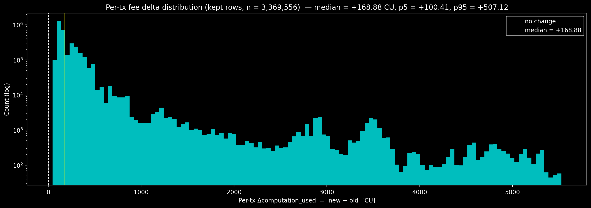

- **The entire distribution is positive**: even the 5th percentile sits at **+100.41 CU**, so essentially no kept transaction pays a _lower_ fee under the proposed weights. This is the per-tx restatement of the §7.1 share rebalancing: the global ~5× effort scaling dominates the share-shift effect, so every kept transaction's effort rises.
- **A series of secondary humps** in the right tail (visible around ~1,500 CU, ~2,800 CU, ~3,500 CU): each hump corresponds to a distinct script-fingerprint family with a characteristic intensity vector. The largest of these are the entries at the top of the per-fingerprint table above; the long-tail humps fall off the table but are still visible in the distribution.

## 8. Future of the model

### 8.1 What's still fragile

Three classes of follow-up, all actionable at the template / instrumentation level:

**Unstable weights (§5.4).** Five kinds bootstrap-classify as `unstable`:

- `atree_map_construction`: sizeable point estimate (6,279 ns) but bootstrap occasionally drives it to zero; needs an isolating template that exercises map construction without get/set/has.
- `emit_event`: identifiability boundary (p50 = 0); co-occurs heavily with `encode_event`. Needs a template that emits events without atree mutations.
- `create_dictionary_value`, `get_block_at_height`, `revoke_account_key`: zero in the proposed fit but the bootstrap occasionally lifts them. Each needs a dedicated template or a retirement decision.

**Worst-linearity fingerprints (§6).** **`c4245ac6…`** is the standout: fragile linearity _and_ the #1 fee-delta outlier in §7.4. Manual Cadence/intensity-vector inspection is the highest-priority next step; the other nine fingerprints in §6's table follow the same pattern at lower volume.

**Coverage gaps (§3).** 18 kinds are `zero_fitted_despite_coverage`; the most actionable are `string_comparison`, `string_decode_hex`, and `encode_value` (mainnet mean 10,155). The single `correlated_and_dropped` pair (`atree_array_read_iteration` ↔ `atree_array_batch_construction`, `r = +0.94`) is also resolvable with one orthogonal template (already a strong improvement over FLIP-346's seven such pairs).

### 8.2 Continuous monitoring

Calibrated weights drift between cycles, and there is currently no way to detect it. A monitor that re-scores the live weight set against fresh mainnet scrapes would surface drift. Proposed checks:

1. **Daily predict-and-score** on a trailing-N-day mainnet window: R², MARE, per-kind residual-mean (no fitting).
2. **Drift alerts** when R² drops below 0.85× publication value, a per-kind residual leaves its envelope, or the §7.3 over-cap rate exceeds 1 %.
3. **Coverage drift:** Appendix A re-emitted daily; alert on in-scope kinds dropping below 1 % or out-of-scope kinds crossing above.

Building this requires a scheduled scoring service, alert routing, and a dashboard. None of it exists yet.

### 8.3 Automated recalibration on protocol releases

Each recalibration is a manual end-to-end pass tied to a specific `flow-go` revision. Two longer-term directions could reduce the human cost:

- **Reproducible runbook → CI pipeline.** Migrationtestnet provisioning, scrape collection, joint fit, and PR generation could be codified into a single workflow triggered per protocol release. Editorial decisions (α, exclusion review, worst-linearity investigation) stay manual.
- **On-protocol calibration.** Further out, the calibration loop could move into the protocol itself: execution nodes report per-kind durations as part of normal operation, and weight updates ride alongside other governance or upgrade changes. The offline analysis pipeline this document describes becomes a fallback rather than the primary path.

## 9. Discussion

Discussion of this FLIP takes place on the pull request that proposes it. Open questions
seeded for review:

- The single fingerprint (`00b366ed…`) responsible for ~90 % of over-cap transactions
  (§7.3, §8.1) — characterise and decide whether it warrants mitigation before deployment.
- The five `unstable` weights and the worst-linearity fingerprints (§5.4, §6) — acceptable
  as-is, or held for a follow-up calibration?

## 10. Conclusion

This recalibration is foremost a **precision improvement**: unlike FLIP-346, which fit weights against synthetic migrationtestnet data, this calibration fits primarily against real mainnet traffic. The result is a model that actually explains what drives execution time on production hardware.

**Model accuracy.** Under the proposed weights, mainnet R² rises from **0.15 to 0.80** — the model now accounts for 80% of the variance in execution time, versus 15% previously. Mean absolute relative error falls from **88.6% to 37.4%**. The 2025 weights had limited accuracy in predicting actual mainnet execution time (`c_main = 5.09`, §2.5); the proposed weights bring predicted and actual execution time into alignment across the full production distribution. GroupKFold cross-validation on unseen transaction shapes holds at **R² = 0.67 ± 0.21** on mainnet, confirming the fit generalises beyond the training sample.

**Fairer pricing.** Accurate weights mean each transaction is charged in proportion to the execution effort it actually consumes. Under the 2025 weights, computationally intensive transactions were systematically undercharged — their real cost was being spread across all users. The proposed weights correct this: kinds that dominate mainnet wall-clock time (`get_value`, `atree_map_get`, `function_invocation`, `loop`) are repriced to reflect their measured cost, and 13 new kinds that were previously unpriced now carry explicit weights.

**Fee impact.** As a direct consequence of the accuracy correction, transaction fees will increase. Aggregate `computation_used` across mainnet rises by **+443.8%** under the proposed weights (§7.4), and the per-transaction Δ distribution is entirely positive — even the 5th-percentile transaction sees **+100.41 CU**. Most transactions will see roughly a **2–4× increase** in fees; larger, computation-heavy transactions may see increases beyond that. The median per-transaction increase is **+168.88 CU ≈ +0.0103 FLOW** (at the FLIP-351 companion unit cost of 4×10⁻⁵ FLOW/CU). At current mainnet volume (~16.7M transactions/month), this projects to approximately **+171,000 FLOW/month** in additional execution-fee revenue. This increase is not a policy decision to raise fees; it is the consequence of correcting a systematic underestimate in the previous weights.

**Over-cap exposure.** Under the proposed weights, **0.49% of mainnet transactions** (16,499 of 3.39M) would exceed the 9999 CU production cap, compared to 0.003% under FLIP-346 weights. Approximately 90% of these come from a single script fingerprint (`00b366ed…`); excluding that fingerprint, the over-cap rate drops to 0.047%. Transactions that exceed the cap fail and pay no execution fee; this fingerprint warrants investigation before deployment (§8.1).

**In summary:** this calibration replaces a model that explained 15% of mainnet execution-time variance with one that explains 80%, and aligns per-kind pricing with measured hardware cost. The resulting fee changes reflect each transaction's true share of execution effort for the first time.

## Appendices

### A. Full per-kind coverage matrix

Per-kind frequency and mean intensity in each scrape, sorted by `coverage_gap`. Feeds §2.3 and §3.

**Columns:**

| Column                                  | Meaning                                                                                                                             |
| --------------------------------------- | ----------------------------------------------------------------------------------------------------------------------------------- |
| `kind`                                  | Computation-kind name as tracked by the FVM / Cadence runtime.                                                                      |
| `presence`                              | `both` if the kind appears non-zero in both datasets; `mainnet only` / `mig only` if exclusively in one.                            |
| `main_n_nz`, `mig_n_nz`                 | Number of rows in which the kind has non-zero intensity, per dataset.                                                               |
| `main_frac_nz`, `mig_frac_nz`           | The above divided by total rows (3,386,055 mainnet; 224,539 migrationtestnet).                                                      |
| `main_mean_when_nz`, `mig_mean_when_nz` | Mean intensity over rows where the kind is non-zero.                                                                                |
| `coverage_gap`                          | `\|main_frac_nz − mig_frac_nz\|`. Sort key: larger values are kinds whose production exposure differs most from the synthetic load. |

#### Full table: all 71 in-scope kinds, sorted by `coverage_gap` descending

| Kind                                   | presence |    main n | main frac | main mean |   mig n | mig frac |  mig mean |    gap |
| -------------------------------------- | -------- | --------: | --------: | --------: | ------: | -------: | --------: | -----: |
| `word_slice_operation`                 | both     |   888,125 |    0.2623 |       8.8 | 213,975 |   0.9530 |     8,224 | 0.6907 |
| `encode_value`                         | both     | 3,161,243 |    0.9336 |    10,155 |  55,394 |   0.2467 |    30,126 | 0.6869 |
| `set_value`                            | both     | 3,333,669 |    0.9845 |     7,348 |  69,092 |   0.3077 |    50,772 | 0.6768 |
| `allocate_slab_index`                  | both     | 2,547,892 |    0.7525 |       7.7 |  34,006 |   0.1514 |       296 | 0.6010 |
| `atree_map_pop_iteration`              | both     | 2,790,704 |    0.8242 |      43.1 |  66,934 |   0.2981 |       571 | 0.5261 |
| `transfer_composite_value`             | both     | 3,130,110 |    0.9244 |       142 |  95,160 |   0.4238 |     1,033 | 0.5006 |
| `emit_event`                           | both     | 2,684,591 |    0.7928 |     2,013 |  72,209 |   0.3216 |    37,595 | 0.4712 |
| `encode_event`                         | both     | 2,684,591 |    0.7928 |      11.2 |  72,209 |   0.3216 |       164 | 0.4712 |
| `atree_map_batch_construction`         | both     | 3,098,666 |    0.9151 |      82.6 |  99,715 |   0.4441 |       786 | 0.4710 |
| `atree_map_read_iteration`             | both     | 3,112,694 |    0.9193 |      97.8 | 107,190 |   0.4774 |     1,086 | 0.4419 |
| `create_composite_value`               | both     | 3,339,208 |    0.9862 |      11.4 | 124,241 |   0.5533 |       312 | 0.4328 |
| `string_comparison`                    | both     | 2,235,355 |    0.6602 |       453 |  67,457 |   0.3004 |   170,094 | 0.3597 |
| `atree_map_construction`               | both     | 3,340,461 |    0.9865 |      12.0 | 146,080 |   0.6506 |       358 | 0.3360 |
| `atree_map_remove`                     | both     | 1,541,753 |    0.4553 |       6.6 |  26,837 |   0.1195 |       400 | 0.3358 |
| `atree_map_set`                        | both     | 3,382,317 |    0.9989 |      28.5 | 150,396 |   0.6698 |       670 | 0.3291 |
| `atree_map_single_slab_construction`   | both     | 1,867,907 |    0.5516 |      90.8 |  50,026 |   0.2228 |       308 | 0.3289 |
| `atree_map_has`                        | both     | 1,228,498 |    0.3628 |       7.0 |  16,851 |   0.0750 |       127 | 0.2878 |
| `generate_uuid`                        | both     | 1,438,985 |    0.4250 |       3.2 |  31,415 |   0.1399 |       635 | 0.2851 |
| `string_decode_hex`                    | both     |   461,689 |    0.1364 |       827 |  91,810 |   0.4089 |    22,027 | 0.2725 |
| `atree_array_pop_iteration`            | both     | 2,377,641 |    0.7022 |       115 |  99,301 |   0.4422 |     8,637 | 0.2599 |
| `validate_public_key`                  | both     |    45,276 |    0.0134 |       1.0 |  53,203 |   0.2369 |      90.5 | 0.2236 |
| `destroy_composite_value`              | both     |   963,018 |    0.2844 |       4.5 |  24,027 |   0.1070 |       525 | 0.1774 |
| `get_current_block_height`             | both     |   729,710 |    0.2155 |       2.7 |  11,146 |   0.0496 |     1,275 | 0.1659 |
| `get_block_at_height`                  | both     |   729,710 |    0.2155 |       2.7 |  12,793 |   0.0570 |     1,849 | 0.1585 |
| `graphemes_iteration`                  | both     |   402,553 |    0.1189 |       130 |  50,430 |   0.2246 |    38,250 | 0.1057 |
| `atree_array_insert`                   | both     |    85,637 |    0.0253 |       2.4 |  25,620 |   0.1141 |     1,947 | 0.0888 |
| `create_dictionary_value`              | both     |   911,664 |    0.2692 |       2.2 |  44,132 |   0.1965 |       304 | 0.0727 |
| `transfer_dictionary_value`            | both     |   979,545 |    0.2893 |       133 |  49,170 |   0.2190 |     1,010 | 0.0703 |
| `atree_array_get`                      | both     |   751,734 |    0.2220 |       9.0 |  35,605 |   0.1586 |       207 | 0.0634 |
| `destroy_array_value`                  | both     |   322,453 |    0.0952 |       1.4 |   7,988 |   0.0356 |       157 | 0.0597 |
| `evmencode_abi`                        | both     |    30,945 |    0.0091 |       380 |  14,692 |   0.0654 |    42,509 | 0.0563 |
| `verify_signature`                     | both     |       103 |    0.0000 |       1.0 |  12,216 |   0.0544 |      37.9 | 0.0544 |
| `hash`                                 | both     |   260,091 |    0.0768 |       2.1 |   5,311 |   0.0237 |       754 | 0.0532 |
| `blsaggregate_public_keys`             | mig only |         0 |    0.0000 |         0 |  10,657 |   0.0475 |       1.0 | 0.0475 |
| `blsaggregate_signatures`              | mig only |         0 |    0.0000 |         0 |  10,567 |   0.0471 |       1.0 | 0.0471 |
| `generate_account_local_id`            | both     |   218,573 |    0.0646 |       1.6 |   5,340 |   0.0238 |       277 | 0.0408 |
| `add_account_key`                      | both     |    45,174 |    0.0133 |       1.0 |  12,139 |   0.0541 |      70.6 | 0.0407 |
| `rlpdecoding`                          | both     |   173,356 |    0.0512 |       645 |  19,904 |   0.0886 |     6,531 | 0.0374 |
| `evmgas_usage`                         | both     |   296,630 |    0.0876 |   237,852 |  27,339 |   0.1218 | 2,659,238 | 0.0342 |
| `create_account`                       | both     |    44,664 |    0.0132 |       1.0 |  10,640 |   0.0474 |       8.2 | 0.0342 |
| `get_storage_capacity`                 | both     |   179,028 |    0.0529 |       2.2 |   5,212 |   0.0232 |      41.8 | 0.0297 |
| `uint_parse`                           | both     |         1 |    0.0000 |      18.0 |   5,378 |   0.0240 |    20,858 | 0.0240 |
| `get_account_available_balance`        | both     |       222 |    0.0001 |       1.0 |   5,360 |   0.0239 |      39.3 | 0.0238 |
| `big_int_parse`                        | both     |        21 |    0.0000 |      25.1 |   5,329 |   0.0237 |    19,786 | 0.0237 |
| `int_parse`                            | mig only |         0 |    0.0000 |         0 |   5,305 |   0.0236 |    23,271 | 0.0236 |
| `fix_parse`                            | mig only |         0 |    0.0000 |         0 |   5,309 |   0.0236 |    24,691 | 0.0236 |
| `revoke_account_key`                   | both     |        74 |    0.0000 |       2.8 |   5,288 |   0.0236 |      71.8 | 0.0235 |
| `account_keys_count`                   | both     |         3 |    0.0000 |       1.0 |   5,261 |   0.0234 |       978 | 0.0234 |
| `get_account_key`                      | both     |         4 |    0.0000 |       1.2 |   5,226 |   0.0233 |       418 | 0.0233 |
| `get_account_contract_names`           | both     |         1 |    0.0000 |       1.0 |   5,239 |   0.0233 |       524 | 0.0233 |
| `get_account_balance`                  | mig only |         0 |    0.0000 |         0 |   5,211 |   0.0232 |      40.9 | 0.0232 |
| `blsverify_pop`                        | mig only |         0 |    0.0000 |         0 |   5,119 |   0.0228 |      12.5 | 0.0228 |
| `ufix_parse`                           | both     |     1,221 |    0.0004 |      10.0 |   5,203 |   0.0232 |    21,927 | 0.0228 |
| `update_account_contract_code`         | both     |        88 |    0.0000 |       1.0 |   5,047 |   0.0225 |       6.6 | 0.0225 |
| `atree_array_set`                      | both     |     4,539 |    0.0013 |      78.2 |   5,239 |   0.0233 |     1,466 | 0.0220 |
| `atree_array_remove`                   | both     |   211,693 |    0.0625 |       3.4 |  10,525 |   0.0469 |     1,621 | 0.0156 |
| `string_to_lower`                      | both     |   110,207 |    0.0325 |      53.4 |   5,331 |   0.0237 | 4,666,207 | 0.0088 |
| `destroy_dictionary_value`             | both     |   133,175 |    0.0393 |       2.9 |  10,454 |   0.0466 |     1,969 | 0.0072 |
| `evmdecode_abi`                        | both     |   105,457 |    0.0311 |       109 |   6,965 |   0.0310 |    41,804 | 0.0001 |
| `atree_array_append`                   | both     | 3,386,055 |    1.0000 |       3.0 | 224,539 |   1.0000 |       116 | 0.0000 |
| `atree_array_batch_construction`       | both     | 3,386,055 |    1.0000 |       241 | 224,539 |   1.0000 |    15,542 | 0.0000 |
| `atree_array_read_iteration`           | both     | 3,386,055 |    1.0000 |       194 | 224,539 |   1.0000 |     8,228 | 0.0000 |
| `atree_array_single_slab_construction` | both     | 3,386,055 |    1.0000 |       223 | 224,538 |   1.0000 |    22,295 | 0.0000 |
| `create_array_value`                   | both     | 3,386,055 |    1.0000 |       7.4 | 224,539 |   1.0000 |       304 | 0.0000 |
| `atree_map_get`                        | both     | 3,386,055 |    1.0000 |       194 | 224,539 |   1.0000 |       406 | 0.0000 |
| `get_storage_used`                     | both     | 3,386,055 |    1.0000 |       2.5 | 224,539 |   1.0000 |      23.2 | 0.0000 |
| `function_invocation`                  | both     | 3,386,055 |    1.0000 |      92.3 | 224,539 |   1.0000 |     2,413 | 0.0000 |
| `loop`                                 | both     | 3,386,055 |    1.0000 |      64.8 | 224,539 |   1.0000 |     3,042 | 0.0000 |
| `get_value`                            | both     | 3,386,055 |    1.0000 |    40,568 | 224,539 |   1.0000 |    68,822 | 0.0000 |
| `transfer_array_value`                 | both     | 3,386,055 |    1.0000 |       338 | 224,539 |   1.0000 |    23,717 | 0.0000 |
| `statement`                            | both     | 3,386,055 |    1.0000 |       165 | 224,539 |   1.0000 |     7,683 | 0.0000 |

### B. Full exclusion ledger

The exclusion ledger labels every computation kind tracked by the FVM as one of {`kept`, `non_deterministic`, `impossible_or_disabled`, `correlated_and_dropped`, `zero_fitted_despite_coverage`}. §3 covers the four exclusion buckets in narrative; this appendix is the complete per-row table, grouped by bucket. Totals: **52 `kept` kinds with positive proposed weights** (weights table in §4) plus **33 kinds in the four exclusion buckets** below.

#### `non_deterministic` (4 kinds)

_Reason_: depends on cache state (dropped at preprocessing; see §2.4).

`get_account_contract_code`, `get_code`, `get_or_load_program`, `resolve_location`.

#### `impossible_or_disabled` (10 kinds)

_Reason_: never observed non-zero in mainnet or migrationtestnet during the data window. Either gated off in the production runtime, unreachable from current Cadence, or instrumented for a feature no transaction exercised.

`add_encoded_account_key`, `get_random_source_history`, `remove_account_contract_code`, `rlpencoding`, `stdlibassert`, `stdlibpanic`, `stdlibrevertible_random`, `stdlibrlpdecode_list`, `stdlibrlpdecode_string`, `value_exists`.

#### `correlated_and_dropped` (1 kind)

_Reason_: Pearson |r| > 0.9 against another kind; NNLS retained the partner.

| Kind                         | Partner kind                     |     r | main_frac_nz | mig_frac_nz | Weight |
| ---------------------------- | -------------------------------- | ----: | -----------: | ----------: | -----: |
| `atree_array_read_iteration` | `atree_array_batch_construction` | +0.94 |       1.0000 |      1.0000 |      0 |

#### `zero_fitted_despite_coverage` (18 kinds)

_Reason_: appears non-zero in the data, but the NNLS drives the weight to zero. Usually one of: co-occurs with a heavier kind that absorbs its contribution, mean intensity is too small to matter, or production-data variance is too low for identification. `frac_nz` values are pulled from the per-kind coverage matrix (Appendix A).

| Kind                                 | main_frac_nz | mig_frac_nz | Weight |
| ------------------------------------ | -----------: | ----------: | -----: |
| `add_account_key`                    |       0.0133 |      0.0541 |      0 |
| `atree_array_remove`                 |       0.0625 |      0.0469 |      0 |
| `atree_map_pop_iteration`            |       0.8242 |      0.2981 |      0 |
| `atree_map_single_slab_construction` |       0.5516 |      0.2228 |      0 |
| `create_dictionary_value`            |       0.2692 |      0.1965 |      0 |
| `destroy_composite_value`            |       0.2844 |      0.1070 |      0 |
| `encode_value`                       |       0.9336 |      0.2467 |      0 |
| `evmencode_abi`                      |       0.0091 |      0.0654 |      0 |
| `get_account_key`                    |       0.0000 |      0.0233 |      0 |
| `get_block_at_height`                |       0.2155 |      0.0570 |      0 |
| `get_current_block_height`           |       0.2155 |      0.0496 |      0 |
| `revoke_account_key`                 |       0.0000 |      0.0236 |      0 |
| `string_comparison`                  |       0.6602 |      0.3004 |      0 |
| `string_decode_hex`                  |       0.1364 |      0.4089 |      0 |
| `transfer_array_value`               |       1.0000 |      1.0000 |      0 |
| `transfer_composite_value`           |       0.9244 |      0.4238 |      0 |
| `transfer_dictionary_value`          |       0.2893 |      0.2190 |      0 |
| `validate_public_key`                |       0.0134 |      0.2369 |      0 |

### C. Full bootstrap summary

Per-kind bootstrap statistics (100 resamples at α = 0.40, sample fraction 0.5): the data behind §5.4.

**Columns:**

| Column              | Meaning                                                                                        |
| ------------------- | ---------------------------------------------------------------------------------------------- |
| `kind`              | Computation-kind name.                                                                         |
| `point`             | Point estimate from the proposed fit at the chosen α (in ns per intensity unit).               |
| `p05`, `p50`, `p95` | 5th / 50th / 95th percentile of the bootstrap distribution per kind, in ns per intensity unit. |
| `stability`         | `stable_nonzero` if `p05 > 0`; `stable_zero` if `p95 = 0`; `unstable` otherwise.               |

Rows sorted by `p50` descending.

#### Top 10 by `p50` (all `stable_nonzero`)

| Kind                            |         point |           p05 |           p50 |           p95 |
| ------------------------------- | ------------: | ------------: | ------------: | ------------: |
| `blsaggregate_public_keys`      | 32,487,308.93 | 31,505,612.51 | 32,423,480.98 | 33,489,492.95 |
| `blsaggregate_signatures`       | 22,911,656.04 | 22,054,060.03 | 23,005,375.49 | 23,917,698.95 |
| `create_account`                |  8,014,160.40 |  7,932,937.87 |  8,013,755.70 |  8,091,334.68 |
| `blsverify_pop`                 |  5,031,434.46 |  4,994,720.52 |  5,032,656.34 |  5,074,261.11 |
| `update_account_contract_code`  |    978,659.83 |    833,421.85 |    969,485.79 |  1,134,937.68 |
| `get_account_balance`           |    930,147.63 |    904,637.81 |    928,957.11 |    948,596.95 |
| `get_storage_capacity`          |    762,149.85 |    744,850.20 |    760,063.79 |    786,595.17 |
| `get_account_available_balance` |    734,299.54 |    717,717.21 |    733,276.62 |    753,249.98 |
| `verify_signature`              |    319,150.70 |    314,843.39 |    319,418.26 |    323,848.40 |
| `generate_account_local_id`     |    127,050.67 |    123,499.73 |    126,957.33 |    130,270.50 |

Width of the `[p05, p95]` band as a fraction of `p50`, a quick read on tightness:

| Kind                               | (p95 − p05) / p50 |
| ---------------------------------- | ----------------: |
| `blsaggregate_public_keys`         |             6.1 % |
| `blsaggregate_signatures`          |             8.1 % |
| `create_account`                   |             2.0 % |
| `blsverify_pop`                    |             1.6 % |
| **`update_account_contract_code`** |        **31.1 %** |
| `get_account_balance`              |             4.7 % |
| `get_storage_capacity`             |             5.5 % |
| `get_account_available_balance`    |             4.8 % |
| `verify_signature`                 |             2.8 % |
| `generate_account_local_id`        |             5.3 % |

The top weights are remarkably tightly bound: the BLS aggregation primitives sit within ±3–4 % of their point estimates, `create_account` and `blsverify_pop` within ±1 %. **`update_account_contract_code` is the outlier** in the top 10 with a ±15 % band: it is a relatively rare operation, so the resampling sees few rows per draw and the resulting coefficient is less tightly identified than the high-frequency kinds around it.

#### `stable_zero` (16 kinds) and `unstable` (5 kinds)

The `stable_zero` set is the union of (a) every kind in the §3 `zero_fitted_despite_coverage` bucket whose bootstrap p95 is also zero, and (b) any additional kinds whose bootstrap distribution remained at zero. The `unstable` set is the 5 kinds enumerated in §5.4 (`atree_map_construction`, `emit_event`, `create_dictionary_value`, `get_block_at_height`, `revoke_account_key`).

### D. Full weighted contribution

The weighted-contribution table records, for each computation kind, its share of total predicted execution time across the mainnet sample. It is the data behind the §7.1 bar chart, with one row per kind. Same numbers as the chart, but in tabular form so individual values are readable.

The `joint_*` column names are the internal notebook names retained from `analysis/combined-fit-weights.py`; they refer to the same proposed-fit quantities the body of §7.1 calls "proposed share / contribution".

**Columns:**

| Column                | Meaning                                                                                                                                                                           |
| --------------------- | --------------------------------------------------------------------------------------------------------------------------------------------------------------------------------- |
| `kind`                | Computation-kind name.                                                                                                                                                            |
| `joint_contrib_ns`    | `Σᵢ (intensity_{i,k} · proposed weight in ns)` across the mainnet sample: the total nanoseconds of predicted execution time attributable to this kind under the proposed weights. |
| `baseline_contrib_ns` | Same total under **2025 weights** (in ns; computed via `cu_baseline × SCALE_NS` so it is directly comparable).                                                                    |
| `joint_share_pct`     | `joint_contrib_ns / Σ_k joint_contrib_ns · 100`: the kind's share of the total proposed-fit effort budget.                                                                        |
| `baseline_share_pct`  | Same share under **2025 weights**.                                                                                                                                                |

Rows are sorted by `joint_share_pct` descending; the kinds that consume the largest share of predicted execution time under the proposed weights come first.

#### Top 10 by `joint_share_pct`

| Kind                           | joint_contrib (ns) | baseline_contrib (ns) | proposed share % | **2025 weights** share % |
| ------------------------------ | -----------------: | --------------------: | ---------------: | -----------------------: |
| `get_value`                    | 17,298,134,284,025 |     1,607,515,268,685 |       **40.842** |                   19.806 |
| `atree_map_get`                | 11,888,749,513,605 |     2,947,356,514,950 |           28.070 |                   36.314 |
| `atree_map_read_iteration`     |  1,682,159,840,756 |       514,828,963,321 |            3.972 |                    6.343 |
| `function_invocation`          |  1,677,964,247,933 |       222,572,631,328 |            3.962 |                    2.742 |
| `statement`                    |  1,593,404,159,106 |       502,750,069,902 |            3.762 |                    6.194 |
| `atree_map_set`                |  1,319,696,938,057 |       179,149,054,308 |            3.116 |                    2.207 |
| `atree_map_batch_construction` |  1,078,968,898,253 |                     0 |            2.548 |                    0.000 |
| `encode_event`                 |    714,635,211,430 |        44,671,341,696 |            1.687 |                    0.550 |
| `get_storage_used`             |    641,906,647,968 |       110,858,498,214 |            1.516 |                    1.366 |
| `loop`                         |    498,380,274,458 |        19,971,952,216 |            1.177 |                    0.246 |

These ten kinds together account for **≈ 90.7 %** of the proposed-fit effort budget. Three observations on the top of the sort:

- **`get_value` doubles its share** (19.8 % → 40.8 %): mainnet reads dominate the workload, and the proposed fit re-prices each read accordingly.
- **`atree_map_get` drops** (36.3 % → 28.1 %): the proposed fit lets some of its share migrate to `function_invocation` / `statement` / `atree_map_set`, which are now more accurately costed.
- **`atree_map_batch_construction` is a new contributor** (0 % → 2.5 %): it has zero baseline weight in **2025 weights** (the `new` status in §4's weights table), so its entire 2.5 % share appears for the first time.
